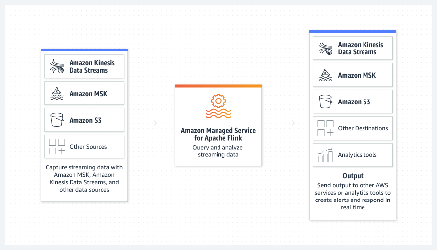

# Real-Time Data Stream Processing with Amazon Managed Service for Apache Flink

## 1. Introduction

In today’s data-driven landscape, organizations must transform and analyze data in real time to gain immediate insights and drive timely decisions. Amazon Managed Service for Apache Flink (AMSAF) offers a fully managed, serverless environment for running Apache Flink applications at scale. By eliminating the operational overhead of provisioning, managing, and scaling clusters, AMSAF allows you to focus on crafting robust stream-processing logic. 
## 2. Overview of Apache Flink

Apache Flink is an open-source engine designed for stateful stream processing and complex event processing. It enables the continuous computation of data streams with low latency and high throughput. Flink supports multiple programming languages, including Java, Scala, Python, and SQL, and provides various APIs—from high-level SQL/Table APIs to lower-level DataStream APIs—so you can choose the right abstraction for your application. With features like exactly-once state consistency, advanced windowing, and fault tolerance via checkpoints and savepoints, Apache Flink is widely adopted for building responsive and scalable real-time applications.

## 3. Amazon Managed Service for Apache Flink: An Overview

Amazon Managed Service for Apache Flink is a fully managed service that lets you build, deploy, and run Apache Flink applications without the need to manage the underlying infrastructure. Formerly known as Amazon Kinesis Data Analytics for Apache Flink, the service abstracts away server provisioning, capacity planning, and cluster management. Key benefits include:

- **Serverless & Fully Managed:**  
    No need to manually provision servers or clusters; AWS automatically handles resource scaling using Amazon KPUs (each KPU offers 1 vCPU and 4 GB memory) and provides 50 GB of application storage per KPU for state management.
    
- **Flexible API Support:**  
    Develop applications using the Apache Flink DataStream API for fine-grained control, the Table API/SQL for higher-level abstractions, or even interactive notebooks via AMSAF Studio for rapid prototyping and ad hoc analysis.
    
- **Fault Tolerance & Exactly-Once Semantics:**  
    Built-in checkpointing and snapshot mechanisms ensure that applications can recover seamlessly from failures while maintaining exactly-once processing semantics.
    
- **Integrated Ecosystem:**  
	AMSAF comes with prebuilt connectors to services like Amazon Kinesis Data Streams, Amazon Managed Streaming for Apache Kafka (MSK), Amazon S3, DynamoDB, and Amazon OpenSearch Service, allowing you to build end-to-end streaming pipelines effortlessly.
## 4. Core Use Cases

AMSAF is engineered to support a variety of real-time data processing scenarios. Common use cases include:

- **Streaming ETL:**  
    Continuously ingest, clean, enrich, and transform raw data—such as IoT sensor outputs or web clickstreams—before loading them into data lakes or warehouses.
    
- **Continuous Metric Generation:**  
    Compute time-series analytics and live leaderboards by aggregating streaming data in near real time.
    
- **Responsive Real-Time Analytics:**  
    Monitor key performance indicators (e.g., API success rates) to trigger immediate alerts or notifications when specific thresholds are breached.
    
- **Interactive Data Exploration:**  
    Use AMSAF Studio notebooks to run ad hoc queries on live data streams, facilitating rapid prototyping, debugging, and visualization.
    

> **Exam Tip:** Questions may test your knowledge on which data sources are supported. Remember that AMSAF integrates with Amazon Kinesis Data Streams and MSK, but not directly with Amazon Kinesis Data Firehose.

## 5. Architecture Highlights

The architecture of an Amazon Managed Service for Apache Flink solution is designed to provide high scalability, fault tolerance, and seamless integration with other AWS services. Key components include:

- **Streaming Data Sources:**  
    Data is ingested from sources such as Amazon Kinesis Data Streams or Amazon MSK.
    
- **Flink Application Environment:**  
    Your application—written using Apache Flink’s APIs—runs in a managed environment. AWS automatically provisions compute resources and scales them based on the volume and complexity of incoming data.
    
- **Checkpoints and Snapshots:**  
    To ensure fault tolerance, AMSAF automatically takes periodic checkpoints of your application state. These checkpoints, along with savepoints (manually triggered backups), allow your application to recover from failures with exactly-once guarantees.
    
- **Integrated Connectors:**  
    Prebuilt connectors enable easy integration with downstream systems (e.g., Amazon S3, DynamoDB) for persisting processed data or feeding analytics dashboards.

The following diagram illustrates a simplified data flow:

## 6. Deployment and Operations

One of the major advantages of AMSAF is that AWS takes care of the heavy lifting:

- **Automatic Scaling:**  
    The service dynamically adjusts the number of KPUs to match data throughput and processing complexity, ensuring optimal performance without manual intervention.
    
- **Managed Infrastructure:**  
    AWS provisions and maintains the underlying compute resources, distributes your application across multiple availability zones, and handles routine tasks such as software updates and patching.
    
- **Monitoring & Management:**  
    Integrated with the Apache Flink Dashboard and AWS CloudWatch, AMSAF provides real-time monitoring, logging, and metrics, allowing you to track application performance and troubleshoot issues effectively.
## 7. Development Approaches and API Options

Developers can choose from two primary pathways when building applications with AMSAF:

1. **Direct Application Development:**  
    Write Apache Flink code in your preferred language (Java, Scala, or Python) using the DataStream API or Table API. This approach is ideal for long-running applications that benefit from integration with CI/CD pipelines and unit testing.
    
2. **Managed Studio Notebooks:**  
    Use AMSAF Studio (powered by Apache Zeppelin) to interactively develop and run stream processing applications using SQL, Python, or Scala. Studio notebooks are excellent for ad hoc data exploration, rapid prototyping, and interactive debugging before deploying production-grade applications.

## 8. Security, Integration, and Scalability Considerations

- **IAM and VPC Integration:**  
    AMSAF requires appropriate AWS Identity and Access Management (IAM) roles to access data sources and sinks. For applications running in a Virtual Private Cloud (VPC), note that they do not have Internet access by default; additional configuration is required if needed.
    
- **Data Governance and Schema Management:**  
    When using Flink DataStream connectors, you can integrate with AWS Glue Schema Registry to manage and enforce data schemas across your streaming pipelines.
    
- **Pricing and Billing:**  
    You pay only for the KPUs and storage your application consumes, with a minimum charge in place even when your application is idle. In addition, you are billed separately for any downstream services that your application interacts with.

## 9. Exam Tips

- **Supported Data Sources:**  
    Be clear on the supported sources for AMSAF. The service works with Amazon Kinesis Data Streams and MSK—not with Amazon Kinesis Data Firehose.
    
- **Fault Tolerance Mechanisms:**  
    Understand the role of checkpoints and snapshots in ensuring exactly-once processing semantics.
    
- **API Options and Development Models:**  
    Familiarize yourself with the distinctions between developing directly in an IDE (using the DataStream or Table APIs) versus using Studio notebooks for interactive development.
    
- **Scaling and Resource Provisioning:**  
    Know how AMSAF scales automatically with Amazon KPUs and the role of these units in resource allocation.
## 10. Conclusion

Amazon Managed Service for Apache Flink empowers organizations to build real-time data processing pipelines with minimal operational overhead. By leveraging the managed capabilities—automatic scaling, built-in fault tolerance, and seamless AWS integrations—you can focus on crafting sophisticated stream processing logic that delivers immediate insights and drives business decisions.

For more details and to begin building your applications, explore the following official documentation:

- [Amazon Managed Service for Apache Flink Overview](https://aws.amazon.com/managed-service-apache-flink/)
- [AMSAF Developer Documentation](https://docs.aws.amazon.com/managed-flink/)
- [Flink Studio Notebooks](https://aws.amazon.com/managed-service-apache-flink/studio/)
- [Frequently Asked Questions (FAQs)](https://aws.amazon.com/managed-service-apache-flink/faqs/)

Embrace the power of real-time data stream processing with AMSAF and transform how your organization handles data at scale.