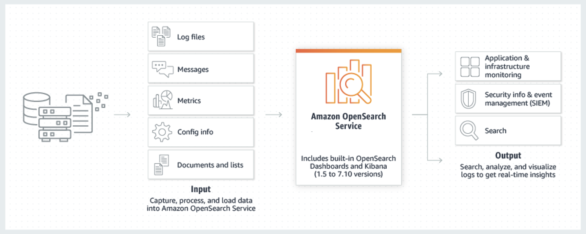
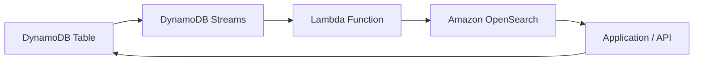

# Harnessing Amazon OpenSearch for Scalable Search and Analytics

## 1. Introduction

**Amazon OpenSearch Service** is a fully managed service that makes it easy to deploy, secure, and operate OpenSearch clusters at scale in the AWS Cloud. Originally launched as Amazon Elasticsearch Service, it was rebranded to Amazon OpenSearch Service after AWS adopted the open‑source OpenSearch project following the fork from Elasticsearch 7.10. This service is designed to handle a wide range of search and analytics use cases, from log analytics and real‑time application monitoring to full‑text search and security analytics.

## 2. Core Concepts of Amazon OpenSearch

Amazon OpenSearch provides distributed search, analytics, and visualization capabilities through components such as **OpenSearch** (for data indexing and search), **OpenSearch Dashboards** (for interactive visualization), and optional log ingestion tools like **Logstash**.

* **Operational Modes:**
	- **Managed Cluster:** You specify instance types, number of nodes, and storage tiers, letting AWS handle provisioning and maintenance of servers under the hood.
	- **Serverless:** AWS fully abstracts cluster management, automatically scaling resources as usage grows. This option suits workloads with spiky or unpredictable traffic.
* **OpenSearch Dashboards:**
	* Previously known as Kibana, OpenSearch Dashboards is a web interface for visualizing data stored in OpenSearch. It offers real-time charts, maps, and other dashboards that go beyond standard AWS CloudWatch Dashboards by providing more advanced querying and visualization.
* **Logstash:**
	* Logstash (and the broader Beats ecosystem) can be used to ingest, enrich, and process data before storing it in OpenSearch. Many AWS teams opt for native services such as Amazon Kinesis and AWS Lambda for ingestion, but Logstash remains a popular and flexible alternative.
## 3. Key Use Cases

- **Log analytics:** Collect and analyze logs from various sources in near real time.
- **Application monitoring:** Detect anomalies, visualize metrics, and troubleshoot performance issues.
- **Security analytics:** Investigate potential security threats through centralized logs.
- **Full-text search:** Provide advanced, low-latency keyword and natural-language queries.
- **Clickstream analytics:** Analyze user behavior data from websites and applications.
- **Indexing:** Ingest large volumes of structured or unstructured data for rapid lookups.
## 4. Common Architectural Patterns

### 4.1. DynamoDB to OpenSearch Integration

One powerful pattern is combining DynamoDB with Amazon OpenSearch for fast lookups and complex text-based searches. A typical flow looks like this:

1. **Data Updates:** Insertions, modifications, or deletions occur on a DynamoDB table.
2. **Change Streams:** A DynamoDB stream captures these changes in near real time.
3. **Lambda Function:** A Lambda function (subscribed to the DynamoDB stream) transforms and sends these changes to Amazon OpenSearch.
4. **Query Layer:** Your application queries OpenSearch to perform advanced searches or analytics, then retrieves the most up-to-date record from the DynamoDB table if needed.

This pattern combines DynamoDB’s scalability for key-value access with OpenSearch’s rich, full-text search capabilities.

### 4.2. CloudWatch Logs Integration

Organizations frequently need centralized log management for operational insights and security audits. Amazon OpenSearch can ingest logs in near real time from CloudWatch Logs:

1. **Log Group:** Services (like EC2, Lambda, or custom apps) send logs to a CloudWatch Log Group.
2. **Subscription Filter:** A subscription filter routes these logs to a target in near real time.
3. **Delivery Mechanism:** Logs can flow either directly through a Lambda function or via Amazon Kinesis Data Firehose, which can batch and transform data as needed.
4. **Amazon OpenSearch:** The logs are indexed and can be visualized via OpenSearch Dashboards.

## 5. Conclusion

Amazon OpenSearch extends AWS’s analytics capabilities by providing robust search and visualization functionality for real-time logs, application monitoring, and text-based queries. Whether you need a straightforward search solution for unstructured data or a powerful analytics tool for operational insights, OpenSearch can handle it all. 

For the most detailed and up‑to‑date information on Amazon OpenSearch Service, refer to the following official resources:

- **Amazon OpenSearch Service Product Page:**  
    [AWS Official Page](https://aws.amazon.com/opensearch-service/)  
    
- **Amazon OpenSearch Service Developer Guide:**  
    [AWS Documentation](https://docs.aws.amazon.com/opensearch-service/latest/developerguide/what-is.html)