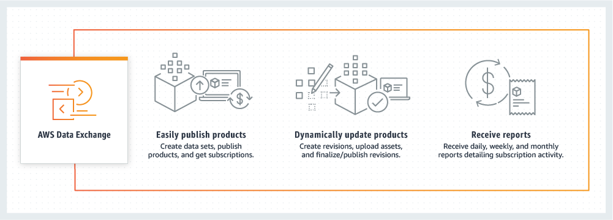
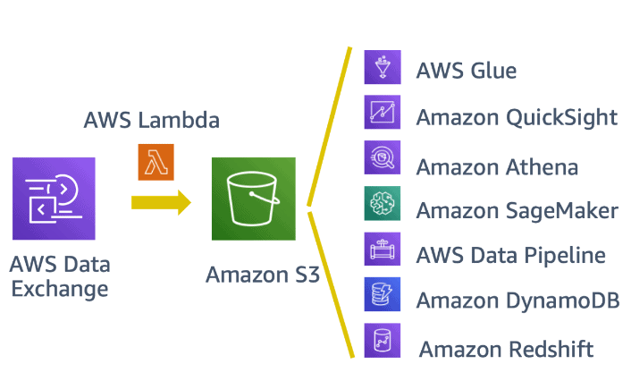

# AWS Data Exchange

## 1. Introduction

AWS Data Exchange is a fully managed service that helps AWS customers easily **share, subscribe to, and manage third‐party data** in the cloud. It streamlines the process of discovering high‑value data sets, subscribing to them with consistent pricing options, and integrating the data with AWS analytics and machine learning services. In essence, it serves as a centralized marketplace where data consumers can access a wide variety of data assets and where data providers can publish their data products without having to build and maintain their own delivery and entitlement infrastructure.
## 2. Key Concepts

### 2.1. Data Grants

A **data grant** is the fundamental unit of exchange in AWS Data Exchange. It is created by a data sender to give a data receiver access to a curated data set. Each grant includes:

- **Data Set:** A collection of data assets (which can be files, APIs, Redshift data sets, S3 objects, or Lake Formation–managed data) that the receiver accesses after accepting the grant.
- **Data Grant Details:** Descriptive information (such as a name and description) visible to the receiver.
- **Recipient Access Details:** Information (like the recipient’s AWS account ID and access duration) that specifies how long the data can be accessed.  
### 2.2. Data Products in AWS Marketplace

A **data product** is the unit of exchange published in AWS Marketplace. It packages one or more data sets along with:

- **Product Details:** Such as a name, short and long descriptions, a logo, sample data, and support contact information.
- **Product Offers:** These define the pricing, subscription durations (from 1 to 36 months), terms (including data subscription agreements), and refund policies. Once reviewed and approved by AWS against its guidelines and terms, these products become available in a single, global catalog.  
### 2.3. Supported Data Set Types

AWS Data Exchange supports five types of data sets:

- **Files:** Traditional file-based data (e.g., CSV, Parquet).
- **API:** Data delivered via REST APIs.
- **Amazon Redshift:** Data sets that can be directly queried in a Redshift data warehouse.
- **Amazon S3:** Data files stored in S3 buckets.
- **AWS Lake Formation (Preview):** Data with granular permissions managed through Lake Formation.
## 3. Core Capabilities

### 3.1. Finding and Subscribing to Data

With AWS Data Exchange, you can browse a centralized catalog containing thousands of data products from independent software vendors, data publishers, and aggregators. After subscribing to a dataset, you can programmatically or manually retrieve it for storage in Amazon S3. This makes data immediately accessible for further processing by AWS services such as Amazon SageMaker, AWS Glue, or Amazon Athena.

### 3.2. Diverse Data Providers
Some of the major data providers include:
- **Reuters**, which curates data from over 2.2 million unique news stories each year in multiple languages.  
- **Change Healthcare**, processing over 14 billion healthcare transactions and $1 trillion in claims annually.  
- **Dun & Bradstreet**, maintaining more than 330 million global business records.  
- **Foursquare**, accumulating data on over 220 million unique customers and 60 million venues worldwide.

By accessing these datasets through AWS Data Exchange, customers gain rapid entry to specialized, high-value information for research, analytics, and machine learning.
## 4. Additional Features

### 4.1. Data Exchange for Amazon Redshift

In some scenarios, storing data in Amazon Redshift can be more efficient for analytical workloads. AWS Data Exchange for Amazon Redshift allows direct loading of third-party data into an Amazon Redshift data warehouse. This capability simplifies queries on external data using Redshift’s standard SQL interface. Conversely, organizations can also publish and license their own Redshift-based data products through AWS Data Exchange to monetize proprietary datasets.
### 4.2. Data Exchange for APIs

Beyond static files, AWS Data Exchange also supports third-party API subscriptions. Consumers invoke the APIs using AWS-native authentication methods, ensuring improved governance, consistent credential management, and seamless integration with existing AWS workflows. This extends the possibilities for near real-time data consumption, making it easier to incorporate external data points into applications and backend services.
## 5. Example Use Case

Consider a scenario where you want to expand your marketing analytics by combining your internal sales data with location intelligence from Foursquare. Through AWS Data Exchange, you subscribe to Foursquare’s dataset, export it into Amazon S3, and configure Amazon Redshift Spectrum to perform federated analyses of your internal sales metrics and the external Foursquare files. Finally, you feed these results into an ML workflow using Amazon SageMaker to generate predictive insights—such as identifying regions with the most promising customer engagement.

## 6. Conclusion

AWS Data Exchange streamlines access to valuable third-party datasets, whether they are journalistic feeds, healthcare transactions, business records, or user-location data. Its tight integration with core AWS services like Amazon S3, Amazon Redshift, and various analytics and ML tools makes it a powerful solution for organizations seeking to extend their data capabilities. By leveraging AWS Data Exchange for secure, scalable third-party data subscription and sharing, enterprises can enhance insights, accelerate decision-making, and drive innovation across their data-driven workloads.

For more details on each aspect—from data grants and marketplace integration to supported data types and access control—please refer to the official AWS documentation:

- [What is AWS Data Exchange?](https://docs.aws.amazon.com/data-exchange/latest/userguide/what-is.html)
- [AWS Data Exchange User Guide](https://docs.aws.amazon.com/data-exchange/latest/userguide/)
