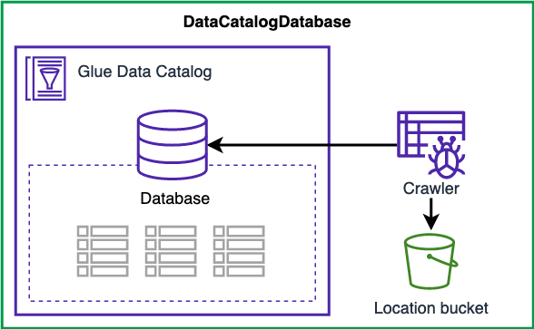
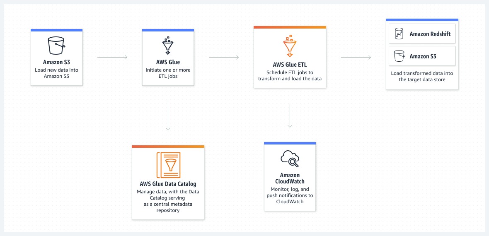
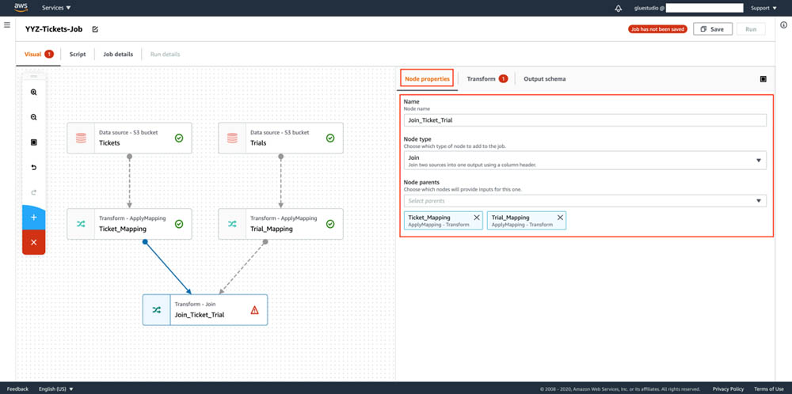
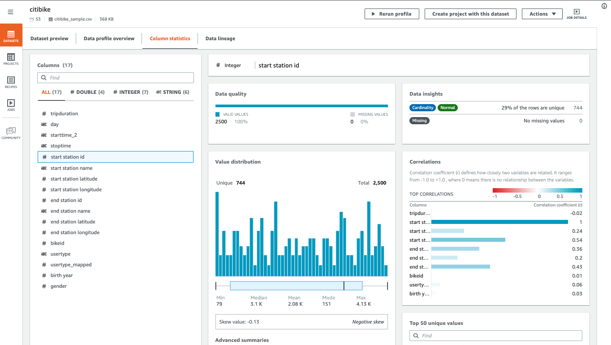

# AWS Glue

## 1. Introduction

AWS Glue is a fully managed, serverless data integration service that simplifies the extract, transform, and load (ETL) process. It enables analytics users to discover, prepare, move, and integrate data from multiple sources for analytics, machine learning, and application development. Because it’s serverless, there’s no infrastructure to manage—it automatically provisions and scales the necessary compute resources as needed.
## 2. Key Features

- **Serverless Architecture:**  
    AWS Glue automatically manages resource provisioning, scaling, and job orchestration. You only pay for the compute time you use, making it both scalable and cost efficient.  
    
- **Centralized Data Catalog:**  
    The AWS Glue Data Catalog serves as a persistent metadata repository where you store table definitions, database schemas, and other information needed to manage your ETL workflows. Crawlers can automatically scan your data sources to populate and update the catalog.  
    
- **Flexible ETL Job Authoring:**  
    You can create ETL jobs using auto-generated code (in PySpark or Scala) or write your own custom scripts. AWS Glue Studio provides a visual, drag-and-drop interface that simplifies job creation for users of all skill levels.  
    
- **Support for Batch and Streaming:**  
    In addition to traditional batch ETL jobs, AWS Glue Streaming enables near real-time processing using Apache Spark Structured Streaming. This is ideal for use cases such as fraud detection, IoT analytics, and real-time clickstream analysis.  
    
- **Integrated Security and Governance:**  
    AWS Glue integrates with AWS Identity and Access Management (IAM), Virtual Private Clouds (VPCs), and encryption protocols (both in transit and at rest). It also works with AWS Lake Formation and AWS CloudTrail for robust data governance and audit capabilities.
## 2. The Glue Data Catalog and Crawlers

One of the foundational elements of AWS Glue is its **Data Catalog**. This central repository stores table definitions and schema information for your datasets while leaving the original data intact in S3. The **Glue Crawler** plays a vital role here—it scans your data periodically, infers schema details, and populates the Data Catalog automatically. With your data cataloged, you can leverage services such as Redshift Spectrum, Athena, EMR, and Quicksight to run queries on data that was once unstructured.
## 3. Organizing Data with S3 Partitions

Efficient querying of large datasets often depends on effective partitioning. AWS Glue crawlers extract partition information based on how your S3 data is organized. For example, if your devices send sensor data every hour, you may choose one of the following partitioning strategies:

- **Time-Driven Partitioning:** Organize data as `yyyy/mm/dd/device` if you primarily query by time ranges.
- **Device-Driven Partitioning:** Organize data as `device/yyyy/mm/dd` if your queries focus on individual devices.

Choosing the right partitioning scheme up front can significantly enhance query performance and reduce processing times.
## 4. Integration with Apache Hive

For organizations that already leverage Apache Hive for SQL-like queries on large datasets, AWS Glue offers seamless integration. The Glue Data Catalog can function as a Hive metastore, allowing EMR clusters to run Hive queries on your data without needing a separate metastore. Moreover, you have the option to import an existing Hive metastore into Glue, simplifying the transition and integration process.
## 5. AWS Glue ETL Capabilities

### 5.1 Automated Code Generation and Customization

AWS Glue’s ETL engine can automatically generate transformation code in **Scala** or **Python**, which you can further modify as needed. The service supports:

- **Encryption:** Data is encrypted at rest and protected in transit with SSL.
- **Event-Driven Processing:** Jobs can be triggered by events or scheduled to run at specific times.
- **Dynamic Scaling:** Provision additional Data Processing Units (DPUs) to boost performance for Spark jobs, with job metrics available directly from the Glue Console.

### 5.2 Transforming, Cleaning, and Enriching Data

Glue ETL not only transforms data but also cleanses and enriches it prior to analysis. It allows you to:

- Generate or modify ETL code,
- Provide custom Spark or PySpark scripts,
- Target output to S3, JDBC sources (such as RDS and Redshift), or update the Glue Data Catalog.

Scheduling and triggers ensure that your jobs are executed in a timely and automated manner, making the process both efficient and cost-effective.
## 6. Working with DynamicFrames

A key innovation in AWS Glue is the **DynamicFrame**—an abstraction similar to a Spark DataFrame but enriched with features tailored for ETL tasks. A DynamicFrame is a collection of self-describing **DynamicRecords** that inherently carry schema information, allowing for flexible and powerful transformations. 
## 7. Built-In Transformations and ResolveChoice

### 7.1 Bundled and Machine Learning Transformations

AWS Glue provides a rich set of built-in transformation operations:

- **Bundled Transformations:** Such as `DropFields`, `DropNullFields`, `Filter`, `Join`, and `Map`, which help remove unwanted data or enrich existing records.
- **Machine Learning Transformations:** For example, **FindMatches ML** identifies duplicate or matching records even in the absence of a common unique identifier.
- **Format Conversions:** Easily convert between CSV, JSON, Avro, Parquet, ORC, and XML, and even switch between Spark DataFrames and DynamicFrames.
### 7.2 Handling Data Ambiguities with ResolveChoice

When data inconsistencies occur—such as multiple fields with the same name—Glue’s **ResolveChoice** transformation provides strategies to resolve these ambiguities. Options include:

- **make_cols:** Creates separate columns for each detected type (e.g., `price_double` and `price_string`).
- **cast:** Converts values to a specified type.
- **make_struct:** Combines multiple data types into a single structured column.

## 8. Modifying the Data Catalog Through ETL Scripts

AWS Glue ETL scripts can dynamically update your Data Catalog by:

- **Adding New Partitions:** Either by re-running the crawler or by using options like `enableUpdateCatalog` and `partitionKeys`.
- **Updating Table Schemas:** Again, either via a crawler or through script-based updates with `updateBehavior`.
- **Creating New Tables:** Using the `setCatalogInfo` parameter in conjunction with update options.

These operations are primarily supported for data stored in S3 and are compatible with file formats such as JSON, CSV, Avro, and Parquet (with special handling for Parquet), though nested schemas are not supported.
## 9. Developing and Running AWS Glue Jobs

### 9.1 Development Endpoints

AWS Glue supports development endpoints that allow you to develop and test ETL scripts using notebooks and integrated development environments. You can connect through:

- Apache Zeppelin (local or hosted on EC2),
- SageMaker notebooks,
- Terminal-based tools like PyCharm,
- Secure access using Elastic IPs in your VPC.

This setup lets you iterate quickly on your ETL logic before deploying it as a production job.
### 9.2 Job Execution and Monitoring

Once your ETL script is ready, AWS Glue provides multiple options for running jobs:

- **Time-Based Schedules:** Use cron-like expressions for regular execution.
- **Job Bookmarks:** Persist state between runs to ensure only new data is processed.
- **CloudWatch Integration:** Trigger notifications, invoke Lambda functions, or even send events to services like Kinesis or Step Functions when jobs complete successfully—or fail.

## 10. Cost Efficiency and Best Practices

AWS Glue is billed by the second, ensuring that you only pay for what you use. Key cost considerations include:

- **Crawler and ETL Job Execution:** Charged per second.
- **Data Catalog Storage:** The first million objects stored are free.
- **Development Endpoints:** Billed by the minute.

A common anti-pattern is mixing multiple ETL engines; since AWS Glue is built on Apache Spark, it is best to leverage it for your ETL needs unless specific requirements dictate another engine (like Hive or Pig, where alternatives such as EMR may be more appropriate).

## 11. Real-Time Processing and AWS Glue Studio

### 11.1 Serverless Streaming ETL

Starting from April 2020, AWS Glue supports serverless streaming ETL. This enables you to ingest, clean, and transform data in real time from sources like Kinesis or Kafka, and then store the results in S3 or other data stores—all powered by Apache Spark Structured Streaming.

### 11.2 Visual Workflow Design with AWS Glue Studio

AWS Glue Studio offers a visual interface that simplifies the creation of complex ETL workflows. With a drag-and-drop job editor, you can:

- Build directed acyclic graphs (DAGs) for multi-step data processing,
- Connect various data sources (S3, Kinesis, Kafka, JDBC),
- Perform transformations such as sampling, joining, and partitioning,
- Monitor job statuses and runtimes through an integrated dashboard.
## 12. Ensuring Data Quality and Preparing Data with DataBrew

### 12.1 AWS Glue Data Quality

Data quality is paramount in any data processing pipeline. AWS Glue Data Quality enables you to define quality rules manually or receive automated recommendations. Using the Data Quality Definition Language (DQDL), you can configure your ETL jobs to either fail when quality checks are not met or simply log issues to CloudWatch for further review.

### 12.2 Visual Data Preparation with AWS Glue DataBrew

AWS Glue DataBrew is a visual data preparation tool that streamlines the process of cleaning and transforming large datasets. It provides:

- A user-friendly interface for pre-processing data from S3, data warehouses, or databases,
- Over 250 ready-made transformations,
- The ability to create and save “recipes” for repeated use,
- Integration with security tools such as KMS, SSL, IAM, CloudWatch, and CloudTrail.

DataBrew also includes specialized features for handling Personally Identifiable Information (PII). You can enable PII statistics to identify sensitive data and apply various techniques—such as substitution, shuffling, encryption (deterministic or probabilistic), decryption, masking, and cryptographic hashing—to protect sensitive information.

## 13. Orchestrating Complex ETL Processes with Workflows

### 13.1 AWS Glue Workflows

For orchestrating multi-job and multi-crawler ETL processes, AWS Glue Workflows offer a structured approach to manage complex pipelines. You can design workflows using pre-defined blueprints, the AWS Glue console, or APIs, ensuring that various components run together in a coordinated fashion.

### 13.2 Workflow Triggers

Triggers within Glue Workflows allow you to automate the start of jobs or crawlers based on specific events. These triggers can be:

- **Scheduled:** Based on cron expressions,
- **Event-Driven:** Activated by EventBridge events, such as the arrival of a new object in S3,
- **Batch-Enabled:** Configured with batch size and time window settings to process groups of events together.

This flexibility makes it possible to design workflows that react dynamically to changing data conditions.

## 14. Conclusion

AWS Glue stands at the center of many serverless data architectures, offering both automated data cataloging and a powerful ETL engine. By reducing the overhead of managing servers, scheduling crawlers, and integrating seamlessly with various AWS analytics services, it enables organizations to prepare and transform their data efficiently before ingesting it into analytics or data warehousing tools.

For more in-depth information, please refer to the [AWS Glue Documentation](https://docs.aws.amazon.com/glue/latest/dg/).