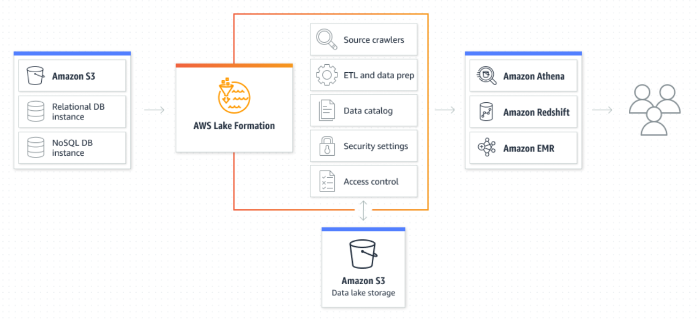
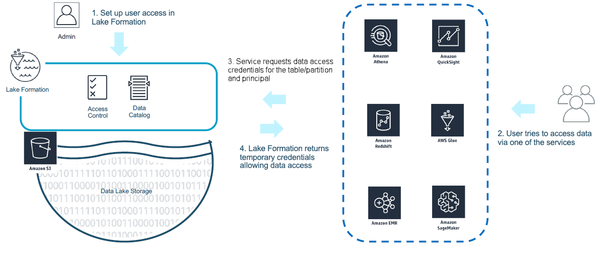

# AWS Lake Formation

## 1. Introduction

AWS Lake Formation is a **fully managed service** for managing and building data lakes. It simplifies the **creation, security, and management of data lakes** by automating many complex, manual tasks such as gathering, cleansing, transferring, and cataloguing data—and then securely delivering that data for analytics and machine learning.

A key aspect of Lake Formation is its **fine-grained permissions model** that works in tandem with the AWS IAM permissions model. This centrally established permissions architecture—resembling a relational database management system (RDBMS)—allows you to grant or revoke access with simple commands. Permissions are enforced at the column, row, and cell levels, ensuring that only the right users and applications can access sensitive data.

## 2. Lake Formation Overview
### 2.1. What Are Data Lakes and Why We Need Them

A **data lake** is a centralized repository that stores all your data—both structured and unstructured, raw and transformed—at any scale. Although it might seem chaotic, a well-designed data lake:

- Preserves valuable information while filtering out irrelevant data.
- Provides an environment for testing, analysis, and insights that drive corporate growth.
- Enables the merging of disparate data sources (e.g., customer buying histories and social media inputs) to enhance decision-making and customer satisfaction.

Data lakes empower teams by offering a single source of truth and a solid foundation for advanced analytics and machine learning.

### 2.2. Key Concepts and Components

This section covers fundamental components unique to AWS Lake Formation:

* **Data Lake:**
	- **Definition:** A persistent repository in Amazon S3 that stores structured and unstructured data, both raw and transformed.
	- **Registration:** When you register an Amazon S3 location, the S3 path and all underlying folders are included.

- **Data Catalog:**
	- **Purpose:** Acts as a persistent metadata store that tracks data sources, transformations, and targets.
	- **Structure:** Maintains metadata as databases (collections of tables) and tables (descriptive information about the data).
	- **Access Control:** Permissions can be applied to databases and tables in the catalog. Each AWS account has one Data Catalog per AWS Region.

* **Governed Tables:**
	- **Features:** Unique to Lake Formation, governed tables support:
	    - ACID transactions
	    - Automatic data compaction
	    - Time-travel queries
	    - Resource links to shared databases and tables in external accounts
	- **Usage:** Primarily used for cross-account access to data in the data lake.

* **Blueprints:**
	- **Definition:** Data management templates that streamline the ingestion of data into a data lake.
	- **Configuration:** Allow you to specify inputs such as data source, data target, and schedule.
	- **Types:** Examples include database snapshot, incremental database, and log file blueprints.

* **Workflow:**
	- **Definition:** A container for a collection of AWS Glue jobs, crawlers, and triggers that define the data source and schedule for data import.
	- **Orchestration:** Uses AWS Glue directed acyclic graphs (DAGs) to orchestrate and monitor the loading and updating of data.
	- **Execution:** Workflows can run on-demand or on a predefined schedule.

### 2.3. Core Capabilities and Features

AWS Lake Formation streamlines tasks that would otherwise require significant manual effort:

1. **Data Import & Ingestion:**
    - Scans and imports data from existing databases by using connection details and credentials.
    - Supports both bulk data loads and incremental updates.

2. **Metadata Management:**
    - Organizes and labels data by extracting technical metadata from data sources.
    - Uses the AWS Glue Data Catalog as a centralized metadata repository.

3. **Data Transformation:**
    - Automates transformations—such as standardizing date formats—via configurable transformation templates.

4. **Encryption & Data Protection:**
    - Automatically encrypts your data lake using Amazon S3 encryption.
    - Supports decryption using AWS KMS and safeguards data in transit.

5. **Access Control & Audit Logging:**
    - Centralizes access management with policies that span databases, tables, columns, rows, and cells.
    - Provides robust audit logging (via CloudTrail) to track data access and changes.

6. **Self-Service Data Access & Discovery:**
    - Enables users to explore and search for datasets through a centralized data catalog, enhancing productivity.

7. **Regulated Tables & ACID Transactions:**
    - Supports Governed Tables unique to Lake Formation that offer ACID transactions, automatic data compaction, time-travel queries, and resource links for cross-account sharing.

## 3. How AWS Lake Formation Works

AWS Lake Formation dramatically simplifies the creation of a **secure, centralized, and curated data lake**. The process involves:

1. **Data Ingestion & Onboarding:**
    - **Identify & Gather Data:** Locate existing data stores (such as Amazon S3, relational databases, or NoSQL databases) and move the data into your new data lake.
    - **Cleansing & Transformation:** Use machine learning algorithms to clean and classify data as it is ingested.
    - **Cataloguing:** Automatically crawl and extract metadata to populate the AWS Glue Data Catalog, ensuring your data assets are discoverable.

2. **Defining Access & Security Policies:**
    - **Policy Setup:** Administrators define security policies to control which users or services can access specific datasets.
    - **Granular Control:** Set permissions at the database, table, column, row, and even cell levels.

3. **Query Execution & Secure Data Delivery:**
    - **Credential Vending:** When an analytics query is submitted (via Amazon Athena, Redshift Spectrum, EMR, etc.), Lake Formation verifies permissions and vends temporary credentials.
    - **Data Access:** The query engine retrieves only the permitted data directly from the Amazon S3 data lake, with filters applied as necessary.

4. **Audit & Compliance:**
    - All actions are logged via AWS CloudTrail, ensuring comprehensive auditability and adherence to compliance standards.

## 4. Fine-Grained Permissions and Security

Lake Formation’s security model is a key differentiator:

- **RDMS-Like Permissions:** Mimics a relational database’s access controls to allow simple grant or revoke operations.
- **Granular Enforcement:** Applies permissions at the column, row, and cell levels, ideal for protecting sensitive data.
- **Hybrid Access Mode:** Enables gradual adoption of Lake Formation permissions while still using existing IAM policies, ensuring a smooth transition.
- **Integration with Analytics & ML Services:** Fine-grained controls are enforced across services such as Amazon Athena, Redshift Spectrum, and EMR.
- **Credential Vending & Querying API:** Uses a credential vending API to issue temporary credentials for accessing registered S3 locations based on effective permissions. The Querying API filters data returned from S3 based on these permissions.
- **Roles & Trust:** A service-linked role provides the necessary permissions to call AWS services on your behalf. If additional permissions are required, user-defined roles can be used.
- **Tag-Based Access Control:** Lake Formation supports tag-based access control for managing large numbers of data catalog resources.
- **API & Logging:** AWS CloudTrail captures all Lake Formation API calls, ensuring every access or change is logged for audit purposes.

## 5. Pricing

While many advanced security and governance features are provided at no extra cost, AWS Lake Formation pricing includes several components:

- **Transaction Requests & Metadata Storage:** You are charged for transaction requests and storing metadata.
- **Data Filtering:** Charges apply for data filtering operations or the number of bytes scanned by the Storage API.
- **Storage Optimizer:** You are billed based on the number of bytes processed by the storage optimizer.
- **Underlying Service Costs:** Charges for Amazon S3, AWS Glue, and any integrated services (like Athena or EMR) continue to apply.

## 6. Conclusion

AWS Lake Formation streamlines the entire lifecycle of your data lake—from ingestion and cataloging to securing and sharing data. Its advanced, fine-grained permissions model, robust integration with AWS analytics services, and key components such as the Data Catalog, governed tables, blueprints, and workflows enable organizations to build secure, scalable, and highly governed data lakes with ease.

By automating many manual tasks and ensuring comprehensive auditability and security, AWS Lake Formation empowers businesses to harness the full value of their data while maintaining strict compliance and governance standards.
