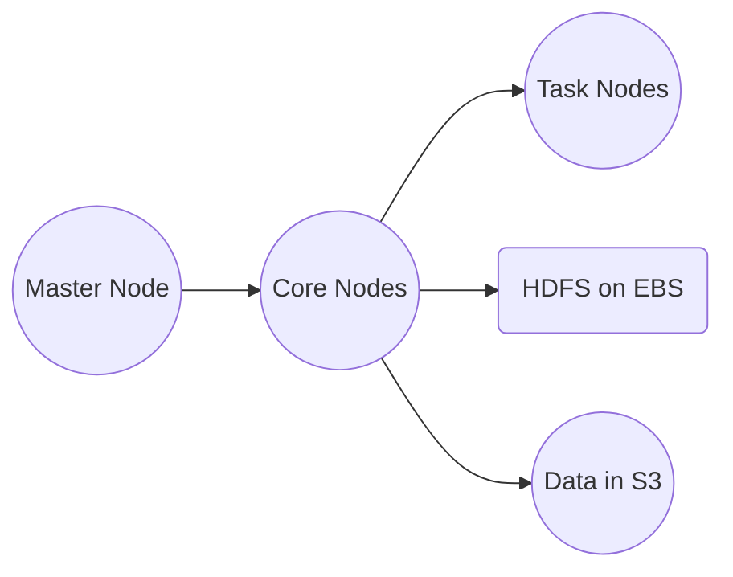

# Amazon EMR

## 1. Introduction

Amazon EMR is a cloud‑based service that simplifies large‑scale distributed data processing by managing clusters that run frameworks like Apache Hadoop, Spark, Hive, HBase, Presto, and more. The service abstracts the complexities of hardware management and software configuration, enabling you to focus on data insights rather than infrastructure details. EMR’s managed nature allows for rapid data processing, auto‑scaling, and integration with other AWS services, making it a cornerstone for modern big data architectures.  

## 2. Core Concepts and Architecture

### 2.1 The Big Data Ecosystem

At the heart of EMR lies the Hadoop ecosystem—a suite of open‑source tools designed for distributed storage and processing of large datasets. In addition to Hadoop, EMR supports:

- **Apache Spark:** For fast, in‑memory analytics and machine learning.
- **Apache Hive:** For SQL‑like querying.
- **Apache HBase:** For real‑time read/write access.
- **Presto and Apache Flink:** For interactive analytics and stream processing.

This ecosystem allows you to build diverse data processing pipelines with a single EMR cluster.  
### 2.2 EMR Architecture and Node Types

EMR clusters are typically deployed within an Amazon Virtual Private Cloud (VPC) and are composed of three primary node types:

- **Master Node:**  
    Coordinates cluster operations, assigns tasks, and must run continuously to manage the cluster.
- **Core Nodes:**  
    Store data using HDFS on attached Amazon EBS volumes and perform the bulk of processing tasks. They are designed for reliability and continuous operation.
- **Task Nodes:**  
    Provide additional processing power without persisting data. They can be scaled in or out dynamically based on workload requirements.

For persistent, durable storage beyond the transient HDFS, EMR integrates with Amazon S3 through EMRFS, ensuring data is replicated across multiple Availability Zones (AZs).

Below is a simplified visualization of a typical EMR cluster configuration:

This design pattern—using HDFS for high‑performance temporary storage and S3 for long‑term durability—is fundamental to many EMR deployments.  
## 3. Key Features and Capabilities

### 3.1 Managed Cluster Platform

- **Simplified Management:**  
    EMR automates cluster setup, configuration, and tuning. You can launch clusters using the AWS Management Console, CLI, or SDKs, reducing the operational burden.
    
- **Dynamic Scaling:**  
    Automatically add or remove nodes to match processing demands, ensuring optimal performance and cost efficiency.
    
### 3.2 Support for Multiple Frameworks

EMR natively supports a wide range of open‑source big data frameworks, allowing you to run diverse applications—from batch processing and interactive querying to machine learning and real‑time analytics—within a single cluster.  

### 3.3 Integration with the AWS Ecosystem

- **Storage and Data Durability:**  
    Seamlessly integrate with Amazon S3 using EMRFS for durable, multi‑AZ storage, and leverage HDFS on EBS for fast, temporary data storage.
    
- **Security and Networking:**  
    Utilize AWS Identity and Access Management (IAM) for fine‑grained control, run clusters within an Amazon VPC for secure networking, and protect data with encryption at rest and in transit.
    
- **Monitoring and Logging:**  
    EMR integrates with Amazon CloudWatch to deliver real‑time metrics and logs for performance monitoring and troubleshooting.  

## 4. Integrations and Data Processing

### 4.1 EMRFS for Amazon S3

EMRFS is a specialized connector that allows Hadoop-based applications (such as Hive, Spark, or MapReduce) to seamlessly read from and write to Amazon S3. This integration ensures data durability and high availability by leveraging S3’s multi-AZ redundancy.  
### 4.2 Additional Integrations

- **DynamoDB Integration:**  
    EMR can pull data from DynamoDB, enabling analytics and reporting on data stored in NoSQL databases.
    
- **AWS Glue and Other Services:**  
    Integrate with AWS Glue for data cataloging and ETL processes, and with Amazon Redshift or RDS for downstream data warehousing and analytics.

These integrations make EMR a flexible hub for various big data workflows.  
## 5. Cost Optimization and Instance Purchasing Options

### 5.1 EMR Node Purchasing Options

Managing the cost of potentially large clusters is critical. EMR offers several purchasing options tailored to different node roles:

- **On‑Demand Instances:**  
    Provide predictable performance and high availability, ideal for master and core nodes that require consistent uptime.
    
- **Reserved Instances:**  
    Offer significant cost savings for long‑running clusters by committing to a one‑year or multi‑year term.
    
- **Spot Instances:**  
    Utilize spare EC2 capacity at lower prices, best suited for task nodes that can tolerate interruptions.
### 5.2 Instance Configuration: Groups vs. Fleets

- **Uniform Instance Groups:**  
    Specify one instance type and purchasing option per node type, with built‑in support for auto‑scaling as workloads fluctuate.
    
- **Instance Fleets:**  
    Allow mixing multiple instance types across On‑Demand and Spot categories, providing flexibility to optimize both cost and availability while targeting a specified capacity.  

## 6. Deployment Options: Long‑Running vs. Transient Clusters

- **Long‑Running Clusters:**  
    Ideal for continuous data processing or on‑demand analytics. These clusters benefit from reserved instances for master and core nodes to ensure cost‑effectiveness over extended periods.
    
- **Transient Clusters:**  
    Suitable for batch jobs or seasonal workloads, these clusters spin up when needed and shut down automatically after processing, thereby minimizing costs.  
## 7. Conclusion

Amazon EMR offers a comprehensive solution for modern big data challenges by combining managed infrastructure, multi‑framework support, and tight integration with the AWS ecosystem. Whether you’re deploying long‑running clusters for continuous analytics or transient clusters for batch processing, EMR’s flexible architecture, cost‑efficient purchasing options, and robust security features empower organizations to extract actionable insights from massive datasets.

For further details and the latest updates, consult the following official resources:

- **Amazon EMR Product Page:** [aws.amazon.com/emr](https://aws.amazon.com/emr/)  
- **Amazon EMR Documentation:** [docs.aws.amazon.com/emr](https://docs.aws.amazon.com/emr/)  
- **Amazon EMR FAQs:** [aws.amazon.com/emr/faqs](https://aws.amazon.com/emr/faqs/)  

By understanding and applying the concepts outlined in this chapter, you are well-equipped to optimize your big data processing workflows using Amazon EMR in a secure, scalable, and cost‑effective manner.