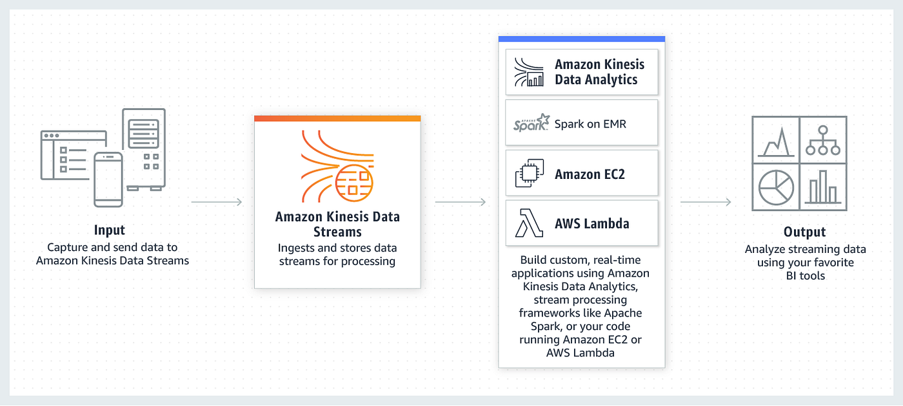
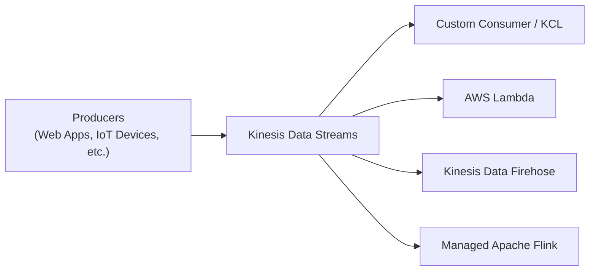

# Amazon Kinesis Data Streams

## 1. Introduction

Amazon Kinesis Data Streams is a fully managed, scalable service designed to ingest, process, and analyze streaming data in real time. It empowers organizations to capture high-throughput data from diverse sources—such as website clickstreams, IoT devices, and system logs—and make it immediately available for real-time analytics, monitoring, and operational dashboards. By combining durability, rapid ingestion, and near-instantaneous processing, Kinesis Data Streams underpins modern data architectures that require continuous insights and immediate responses.

## 2. Real-Time Data and Use Cases

Real-time data is information that is generated and consumed as events occur. This immediacy enables applications to react within seconds—or even milliseconds—to changing conditions. Common real-time data scenarios include:

- **Website Clickstreams:** Captured directly from client-side applications to monitor user behavior.
- **IoT Telemetry:** Streaming sensor data from smart devices, industrial equipment, or connected vehicles.
- **System Logs and Metrics:** Aggregated from servers and applications to drive operational alerts and performance dashboards.

These use cases illustrate how Kinesis Data Streams supports applications that need to process data as it arrives, enabling dynamic pricing, automated alerts, real-time dashboards, and sophisticated analytics pipelines.
## 3. Core Concepts and Architecture

A robust understanding of Kinesis Data Streams starts with its core components and terminology. The following sections detail how the service is architected for high-throughput, real-time data ingestion and processing.

### 3.1. Data Records and Streams

- **Data Record:**  
    The basic unit stored in a stream, each data record consists of a data blob (an immutable sequence of bytes), a partition key (a Unicode string used to group records), and a sequence number that uniquely identifies the record within its shard. Records can be as large as 1 MB, allowing for diverse data payloads.
- **Data Stream:**  
    A logical grouping of data records, a stream is composed of one or more shards. It represents the continuous flow of data that producers push into the system.
### 3.2. Shards and Partitioning

- **Shard:**  
	A shard is a uniquely identified, fixed-capacity sequence of data records. It serves as the fundamental unit of throughput for the stream, with each shard supporting a specified rate of writes and reads. The total capacity of a stream scales linearly with the number of shards.
    
- **Partition Key and Sequence Number:**  
    Each record’s partition key is hashed (using MD5) to determine which shard receives the record. Within a shard, the sequence number—assigned after data ingestion—maintains the order of records for a given partition key. This ordering is crucial for applications that rely on the sequential nature of time-series or event-driven data.
### 3.3. Producers and Data Ingestion

Applications or devices that push data into Kinesis Data Streams are known as producers. These can include:
- **Custom Applications:** Code running on web clients, mobile devices, or backend systems.
- **Kinesis Agents:** Lightweight processes deployed on servers to capture logs or metrics.
- **Kinesis Producer Library (KPL):** A client-side library that efficiently batches and sends data records for high-throughput workloads.

By efficiently batching records and managing retries, producers ensure that data is reliably ingested into the stream.
### 3.4. Consumers and Data Processing

Applications that process data from the stream are known as consumers. They retrieve and process records in near real time, and they can be implemented in several ways:
- **Kinesis Client Library (KCL):** Provides fault-tolerant, load-balanced consumption of data across multiple application instances.
- **AWS Lambda:** Allows event-driven processing without provisioning servers.
- **Other AWS Services:** Such as Amazon Managed Service for Apache Flink for stateful stream processing or Amazon Data Firehose for data delivery to storage and analytics destinations.

The design of Kinesis Data Streams enables multiple consumers to process the same stream concurrently—each with dedicated throughput when using enhanced fan-out capabilities.

### 3.5. Data Retention and Ordering

- **Data Retention:**  
    Kinesis Data Streams retains data records for a default period of 24 hours. However, you can extend this retention period up to 365 days (8760 hours) to allow for reprocessing or replay of events—a critical feature for debugging, historical analysis, or fault-tolerant processing.
- **In-Order Consumption:**  
    Records with the same partition key are delivered in order, ensuring that time-sensitive sequences (such as transactional logs or sensor readings) maintain their chronological integrity.
## 4. Capacity Modes

Kinesis Data Streams offers two capacity modes to align with varying workload demands and cost considerations:
### 4.1. Provisioned Mode

- **Capacity Management:**  
    You explicitly provision the number of shards for your stream. Each shard offers:
    - Up to 1 MB/s (or 1,000 records per second) for writes.
    - Up to 2 MB/s for reads.
- **Scaling:**  
    Manual scaling is required. You can split or merge shards to adjust throughput capacity.
- **Pricing:**  
    You are billed hourly per shard provisioned.

>**Exam Tip:** Provisioned mode is often highlighted in scenarios where predictable traffic allows for manual capacity adjustments.
### 4.2. On-Demand Mode

- **Automatic Scaling:**  
    The service dynamically adjusts capacity based on observed traffic patterns without requiring manual intervention.
- **Pricing:**  
    Charges are based on the volume of data ingested and retrieved, rather than on a fixed shard count.
- **Use Case:**  
    On-Demand mode is ideal when traffic patterns are highly variable or unpredictable.
## 5. Security

Security in Amazon Kinesis Data Streams is enforced at multiple layers:
- **Data in Transit:**  
    All data is transmitted securely using HTTPS, ensuring encryption during transit.
- **Data at Rest:**  
    Kinesis supports server-side encryption using AWS Key Management Service (KMS) to protect stored data.
- **Shared Responsibility Model:**  
    AWS is responsible for securing the underlying infrastructure (security of the cloud), while you are responsible for configuring access policies, managing encryption keys, and ensuring that applications have the necessary permissions (security in the cloud).

These measures help ensure the confidentiality and integrity of your streaming data.
## 6. Monitoring and Troubleshooting

Effective monitoring is critical for operating high-throughput data streams. Kinesis Data Streams integrates with several AWS services to provide real-time operational insights:

- **CloudWatch Metrics:**  
    Detailed custom metrics provide insights into stream throughput, latency, and data consumption.
- **Kinesis Agent:**  
    This tool can publish additional metrics to help ensure that log and metric data are being captured and forwarded correctly.
- **API Logging and CloudTrail:**  
    Logging of API calls aids in troubleshooting and provides an audit trail for stream operations.
- **KCL Metrics:**  
    The Kinesis Client Library aggregates per-shard and per-consumer metrics to facilitate the identification and resolution of processing bottlenecks.
## 7. Integration and Example Architecture

Kinesis Data Streams is designed to integrate seamlessly with a range of AWS services and third-party tools. Typical integrations include:
- **Data Delivery:**  
    Kinesis Data Firehose can automatically load streaming data into Amazon S3, Amazon Redshift, or Amazon OpenSearch.
- **Real-Time Analytics:**  
    Consumers built on AWS Lambda or managed Apache Flink can perform continuous analytics on the stream data.
- **Data Storage and Processing:**  
    Processed data can be further integrated into Amazon DynamoDB, Amazon RDS, or other data stores for long-term storage and analysis.

The following diagram illustrates a conceptual flow of data from producers to multiple consumer endpoints:

This architecture demonstrates how producers publish real-time events to a stream, from which various consumers can process the data concurrently and independently.
## 8. Service Limits and Pricing

- **Service Limits:**  
    Each AWS account has specific quotas—such as the maximum number of shards per region—that determine the scalability of your stream. These limits can often be increased by request.
- **Pricing Model:**  
    Pricing depends on your chosen capacity mode. In Provisioned mode, you are billed based on the number of shards provisioned; in On-Demand mode, pricing is based on the volume of data ingested and retrieved. Extended data retention and enhanced features (like fan-out) may incur additional costs.
## 9. Conclusion

Amazon Kinesis Data Streams provides a comprehensive platform for real-time data ingestion and processing. By offering flexible capacity modes, robust security, and deep integration with other AWS services, it enables organizations to build responsive and scalable data architectures. Whether you need to capture high-volume clickstream data, monitor IoT devices, or process logs and metrics in real time, Kinesis Data Streams offers the durability, speed, and operational simplicity required for modern streaming applications.

By leveraging best practices such as using the Kinesis Producer Library (KPL) for efficient data ingestion and the Kinesis Client Library (KCL) for fault-tolerant consumption, you can create robust systems that support continuous, real-time insights—empowering your business to react instantly to new information.