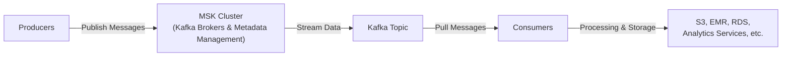

# Amazon Managed Streaming for Apache Kafka (Amazon MSK)

## 1. Introduction

Amazon MSK is a fully managed service that makes it easy to build and run applications using Apache Kafka to process streaming data. With Amazon MSK, AWS handles the heavy lifting involved in provisioning, operating, and scaling Apache Kafka clusters—freeing you to focus on your application logic rather than on managing the infrastructure. Applications built on Kafka’s open-source API work seamlessly with Amazon MSK, so you can leverage your existing tools and integrations without code changes.

## 2. Key Features of Amazon MSK

- **Fully managed**: AWS manages the underlying infrastructure (brokers, ZooKeeper, storage).
- **High availability**: Clusters can span multiple Availability Zones for resiliency.
- **Ease of scaling**: Compute and storage resources can be scaled based on workload demands.
- **Persistent data storage**: You retain streamed data on Amazon EBS volumes for as long as needed.
- **Multiple consumption options**: Integrate MSK with native Kafka consumers or AWS services such as Lambda, AWS Glue, and Kinesis Data Analytics for Apache Flink.

## 3. Architecture and Components

The following diagram illustrates the flow of data and the key components within an MSK cluster:

**Brokers and ZooKeeper:**
- **Brokers** are the Kafka servers that store streaming data and handle read/write requests.
- **ZooKeeper** manages cluster coordination, leader election, and other administrative tasks.
- MSK automatically creates and manages these nodes across Availability Zones for fault tolerance.

**Topics and Partitions:**
- Data is organized into **topics**, which are further split into **partitions**.
- Producers write messages to specific topics, and partitions help distribute load.
- Consumers pull messages from specific partitions, allowing parallel processing.
## 4. Integration and Use Cases
### 4.1. Producing Data to MSK

Producers feed data into MSK much like a traditional Kafka environment. You can build Kafka producer clients in a wide range of languages. The data typically comes from sources like IoT devices, databases, and streaming systems:

- **Kafka Producer Library**: Use Kafka’s native producer library with your preferred programming language.
- **Kinesis**: You can integrate external AWS services or gather data in Kinesis and forward it to MSK if desired.

### 4.2. Consuming Data from MSK

Once data is in MSK, multiple consumers can pull from Kafka topics. Common consumption patterns include:

1. **Kinesis Data Analytics for Apache Flink**: Run streaming SQL or large-scale data analysis on real-time data.
2. **AWS Glue**: ETL jobs can read from Kafka using Apache Spark Streaming capabilities.
3. **AWS Lambda**: Trigger Lambda functions directly from MSK for simpler event-driven processing.
4. **Native Kafka Consumers**: Deployed on Amazon EC2, Amazon ECS, or Amazon EKS, using standard Kafka consumer libraries.

### 4.3. MSK Serverless

Serverless MSK eliminates the need to provision and manage capacity for Kafka clusters manually. It automatically scales compute and storage based on workload, simplifying operations further. **This can be particularly useful for unpredictable or spiky workloads.**

## 5. Comparing MSK to Kinesis Data Streams

While both Amazon MSK (Apache Kafka) and Amazon Kinesis Data Streams are AWS services for real-time data ingestion and processing, they have key differences that make them suitable for different use cases.

| **Feature**              | **Kinesis Data Streams** | **MSK (Apache Kafka)**                                                      |
| ------------------------ | ------------------------ | --------------------------------------------------------------------------- |
| Default Max Message Size | 1 MB                     | 1 MB by default (configurable, e.g., 10 MB)                                 |
| Scaling Method           | Add or merge shards      | Add partitions only (cannot reduce partitions)                              |
| Encryption In Transit    | TLS                      | Plaintext or TLS                                                            |
| Encryption At Rest       | KMS                      | AWS-managed or customer-managed keys                                        |
| Data Retention           | Up to 7 days by default  | Potentially unlimited (EBS storage dependent)                               |
| Management               | Fully managed by AWS     | Fully managed for Kafka, deeper configuration possible (topics, partitions) |

When deciding between these services, consider factors such as existing Kafka expertise, message size requirements, throughput needs, and operational overhead. Organizations with existing Kafka applications or those seeking advanced configuration options may find MSK to be a compelling choice.

> **Exam Tip:** Expect to evaluate architectures involving real-time ingest, event processing, and analytics. You should be prepared to discuss the suitability of MSK versus Kinesis Data Streams, how to integrate with AWS services, and key configuration options (like retention, partitions, and encryption). Familiarity with these operational and architectural details ensures you can design highly available, secure, and scalable data streaming solutions with minimal overhead.
## Conclusion

Amazon MSK revolutionizes the adoption of Apache Kafka by handling the complexities of cluster management, allowing organizations to fully leverage Kafka's powerful streaming capabilities without the operational overhead. Its robust, scalable, and secure architecture, combined with deep integration across the AWS ecosystem, makes it an ideal solution for a wide range of real-time data streaming, event processing, and data-driven applications. By choosing MSK, teams can focus on building innovative streaming solutions, accelerating time-to-value and driving business agility.

For further details and the latest updates, consult the official documentation and service pages on AWS:

- [Amazon MSK Overview](https://aws.amazon.com/msk/)
- [Amazon MSK Developer Guide](https://docs.aws.amazon.com/msk/latest/developerguide/what-is-msk.html)
