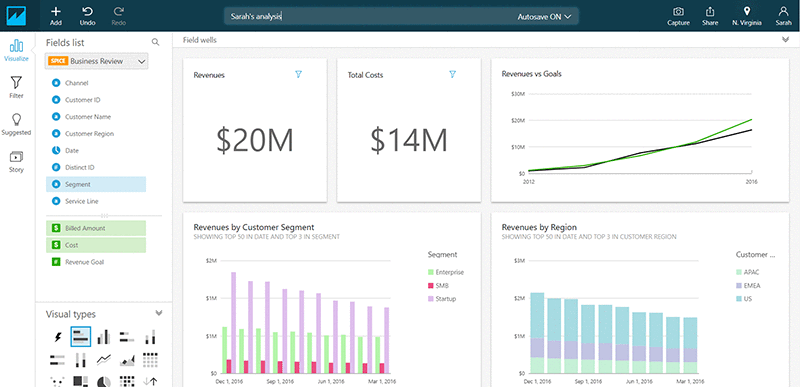

# Amazon QuickSight

## 1. Introduction
Amazon QuickSight is a fully managed, visually rich analytics solution that enables organizations to derive insights from their data in a highly scalable, serverless manner. By leveraging powerful in-memory functionality and seamless integration with numerous data sources, QuickSight makes it straightforward to create interactive dashboards and analytical reports. 

## 2. Core Features and Capabilities

* **Serverless and Machine Learning Powered:**
	Because **QuickSight is fully managed**, there is no need to provision or maintain underlying infrastructure. Its serverless nature allows it to automatically scale capacity based on the size and complexity of your datasets. Additionally, QuickSight uses machine learning–powered insights to identify trends, outliers, and key drivers behind your data.
	
* **Interactive Dashboards:**
	A core benefit of QuickSight is the ability to create visually appealing dashboards. These dashboards can include charts, tables, KPIs, and other visual elements that allow end-users to quickly glean meaningful information. Dashboards can also be embedded into websites or applications, making it easier to deliver analytics to external stakeholders.

* **SPICE Engine:**
	QuickSight’s SPICE (Super-fast, Parallel, In-memory Calculation Engine) is designed for high-speed data analysis. When data is imported directly into QuickSight, SPICE can perform in-memory computations at scale, enabling responsive reporting and advanced calculations. This in-memory engine does not apply when QuickSight simply connects to remote sources; you must import the dataset for the performance benefits of SPICE.

## 3. Architecture and Integrations

QuickSight integrates with a broad range of native AWS services and third-party providers:

- **AWS Databases:** Connect directly to RDS, Aurora, Redshift, Athena, Timestream, or S3.  
- **Third-Party Sources:** Access data from SaaS platforms like Salesforce and Jira or on-premises databases through JDBC.  
- **File Imports:** Ingest files in Excel, CSV, JSON, or TSV formats to harness in-memory performance with SPICE.

## 4. Users, Groups, Dashboards, and Analysis

QuickSight maintains its own internal user management system, separate from AWS Identity and Access Management (IAM) users. While IAM credentials can be used for administrative tasks, the end-users who consume dashboards or collaborate on analyses are defined within QuickSight itself.

- **Users and Groups:**  
  – Standard edition supports individual users.  
  – Enterprise edition also offers groups for more granular access control.  

- **Analysis and Dashboards:**  
  – An “analysis” is where you perform data exploration, build visuals, and configure filters or parameters.  
  – A “dashboard” is a read-only, shareable version of an analysis. Publishing a dashboard ensures consistent views of your data across different users.
## 5. Conclusion

Amazon QuickSight stands out as a robust, scalable, and secure BI service that leverages AWS’s cloud infrastructure and advanced machine learning capabilities. Whether you're looking to empower your business with real-time dashboards, perform deep data analysis, or embed interactive analytics into your applications, QuickSight provides the tools and integrations necessary to transform raw data into actionable insights—all while benefiting from AWS’s commitment to security, performance, and innovation.

For further details, please refer directly to the official resources:

- [Amazon QuickSight Product Page](https://aws.amazon.com/quicksight/)
- [Amazon QuickSight Documentation](https://docs.aws.amazon.com/quicksight/latest/user/welcome.html)