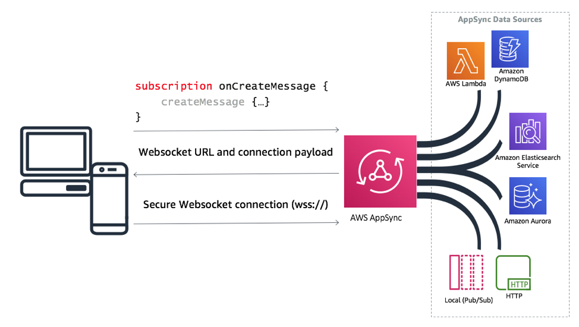
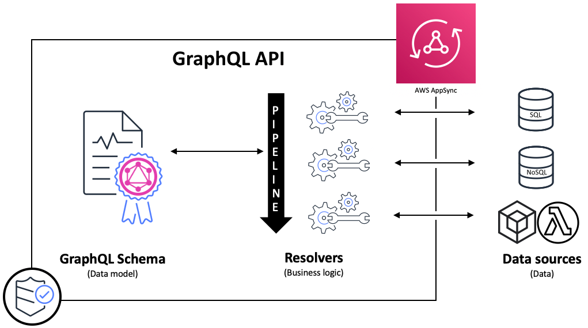

# AWS AppSync
## 1. Introduction

**AWS AppSync** is a fully managed service from Amazon Web Services that simplifies the development of GraphQL APIs. By using GraphQL as its core language, AppSync lets your client applications fetch only the data they need through a single API endpoint, regardless of whether that data resides in one or many back-end sources. It abstracts away the complexity of connecting to multiple data stores and integrates with other AWS services seamlessly.  

## 2. Core Features

1. **GraphQL API Layer**
    - **Unified Data Access:** Create a single API that aggregates data from multiple sources (e.g., Amazon DynamoDB, Aurora, Lambda, and HTTP APIs).
    - **Schema-driven Development:** Define your API’s data model using GraphQL Schema Definition Language (SDL) and automatically generate resolvers.
    - **Introspection & Self-Documentation:** GraphQL’s introspection capabilities help new developers understand available data without in-depth backend knowledge.  

2. **Real-Time Data & Offline Support**
    - **Subscriptions:** AppSync supports real-time updates via GraphQL subscriptions using WebSockets, which are ideal for chat apps, dashboards, or collaborative tools.
    - **Offline Synchronization:** It provides offline data capabilities for mobile and web applications. When devices reconnect, only the delta is synchronized with built-in conflict resolution strategies.

3. **Built-In Caching**
    - **Server-Side Caching:** Reduce latency by caching frequently accessed data directly within the managed service, with options to customize cache invalidation and expiration.

4. **Security & Access Control**
    - **Multiple Auth Modes:** Choose from API keys, AWS IAM, Amazon Cognito User Pools, OpenID Connect, or even custom Lambda authorizers to secure your API.
    - **Fine-Grained Access:** Define access rules directly within your GraphQL schema, making it easier to enforce per-field or per-operation permissions.

5. **Data Federation**
    - **Merged GraphQL APIs:** AppSync can combine multiple independent GraphQL APIs (or microservices) into one super-graph. This federation helps in scaling and isolating services while presenting a unified interface to the client.

6. **Developer Tools & Integrations**
    - **CLI & Frameworks:** Use the Amplify CLI, AWS CDK, or the Serverless Framework to deploy and manage your AppSync APIs.
    - **Resolver Languages:** Write business logic for resolvers in JavaScript/TypeScript or use Velocity Template Language (VTL) to map and transform data.

## 3. Architecture

AWS AppSync operates as a proxy layer that intercepts GraphQL requests from client applications. Here’s a brief outline of its architecture:

- **GraphQL Proxy:** Accepts, parses, and validates incoming GraphQL queries.
- **Resolvers:** Each field in the schema is linked to a resolver that maps to one or more data sources.
- **Data Sources:** Supported backends include DynamoDB, Lambda functions, relational databases (via Aurora Serverless), Elasticsearch/OpenSearch, and external HTTP endpoints.
- **Real-Time & Offline Layer:** Manages WebSocket connections for subscriptions and automatically handles data synchronization for offline clients.

This design abstracts the backend complexities, allowing you to focus on business logic while AWS handles scalability, security, and performance.

## 4. Use Cases

AWS AppSync is well suited for various scenarios:

- **Real-Time Applications:** Chat apps, live dashboards, and collaboration tools benefit from its subscription model.
- **Multi-Data Source Aggregation:** When your application requires data from several different sources (e.g., NoSQL, SQL, external APIs), AppSync provides a single endpoint.
- **Offline-First Mobile/Web Apps:** Its built-in offline capabilities allow seamless user experiences even with intermittent connectivity.
- **IoT and Sensor Data:** Use AppSync to display real-time data from IoT devices on dashboards or mobile apps.

## 5. Benefits

- **Simplified Development:** With a single GraphQL endpoint, developers can avoid the complexity of managing multiple REST endpoints.
- **Scalability:** As a fully managed service, AppSync automatically scales to handle increased loads.
- **Cost Efficiency:** Its pay-per-use pricing model means you only pay for the queries, updates, and connection minutes used.
- **Security and Compliance:** Integrated with AWS security features and compliance certifications, ensuring that your API remains secure.

## 6. Considerations and Drawbacks

- **Learning Curve:** Transitioning from REST to GraphQL may require a paradigm shift and learning new patterns.
- **Vendor Lock-In:** As a proprietary AWS service, migrating away from AppSync could require significant rework.
- **Performance Visibility:** Being a managed service means some performance tuning is abstracted away, which may limit detailed performance control.
- **Tooling Dependencies:** Some advanced features work best when combined with AWS Amplify or other AWS-specific tools, which might not suit every team’s tech stack.

## 7. Pricing Model

AWS AppSync pricing is based on:

- **GraphQL Query Operations:** Charged per million queries or data modification requests.
- **Real-Time Updates:** Pricing is based on the number of real-time messages delivered.
- **Connection Minutes:** Billed based on the total minutes of active WebSocket connections.

A generous free tier is available for 12 months with limits on queries, real-time updates, and connection minutes, allowing developers to experiment and build prototypes at minimal cost. 

## 8. Conclusion

AWS AppSync is a powerful tool for building modern, scalable, and real-time applications with GraphQL. It helps streamline backend development by providing:

- A unified API endpoint for diverse data sources.
- Real-time and offline support to enhance user experience.
- Robust security features and multiple integration options.

While it comes with benefits such as reduced development time and scalability, it also introduces challenges like vendor lock-in and a learning curve for teams new to GraphQL. The decision to use AppSync should be based on your project’s specific needs and the expertise of your team.