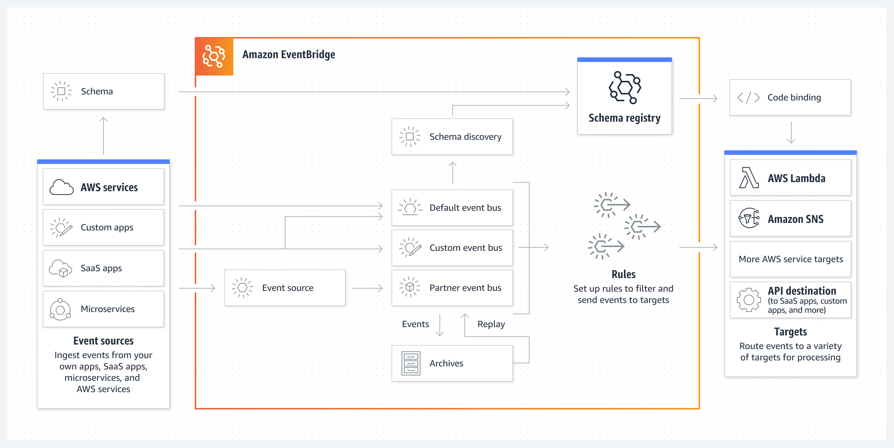
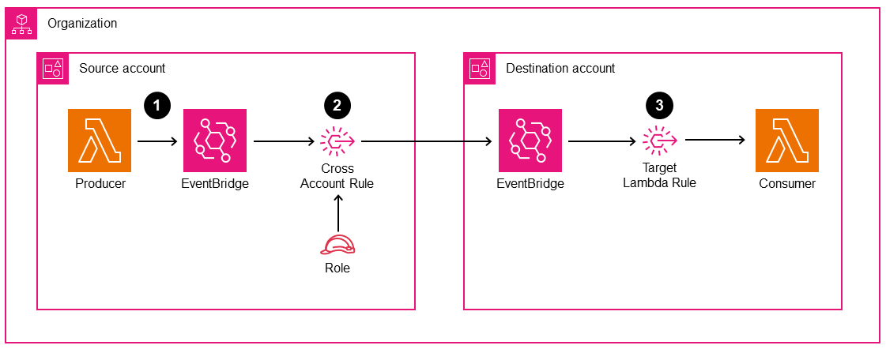

# Amazon EventBridge

## 1. Introduction
Amazon EventBridge, formerly known as CloudWatch Events, serves as a powerful event bus that can integrate multiple AWS services, partner applications, and custom events. It provides a way to detect changes in your environment—whether on a schedule, in response to specific events, or both—and trigger actions in your AWS infrastructure. 

## 2. Event Bus

EventBridge operates as a centralized hub for all sorts of notifications, state changes, and scheduled intervals. Events may originate from AWS services, third-party software as a service (SaaS) partners, or your own custom applications. Once an event is placed on the bus, you have full control over how and where it should be routed.

### 2.1. Default Event Bus
The default event bus automatically captures events emitted by AWS services in your account. For example, you can set up rules that pay attention to specific conditions, such as a successful EC2 instance launch or an IAM root user signing in to the console. When the event criteria match, EventBridge invokes your chosen target—commonly an SNS topic for notifications or a Lambda function for an automated workflow.

### 2.2. Partner Event Bus
Aside from the default bus, EventBridge integrates with select SaaS partner solutions to ingest their event streams natively into your account. If you use third-party services like Datadog or Zendesk, those platforms can be granted permission to publish events into a dedicated partner event bus. You can then create rules for real-time response whenever something occurs in those external systems.

### 2.3. Custom Event Bus
Custom event buses are also supported, enabling your own applications or microservices to publish events. This design provides clear separation of concerns: one bus might handle standard AWS service events, while another is reserved specifically for your internal app signals. Once published, these events benefit from the same filtering and target capabilities available to the default bus.
## 3. Event Patterns and Rules

EventBridge lets you define granular event patterns that act as filters. When an event from any source matches the specified attributes, EventBridge routes that event toward the associated targets. This mechanism, for example, allows you to:

- Monitor IAM root user sign-ins and send real-time notifications through SNS.
- Handle build failures in CodeBuild by invoking a remediation Lambda.
- Detect uploads to Amazon S3 and process objects automatically.

The JSON object describing each event contains metadata such as the time, service-specific details, region, and more. You have full control to filter or pass through whatever portion you need in your rule.

## 4. Resource-Based Policies and Cross-Account Access

Resource-based policies enable you to set fine-grained access controls on each event bus, allowing other AWS accounts (or specific principals) to publish events to your bus. This is particularly useful when consolidating logs or notifications into a central event bus in a designated management account. You configure a policy that grants permission to selected accounts or organizational units, enabling them to send events via `PutEvents`.

## 5. Event Archiving and Replay

In many scenarios, especially for troubleshooting or compliance, you may want to preserve incoming events. EventBridge can archive all or some subset of events based on your filters. An indefinite or time-bound retention allows you to replay events whenever needed—handy when fixing bugs in your targets or reprocessing data with updated logic.

## 6. Schema Registry

To help you manage the structure of events, EventBridge offers a Schema Registry that automatically discovers and infers the schema of the events passing through the bus. This registry is versioned, ensuring your applications can keep up with incremental changes in the event formats. Developers can download code bindings in languages like Java or Python based on these schemas, making it easier to parse and handle event data.

## 7. Conclusion

Amazon EventBridge brings powerful event-driven architecture features to AWS, enabling timely responses to numerous triggers, both within and outside the AWS ecosystem. Through event patterns, schedules, various target integrations, and cross-account policies, you can create a comprehensive, reactive solution that minimizes complexity and reduces operational overhead. Its built-in archiving and schema registry further simplify governance and lifecycle management. By leveraging these features, you can craft resilient, decoupled systems well-suited for microservices, serverless workflows, and enterprise-scale integrations.

For more detailed instructions, code examples, and best practices, you can refer to the official AWS documentation:

- [What Is Amazon EventBridge?](https://docs.aws.amazon.com/eventbridge/latest/userguide/what-is-amazon-eventbridge.html)
- [Event Buses in Amazon EventBridge](https://docs.aws.amazon.com/eventbridge/latest/userguide/eb-event-bus.html)
- [Rules in Amazon EventBridge](https://docs.aws.amazon.com/eventbridge/latest/userguide/eb-rules.html)
- [Amazon EventBridge Pricing](https://aws.amazon.com/eventbridge/pricing/)
