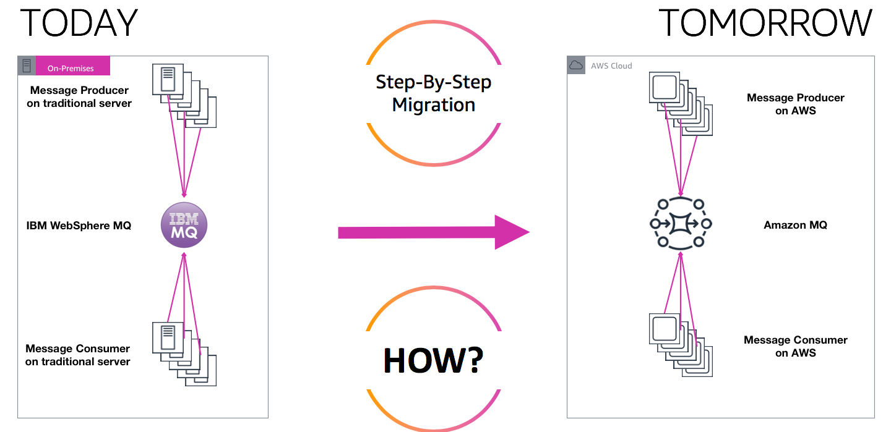

# Migrating Traditional Message Brokers to Amazon MQ

## 1. Introduction

Organizations migrating to AWS often face a challenge when their on-premises applications use open messaging protocols such as MQTT, AMQP, STOMP, Openwire, or WSS. While Amazon Simple Queue Service (SQS) and Amazon Simple Notification Service (SNS) are powerful, fully managed services, they rely on proprietary AWS protocols. Redesigning an application originally built on open protocols to use these proprietary interfaces can be time-consuming and costly. To address this, Amazon MQ provides a managed, highly compatible messaging solution for common open-source brokers.

## 2. Understanding the Need for Amazon MQ

On-premises environments frequently rely on RabbitMQ or ActiveMQ because they support open messaging protocols out of the box. When these applications migrate to AWS and require the same interfaces, Amazon MQ steps in to offer broker compatibility without requiring a complete rewrite of messaging logic. 

## 3. Key Features

Amazon MQ manages ActiveMQ or RabbitMQ under the hood. Through a single managed service, you can handle both queueing (similar to SQS) and topic-based (similar to SNS) messaging patterns. Key considerations include:

- **Managed Infrastructure:** AWS automatically provisions and manages the underlying servers and network configurations.  
- **Multi-AZ Failover:** You can opt for a deployment mode that spans multiple Availability Zones to ensure high availability.  
- **Compatibility:** Because it supports open protocols, applications built on IBM MQ, TIBCO EMS, RabbitMQ, or Apache ActiveMQ can migrate with minimal refactoring.  
- **Performance and Scalability Limits:** Unlike SQS and SNS, which scale virtually without limit, Amazon MQ brokers run on servers and have practical upper capacity boundaries. Proper sizing of broker instances is therefore essential.

## 4. Architectural Considerations
Compared to SQS and SNS, which are serverless and event-driven, Amazon MQ requires more hands-on attention to throughput limits and potential failover. In a production setup, you should consider:

- **Broker Type:** Decide between ActiveMQ or RabbitMQ based on existing code and feature needs.  
- **Deployment Mode:** “Single-instance” for lower cost, or active/standby multi-AZ for high availability.  
- **Simplifying Migrations:** Migrate queues and topics from legacy environments to Amazon MQ, preserving existing messaging protocols.

## 5. Conclusion

Amazon MQ offers a straightforward path for migrating legacy or on-premises workloads that rely on popular open protocols. While it does not scale as limitlessly as SQS or SNS, it provides managed infrastructures for ActiveMQ or RabbitMQ, making it an ideal choice for organizations seeking to preserve their existing messaging APIs during a cloud migration. Being aware of the compatibility and performance nuances will help you select the appropriate service when preparing for AWS architecture and migration exams.

For a complete and in‐depth understanding, please refer to the following official resources:

• **Amazon MQ Developer Guide:**  
  [docs.aws.amazon.com/amazon-mq/latest/developer-guide/](https://docs.aws.amazon.com/amazon-mq/latest/developer-guide/)  
• **AWS Whitepapers:** White papers like “Implementing Microservices on AWS” include architectural references that incorporate Amazon MQ.  