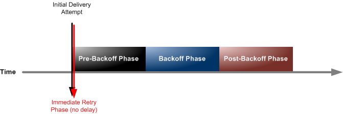

# Amazon SNS

## 1. Introduction

Amazon SNS is a fully managed, pub‑sub messaging service that lets you build distributed, decoupled, and scalable applications. It enables both application‑to‑application (A2A) and application‑to‑person (A2P) messaging by “pushing” notifications to subscribers via multiple supported protocols. With SNS, you can quickly set up topics, add subscribers, and deliver messages without the overhead of managing and scaling your own messaging infrastructure.
## 2. The Pub-Sub Pattern

Traditionally, when a system needed to send notifications to multiple receivers—such as sending an email, notifying a fraud service, and placing a message onto an Amazon SQS queue—it required multiple direct integrations. Each new receiver meant more code, more endpoints, and more complexity.

The publish-subscribe (pub/sub) pattern decouples message producers from consumers. A publisher sends a message to a “topic,” and any number of subscribers automatically receive that message. This drastically reduces integration overhead and simplifies scaling.

**High-Level Flow**:

1. **Producers (Publishers):** Send messages to an SNS topic.
2. **Topic:** Acts as a central “channel” or “hub.”
3. **Consumers (Subscribers):** Automatically receive messages from that topic in various formats (e.g., email, HTTP, AWS Lambda, Amazon SQS).

This model allows for straightforward addition or removal of subscribers. You no longer modify the publisher to accommodate new consumers. Instead, you configure them to listen on the SNS topic.

## 3. Architecture & Components

**Topic**  
A topic is the primary resource in SNS where a message is published. Once a message arrives, SNS automatically distributes copies to all subscribers.

**Subscriptions**  
A subscription defines how the topic routes messages to the consumer. You can configure a wide range of subscription endpoints:

- **Email:** SNS can send notifications directly as email messages.
- **SMS:** Send text messages to mobile phones.
- **HTTP/HTTPS:** Forward requests to an endpoint you configure.
- **Amazon SQS:** Route notifications into an SQS queue for decoupled processing.
- **AWS Lambda:** Invoke a function when new messages arrive.
- **Mobile Push Notifications:** Integrate with GCM (Google), APNS (Apple), or ADM (Amazon) for mobile devices.

**Message Attributes & Filtering:**  
Messages can carry additional metadata in the form of attributes. Subscribers can use filter policies to select only the messages they need.

**Scalability**  
SNS supports millions of subscriptions per topic, and you can create a large number of topics per AWS account. While specific limit numbers can change, the key point is that SNS is designed for massive fan-out.

> **Exam Tip:** You are not tested on the exact numeric service limits for SNS, but it is crucial to know it scales to millions of subscribers and can support hundreds of thousands of topics per account.

## 4. Reliable Message Delivery and Dead Letter Queues

Simple Notification Service (SNS) provides a flexible, fully managed message delivery mechanism within AWS. However, message delivery does not always succeed on the first try due to endpoint issues or network errors. This section explores how SNS handles message delivery retries and leverages dead letter queues (DLQs) to ensure important messages are not lost when all attempts fail. Understanding these retry and failure-handling processes is key to designing resilient systems.
### 4.1. Default Delivery Policy and Retries for Managed Endpoints

When SNS sends messages to AWS-managed endpoints—such as Kinesis Data Firehose, AWS Lambda, or Amazon SQS—it applies a specific, preconfigured delivery policy. This policy is structured in distinct phases, aiming to ensure maximum persistence in delivering the message:

- Three initial attempts without any delay.  
- Two subsequent retries separated by a 1-second delay.  
- Ten exponential backoff attempts ranging from 1 to 20 seconds between retries.  
- A “post backoff” phase of 100,000 attempts, each separated by 20 seconds, spanning up to 23 days in total.

By adding all these phases together, an individual message can see up to 100,015 total delivery attempts. The extremely large number of retries provides a high degree of confidence that if the endpoint recovers, the message will eventually be delivered.

### 4.2. Custom Delivery Policies for HTTP/HTTPS Subscribers

In addition to the built-in delivery policy for AWS-managed endpoints, SNS offers custom delivery policies for HTTP and HTTPS endpoints subscribed to a topic. These policies allow you to fine-tune:

- The maximum number of retries.  
- The minimum and maximum delay between successive attempts.  
- The exponential backoff function.  
- Throttling behavior to control the rate of requests sent to your endpoint.

This flexibility is particularly useful if your custom application endpoint has specific throughput or concurrency limits. By setting a tailored retry policy, you can balance reliability (ensuring enough delivery attempts) with system stability (avoiding overwhelming a recovering service).

### 4.3. Using Dead Letter Queues for Failed Deliveries

Even with a thorough retry policy, some messages may still fail to be delivered successfully. When all retries are exhausted, SNS discards the message unless a dead letter queue (DLQ) is attached. In this scenario, the undelivered message is sent to an Amazon SQS queue designated as the DLQ. You can later inspect, reprocess, or log these failed messages to troubleshoot delivery issues.

### 4.4. Subscription-Level DLQs

For SNS, a DLQ is configured on the subscription level, not on the topic itself. This design choice allows for granular handling of failures. Different subscriptions require different treatment of unprocessed messages, so you can attach separate DLQs to each subscription if needed. For instance:

- An email subscription might have its own DLQ to catch messages that fail delivery.  
- An HTTP/HTTPS subscription with specialized error handling might be configured with its own distinct DLQ.

By segregating these queues at the subscription level, you can quickly pinpoint which endpoint experiences problems and handle failures more efficiently.

## 5. Pricing and Quotas

- **Pricing:**  
	SNS charges based on the number of API requests (e.g., publishing messages) and the number of notifications delivered. There is a generous free tier (for example, the first 1 million requests each month are free) and pricing varies by delivery protocol (HTTP/HTTPS, email, SMS, etc.).
    
- **Quotas:**  
    Official documentation details limits such as the number of topics per account, subscription limits, message size (up to 256 KiB per message), and API rate limits. These quotas are designed to be high enough for most use cases and can often be increased on request.
## 6. Security

- **Access Control:**  
    Use IAM policies and SNS topic policies to restrict who can publish or subscribe to topics.
- **Encryption:**  
    Enable server‑side encryption with AWS KMS to protect message data at rest.
- **VPC Endpoints:**  
    For increased security, SNS supports VPC endpoints so that traffic can remain within your private network.

## 7. Common Integration Patterns

- **Application Integration:**  
    SNS is often used to decouple microservices. A common pattern is to publish messages to a topic that are then fanned out to multiple SQS queues, Lambda functions, or other endpoints for parallel processing.
    
- **Alerts & Notifications:**  
    Whether sending operational alerts (via SMS or email), mobile push notifications for customer apps, or automated messages between services, SNS provides real‑time, push-based delivery without polling.
    
- **Fanout Architectures:**  
    SNS can efficiently fan out messages to a large number of subscribers, making it ideal for event-driven systems where a single event must trigger multiple actions.
## 8. Conclusion

Amazon SNS is a versatile, highly scalable, and fully managed messaging service designed to simplify the process of sending notifications and messages in both application-to-application and application-to-person contexts. With robust security, flexible integration options, and cost-effective pricing, it is an essential component for building modern, distributed, and event-driven architectures on AWS.

For more in‑depth information, refer to the official resources:

- [Amazon SNS Documentation](https://docs.aws.amazon.com/sns/)
- [Amazon SNS FAQs](https://aws.amazon.com/sns/faqs/)
- [Amazon SNS Endpoints and Quotas](https://docs.aws.amazon.com/general/latest/gr/sns.html)
