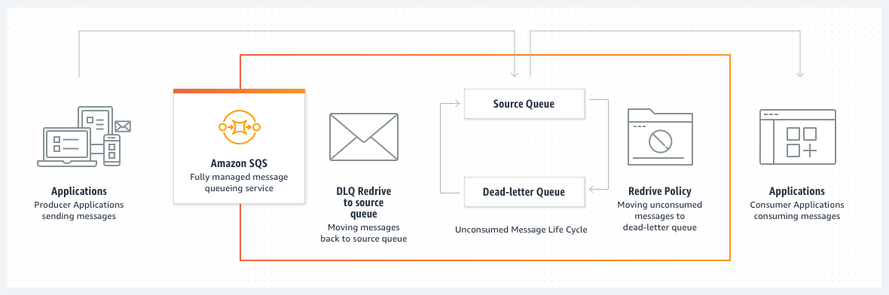
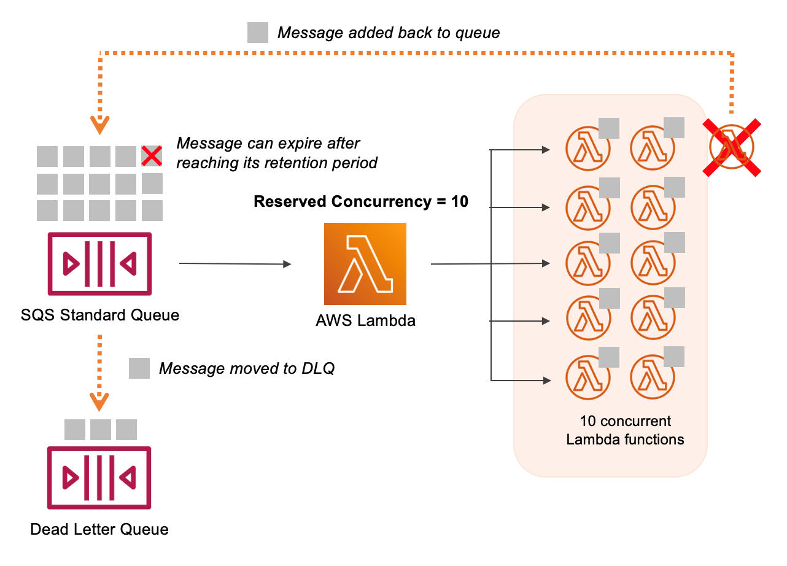

# Amazon SQS

## 1. Introduction

Amazon SQS is a fully managed, highly scalable message queuing service that decouples distributed application components such as microservices, serverless applications, and distributed systems. With SQS, you can reliably send, store, and receive messages without needing to provision or manage your own messaging infrastructure. It supports both standard and FIFO (first‐in‐first‐out) queues, each optimized for different use cases.

## 2. Core Concepts

### 2.1. Decoupled Architecture

A primary use for SQS is to decouple systems so that sending messages (producers) and receiving messages (consumers) do not directly depend on each other. This approach improves resiliency and scalability across microservices, since each component can scale according to its own demand, without causing cascading failures or bottlenecks in the rest of the system.
### 2.2. Standard vs. FIFO Queues

SQS offers two queue types:

- **Standard Queue**: Provides nearly unlimited throughput, best-effort ordering, and at-least-once message delivery. This means:
    
    - **Ordering is not guaranteed**; messages can be delivered in a different sequence from which they were sent.
    - **High Throughput**: Able to handle very large volumes of messages per second without provisioning.

- **FIFO Queue**: Preserves message ordering (“first in, first out”) and supports exactly-once processing. However:
    
    - **Reduced Throughput**: By default, up to 300 messages per second (or up to 3000 with message batching).
    - **Strict Ordering**: Suited for workloads where the exact sequence of operations is critical.
### 2.3. Message Size

Each message can be up to 256 KB. If a process needs to send a payload larger than 256 KB (for instance, a file of several megabytes), a common pattern is to:

1. Upload the large data object to Amazon S3.
2. Send only the reference (the S3 key) through SQS.
3. Have the consumer retrieve and process the file from S3.

This pattern maintains the scalability of SQS and offloads large data storage to S3.

## 3. Understanding Dead Letter Queues

### 3.1. Why Dead Letter Queues Matter

When a consumer fails to process a message within the “visibility timeout” (the time a message stays hidden from other consumers once retrieved), that message returns to the queue. If a particular message keeps failing repeatedly, it can cause a “poison-pill” loop.

A **Dead Letter Queue (DLQ)** prevents repeated processing attempts of problematic messages. You set a **maximum receive count** for the original queue, and if a message fails above that threshold, SQS automatically moves it to the DLQ. You can then inspect the stuck messages, debug potential issues, and decide on corrective actions before reprocessing them.

### 3.2. Matching Queue Types

- A standard queue can only use another standard queue as its DLQ.
- A FIFO queue can only use another FIFO queue as its DLQ.

### 3.3. Retention for Troubleshooting

To allow enough time for debugging, you can set the retention period in the DLQ as high as **14 days**. This ensures that problematic messages remain available for analysis and manual reprocessing if needed.

### 3.4. Redrive to Source

Once you fix the root cause of why messages landed in a DLQ, the **Redrive** feature lets you move those DLQ messages back to the original (source) queue for normal processing. This workflow helps recover gracefully from temporary logic or data format errors that caused the consumer to fail.

## 4. Idempotency: Ensuring Safe Reprocessing

Because SQS guarantees at-least-once message delivery, a message might occasionally be delivered twice. Your consumers should be **idempotent**, meaning that repeated processing of the same message does not produce unintended, duplicate side effects.

For example:

- **Non-Idempotent**: Inserting a new database record each time a message is read. Reading the same message twice results in two duplicate records.
- **Idempotent**: Using a primary key or unique identifier. If the record already exists, update or overwrite it instead of creating a duplicate.

Designing idempotent consumers is vital for preventing data corruption and ensuring consistent results in distributed systems.

## 5. Integrations with AWS Lambda

SQS can trigger AWS Lambda functions through an **event source mapping**. Lambda’s poller automatically uses "long polling" on the SQS queue, retrieves messages in batches, and invokes your Lambda function. Considerations include:

- **Batch Size**: Configure between 1 and 10 messages, balancing throughput and concurrency.
- **Visibility Timeout**: Set this timeout at approximately six times the Lambda function’s timeout. This ensures that if your function needs retries or experiences delays, it has sufficient time to process messages without them reappearing on the queue prematurely.
- **DLQ Setup**: If you want unprocessed messages (due to repeated failures) to stop re-invoking the Lambda function, configure a DLQ at the queue level. Alternatively, you can use Lambda Destinations when processing events asynchronously, but that does not apply to poll-based event sources such as SQS.
## 6. Conclusion

Amazon SQS is an essential component for building resilient, scalable, and decoupled architectures on AWS. By using standard or FIFO queues along with features such as visibility timeouts, dead-letter queues, and integration with other AWS services, SQS helps you manage asynchronous communication between distributed components with minimal overhead and maximum reliability.

For detailed best practices, refer to the following resources:

- **Amazon SQS Documentation Portal:**  
    [https://docs.aws.amazon.com/sqs/](https://docs.aws.amazon.com/sqs/)  
- **AWS Whitepapers & Guides:**  
    Although there isn’t a standalone AWS-published whitepaper solely for SQS, the “Overview of Amazon Web Services” whitepaper covers SQS as part of the broader AWS platform.  
- **Developer Guides & Tutorials:**  
    Explore the [Amazon SQS Resources](https://aws.amazon.com/sqs/resources/) page for webinars, best practices, and additional tutorials.

