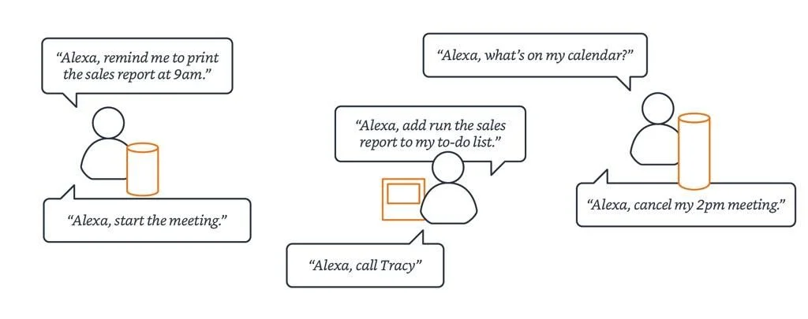
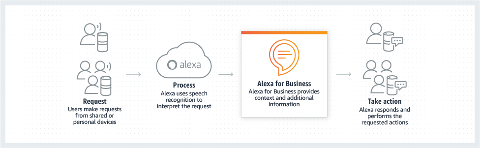

# AWS Alexa for Business

## 1. Introduction

AWS Alexa for Business is an enterprise service that brings the familiar Alexa voice assistant into the workplace. It enables organizations to:

- **Manage Alexa-enabled devices at scale** (shared or personal)
- **Deploy and manage skills**—both public and custom private skills
- **Improve productivity** through voice-driven actions such as meeting room booking, initiating conference calls, accessing calendars, and more

This service is designed so that IT administrators can provision devices, enroll users, and set configurations for shared spaces (e.g., conference rooms) as well as allow employees to extend these capabilities to their personal devices.

## 2. Architecture and Management Tools

- **Centralized Management Console:**  
    Administrators use the Alexa for Business console to:
    - Configure room profiles and assign devices
    - Enroll users and manage skills
    - Monitor device usage and manage conference settings

- **API Operations:**  
    A comprehensive set of API calls (e.g., `create_room`, `update_profile`, `send_invitation`, etc.) allow integration with existing enterprise systems and automation of device management tasks.
    
- **Integration with AWS Ecosystem:**  
    Alexa for Business leverages core AWS security services (such as IAM and TLS encryption) to ensure that all communications between devices and the Alexa cloud are secure.

## 3. Conclusion

AWS Alexa for Business is designed to bring the ease and natural interaction of Alexa into the enterprise. It helps organizations manage devices and skills centrally, enabling hands-free, voice-driven productivity improvements across shared spaces and personal devices. With robust APIs, comprehensive security measures, and detailed documentation—including official white papers on privacy and data handling—AWS ensures that businesses can integrate voice technology while maintaining control and safeguarding user data.

For more in-depth details, consult these official resources:

- **AWS Alexa for Business Official Page & Documentation:**  
    [AWS Alexa for Business](https://aws.amazon.com/alexaforbusiness/)  
    [Alexa for Business Administration Guide](https://docs.aws.amazon.com/alexaforbusiness/latest/dg/what-is-alexaforbusiness.html)  

- **Service Authorization & API References:**  
    [Actions, Resources, and Condition Keys for Alexa for Business](https://docs.aws.amazon.com/service-authorization/latest/reference/list_alexaforbusiness.html)  

- **White Papers on Privacy and Data Handling:**  
    [Alexa Privacy and Data Handling Overview (20180720)](https://d1.awsstatic.com/product-marketing/A4B/White%20Paper%20-%20Alexa%20Privacy%20and%20Data%20Handling%20Overview.pdf)  
    [Alexa Confidentiality and Data Handling Overview (20191220)](https://d1.awsstatic.com/whitepapers/White%20Paper-Alexa%20Confidentiality%20and%20Data%20Handling%20Overview%20Dec%202019.pdf)  
    
- **API Developer Documentation:**  
    [Boto3 Documentation for AlexaForBusiness](https://boto3.amazonaws.com/v1/documentation/api/1.26.85/reference/services/alexaforbusiness.html)  