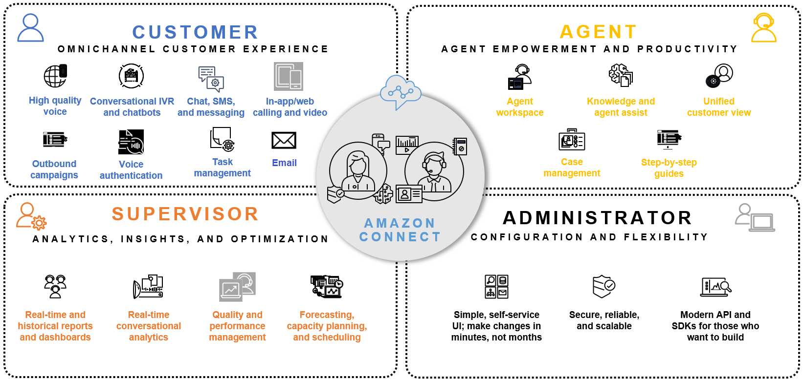

# Amazon Connect

## 1. Introduction

**Amazon Connect** is AWS’s cloud-based contact center solution designed to be easy to set up, scalable, and cost-effective. It lets organizations quickly launch an omnichannel contact center that supports voice, chat, and other channels while integrating AI and machine learning to enhance customer interactions. With a pay-as-you-go pricing model and a fully managed infrastructure, Amazon Connect minimizes the need for upfront investments and on-premises hardware.
## 2. Key Features and Capabilities

- **Omnichannel Customer Experience:**  
    Amazon Connect provides a unified interface for voice and web chat interactions. It seamlessly integrates with other AWS services (such as Amazon Lex for conversational bots, AWS Lambda for custom logic, and Amazon Pinpoint for messaging) to extend its functionality and deliver personalized customer experiences.  

- **AI and Analytics Integration:**
    
    - **Contact Lens for Amazon Connect:** Uses advanced natural language processing to analyze call transcripts, gauge sentiment, and even redact sensitive information automatically.
    - **Amazon Q in Connect:** Empowers agents with real-time, generative AI assistance to improve response times and service quality.
    - Built-in metrics and reporting help supervisors monitor key performance indicators in near real time.  

- **APIs and Extensibility:**  
    Amazon Connect is an open platform with extensive APIs (and SDKs such as the Amazon Connect Streams API) that allow developers to integrate the contact center with existing CRM systems, data lakes, and third-party applications.  

- **Scalability and Flexibility:**  
	The service can scale from a small number of agents to thousands and supports advanced features such as skills-based routing, task management, and detailed contact flow customization—all managed via a web-based administration console.  

- **Security and Compliance:**  
	Security is built in from the ground up. Amazon Connect uses industry-standard TLS and SRTP to secure both signaling and media traffic. For highly regulated industries, AWS offers additional whitepapers (such as AWS Direct Connect for Amazon Connect) to help establish private connectivity and meet compliance requirements.

## 3. Architecture and Integration

- **Contact Center Architecture:**  
    Amazon Connect’s architecture is designed for simplicity and integration. It provides a web-based agent desktop (the Contact Control Panel) and a highly flexible contact flow editor that allows the creation and customization of call routes and digital interactions.  

- **Data Lake Integration:**  
    For organizations looking to leverage data for deeper insights, the [Amazon Connect Data Lake Best Practices](https://docs.aws.amazon.com/whitepapers/latest/amazon-connect-data-lake-best-practices/amazon-connect.html) whitepaper outlines how to centralize various data types (like contact trace records, call recordings, and contact flow logs) in Amazon S3. This integration supports advanced analytics, machine learning, and real-time dashboards.  
    
- **Connectivity Options:**  
    If customers need a private, reliable connection rather than relying on the public internet, the [AWS Direct Connect for Amazon Connect](https://docs.aws.amazon.com/whitepapers/latest/aws-direct-connect-for-amazon-connect/technical-overview.html) whitepaper describes how to set up dedicated connectivity through physical cross-connects, carrier interconnections, or data center interconnections.

## 4. Use Cases and Business Benefits

- **Cost Efficiency and ROI:**  
    According to studies referenced in the [Amazon Connect Data Lake Best Practices](https://docs.aws.amazon.com/whitepapers/latest/amazon-connect-data-lake-best-practices/amazon-connect.html) whitepaper, customers have realized significant cost savings (including reductions in cloud technology and subscription costs) and improved agent productivity, achieving ROIs as high as 241%.  
    
- **Scalability for All Sizes:**  
    Whether you are a small business or an enterprise with tens of thousands of agents, Amazon Connect scales automatically to meet demand without a need for additional infrastructure investments.
    
- **Enhanced Customer Experience:**  
    By integrating AI-powered analytics and real-time data insights, organizations can rapidly identify and resolve issues, optimize agent performance, and ultimately deliver a more personalized and efficient customer service experience.

## 5. Conclusion

For more details and the latest updates, you can refer to the following resources:

- [AWS Direct Connect for Amazon Connect](https://docs.aws.amazon.com/whitepapers/latest/aws-direct-connect-for-amazon-connect/technical-overview.html)  
- [Amazon Connect Data Lake Best Practices](https://docs.aws.amazon.com/whitepapers/latest/amazon-connect-data-lake-best-practices/amazon-connect.html)