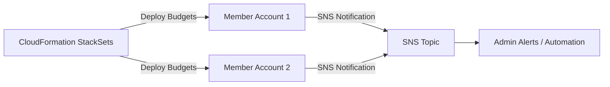

# AWS Budgets

## 1. Introduction

AWS Budgets is a core AWS cost management tool that empowers you to proactively monitor and control your cloud spending. It lets you set custom budgets based on your actual costs, usage, or reservation metrics, and alerts you when your spending or usage exceeds—or is forecasted to exceed—your defined thresholds. 

## 2. Overview

AWS Budgets is a powerful service that lets you monitor and control your spending. You can define budgets for different dimensions—usage, cost, reservations, or savings plans—and set up alerts that notify you when actual or forecasted usage exceeds the threshold you specify.

![[budgets.png]]

You can set up optional notifications that warn you if you exceed, or are forecasted to exceed, your budgeted amount for cost or usage budgets. Or if you fall below your target utilization and coverage for RI or Savings Plans budgets. You can have notifications sent to an Amazon SNS topic, to an email address, or to both.

## 3. Budget Types

You can create the following types of budgets:

- **Cost budgets** – Plan how much you want to spend on a service.
- **Usage budgets** – Plan how much you want to use one or more services.
- **RI utilization budgets** – Define a utilization threshold and receive alerts when your RI usage falls below that threshold. This lets you see if your RIs are unused or under-utilized.
- **RI coverage budgets** – Define a coverage threshold and receive alerts when the number of your instance hours that are covered by RIs fall below that threshold. This lets you see how much of your instance usage is covered by a reservation.
- **Savings Plans utilization budgets** – Define a utilization threshold and receive alerts when the usage of your Savings Plans falls below that threshold. This lets you see if your Savings Plans are unused or under-utilized.
- **Savings Plans coverage budgets** – Define a coverage threshold and receive alerts when your Savings Plans eligible usage that is covered by Savings Plans fall below that threshold. This lets you see how much of your instance usage is covered by Savings Plans.

## 4. Budget Actions

You can use AWS Budgets to run an action on your behalf when a budget exceeds a certain cost or usage threshold. To do this, after you set a threshold, configure a budget action to run either automatically or after your manual approval.

Your available actions include:

* **Apply or modify IAM policies**: Restrict specific users, groups, or roles from certain operations.
- **Attach or update Service Control Policies (SCPs)**: Impose restrictions on an entire Organizational Unit (OU).
- **Stop EC2 or RDS instances**: Halt running instances to prevent further costs.

You can also configure multiple actions to initiate at the same notification threshold. For example, you can configure actions to initiate automatically when you reach 90 percent of your forecasted costs for the month. To do so, perform the following actions:

- Apply a custom `Deny IAM` policy that restricts the ability for a user, group, or role to provision additional Amazon EC2 resources.    
- Target specific Amazon EC2 instances in `US East (N. Virginia) us-east-1`.
## 5. Centralized vs. Decentralized Budget Management

### 5.1. Centralized Budget Management

In a centralized approach, the management account controls budgets for all member accounts within an Organization. You would create one budget per member account within the management account, applying filters that target the member account’s AWS billing data.

![[budget-centeralized.png]]

1. **Budget Creation**: Define the budget in the management account, using filters to track spending for a specific member account.
2. **Alert and Automation**:
    - If a threshold is exceeded, an SNS topic sends a notification to a Lambda function.
    - The function then moves the over-budget member account to a restrictive OU that prevents provisioning of additional resources.
    - An email or message can be sent to administrators for visibility into this event.

In this setup, all budgets are visible and controlled at the management account level, simplifying governance and central oversight.

### 5.2. Decentralized Budget Management

With a decentralized model, each member account hosts its own budget. This approach is useful when you want individual teams or departments to manage their own cost thresholds. You can streamline budget deployment across all member accounts by using AWS CloudFormation StackSets.

1. **StackSets for Budget Deployment**: From the management account, use a StackSet to automatically create and configure AWS Budgets in each member account.
2. **Alerts and Actions**: Similar to centralized management, each member account can trigger notifications and automated actions to stop costly resources when a threshold is exceeded.

This approach distributes responsibility, allowing each team to manage its own costs while still adhering to overarching organizational policies.

## 6. Integration in a Broader Cost Management Strategy

AWS Budgets is an integral component of AWS’s overall cost management framework, often paired with:

- **AWS Cost Explorer:** For visualizing cost trends and analyzing spending patterns.
- **AWS Cost and Usage Report:** For accessing detailed billing data.
- **Cloud Financial Management Best Practices:** As outlined in the AWS Cloud Adoption Framework, which recommends using tools like AWS Budgets for transparent cost planning, measurement, and optimization. 

## 7. Pricing Considerations

While AWS Budgets is designed to help manage costs, it also has its own pricing model. Generally, you pay a small fee per alert notification beyond the free tier—allowing you to keep costs minimal while benefiting from continuous monitoring. For the latest pricing details, consult the official AWS Budgets pricing page.
## 8. Conclusion

AWS Budgets provides a robust, flexible, and integrated solution to monitor, forecast, and control your AWS spending. By setting up custom budgets and leveraging proactive alerts, you can enforce cost discipline and drive continuous cost optimization across your cloud environment. When combined with other AWS cost management tools, AWS Budgets forms a key pillar of your overall cloud financial management strategy.

For more in-depth details, read AWS whitepapers—such as the "[Laying the Foundation: Setting Up Your Environment for Cost Optimization](https://docs.aws.amazon.com/pdfs/whitepapers/latest/cost-optimization-laying-the-foundation/cost-optimization-laying-the-foundation.pdf)"— which highlights the importance of using AWS Budgets to drive cost-optimization behaviors and support a proactive cloud financial management strategy.  