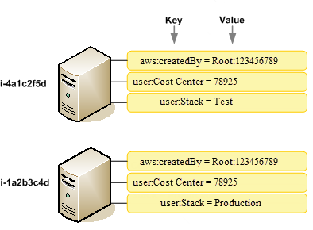

# AWS Cost Allocation Tags

## 1. Introduction

AWS Cost Allocation Tags are a key mechanism for tracking and managing your AWS costs by allowing you to assign metadata to your resources in the form of key‐value pairs. Once applied and activated, these tags appear in your billing reports and help you break down your costs by business unit, application, environment, and other organizational dimensions.

## 2. What They Are?

A tag is a label that you or AWS assigns to an AWS resource. Each tag consists of a _key_ and a _value_. For each resource, each tag key must be unique, and each tag key can have only one value. You can use tags to organize your resources, and cost allocation tags to track your AWS costs on a detailed level. After you activate cost allocation tags, AWS uses the cost allocation tags to organize your resource costs on your cost allocation report, to make it easier for you to categorize and track your AWS costs.

## 3. Types of Tags

AWS provides two types of cost allocation tags, an _AWS-generated tags_ and _user-defined tags_. AWS, or AWS Marketplace ISV defines, creates, and applies the AWS-generated tags for you, and you define, create, and apply user-defined tags. You must activate both types of tags separately before they can appear in Cost Explorer or on a cost allocation report.

### 3.1. AWS Generated Cost Allocation Tags

- **Definition:** These tags are automatically applied by AWS to new resources upon creation.
- **Identification:** They are easily recognized by the prefix "AWS" (e.g., `AWS:createdBy`).
- **Scope:** Note that these tags are only applied to resources created after the activation of the cost allocation feature. Resources that were provisioned before enabling the tags will not include these automatically generated tags.

### 3.2. User-Defined Cost Allocation Tags

- **Definition:** User-defined or custom tags are created manually by you or your organization.
- **Identification:** These tags are distinguished by the prefix "user," making them customizable and aligned with your specific operational and reporting requirements.
- **Usage:** They are critical when you want to group resources in a way that best reflects your organizational structure or project segmentation.

### 3.3. Example

In the following example, you've assigned and activated tags on two Amazon EC2 instances, one tag called Cost Center and another tag called Stack. Each of the tags has an associated value. You also activated the AWS-generated tags, `createdBy` before creating these resources. The `createdBy` tag tracks who created the resource. The user-defined tags use the `user` prefix, and the AWS-generated tag uses the `aws:` prefix.

## 4. Use case

After you or AWS applies tags to your AWS resources (such as Amazon EC2 instances or Amazon S3 buckets) and you activate the tags in the Billing and Cost Management console, AWS generates a cost allocation report as a comma-separated value (CSV file) with your usage and costs grouped by your active tags. You can apply tags that represent business categories (such as cost centers, application names, or owners) to organize your costs across multiple services.

The cost allocation report includes all of your AWS costs for each billing period. The report includes both tagged and untagged resources, so that you can clearly organize the charges for resources. For example, if you tag resources with an application name, you can track the total cost of a single application that runs on those resources. The following screenshot shows a partial report with columns for each tag.

You can also use tags to filter views in Cost Explorer. For more information about Cost Explorer, see [Analyzing your costs with AWS Cost Explorer](https://docs.aws.amazon.com/cost-management/latest/userguide/ce-what-is.html).

However, it is important to understand that:

- **Visibility:** These tags appear only in the billing console and are not displayed elsewhere in the AWS Management Console.
- **Latency:** There is a latency of approximately 24 hours before newly applied tags show up in the billing reports. This delay should be factored into your monitoring and reporting cycles.

## 5. Best Practices

- **Cross-Account Consistency:** Develop a standardized tagging framework across all AWS accounts. This ensures that when cost allocation tags are applied, billing data is grouped consistently, making it easier to track and manage expenses across multiple environments.
- **Strategic Grouping:** Choose tags that reflect meaningful business units or projects, ensuring that each tag corresponds to a measurable cost center.
- **Regular Review:** Periodically review and update your tagging strategy to accommodate changes in resource usage and organizational priorities.

## 6. Conclusion

By leveraging AWS Cost Allocation Tags effectively, you can gain granular visibility into your cloud spending, improve financial accountability, and support your organization’s cost management and optimization initiatives.

For more detailed guidance on planning and implementing a cost allocation tagging strategy, consider reviewing:

- **[AWS Billing and Cost Management Documentation](https://docs.aws.amazon.com/awsaccountbilling/latest/aboutv2/cost-alloc-tags.html):**  
    Provides step-by-step guidance on activating and managing cost allocation tags.  
- **[Best Practices for Tagging AWS Resources (Whitepaper)](https://docs.aws.amazon.com/whitepapers/latest/tagging-best-practices/cost-allocation-tags.html):**  
    Offers insights on creating a comprehensive tagging schema, including cost allocation tags.  
- **[AWS Prescriptive Guidance on Tagging](https://docs.aws.amazon.com/pdfs/prescriptive-guidance/latest/cost-allocation-tagging/cost-allocation-tagging.pdf):**  
    A whitepaper that covers detailed strategies for implementing a tagging strategy for cost and usage data.  