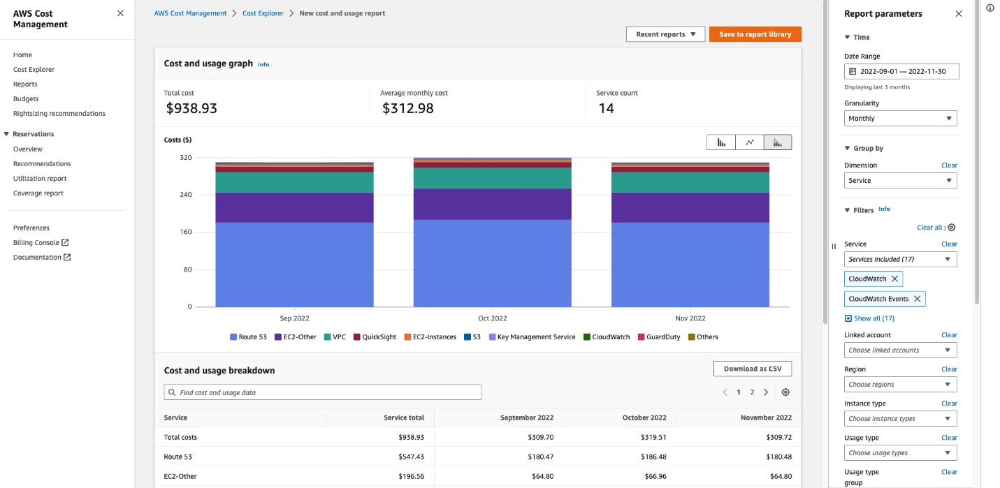

# AWS Cost Explorer

## 1. Introduction

AWS Cost Explorer is a powerful tool that brings clarity to the complexities of cloud spending. In this chapter, we delve into the capabilities, setup, and advanced features of Cost Explorer, offering you a comprehensive guide to understanding and optimizing your AWS costs.

## 2. What is AWS Cost Explorer?

At its core, AWS Cost Explorer is a visualization and analysis tool designed to help you understand your cost and usage patterns. It offers several key features:

- **Historical Data Analysis:** View up to 13 months of past data, enabling you to identify spending trends.
- **Forecasting:** Estimate your future costs for the next 12 months based on historical trends.
- **Reservation Recommendations:** Receive guidance on which Reserved Instances or Savings Plans might benefit your organization.
- **Custom Views:** Access preconfigured dashboards or tailor your own reports to highlight the metrics that matter most.

These features ensure that you can not only track your spending but also predict and plan for upcoming expenses.

## 3. Enabling and Setting Up Cost Explorer

Before you can harness the power of Cost Explorer, you must enable it through the AWS Cost Management console. The initial setup process involves several important steps:

1. **Activation:** Open the Billing and Cost Management console and navigate to the Cost Explorer section. When you launch Cost Explorer for the first time, AWS begins preparing the data for your **current month and the previous 13 months**.
2. **Data Availability:** While the current month’s data becomes available in about 24 hours, the rest of your historical data may take a few days to process. Once enabled, Cost Explorer continuously refreshes your data at least once every 24 hours.
3. **Cost Anomaly Detection:** As part of the activation, AWS automatically configures Cost Anomaly Detection. This feature uses machine learning to monitor your spending patterns and alert you to any anomalies—typically when your spending exceeds a threshold of $100 and 40% of your expected cost.

It is important to note that while using the Cost Explorer user interface is free of charge, programmatic access via the API incurs a small fee per request. Moreover, once enabled, Cost Explorer remains active for your account.

## 4. Navigating the Cost Explorer Dashboard

Once set up, the Cost Explorer dashboard offers a wealth of information at a glance:
### 4.1. Key Dashboard Elements

- **Month-to-Date and Forecasted Costs:** Prominently displayed at the top, these figures show your estimated spending for the current month and your forecasted month-end costs, offering a direct comparison with previous periods.
- **Daily Cost Graphs:** In the center of the dashboard, a graph illustrates your daily unblended costs—helping you visualize short-term spending trends.
- **Top Cost Trends:** A dedicated section highlights your five most significant cost trends. These trends can reveal patterns such as rising expenses in specific AWS services or cost increases in your Reserved Instances.
- **Recent Reports:** A list of your recently accessed reports allows you to quickly switch between different views and analyses.

### 4.2. Detailed Reporting Options

Beyond the high-level overview, Cost Explorer offers detailed reports that let you dive deeper:

- **Unblended and Net Costs:** You can analyze both your gross charges and your net spending after applicable discounts. This includes viewing unblended costs with monthly granularity and understanding the impact of discounts such as RI Volume Discounts.
- **Amortized Cost Analysis:** For organizations that commit to long-term savings plans or Reserved Instances, Cost Explorer spreads these costs over the applicable usage period. This helps you see both the upfront commitment and the effective cost rate over time.
- **Custom Reports and CSV Exports:** Every report can be customized by adjusting filters and parameters. Moreover, if you need to perform further analysis, you can export your data to a CSV file for use in other tools.

## 5. Advanced Features and Considerations

### 5.1. Cost Anomaly Detection

A standout feature of AWS Cost Explorer is its integrated Cost Anomaly Detection. Utilizing machine learning models, this feature monitors your AWS spending and alerts you when unusual patterns arise. By setting up automatic notifications and daily summaries, Cost Anomaly Detection ensures that you are promptly informed about any unexpected deviations in your spending.
### 5.2. Organizational and Account Considerations

AWS Cost Explorer is also designed to work seamlessly within AWS Organizations. However, there are a few key points to keep in mind:

- **Member vs. Standalone Accounts:** The visibility of cost and usage data can change when an account moves between standalone and organizational statuses. For example, a member account that leaves an organization loses access to historical data from its time within that organization.
- **Access Controls:** In an organization, the management account has the authority to enable or restrict access to Cost Explorer for member accounts. This centralized control ensures that cost management practices are consistent across the organization.

## 6. Conclusion

AWS Cost Explorer is more than just a billing tool—it is a comprehensive solution for understanding, forecasting, and optimizing your AWS spending. By offering detailed insights through customizable dashboards, advanced anomaly detection, and seamless integration within AWS Organizations, Cost Explorer empowers you to make data-driven decisions that can significantly impact your operational efficiency and cost-effectiveness.

For further details, consult these official AWS resources:

- **[AWS Cost Explorer Documentation](https://docs.aws.amazon.com/cost-management/latest/userguide/ce-exploring-data.html):** Detailed user guides and tutorials on using Cost Explorer are available on the AWS Documentation site.  
- **[AWS Cost Management User Guide](https://docs.aws.amazon.com/pdfs/cost-management/latest/userguide/cost-management-guide.pdf):** Provides comprehensive details on cost analysis, forecasting, and integration with other cost management tools.  
- **[AWS Whitepapers](https://docs.aws.amazon.com/whitepapers/latest/how-aws-pricing-works/aws-cost-optimization.html):** For a deeper dive into cost optimization strategies and pricing models, refer to AWS whitepapers like “AWS Cost Optimization – How AWS Pricing Works.”  
