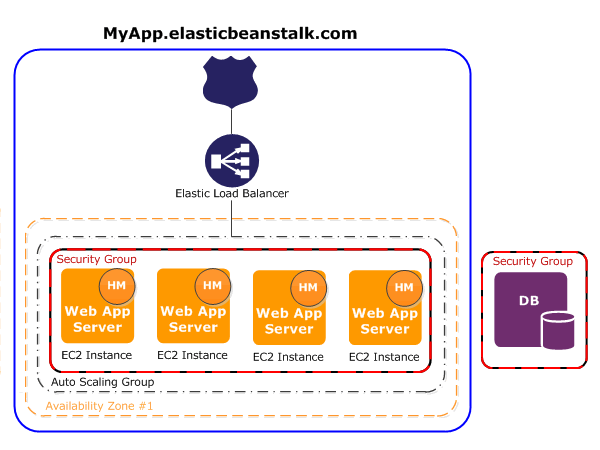
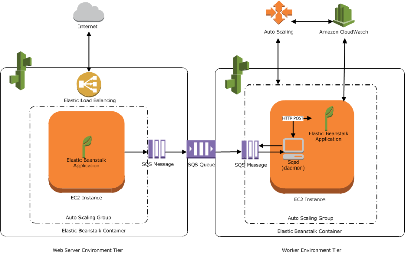

# AWS Elastic Beanstalk

## 1. Introduction

AWS Elastic Beanstalk is a fully managed Platform as a Service (PaaS) that makes it simple to deploy, manage, and scale web applications and services. By abstracting away the complexities of infrastructure provisioning, Elastic Beanstalk lets you focus on writing code while it automatically handles capacity provisioning, load balancing, auto scaling, and application health monitoring. It supports applications written in Java, .NET, PHP, Node.js, Python, Ruby, Go, and Docker, among others.

## 2. Elastic Beanstalk Concepts

### 2.1. Application

An Elastic Beanstalk _application_ is a logical collection of Elastic Beanstalk components, including _environments_, _versions_, and _environment configurations_. In Elastic Beanstalk an application is conceptually similar to a folder. AWS Elastic Beanstalk enables you to manage all of the resources that run your _application_ as _environments_.

### 2.2. Application version

In Elastic Beanstalk, an _application version_ refers to a specific, labeled iteration of deployable code for a web application. An application version points to an Amazon Simple Storage Service (Amazon S3) object that contains the deployable code, such as a Java WAR file. An application version is part of an application. Applications can have many versions and each application version is unique. In a running environment, you can deploy any application version you already uploaded to the application, or you can upload and immediately deploy a new application version. You might upload multiple application versions to test differences between one version of your web application and another.

### 2.3. Environment

An _environment_ is a collection of AWS resources running an application version. Each environment runs only one application version at a time, however, you can run the same application version or different application versions in many environments simultaneously. When you create an environment, Elastic Beanstalk provisions the resources needed in your AWS account to run the application version you specified.

### 2.4. Environment tier

When you launch an Elastic Beanstalk environment, you first choose an environment tier. The environment tier designates the type of application that the environment runs, and determines what resources Elastic Beanstalk provisions to support it. An application that serves HTTP requests runs in a web server environment tier. A backend environment that pulls tasks from an Amazon Simple Queue Service (Amazon SQS) queue runs in a worker environment tier.

### 2.5. Environment configuration

An _environment configuration_ identifies a collection of parameters and settings that define how an environment and its associated resources behave. When you update an environment’s configuration settings, Elastic Beanstalk automatically applies the changes to existing resources or deletes and deploys new resources (depending on the type of change).

### 2.6. Saved configuration

A _saved configuration_ is a template that you can use as a starting point for creating unique environment configurations. You can create and modify saved configurations, and apply them to environments, using the Elastic Beanstalk console, EB CLI, AWS CLI, or API. The API and the AWS CLI refer to saved configurations as _configuration templates_.

### 2.7. Platform

A _platform_ is a combination of an operating system, programming language runtime, web server, application server, and Elastic Beanstalk components. You design and target your web application to a platform. Elastic Beanstalk provides a variety of platforms on which you can build your applications.

## 3. Web Server Environments

A **web server environment** in AWS Elastic Beanstalk is designed to host applications that serve HTTP requests. When you create such an environment, Elastic Beanstalk automatically provisions and manages the necessary AWS resources to run your application. These resources include:

- **Elastic Load Balancer (ELB):** Provides a single, public URL (CNAME) that routes traffic to your application. The environment’s URL (e.g., `myapp.us-west-2.elasticbeanstalk.com`) is a CNAME alias that points to an ELB DNS name.
- **Auto Scaling Group:** Manages a group of Amazon EC2 instances running your application. Auto Scaling adjusts the number of instances based on demand—adding instances during high load and terminating them when demand falls—while ensuring that at least one instance is always running.
- **Amazon EC2 Instances:** These instances are launched with a preconfigured software stack, defined by the container type you choose. For example, an environment running an Apache Tomcat container will use Amazon Linux with Apache and Tomcat installed.

### 3.1. Key Components

- **Container Type:** Determines the underlying operating system and application server software (for example, Apache Tomcat, Node.js, etc.). Each instance in the environment runs a container that corresponds to the selected platform.
- **Host Manager (HM):** A software component running on every EC2 instance. Its responsibilities include:
    - Deploying your application.
    - Aggregating and reporting events, metrics, and instance-level logs.
    - Monitoring the application and server health.
    - Patching and log rotation, including publishing logs to Amazon S3.

### 3.2. Networking and Security

- **Security Groups:** Elastic Beanstalk assigns a default security group to the EC2 instances, typically configured to allow inbound traffic on port 80 (HTTP). You can customize these settings to meet your security requirements.
- **DNS Management:** The environment URL provided by Elastic Beanstalk is managed using Amazon Route 53, which maps the friendly CNAME to the ELB’s DNS name.

### 3.3. Additional Considerations

- **Monitoring and Management:** The host manager on each instance provides critical operational data. Metrics, errors, and events are available through the Elastic Beanstalk console, APIs, and command-line tools.
- **Customization:** While Elastic Beanstalk abstracts much of the infrastructure management, you retain the ability to customize aspects like instance configuration, security groups, and scaling parameters.

## 4. Worker Environments

A **worker environment** is designed for applications that process background tasks asynchronously. Instead of handling HTTP requests like web server environments, worker environments work by retrieving and processing messages from an Amazon SQS (Simple Queue Service) queue.

### 4.1. Key Components

- **Auto Scaling Group & EC2 Instances:**  
    Elastic Beanstalk provisions one or more EC2 instances that are grouped within an Auto Scaling group. This ensures that the number of instances adjusts based on the workload while maintaining a minimum capacity.

- **IAM Role:**  
    An IAM role is created and associated with the worker environment. This role grants the necessary permissions for the environment to interact with other AWS services (such as Amazon SQS and CloudWatch).

- **Amazon SQS Queue:**  
    If you don’t already have an SQS queue, Elastic Beanstalk automatically creates and provisions one for your worker environment. This queue is central to the asynchronous processing model used by worker environments.

- **Worker Daemon:**  
	On each EC2 instance, Elastic Beanstalk installs a daemon tailored for your programming language. This daemon continuously polls the SQS queue for new messages. When it receives a message, it passes the message data to your application code for processing.

- **Monitoring and Alarms:**  
    Amazon CloudWatch is integrated to provide health monitoring and alarms for your worker environment, helping you track performance and troubleshoot issues.

### 4.2. How It Works

1. **Message Ingestion:**  
    External systems or applications push messages to the SQS queue.

2. **Polling:**  
    The worker daemon on each instance continuously polls the SQS queue. All instances share the same queue, so messages are distributed among them.

3. **Processing:**  
    Once a message is retrieved, the daemon forwards it to your worker application. Your application then processes the task asynchronously.

4. **Scaling & Monitoring:**  
    Based on the workload and configured thresholds, Auto Scaling adjusts the number of EC2 instances. CloudWatch provides insights into performance and system health.

## 5. Key Benefits

- **Simplified Management:** No need to manually provision or manage infrastructure—the service handles it for you.
- **Scalability:** Auto scaling and load balancing are built in, ensuring your application can handle variable traffic loads.
- **Flexibility and Customization:** While Elastic Beanstalk abstracts infrastructure details, you retain full control over AWS resources and can customize settings as needed.
- **Compliance:** Elastic Beanstalk is designed to meet various compliance standards (ISO, PCI, SOC, HIPAA), making it suitable for regulated applications.
- **Cost Efficiency:** There is no additional charge for Elastic Beanstalk itself; you pay only for the underlying AWS resources.

## 6. Conclusion

For more detailed information and official guidance, please refer to [official documentation](https://docs.aws.amazon.com/elasticbeanstalk/latest/dg/Welcome.html).

