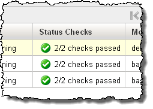
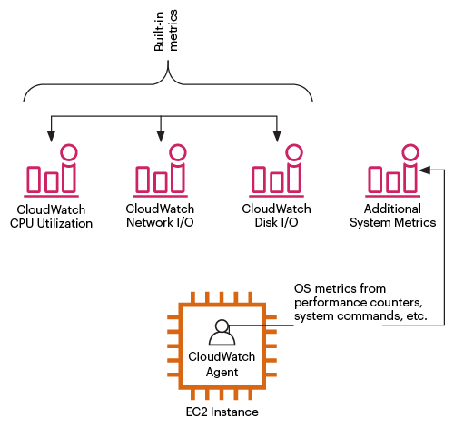

# Amazon EC2 - Monitoring

## 1. Introduction

Monitoring your EC2 resources is a critical aspect of maintaining high availability, performance, and security for your applications. AWS provides a suite of integrated services and features that allow you to collect, analyze, and act upon various operational metrics and events from your EC2 instances.

## 2. Basic vs. Detailed Monitoring

By default, each EC2 instance sends metrics (like CPU utilization, network traffic, and disk I/O) to Amazon CloudWatch in 5‑minute intervals. This level of monitoring comes at no additional charge. 

 You can enable detailed monitoring to push metrics every minute. This higher granularity is useful for faster reaction times to operational issues, though it incurs extra charges per metric. Detailed monitoring can be enabled at launch or for running instances using the EC2 console, CLI, or API.

The following table highlights the differences between basic monitoring and detailed monitoring for your instances.

| Monitoring type         | Description                                                                                                                                                                                                                                                                                   | Charges                                                                                                                                                                                                                                                                        |
| ----------------------- | --------------------------------------------------------------------------------------------------------------------------------------------------------------------------------------------------------------------------------------------------------------------------------------------- | ------------------------------------------------------------------------------------------------------------------------------------------------------------------------------------------------------------------------------------------------------------------------------ |
| **Basic monitoring**    | Status check metrics are available in 1-minute periods. All other metrics are available in 5-minute periods.                                                                                                                                                                                  | No charge.                                                                                                                                                                                                                                                                     |
| **Detailed monitoring** | All metrics, including status check metrics, are available in 1-minute periods. To get this level of data, you must specifically enable it for the instance. For the instances where you've enabled detailed monitoring, you can also get aggregated data across groups of similar instances. | You are charged per metric that Amazon EC2 sends to CloudWatch. You are not charged for data storage. For more information, see **Paid tier** and **Example 1 - EC2 Detailed Monitoring** on the [Amazon CloudWatch pricing page](https://aws.amazon.com/cloudwatch/pricing/). |

## 2. Status Checks

Amazon EC2 automatically performs two types of status checks on every running instance:

- **System Status Checks:**  
    Monitor the AWS systems required to use your instance to ensure that they are working properly. These checks detect problems with your instance that require AWS involvement to repair. When a system status check fails, you can choose to wait for AWS to fix the issue or you can resolve it yourself (for example, by stopping and restarting or terminating and replacing an instance). Examples of problems that cause system status checks to fail include:
	- Loss of network connectivity
	- Loss of system power
	- Software issues on the physical host
	- Hardware issues on the physical host that impact network reachability

- **Instance Status Checks:**  
    Monitor the software and network configuration of your individual instance. These checks detect problems that require your involvement to repair. When an instance status check fails, typically you will need to address the problem yourself (for example, by rebooting the instance or by making modifications in your operating system). Examples of problems that may cause instance status checks to fail include:
	- Failed system status checks
	- Misconfigured networking or startup configuration
	- Exhausted memory
	- Corrupted file system
	- Incompatible kernel

Both status check metrics are available in near real-time (every minute) and are integrated with CloudWatch for alerting and automated recovery actions.

## 3. Amazon CloudWatch Agent

For metrics not provided by default—such as memory usage, swap usage, and custom application metrics—you can install the CloudWatch Agent on your instances. This agent collects both system-level and custom metrics, sending them to CloudWatch for detailed monitoring and alerting.

## 4. AWS CloudTrail for API Monitoring

While CloudWatch provides operational metrics, AWS CloudTrail offers audit-level monitoring by logging every API call made on your account:

- **API Call Logging:**  
    CloudTrail records details about calls made to the EC2 API—including which actions were performed, who initiated them, and when they occurred. These logs help with security analysis and compliance auditing.  

- **Integration with CloudWatch:**  
    CloudTrail logs can be integrated with CloudWatch Logs to set alarms on unusual API activity or errors. This integration supports proactive incident management.
## 5. Event Monitoring with Amazon EventBridge

You can use Amazon EventBridge to automate your AWS services and respond automatically to system events, such as application availability issues or resource changes. Events from AWS services are delivered to EventBridge in near real time. You can create rules to indicate which events you're interested in, and the actions to take when an event matches a rule. The actions that can be automatically triggered include the following:

- Invoke an AWS Lambda function
- Invoke Amazon EC2 Run Command
- Relay the event to Amazon Kinesis Data Streams
- Activate an AWS Step Functions state machine
- Notify an Amazon SNS topic
- Notify an Amazon SQS queue

The following are examples of how you can use EventBridge with Amazon EC2:

- Activate a Lambda function whenever an instance enters the running state.
- Notify an Amazon SNS topic when an Amazon EBS volume is created or modified.
- Send a command to one or more Amazon EC2 instances using Amazon EC2 Run Command whenever a certain event in another AWS service occurs.

## 6. Session Manager Data Logging

AWS Systems Manager Session Manager not only provides secure, agent‐based access to your instances without the need to open inbound ports or manage SSH keys, it also incorporates robust auditing features that help you track and record session activity for security and compliance purposes.

Session Manager can be configured to record the interactive session’s command input and output. When enabled, session data is automatically sent to one or both of the following:

- **Amazon CloudWatch Logs:** For real‑time monitoring, searchability, and long-term retention.
- **Amazon S3:** For durable, archival storage and later retrieval.

This detailed session recording allows you to see exactly what commands were executed and what responses were returned, which is essential for detailed auditing and troubleshooting.

## 7. Conclusion

For comprehensive and up-to-date information, always refer to the [official documentation](https://docs.aws.amazon.com/AWSEC2/latest/UserGuide/monitoring_ec2.html).

