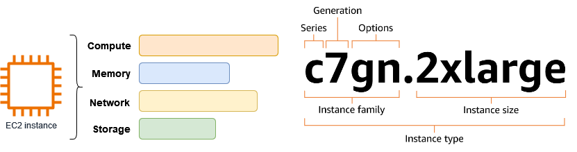
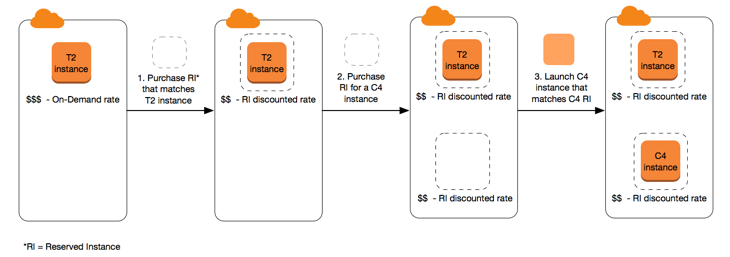
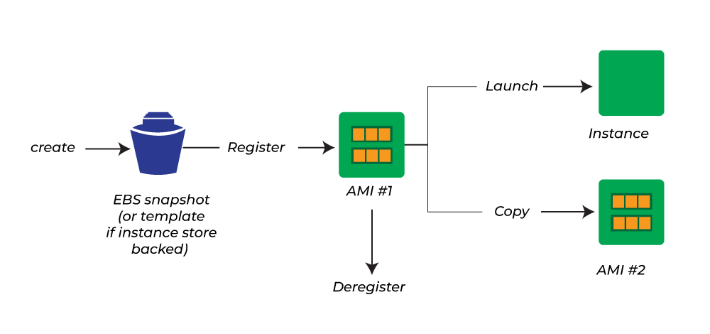
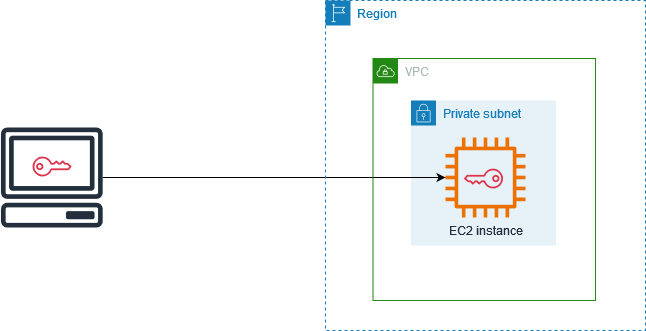
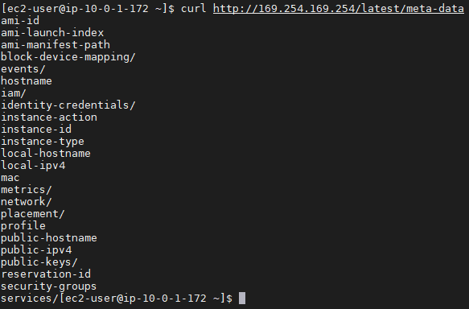
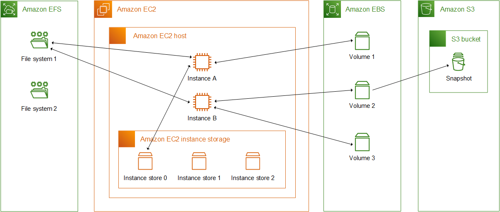

# Amazon EC2

## 1. Introduction

Amazon Elastic Compute Cloud (EC2) is a core service within Amazon Web Services (AWS) that provides resizable compute capacity in the cloud. Introduced in 2006, EC2 was designed to simplify web‐scale computing for developers by enabling rapid provisioning and scalable deployment of virtual servers around the globe. This flexibility has made it a foundational component for running a wide variety of applications—from simple web hosting to complex, high-performance computing workloads.

## 2. EC2 Instance Types

Amazon EC2 provides a variety of instance types so you can choose the type that best meets your requirements. Instance types are named based on their _instance family_ and _instance size_. The first position of the instance family indicates the _series_, for example `c`. The second position indicates the _generation_, for example `7`. The third position indicates the _options_, for example `gn`. After the period (`.`) is the instance size, such as `small` or `4xlarge`, or `metal` for bare metal instances.

| Series                                                                                                                                                                                                                                                                                                                                                                                                                                                                                                                                                                                                                                        | Options                                                                                                                                                                                                                                                                                                                                                        |
| --------------------------------------------------------------------------------------------------------------------------------------------------------------------------------------------------------------------------------------------------------------------------------------------------------------------------------------------------------------------------------------------------------------------------------------------------------------------------------------------------------------------------------------------------------------------------------------------------------------------------------------------- | -------------------------------------------------------------------------------------------------------------------------------------------------------------------------------------------------------------------------------------------------------------------------------------------------------------------------------------------------------------- |
| - **C** – Compute optimized\n- **D** – Dense storage\n- **F** – FPGA\n- **G** – Graphics intensive\n- **Hpc** – High performance computing\n- **I** – Storage optimized\n- **Im** – Storage optimized (1 to 4 ratio of vCPU to memory)\n- **Is** – Storage optimized (1 to 6 ratio of vCPU to memory)\n- **Inf** – AWS Inferentia\n- **M** – General purpose\n- **Mac** – macOS\n- **P** – GPU accelerated\n- **R** – Memory optimized\n- **T** – Burstable performance\n- **Trn** – AWS Trainium\n- **U** – High memory\n- **VT** – Video transcoding\n- **X** – Memory intensive\n- **Z** – High memory | - **a** – AMD processors\n- **g** – AWS Graviton processors\n- **i** – Intel processors\n- **b** – Block storage optimization\n- **d** – Instance store volumes\n- **e** – Extra storage or memory\n- **flex** – Flex instance\n- **n** – Network and EBS optimized\n- **q** – Qualcomm inference accelerators\n- **z** – High CPU frequency |

- **R (Memory-Optimized)**  
    Ideal for workloads such as in-memory caches or high-performance databases (e.g., in-memory analytics). Emphasizes large amounts of RAM.
    
- **C (Compute-Optimized)**  
    Designed for CPU-intensive tasks like high-performance web servers, machine learning inference, or compute-intensive databases.
    
- **M (General Purpose)**  
    Balanced in terms of CPU and memory, useful for web applications, application servers, and small/medium databases.
    
- **I (Storage-Optimized)**  
    Offers high local I/O throughput with instance store volumes. Well-suited for transactional workloads that demand fast, low-latency storage such as NoSQL databases or data warehousing.
    
- **G (GPU-Optimized)**  
    Equipped with powerful GPUs for graphics-intensive applications (e.g., video rendering) and machine learning model training.
    
- **T (Burstable Instances, e.g., T2 and T3)**  
    Provides baseline CPU performance with the ability to burst CPU usage for short periods. Great for applications that see occasional or unpredictable spikes in demand.
    
    - **T2/T3 Unlimited**: Allows continuous bursting for workloads that exceed the baseline over an extended period.

> **Exam Tip:** If the exam scenario references big data, memory caches, or HPC, always check if the instance family is well-suited to that type of load. Mismatched resources can incur unnecessary costs or performance bottlenecks.

### 2.1. Graviton Processors

Amazon EC2 Graviton processors are custom-built, Arm-based processors designed by AWS to deliver optimized performance and cost efficiency for cloud workloads. They provide a high-performance, energy-efficient alternative to traditional x86-based instances and are used across a range of EC2 instance families—including M6g, C6g, R6g, and T4g—targeting general-purpose, compute-optimized, memory-optimized, and burstable applications.

- **Graviton2**: Up to ~40% better price performance over fifth-generation x86.
- **Graviton3**: Up to 3x better performance over Graviton2.
- **Compatibility**: Popular Linux distributions (e.g., Amazon Linux 2, Ubuntu). Not supported for Windows Server.

For the most accurate and up-to-date information, refer to [Amazon EC2 Graviton Processors](https://aws.amazon.com/ec2/graviton/).

### 2.2. Bare Metal Instances

Amazon EC2 bare metal instances provide customers with direct access to the underlying physical hardware of an AWS server. Unlike virtualized instances, these instances run “natively” on the hardware without a hypervisor between the operating system and the server’s processors, memory, and storage. This model enables you to run applications that require low‐level hardware features, direct performance analysis, or non‑virtualized environments (for example, due to licensing or legacy constraints) while still benefiting from the full AWS ecosystem (such as Amazon VPC, Amazon EBS, Auto Scaling, and CloudWatch) and the security and management features provided by the AWS Nitro System.

For more technical details, refer to [Introducing Amazon EC2 Bare Metal Instances with Direct Access to Hardware](https://aws.amazon.com/blogs/aws/new-amazon-ec2-bare-metal-instances-with-direct-access-to-hardware/).

## 3. Managed Instances

An Amazon EC2 managed instance is an EC2 instance provisioned and managed by a designated service provider, such as Amazon EKS through EKS Auto Mode. These managed instances simplify running compute workloads on Amazon EC2 by allowing you to delegate operational control of the instance to a service provider. Delegated control is the only change introduced for managed instances. The technical specifications and billing remain the same as non-managed EC2 instances.

### 3.1. Delegated Control

When an instance is managed, the service provider is responsible for tasks such as provisioning the instance, configuring software, scaling capacity, and handling instance failures and replacements. While you cannot directly modify the settings of a managed instance, you can add, modify, or remove tags to categorize them within your AWS environment. The specific operations are determined by the agreement between you and the service provider.

### 3.2. Identify managed instances

Managed instances are identified by a **true** value in the **Managed** field. The service provider is identified in the **Operator** field (in the console) or `Principal` field (in the CLI).

### 3.3. Billing for managed instances

All Amazon EC2 purchasing options are available for managed instances, including On-Demand Instances, Reserved Instances, Spot Instances, and Savings Plans. By sourcing your compute directly from EC2 and then providing it to your service provider, you benefit from any existing Reserved Instances or Savings Plans applied to your account, ensuring that you're using the most cost-effective compute capacity available.

For example, when using Amazon EKS Auto Mode, you pay the standard EC2 instance rate for the underlying instances, plus an additional charge from Amazon EKS for managing the instances on your behalf. If you then decide to sign up for a [Savings Plan](https://docs.aws.amazon.com/savingsplans/latest/userguide/what-is-savings-plans.html), the EC2 instance rate is reduced by the Savings Plan, while the additional charge from Amazon EKS remains unchanged.

## 4. Billing and Purchasing Options

You can use the following options to optimize your costs for Amazon EC2:

- **On-Demand Instances**: Pay, by the second, for the instances that you launch.
- **Savings Plans**: Reduce your Amazon EC2 costs by making a commitment to a consistent amount of usage, in USD per hour, for a term of 1 or 3 years.
- **Reserved Instances**: Reduce your Amazon EC2 costs by making a commitment to a consistent instance configuration, including instance type and Region, for a term of 1 or 3 years.
- **Spot Instances**: Request unused EC2 instances, which can reduce your Amazon EC2 costs significantly.
- **Dedicated Hosts**: Pay for a physical host that is fully dedicated to running your instances, and bring your existing per-socket, per-core, or per-VM software licenses to reduce costs.
- **Dedicated Instances**: Pay, by the hour, for instances that run on single-tenant hardware.
- **Capacity Reservations**: Reserve capacity for your EC2 instances in a specific Availability Zone.

### 4.1. On‑Demand Instances

With On‑Demand Instances, you pay by the second (with a 60‑second minimum) for the compute capacity you use with no long‑term commitments. This option is ideal for unpredictable workloads, short‑term projects, or testing.

There are [quotas](https://docs.aws.amazon.com/AWSEC2/latest/UserGuide/ec2-on-demand-instances.html#ec2-on-demand-instances-limits) for the number of running On-Demand Instances per AWS account per Region. On-Demand Instance quotas are managed in terms of the _number of virtual central processing units (vCPUs)_ that your running On-Demand Instances are using, regardless of the instance type. Each quota type specifies the maximum number of vCPUs for one or more instance families.

Even though Amazon EC2 automatically increases your On-Demand Instance quotas based on your usage, you can request a quota increase if necessary. For example, if you intend to launch more instances than your current quota allows, you can request a quota increase by using the Service Quotas console described in [Amazon EC2 service quotas](https://docs.aws.amazon.com/AWSEC2/latest/UserGuide/ec2-resource-limits.html).
### 4.1. Savings Plans

Savings Plans let you commit to a consistent amount of usage (measured in USD per hour) for a one‑ or three‑year term, offering significant savings compared to On‑Demand pricing.

Unlike Reserved Instances, Savings Plans provide flexibility to change instance families, sizes, Regions, operating systems, or even AWS services (such as AWS Lambda and Fargate) while still receiving a discounted rate.  
### 4.2. Reserved Instances (RIs)

Reserved Instances provide a billing discount on your On‑Demand usage in exchange for a commitment to a specific instance configuration over a one‑ or three‑year term. They are not physical instances but a pricing mechanism that applies when your running instances match the reservation’s attributes. **AWS recommends Savings Plans over Reserved Instances**.

- **Key Variables:**  
    Pricing depends on instance attributes, term length, and the chosen payment option.
* **Instance attributes**:
	* **Instance type**: For example, `m4.large`.
	- **Region**: The Region in which the Reserved Instance is purchased.
	- **Tenancy**: Whether your instance runs on shared (default) or single-tenant (dedicated) hardware.
	- **Platform**: The operating system; for example, Windows or Linux/Unix.
- **Payment Options:**
    - **All Upfront:** Pay the entire cost at purchase for the lowest effective hourly rate.
    - **Partial Upfront:** Pay a portion upfront and the remainder at a discounted hourly rate.
    - **No Upfront:** Pay only a discounted hourly rate throughout the term.
- **Offering Classes:**
    - **Standard RIs:** Offer the deepest discount but are less flexible.
    - **Convertible RIs:** Provide the ability to exchange for different configurations, though at a slightly lower discount.  

The following diagram shows a basic scenario of purchasing and using Reserved Instances.

In this scenario, you have a running On-Demand Instance (T2) in your account, for which you're currently paying On-Demand rates. You purchase a Reserved Instance that matches the attributes of your running instance, and the billing benefit is immediately applied. Next, you purchase a Reserved Instance for a C4 instance. You do not have any running instances in your account that match the attributes of this Reserved Instance. In the final step, you launch an instance that matches the attributes of the C4 Reserved Instance, and the billing benefit is immediately applied.
### 4.3. Spot Instances

A Spot Instance is an instance that uses spare EC2 capacity that is available for less than the On-Demand price. Because Spot Instances enable you to request unused EC2 instances at steep discounts, you can lower your Amazon EC2 costs significantly. The hourly price for a Spot Instance is called a Spot price. The Spot price of each instance type in each Availability Zone is set by Amazon EC2, and is adjusted gradually based on the long-term supply of and demand for Spot Instances. Your Spot Instance runs whenever capacity is available.

Spot Instances are a cost-effective choice if you can be flexible about when your applications run and if your applications can be interrupted. For example, Spot Instances are well-suited for data analysis, batch jobs, background processing, and optional tasks.

To view the current Spot prices see [Amazon EC2 Spot Instances Pricing](https://aws.amazon.com/ec2/spot/pricing/).

### 4.4. Dedicated Hosts

An Amazon EC2 Dedicated Host is a physical server that is fully dedicated for your use. You can optionally choose to share the instance capacity with other AWS accounts. For more information, see [Cross-account Amazon EC2 Dedicated Host sharing](https://docs.aws.amazon.com/AWSEC2/latest/UserGuide/dh-sharing.html).

Dedicated Hosts provide visibility and control over instance placement and they support host affinity. This means that you can launch and run instances on specific hosts, and you can ensure that instances run only on specific hosts.

Dedicated Hosts provide comprehensive Bring Your Own License (BYOL) support. They allow you to use your existing per-socket, per-core, or per-VM software licenses, including Windows Server, SQL Server, SUSE Linux Enterprise Server, Red Hat Enterprise Linux, or other software licenses that are bound to VMs, sockets, or physical cores, subject to your license terms.

If you require your instances to run on dedicated hardware, but you do not need visibility or control over instance placement, and you do not need to use per-socket or per-core software licenses, you can consider using Dedicated Instances instead.
### 4.5. Dedicated Instances

By default, EC2 instances run on shared tenancy hardware. This means that multiple AWS accounts might share the same physical hardware.

**Dedicated Instances are EC2 instances that run on hardware that's dedicated to a single AWS account**. This means that Dedicated Instances are physically isolated at the host hardware level from instances that belong to other AWS accounts, even if those accounts are linked to a single payer account. **However, Dedicated Instances might share hardware with other instances from the same AWS account that are not Dedicated Instances**.

Dedicated Instances **provide no visibility or control over instance placement**, and they do not support host affinity. If you stop and start a Dedicated Instance, it might not run on the same host. Similarly, you cannot target a specific host on which to launch or run an instance. Additionally, Dedicated Instances provide limited support for Bring Your Own License (BYOL).

If you require visibility and control over instance placement and more comprehensive BYOL support, consider using a Dedicated Host instead. The following table highlights some of the key differences between Dedicated Instances and Dedicated Hosts:

|                                               | Dedicated Host                                                                                  | Dedicated Instance                                               |
| --------------------------------------------- | ----------------------------------------------------------------------------------------------- | ---------------------------------------------------------------- |
| **Dedicated physical server**                 | ✅ Physical server with instance capacity fully dedicated to your use.                           | ✅ Physical server that's dedicated to a single customer account. |
| **Instance capacity sharing**                 | ✅ Can share instance capacity with other accounts.                                              | ❌ Not supported                                                  |
| **Billing**                                   | Per-host billing                                                                                | Per-instance billing                                             |
| **Visibility of sockets, cores, and host ID** | ✅ Provides visibility of the number of sockets and physical cores                               | ❌ No visibility                                                  |
| **Host and instance affinity**                | ✅ Allows you to consistently deploy your instances to the same physical server over time        | ❌ Not supported                                                  |
| **Targeted instance placement**               | ✅ Provides additional visibility and control over how instances are placed on a physical server | ❌ Not supported                                                  |
| **Automatic instance recovery**               | ✅ Supported                                                                                     | ✅ Supported                                                      |
| **Bring Your Own License (BYOL)**             | ✅ Supported                                                                                     | Partial support                                                  |
| **Capacity Reservations**                     | ❌ Not supported                                                                                 | ✅ Supported                                                      |
### 4.6. Capacity Reservations

Capacity Reservations allow you to reserve EC2 capacity for your instances in a specific Availability Zone. This ensures that you can launch your instances when needed, regardless of fluctuations in available capacity, while you continue to be billed at the On‑Demand rate.

This option is useful when you need guaranteed capacity for critical workloads, even if you don’t commit to long‑term pricing.  

## 5. Amazon Machine Images

An Amazon Machine Image (AMI) is an image that provides the software that is required to set up and boot an Amazon EC2 instance. You must specify an AMI when you launch an instance. **The AMI must be compatible with the instance type that you chose for your instance.** You can use an AMI provided by AWS, a public AMI, an AMI that someone else shared with you, or an AMI that you purchased from the AWS Marketplace.

An AMI is specific to the following:

- **Region**
- **Operating system**
- **Processor architecture**
- **Root device type:** Backed by Amazon EBS or backed by instance store.
- **Virtualization type:** One of two types of virtualization: paravirtual (PV) or hardware virtual machine (HVM)
- **Launch permissions:** The owner of an AMI determines its availability by specifying launch permissions. It can be:
	- **public**: All AWS accounts
	- **explicit**: Specific AWS accounts, organizations, or organizational units (OUs)
	- **implicit**: Implicit launch permissions for an AMI.
### 5.1. AMI Lifecycle

- **Creation & Customization:**
    - Amazon offers pre-built AMIs, or you can create your own.
    - You can launch an instance from an existing AMI, customize it (e.g., install software, change OS settings), and then save the updated environment as a new AMI.
    - All customizations are saved, so instances launched from the new AMI include these changes.
- **Copy:**
    - **An AMI can only be used in the AWS Region where it was created**.
    - To use the same configuration in multiple Regions, you must copy the AMI to each desired Region.
- **Disabling vs. Deregistering:**
    - **Disabling:**
        - Temporarily prevents an AMI from being used to launch new instances.
        - Re-enabling restores its availability.
        - Disabling does not affect instances already launched.
    - **Deregistering:**
        - Permanently removes an AMI’s ability to launch new instances.
        - Existing instances remain unaffected.
- **Automation with Amazon Data Lifecycle Manager:**
    - Automates the creation, retention, copying, deprecation, and deregistration of Amazon EBS-backed AMIs and their snapshots.

### 5.2. Monitor AMI events using Amazon EventBridge

When the state of an Amazon Machine Image (AMI) changes, Amazon EC2 generates an event that is sent to Amazon EventBridge. The events are sent to the default EventBridge event bus in JSON format. You can use Amazon EventBridge to detect and react to these events.

### 5.3. AMI Costs

- **AMI billing is not a “line-item” charge for the image itself**; rather, costs come from the storage of snapshots (for EBS-backed images) or S3 (for instance-store images).
- **Marketplace AMIs** may incur additional charges depending on the pricing model (hourly vs. annual subscription), and billing metadata is provided to track these costs.

## 6. EC2 Launch Templates

Amazon EC2 launch templates are configuration documents that allow you to store the parameters needed to launch an EC2 instance. Instead of specifying the same settings repeatedly (such as the AMI ID, instance type, key pair, security groups, storage options, network interfaces, and user data), you can create a launch template once and reuse it across multiple instance launches.

**Key Benefits:**
- **Consistency & Reusability:**  
    By storing your preferred instance configuration in a launch template, you ensure that every instance launched using the template adheres to your organization’s standards. This minimizes human error and speeds up deployments.  
- **Versioning:**  
    Launch templates support versioning. You can create multiple versions of a template, each containing different parameter sets. When launching an instance, you can choose a specific version or allow AWS to use the default version. This makes it easy to roll out changes gradually and to revert if needed.  
- **Integration with Other Services:**  
    Launch templates are used not only for manual instance launches but also are integral to services such as:
    - **Amazon EC2 Auto Scaling** (to specify instance configuration for scaling groups)
    - **EC2 Fleet and Spot Fleet** (to manage diverse instance types and purchasing options)
    - **AWS CloudFormation** (via the AWS::EC2::LaunchTemplate resource)
    This integration provides a unified approach to instance provisioning across AWS services.  

## 7. Connecting to an Instance

AWS provides multiple ways to connect to your EC2 instances, with the method often chosen based on the instance’s operating system, network configuration, and security requirements.

| Connection option             | Instance operating system | Inbound traffic rule | IAM permissions | Instance profile role | Software on instance | Software on connecting system | Key pair |
| ----------------------------- | ------------------------- | -------------------- | --------------- | --------------------- | -------------------- | ----------------------------- | -------- |
| SSH client                    | Linux                     | ✅                    | ❌               | ❌                     | ❌                    | ✅                             | ✅        |
| EC2 instance connect          | Linux                     | ✅                    | ✅               | ❌                     | ✅                    | ❌                             | ❌        |
| PuTTY                         | Linux                     | ✅                    | ❌               | ❌                     | ❌                    | ✅                             | ✅        |
| RDP client                    | Windows                   | ✅                    | ❌               | ❌                     | ❌                    | ✅                             | ✅        |
| Fleet Manager                 | Windows                   | ❌                    | ✅               | ✅                     | ✅                    | ❌                             | ✅        |
| Session Manager               | Linux, Windows            | ❌                    | ✅               | ✅                     | ✅                    | ❌                             | ❌        |
| EC2 instance connect endpoint | Linux, Windows            | ✅                    | ✅               | ❌                     | ❌                    | ❌                             | ✅        |

* **SSH client:** A standard command-line tool that uses the SSH protocol to securely connect to Linux/Unix-based EC2 instances by using a private key.
* **EC2 instance connect:** A browser-based (and CLI-accessible) service that temporarily provisions an SSH key to enable secure connections to your EC2 instance without managing keys manually.
* **PuTTY:** A widely used free SSH and telnet client for Windows that allows users to securely connect to Linux/Unix-based EC2 instances using private keys.
* **RDP client:** A client application that uses the Remote Desktop Protocol to connect to Windows-based EC2 instances, providing a graphical desktop interface.
* **Fleet Manager:** An AWS Systems Manager capability that offers a unified web-based interface to inventory, manage, and remotely connect to your fleet of EC2 instances.
* **Session Manager:** A feature of AWS Systems Manager that enables secure, browser- or CLI-based shell access to EC2 instances without requiring open inbound ports or SSH keys.
* **EC2 instance connect endpoint:** A managed endpoint that allows secure, private connectivity to your EC2 instances via Instance Connect over a VPC, enhancing security by eliminating the need for public IPs.

### 6.1. Key Pairs

A key pair, consisting of a public key and a private key, is a set of security credentials that you use to prove your identity when connecting to an Amazon EC2 instance. For Linux instances, the private key allows you to securely SSH into your instance. For Windows instances, the private key is required to decrypt the administrator password, which you then use to connect to your instance.

Amazon EC2 stores the public key on your instance, and you store the private key, as shown in the following diagram. It's important that you store your private key in a secure place because anyone who possesses your private key can connect to your instances that use the key pair.

When you launch an instance, you can [specify a key pair](https://docs.aws.amazon.com/AWSEC2/latest/UserGuide/ec2-instance-launch-parameters.html#liw-key-pair), so that you can connect to your instance using a method that requires a key pair. Depending on how you manage your security, you can specify the same key pair for all your instances or you can specify different key pairs.

For Linux instances, when your instance boots for the first time, the public key that you specified at launch is placed on your Linux instance in an entry within `~/.ssh/authorized_keys`. When you connect to your Linux instance using SSH, to log in you must specify the private key that corresponds to the public key.

## 7. EC2 Instance State

An Amazon EC2 instance transitions through different states from the moment you launch it through to its termination.

The following illustration represents the transitions between instance states.

Amazon EC2 sends an `EC2 Instance State-change Notification` event to Amazon EventBridge when the state of an instance changes.

The following table provides a brief description of each instance state and indicates whether instance usage is billed. Some AWS resources, such as Amazon EBS volumes and Elastic IP addresses, incur charges regardless of the instance's state.

| Instance state  | Description                                                                                                                                                                  | Billed?                                                                                                                                              |
| --------------- | ---------------------------------------------------------------------------------------------------------------------------------------------------------------------------- | ---------------------------------------------------------------------------------------------------------------------------------------------------- |
| `pending`       | The instance is preparing to enter the `running` state. An instance enters the `pending` state when it is launched or when it is started after being in the `stopped` state. | ❌                                                                                                                                                    |
| `running`       | The instance is running and ready for use.                                                                                                                                   | ✅                                                                                                                                                    |
| `stopping`      | The instance is preparing to be stopped.                                                                                                                                     | ❌\n\n**Note:** If you hibernate an instance, you're billed while the instance is in the `stopping` state.                                        |
| `stopped`       | The instance is shut down and cannot be used. The instance can be started at any time.                                                                                       | ❌                                                                                                                                                    |
| `shutting-down` | The instance is preparing to be terminated.                                                                                                                                  | ❌                                                                                                                                                    |
| `terminated`    | The instance has been permanently deleted and cannot be started.                                                                                                             | ❌\n\n**Note:** Reserved Instances that applied to terminated instances are billed until the end of their term according to their payment option. |

## 8. EC2 Instance Hibernate

When you hibernate an instance, Amazon EC2 signals the operating system to perform hibernation (suspend-to-disk). Hibernation saves the contents from the instance memory (RAM) to your Amazon Elastic Block Store (Amazon EBS) root volume. Amazon EC2 persists the instance's EBS root volume and any attached EBS data volumes. When your instance is started:

- The EBS root volume is restored to its previous state
- The RAM contents are reloaded
- The processes that were previously running on the instance are resumed
- Previously attached data volumes are reattached and the instance retains its instance ID

You can hibernate an instance only if it's [enabled for hibernation](https://docs.aws.amazon.com/AWSEC2/latest/UserGuide/enabling-hibernation.html) and it meets the [hibernation prerequisites](https://docs.aws.amazon.com/AWSEC2/latest/UserGuide/hibernating-prerequisites.html).

You're not charged for instance usage for a hibernated instance when it is in the `stopped` state or for data transfer when the contents of the RAM are transferred to the EBS root volume. You are charged for storage of any EBS volumes, including storage for the RAM contents.
### 8.1. Hibernate Use Case

If an instance or application takes a long time to bootstrap and build a memory footprint in order to become fully productive, you can use hibernation to pre-warm the instance. To pre-warm the instance, you:

1. Launch it with hibernation enabled.
2. Bring it to a desired state.
3. Hibernate it so that it's ready to be resumed to the desired state whenever needed.

## 9. EC2 instance metadata

**EC2 instance metadata** is a service provided by AWS that makes dynamic information about a running instance available to the instance itself. This data can be used by applications on the instance to discover configuration details about the instance, such as its identity, networking information, and assigned IAM role. Additionally, the service provides access to user data—information that you supply at launch (for example, a startup script).

The metadata is available via HTTP requests to the special IP address `169.254.169.254`. It exposes a structured hierarchy of information (e.g., `latest/meta-data/`, `latest/user-data/`).

## 10. Storage

Amazon EC2 offers a rich set of storage options designed to meet a wide range of performance, durability, and cost requirements. 

1. **Instance Store (Ephemeral Storage):** Instance store provides temporary, block-level storage that is physically attached to the host machine running your EC2 instance. The storage is “ephemeral” – its data persists only for the life of the instance. **When the instance stops, hibernates, or terminates, data on instance store volumes is lost.**

2. **Amazon Elastic Block Store (EBS):** Amazon EBS provides persistent block storage volumes that you can attach to EC2 instances. These volumes persist independently from the instance’s life cycle and offer features such as snapshots, encryption, and the ability to scale performance and capacity without downtime.

3. **Amazon Simple Storage Service (S3):** While not directly “attached” to an EC2 instance as a block device, Amazon S3 is a highly durable object storage service used extensively in AWS. EC2 uses S3 to store AMIs, EBS snapshots, backups, and static assets.

4. **Amazon Elastic File System (EFS):** Amazon EFS is a fully managed, scalable file storage service that provides a POSIX-compliant file system. It can be mounted concurrently by multiple EC2 instances (Linux only) across multiple Availability Zones.

5. **Amazon FSx:** It provides fully managed file storage built on popular file systems:
	- **FSx for Windows File Server:** For Windows-based applications with native SMB support.
	- **FSx for Lustre:** High-performance file systems optimized for compute-intensive workloads like HPC and machine learning.
	- **FSx for NetApp ONTAP and FSx for OpenZFS:** For advanced storage features and integration with existing on-premises environments.

6. **Amazon File Cache:** It is designed to provide a high-performance, temporary caching layer for file data. It can accelerate file processing by serving as an intermediate cache for data stored in systems like Amazon EFS or S3.

Below is a comparison table summarizing the key characteristics of the main EC2 storage options:

| **Storage Option**    | **Type**             | **Persistence**                    | **Ideal Use Cases**                                  | **Key Features**                                               |
| --------------------- | -------------------- | ---------------------------------- | ---------------------------------------------------- | -------------------------------------------------------------- |
| **Instance Store**    | 🔗 Block (Ephemeral) | Temporary (lost on stop/terminate) | 🧰 Caching, scratch space, temporary data            | ⚡ Very low latency, included with instance, local storage      |
| **Amazon EBS**        | 💾 Block             | Persistent                         | 🗄️ Databases, boot volumes, transactional workloads | 📸 Snapshots, encryption, scalable size & performance          |
| **Amazon S3**         | ☁️ Object            | Persistent                         | 📁 Static assets, backups, data lakes                | 🛡️ 11 nines durability, global accessibility, API-driven      |
| **Amazon EFS**        | 📂 File              | Persistent                         | 👥 Shared file storage for web servers, dev/test     | 📈 Automatically scales, NFS-compliant, concurrent access      |
| **Amazon FSx**        | 🗄️ File             | Persistent                         | 🎯 Specialized workloads (Windows, Lustre, etc.)     | 🔧 Fully managed, high performance, tailored file systems      |
| **Amazon File Cache** | ⚡ Cache              | Temporary                          | 🚀 Accelerating file processing and caching          | ⏱️ Ultra-low latency, high throughput, temporary caching layer |

The following figure shows the relationship between these storage options and your instance.

## 11. Conclusion

Amazon EC2 is a powerful and versatile service that forms the backbone of many cloud architectures. With its broad array of instance types, flexible pricing models, robust security features, and deep integration with other AWS services, EC2 enables businesses and developers to build, scale, and secure applications efficiently. For comprehensive and up-to-date information, always refer to the [official documentation](https://docs.aws.amazon.com/AWSEC2/latest/UserGuide/Instances.html).
