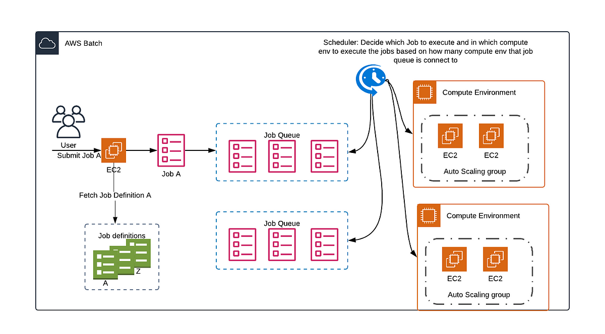

# AWS Batch

## 1. Introduction

AWS Batch is a fully managed batch processing service that enables developers, scientists, and engineers to run hundreds of thousands of batch computing jobs on the AWS Cloud without having to worry about provisioning or managing infrastructure. It dynamically provisions the optimal compute resources—whether on Amazon EC2 (including Spot Instances), Amazon ECS, Amazon EKS, or AWS Fargate—based on your job requirements and workload volume. This lets you focus on solving your business problems rather than on the undifferentiated heavy lifting of managing a batch computing environment.

## 2. Components of AWS Batch

### 2.1. Job Definitions

AWS Batch job definitions specify how jobs are to be run. While each job must reference a job definition, many of the parameters that are specified in the job definition can be overridden at runtime.

Some of the attributes specified in a job definition include:

- Which Docker image to use with the container in your job.    
- How many vCPUs and how much memory to use with the container.
- The command the container should run when it is started.
- What (if any) environment variables should be passed to the container when it starts.
- Any data volumes that should be used with the container.    
- What (if any) IAM role your job should use for AWS permissions.

### 2.2. Job Queues

When you submit an AWS Batch job, you submit it to a particular job queue, where the job resides until it's scheduled onto a compute environment. You associate one or more compute environments with a job queue. You can also assign priority values for these compute environments and even across job queues themselves. For example, you can have a high priority queue that you submit time-sensitive jobs to, and a low priority queue for jobs that can run anytime when compute resources are cheaper.

### 2.3. Compute environment

A compute environment is a set of managed or unmanaged compute resources that are used to run jobs. With managed compute environments, you can specify desired compute type (Fargate or EC2) at several levels of detail. You can set up compute environments that use a particular type of EC2 instance, a particular model such as `c5.2xlarge` or `m5.10xlarge`. Or, you can choose only to specify that you want to use the newest instance types. You can also specify the minimum, desired, and maximum number of vCPUs for the environment, along with the amount that you're willing to pay for a Spot Instance as a percentage of the On-Demand Instance price and a target set of VPC subnets. AWS Batch efficiently launches, manages, and terminates compute types as needed. You can also manage your own compute environments. As such, you're responsible for setting up and scaling the instances in an Amazon ECS cluster that AWS Batch creates for you.

#### 2.3.1. Managed Compute Environments

AWS Batch can automatically provision and manage compute resources for you. Under a managed compute environment, you simply specify the resource requirements and AWS Batch handles the rest. The managed compute resources include:

- **EC2‑based Managed Compute Environments:**  
    AWS Batch provisions Amazon EC2 container instances (using On‑Demand or Spot Instances) based on your job requirements.
    
- **AWS Fargate Managed Compute Environments:**  
    You can run containerized jobs using AWS Fargate (or Fargate Spot), which is a serverless compute engine that abstracts the underlying servers.
    
- **Amazon EKS Managed Compute Environments:**  
    For Kubernetes-based workloads, AWS Batch can manage compute resources on an Amazon EKS cluster.

#### 2.3.2. Unmanaged Compute Environments

In an unmanaged compute environment, you are responsible for provisioning and managing the compute resources. With unmanaged compute environments you register your own compute resources (typically an existing Amazon ECS cluster) with AWS Batch. In this case, you handle scaling, patching, and the overall lifecycle of the container instances.

## 3. Use Cases and Integration

AWS Batch is designed for a wide range of batch workloads, including:

- **Machine Learning (ML):** Running model training and inference jobs at scale.
- **Simulations and Scientific Computing:** Executing large-scale simulations without over-provisioning.
- **Data Processing and Analytics:** Performing ETL or ELT processes, analytics jobs, and reporting.
- **Rendering and Media Transcoding:** Handling compute-intensive tasks such as video rendering and image processing.

It integrates natively with other AWS services like Amazon ECS/EKS, AWS Fargate, Amazon CloudWatch (for monitoring and logging), and AWS Identity and Access Management (IAM) for secure access control.

## 4. Conclusion

AWS Batch is an enterprise-grade service that abstracts the complexity of batch computing, allowing you to run large-scale workloads efficiently and securely on AWS. By automating the provisioning and scaling of compute resources and providing robust scheduling and security features, AWS Batch helps you optimize both performance and cost for a wide variety of batch processing use cases.

For the most current and detailed information, refer directly to the [official documentation](https://docs.aws.amazon.com/batch/latest/userguide/what-is-batch.html).
