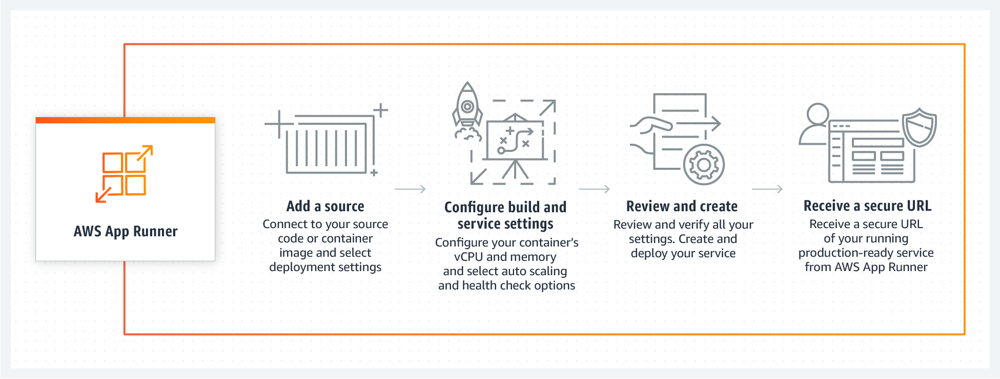
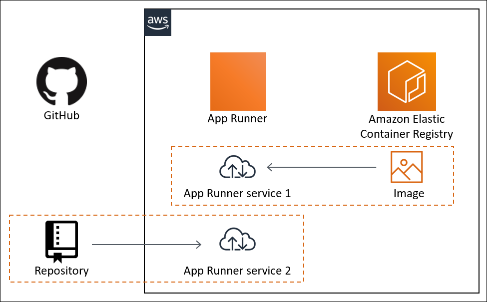

# AWS App Runner

## 1. Introduction

AWS App Runner is an AWS service that provides a fast, simple, and cost-effective way to deploy from source code or a container image directly to a scalable and secure web application in the AWS Cloud. You don't need to learn new technologies, decide which compute service to use, or know how to provision and configure AWS resources.

App Runner connects directly to your code or image repository. It provides an automatic integration and delivery pipeline with fully managed operations, high performance, scalability, and security.

## 2. Key Features

- **Automatic Scaling:** App Runner monitors incoming traffic and adjusts the number of container instances to meet demand, scaling down to a provisioned instance during periods of low or no traffic to optimize costs.

- **Built-in Security and Compliance:** The service provides automatic HTTPS encryption, integrates with AWS Identity and Access Management (IAM) for access control, and allows for Virtual Private Cloud (VPC) integration, enabling secure communication with other AWS resources.

- **Seamless Integration with AWS Services:** App Runner can connect to various AWS services such as databases, caching, and messaging services, facilitating the development of comprehensive applications.
## 3. Architecture

AWS App Runner takes your source code or source image from a repository, and creates and maintains a running web service for you in the AWS Cloud. Typically, you need to call just one App Runner action, *CreateService*, to create your service.

With a source image repository, you provide a ready-to-use container image that App Runner can deploy to run your web service. With a source code repository, you provide your code and instructions for building and running a web service, and you target a specific runtime environment. App Runner supports several programming platforms, each with one or more managed runtimes for platform major versions.

At this time, App Runner can retrieve your source code from either a Bitbucket or GitHub repository, or it can retrieve your source image from Amazon ECR in your AWS account.

The following diagram shows an overview of the App Runner service architecture. In the diagram, there are two example services: one deploys source code from GitHub, and the other deploys a source image from Amazon ECR. The same flow applies to the Bitbucket repository.

## 4. Developing Application Code for App Runner

- **Framework Support:** App Runner is compatible with any web application framework or language, offering platform-specific managed runtimes to simplify the build process and container image creation.

- **Web Requests:** The service supports HTTP 1.0 and HTTP 1.1 protocols, automatically redirecting HTTP requests to HTTPS. App Runner manages TLS termination, eliminating the need for manual configuration. Note that there's a 120-second timeout for HTTP requests, encompassing both request reading and response writing.

- **Stateless Applications:** App Runner is ***designed for stateless applications***, meaning it doesn't guarantee state persistence beyond individual web request processing.

- **Storage:** Each container instance includes 3 GB of ephemeral storage, which is transient and may not persist across requests. For reliable caching, consider integrating services like Amazon ElastiCache.

- **Environment Variables:** App Runner provides a default `PORT` environment variable and allows the addition of custom variables. Sensitive data can be referenced securely from AWS Secrets Manager or AWS Systems Manager Parameter Store.

- **Instance Role:** To enable your application to interact with other AWS services, create an IAM instance role and attach it to your App Runner service during creation.

## 5. Pricing

AWS App Runner offers a pay-as-you-go pricing model, charging based on the compute and memory resources consumed by your application. Additional features like automatic deployments and build services may incur extra costs.

## 6. Conclusion

To begin using AWS App Runner, you can access the service through the AWS Management Console, AWS CLI, or AWS SDKs. The service provides a straightforward setup process, enabling you to deploy your applications quickly and efficiently.

For more detailed information, refer to the [AWS App Runner Developer Guide](https://docs.aws.amazon.com/apprunner/latest/dg/) and the [AWS App Runner Pricing page](https://aws.amazon.com/apprunner/pricing/).

