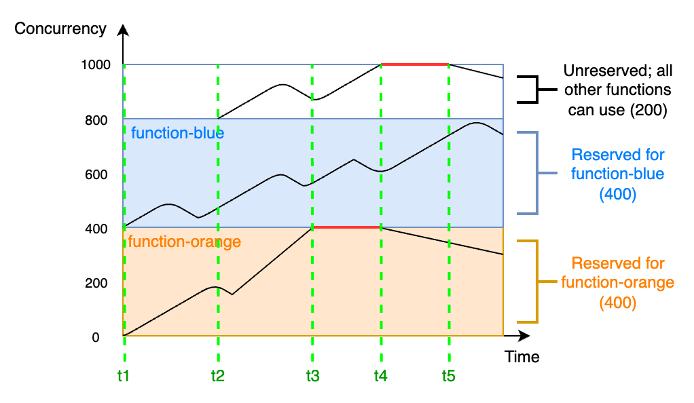

# AWS Lambda

## 1. Introduction

AWS Lambda is Amazon Web Services’ serverless, event‐driven compute service that lets you run your code without provisioning or managing servers. With Lambda, you simply upload your code—organized into functions—and the service automatically takes care of everything required to run and scale your application in response to incoming events. You pay only for the compute time you consume, making it a highly cost‐efficient option for many workloads.

## 2. Key concepts

### 2.1. Lambda Functions

A Lambda function is the fundamental unit of AWS Lambda. It represents a self‐contained piece of code along with its configuration (memory, timeout, environment variables, etc.) that executes in response to events. When you create a Lambda function, you upload your code (or point to a container image) and specify a handler—a method that AWS Lambda calls to begin execution. Lambda functions run on managed infrastructure that automatically scales based on the rate of incoming events, and you’re charged only for the actual compute time used.  

### 2.2. Lambda Runtimes

Lambda runtimes provide the execution environment in which your function code runs. A runtime includes the underlying operating system, language libraries, and any necessary startup routines that load your handler. AWS supplies a variety of managed runtimes (for Node.js, Python, Java, Go, .NET, Ruby, etc.), so you can focus on writing code rather than managing the runtime environment. Additionally, you can provide a custom runtime if your language or framework isn’t natively supported, allowing you greater flexibility in your development environment.  

### 2.3. Triggers and Event Source Mappings

Although you can invoke a Lambda function manually using the AWS Command Line Interface (AWS CLI) or by using the Lambda API, it's more usual in a production application for your function to be invoked by another AWS service in response to a particular event. For example, you might want a function to run whenever an item is added to an Amazon DynamoDB table.

To configure a function to run in response to a specific event, you add a **_trigger_**. When you create a trigger, other AWS services can invoke your function directly by pushing an event object to Lambda whenever a particular event occurs. A function can have multiple triggers, each of which invokes your function independently.

Some types of stream and queue service, such as Amazon Kinesis or Amazon Simple Queue Service (Amazon SQS), can't directly invoke Lambda using a trigger. For these services, you need to create an _**event source mapping**_ instead. Event source mappings are a special type of Lambda resource that continuously polls a stream or queue to check for new events. For example, an event source mapping might poll an Amazon SQS queue to check whether new messages have been added. Lambda batches new messages into a single payload until a limit that you configure is reached, and then invokes your function with a single event object containing all the records in the batch.


### 2.4. The Event Object

When a Lambda function is triggered, AWS Lambda passes an event object to the function’s handler. This object is a JSON-formatted data structure that contains details about the triggering event. Its content varies depending on the source—for example, an S3 event includes bucket and object details, while an API Gateway trigger includes HTTP request data. The event object allows your function to understand the context and act on the incoming data appropriately.  

### 2.5. Lambda Permissions

Lambda permissions determine who or what is allowed to invoke a Lambda function. These permissions are controlled through AWS Identity and Access Management (IAM) and Lambda resource-based policies. They ensure that only authorized AWS services, users, or accounts can trigger your function. For example, you might grant an API Gateway permission to invoke your function or restrict invocation to specific principals. By defining these permissions carefully, you help secure your functions and maintain control over your serverless architecture.  

### 2.6. Lambda Programming Model

At its heart, Lambda is built around discrete functions. Each Lambda function encapsulates a specific piece of logic and runs in response to an event. The function is defined by its code and configuration (such as memory allocation, timeout settings, and environment variables).

When your function is invoked, AWS Lambda calls a designated handler—your entry point—which receives two key parameters:

1. **Event Object:** Contains details about the event that triggered the function (for example, an S3 object upload, a message in a queue, or an HTTP request).
2. **Context Object:** Provides runtime information such as function name, log stream details, and methods to retrieve remaining execution time.

Each invocation of your Lambda function is stateless. However, the execution environment can be reused across multiple invocations. This means that if you initialize objects or connections outside the handler, they can persist and be reused, reducing latency for subsequent calls.

AWS Lambda supports several runtimes (Node.js, Python, Java, Go, .NET, Ruby, etc.), which means you can write your function in the language that best fits your application’s needs. Custom runtimes are also supported, providing flexibility beyond the natively supported languages.

## 3. Lambda Execution Environment

AWS Lambda’s execution environment is a managed runtime container where your function code runs. These containers are based on a stripped-down Linux operating system (typically Amazon Linux or Amazon Linux 2) and use microVMs powered by Firecracker. This isolation provides security boundaries between function invocations even when containers are reused.

The execution environment comes preloaded with the runtime (e.g., Node.js, Python, Java, Go, .NET, Ruby, etc.) and other AWS-provided libraries. This minimizes the work needed from your function’s deployment package, while also ensuring consistency and rapid startup.

Each container has access to a temporary storage directory (usually `/tmp`, **with a capacity of 512 MB by default**) which persists across invocations on the same container but is cleaned up when the container is recycled.

### 3.1. Execution Environment Lifecycle


**1. Initialization (Cold Start)**

- **Container Provisioning:**  
    When your Lambda function is invoked for the first time—or if no existing environment is available—a new container is launched. This involves provisioning resources, starting the microVM, and initializing the operating system.
- **Runtime Initialization:**  
    After the container is ready, the Lambda runtime is loaded. During this phase, your function’s code is loaded into memory, and any initialization code outside of the handler (global scope) is executed. This process is what is commonly known as a "cold start" and can add latency to the first invocation.
- **Snapshot (Lambda SnapStart):**  
    With features like Lambda SnapStart, AWS can take a snapshot of a fully initialized execution environment. This snapshot can later be quickly restored, reducing cold start latency significantly for subsequent invocations.

**2. Invocation (Warm Start)**

- **Event Handling:**  
    Once the execution environment is initialized, AWS Lambda invokes the function’s handler by passing it an event object and a context object. Since the container is already up, subsequent invocations on the same container are considered “warm starts” and benefit from reusing any previously initialized code and established network connections.
- **Resource Reuse:**  
    Global objects, such as database connections or SDK clients, that were created during initialization remain available in subsequent invocations, improving performance and reducing latency.

**3. Idle and Reuse**

- **Environment Reuse:**  
	AWS Lambda reuses warm execution environments to handle multiple invocations. The same container can process many requests sequentially until it becomes idle for a period.
- **Stateless Design:**  
    Although the execution environment may persist and reuse cached objects, Lambda functions are designed to be stateless. Any state stored in memory should not be assumed to persist across separate invocations beyond the container’s lifecycle.

**4. Shutdown and Recycling**

- **Termination of Environment:**  
    If an execution environment remains idle for a period (which AWS does not publicly disclose but is typically in the order of minutes), it may be reclaimed. When reclaimed, any data stored in the container’s memory or the temporary file system is lost.
- **Lifecycle Management:**  
    AWS manages the recycling process automatically, ensuring that containers are eventually terminated to free up resources and maintain isolation. Developers should design their functions to not rely on long-term persistence of state between invocations.

> **Exam Tip:** The time taken during the cold start (container + runtime initialization) is typically higher than during warm starts, where the execution environment is already initialized. Techniques such as provisioned concurrency or SnapStart can help mitigate cold start latency.
## 4. Event-Driven Architectures

In an event-driven architecture, each Lambda function is treated as a microservice, responsible for performing a narrow set of specific instructions.

### 4.1. Benefits of Event-Driven Architectures

**1. Replacing Polling and Webhooks:**  


Traditional integration methods like polling and webhooks can be inefficient and hard to scale. Event-driven architectures replace these with events that are filtered, routed, and pushed to consumers, reducing latency and resource waste.

**2. Reducing Complexity:**  

By breaking a monolithic application into decoupled microservices, each function can focus on a single responsibility. For instance, an ecommerce application can split order acceptance, payment processing, and inventory management into separate, independently scalable services. This decoupling also allows buffering (e.g., via Amazon SQS) between services running at different speeds.


**3. Improving Scalability and Extensibility:**  

Events published to messaging services (like Amazon SNS, SQS, or EventBridge) create an elastic buffer that enables the system to handle sudden spikes in traffic. The loose coupling between event producers and consumers allows additional services to be integrated later without modifying existing components.

### 4.2. Trade-offs of Event-Driven Architectures

- **Variable Latency:**  
    Because the architecture relies on network communication between decoupled services, latency may be less predictable compared to monolithic systems where all components run in the same memory space.

- **Eventual Consistency:**  
    Since events represent discrete state changes across distributed systems, the overall system state is often only eventually consistent. This requires special design considerations, such as using databases (like DynamoDB with strongly consistent reads or transactional support) when strict consistency is needed.

- **Returning Values to Callers:**  
    In asynchronous event-driven systems, the function’s result isn’t immediately returned to the caller. Instead, success or failure is tracked (often with dead letter queues) rather than returning a direct value.

- **Debugging Across Services:**  
    Tracing the journey of an event through multiple services can be challenging. AWS stresses the importance of robust logging, embedding transaction identifiers across services, and using tools like AWS X-Ray for tracing distributed transactions.

### 4.3. Anti-Patterns in Lambda-Based Event-Driven Applications

- **The Lambda Monolith:**  
    Migrating an existing monolithic application “as-is” into a single Lambda function can lead to a bulky deployment package, overly broad permissions, and difficulties in testing, maintaining, and upgrading the code. The recommended approach is to break the application into smaller, focused Lambda functions (microservices).
    
    
- **Recursive Patterns That Cause Run-Away Invocations:**  
    If a Lambda function writes an event that in turn triggers itself (for example, a function that writes to S3 and is triggered by S3 put events), it can create an infinite loop. Detecting and preventing such recursive loops is crucial to avoid exhausting resources.
	
    
- **Lambda Functions Calling Lambda Functions Synchronously:**  
    While code reuse is a common practice, invoking one Lambda function directly from another (and waiting for its response) can increase execution time and costs. Instead, decoupling via messaging (e.g., using SQS or AWS Step Functions for orchestration) is preferred for scalability and fault tolerance.
    
    
- **Synchronous Waiting Within a Single Lambda Function:**  
    Combining sequential tasks within one function (e.g., writing to S3 and then writing to DynamoDB) may lead to compounded latency. Splitting the tasks into separate functions that communicate via events can reduce wait times and optimize resource usage.
	

## 5. Lambda Memory

Lambda allocates CPU power in proportion to the amount of memory configured. _Memory_ is the amount of memory available to your Lambda function at runtime. You can increase or decrease the memory and CPU power allocated to your function using the **Memory** setting. You can configure memory between 128 MB and 10,240 MB in 1-MB increments. At 1,769 MB, a function has the equivalent of one vCPU (one vCPU-second of credits per second).

To find the right memory configuration, monitor your functions with Amazon CloudWatch and set alarms if memory consumption is approaching the configured maximums. This can help identify memory-bound functions. For CPU-bound and IO-bound functions, monitoring the duration can also provide insight. In these cases, increasing the memory can help resolve the compute or network bottlenecks.

You can also consider using the open source [AWS Lambda Power Tuning](https://github.com/alexcasalboni/aws-lambda-power-tuning) tool. This tool uses AWS Step Functions to run multiple concurrent versions of a Lambda function at different memory allocations and measure the performance. The input function runs in your AWS account, performing live HTTP calls and SDK interaction, to measure likely performance in a live production scenario. You can also implement a CI/CD process to use this tool to automatically measure the performance of new functions that you deploy.

## 6. Create a Lambda Function Using a Container Image

AWS Lambda supports container images as an alternative packaging format for your functions. This feature lets you bundle your code, its dependencies, and even a custom runtime into a standard container image, which is then stored in Amazon Elastic Container Registry (ECR) and used to run your function. 


**Benefits and Use Cases:**

- **Familiar Container Tooling:**  
    Developers can leverage existing container build and CI/CD pipelines, making it easier to integrate Lambda into containerized workflows.
- **Larger Dependency Support:**  
    With the increased image size limit, you can package functions that require large binaries, complex libraries, or non-standard runtimes.
- **Customizability:**  
    Container images offer greater control over the runtime environment, allowing you to include specific OS-level packages or custom configurations that aren’t possible with managed ZIP deployments.

**Best Practices and Considerations:**

- **Optimize Image Size:**  
    Even though the limit is 10 GiB, keeping your image as lean as possible helps reduce cold start times.
- **Test Locally:**  
    Use Docker to test your container image locally before deploying to Lambda to ensure that the Lambda Runtime API integration is correct.
- **Monitor Cold Start Impact:**  
    While warm invocations are fast, initial cold starts may add latency. Consider using provisioned concurrency if your application requires low-latency responses.
- **Security Updates:**  
    Keep your base images and dependencies up to date to minimize vulnerabilities, and follow AWS best practices for container security.

## 7. Ephemeral Storage

Lambda provides ephemeral storage for functions in the `/tmp` directory. This storage is temporary and unique to each execution environment. You can control the amount of ephemeral storage allocated to your function using the **Ephemeral storage** setting. **You can configure ephemeral storage between 512 MB and 10,240 MB, in 1-MB increments.** All data stored in `/tmp` is encrypted at rest with a key managed by AWS.

Here are several common use cases that benefit from increased ephemeral storage:

- **Extract-transform-load (ETL) jobs:** Increase ephemeral storage when your code performs intermediate computation or downloads other resources to complete processing. More temporary space enables more complex ETL jobs to run in Lambda functions.

- **Machine learning (ML) inference:** Many inference tasks rely on large reference data files, including libraries and models. With more ephemeral storage, you can download larger models from Amazon Simple Storage Service (Amazon S3) to `/tmp` and use them in your processing.

- **Data processing:** For workloads that download objects from Amazon S3 in response to S3 events, more `/tmp` space makes it possible to handle larger objects without using in-memory processing. Workloads that create PDFs or process media also benefit from more ephemeral storage.

- **Graphics processing:** Image processing is a common use case for Lambda-based applications. For workloads that process large TIFF files or satellite images, more ephemeral storage makes it easier to use libraries and perform the computation in Lambda.

## 8. Function Timeout

Lambda runs your code for a set amount of time before timing out. _Timeout_ is the maximum amount of time in seconds that a Lambda function can run. The **default value for this setting is 3 seconds**, but you can adjust this in increments of 1 second up to a maximum value of 900 seconds (15 minutes).

## 9. Environment Variables

You can use environment variables to adjust your function's behavior without updating code. An environment variable is a pair of strings that is stored in a function's version-specific configuration. The Lambda runtime makes environment variables available to your code and sets additional environment variables that contain information about the function and invocation request.

Environment variables are not evaluated before the function invocation. Any value you define is considered a literal string and not expanded. Perform the variable evaluation in your function code.

You can use environment variables to customize function behavior in your test environment and production environment. For example, you can create two functions with the same code but different configurations. One function connects to a test database, and the other connects to a production database. In this situation, you use environment variables to pass the hostname and other connection details for the database to the function.

The following example shows how to define the database host and database name as environment variables.


### 9.1. Defined runtime environment variables

Lambda runtimes set several environment variables during initialization. Most of the environment variables provide information about the function or runtime. The keys for these environment variables are _reserved_ and cannot be set in your function configuration. You can see a list of these variables [here](https://docs.aws.amazon.com/lambda/latest/dg/configuration-envvars.html#configuration-envvars-runtime). 

## 10. File System Access For Lambda Functions

You can configure a function to mount an Amazon Elastic File System (Amazon EFS) file system to a local directory. With Amazon EFS, your function code can access and modify shared resources safely and at high concurrency.

## 11. Function Versions

You can use versions to manage the deployment of your functions. For example, you can publish a new version of a function for beta testing without affecting users of the stable production version. Lambda creates a new version of your function each time that you publish the function. The new version is a copy of the unpublished version of the function. The unpublished version is named `$LATEST`.

## 12. Lambda Aliases

A Lambda alias is essentially a pointer or reference to a specific version of your Lambda function. It provides a stable, user-friendly name (an alias) that can be used instead of a version number when invoking the function.

Aliases enable you to decouple your function’s invocation from its underlying version. This abstraction lets you update the function’s version behind the alias without changing the clients or other services that call it.


### 12.1. Using Lambda Aliases

Each alias has a unique ARN. An alias can point only to a function version, not to another alias. You can update an alias to point to a new version of the function.

Event sources such as Amazon Simple Storage Service (Amazon S3) invoke your Lambda function. These event sources maintain a mapping that identifies the function to invoke when events occur. If you specify a Lambda function alias in the mapping configuration, you don't need to update the mapping when the function version changes.

In a resource policy, you can grant permissions for event sources to use your Lambda function. If you specify an alias ARN in the policy, you don't need to update the policy when the function version changes.

### 12.2. Weighted Aliases

You can use a weighted alias to split traffic between two different versions of the same function. With this approach, you can test new versions of your functions with a small percentage of traffic and quickly roll back if necessary. This is known as a [canary deployment](https://docs.aws.amazon.com/whitepapers/latest/overview-deployment-options/canary-deployments.html). Canary deployments differ from blue/green deployments by exposing the new version to only a portion of requests rather than switching all traffic at once.


You can point an alias to a maximum of two Lambda function versions. The versions must meet the following criteria:

- Both versions must have the same [execution role](https://docs.aws.amazon.com/lambda/latest/dg/lambda-intro-execution-role.html).
- Both versions must have the same [dead-letter queue](https://docs.aws.amazon.com/lambda/latest/dg/invocation-async-retain-records.html#invocation-dlq) configuration, or no dead-letter queue configuration.
- Both versions must be published. The alias cannot point to `$LATEST`.

## 13. Response Streaming

You can configure your Lambda function URLs to stream response payloads back to clients. Response streaming can benefit latency sensitive applications by improving time to first byte (TTFB) performance. This is because you can send partial responses back to the client as they become available. Additionally, you can use response streaming to build functions that return larger payloads. Response stream payloads have a soft limit of 20 MB as compared to the 6 MB limit for buffered responses. Streaming a response also means that your function doesn’t need to fit the entire response in memory. For very large responses, this can reduce the amount of memory you need to configure for your function.

## 14. Invoking Functions

AWS Lambda invocations are how your functions are triggered and executed. They come in two primary types—synchronous and asynchronous—which differ in how the caller interacts with the function, how errors are handled, and the overall behavior of the invocation.

### 14.1. Synchronous Invocations

In a synchronous invocation, the caller waits for the Lambda function to complete processing and return a response. This is commonly used when the client needs an immediate result.

When a function is invoked synchronously (using the invocation type `RequestResponse`), AWS Lambda immediately passes the event data to your function’s handler. The caller receives a direct response that includes:

- The status code (e.g., 200 OK if successful)
- The payload returned by your function (or error details if the function fails)


**Use Cases:**
- **Web APIs and Microservices:** Services like Amazon API Gateway invoke Lambda functions synchronously to serve HTTP requests.
- **Real-time Data Processing:** Applications that require immediate feedback or results.
**Error Handling:**
* If an error occurs during execution, the error is propagated back to the caller immediately. The caller is responsible for handling retries or failure logic based on the error message.

### 14.2. Asynchronous Invocations

With asynchronous invocations (using the invocation type `Event`), the caller sends the event to Lambda and does not wait for the function’s execution to complete. Instead, Lambda immediately returns a response indicating that the event has been received and queued for processing.


**How It Works:**
- The event is placed into an internal queue.
- AWS Lambda then processes the event independently.
- The caller receives an HTTP 202 (Accepted) status right away.
- AWS Lambda automatically retries processing (with an exponential backoff) if the function fails, and can optionally send failed events to a dead-letter queue (DLQ) or use Lambda Destinations to handle success or failure outcomes.

**Use Cases:** 
- **Event-Driven Workloads:** Applications such as file processing, notifications, and data transformations where immediate response isn’t required.
- **Batch Processing:** When you want to decouple the caller from processing delays or failures.

**Error Handling:**  
* Errors are handled internally by Lambda’s retry mechanism. If the function repeatedly fails, the event can be sent to a DLQ, allowing you to analyze and address the issue later. The asynchronous model is ideal when the outcome of processing doesn’t need to be returned to the caller immediately.

#### Lambda Destinations

Lambda Destinations let you specify where to send the outcome of an asynchronous invocation—whether it’s a success or a failure. When you configure a function for asynchronous invocations, you can set up two separate destinations:


- **On Success:**  
    You can direct the successful response (or metadata about it) to a target such as an SNS topic, SQS queue, Lambda function, or an EventBridge bus. This enables downstream processing, notifications, or further actions once your function completes successfully.
    
- **On Failure:**  
    Similarly, if your function fails to process an event (after automatic retries, if any), you can route the failure details to a different destination (or the same one) for analysis, alerting, or remedial processing. This mechanism can also be used to trigger compensating actions or error-handling workflows.

## 15. Lambda Function States

Lambda functions have internal states that reflect their deployment and update status. These states help you understand whether your function is ready to serve requests or if there are issues that need attention. While Lambda’s runtime environments (containers) also have lifecycle phases (cold start, warm start, idle, termination), here we focus on the function’s configuration states.

### 15.1. Pending

When you create or update a Lambda function, it initially enters a _Pending_ state. This state indicates that AWS Lambda is in the process of provisioning the execution environment and applying your code and configuration changes.

- **Implications:**
    - The function is not yet available for invocation.
    - During this period, any invocation attempts will either be queued or result in an error until the function transitions to an active state.
    - Once the initialization completes, the state will transition automatically to Active (if successful).
### 15.2. Active

A function in the _Active_ state is fully deployed and ready to handle invocations. This is the normal operating state for a Lambda function.

- **Implications:**
    - Your function can receive and process events immediately.
    - Any global initialization performed during the first (cold start) invocation is already complete, which helps reduce subsequent invocation latencies.
    - Most production invocations occur when the function is in this state.
### 15.3. Failed

If an error occurs during deployment or while updating a function’s configuration or code, the function enters the _Failed_ state.

- **Implications:**
    - The function is not available for invocation until the error is resolved.
    - AWS Lambda provides additional diagnostic fields (such as `StateReason` and `StateReasonCode`) to help pinpoint the cause of the failure.
    - Developers must fix the underlying issues (for example, syntax errors, misconfigurations, or resource permission problems) and redeploy the function.

## 16. Recursive Loop Detection

When you configure a Lambda function to output to the same service or resource that invokes the function, it's possible to create an infinite recursive loop. For example, a Lambda function might write a message to an Amazon Simple Queue Service (Amazon SQS) queue, which then invokes the same function. This invocation causes the function to write another message to the queue, which in turn invokes the function again.

Unintentional recursive loops can result in unexpected charges being billed to your AWS account. Loops can also cause Lambda to scale and use all of your account's available concurrency. To help reduce the impact of unintentional loops, Lambda detects certain types of recursive loops shortly after they occur. By default, when Lambda detects a recursive loop, it stops your function being invoked and notifies you. If your design intentionally uses recursive patterns, you can a change a function's default configuration to allow it to be invoked recursively.

Lambda currently detects recursive loops between your functions, Amazon SQS, Amazon S3, and Amazon SNS. The following diagrams show some examples of loops that Lambda can detect:


When another AWS service such as Amazon DynamoDB forms part of the loop, Lambda can't currently detect and stop it.

## 17. Function URLs

A function URL is a dedicated HTTP(S) endpoint for your Lambda function. You can create and configure a function URL through the Lambda console or the Lambda API.

When you create a function URL, Lambda automatically generates a unique URL endpoint for you. Once you create a function URL, its URL endpoint never changes. Function URL endpoints have the following format:

```html
https://<url-id>.lambda-url.<region>.on.aws
```

Function URLs are dual stack-enabled, supporting IPv4 and IPv6. After you configure a function URL for your function, you can invoke your function through its HTTP(S) endpoint via a web browser, curl, Postman, or any HTTP client.

## 18. Lambda Function Scaling

**Concurrency** is the number of in-flight requests that your AWS Lambda function is handling at the same time. For each concurrent request, Lambda provisions a separate instance of your execution environment. As your functions receive more requests, Lambda automatically handles scaling the number of execution environments until you reach your account's concurrency limit. By default, Lambda provides your account with a total concurrency limit of 1,000 concurrent executions across all functions in an AWS Region. To support your specific account needs, you can request a quota increase and configure function-level concurrency controls so that your critical functions don't experience throttling.

As your function receives more concurrent requests, Lambda scales up the number of execution environment instances in response. The following animation tracks the number of concurrent requests over time:


For example, at time `t1`, there are three active environments serving three concurrent requests. The maximum number of concurrent requests in this simulation occurs at time `t4`, when there are six active environments serving six concurrent requests.

### 18.1. Reserved Concurrency and Provisioned Concurrency

By default, your account has a concurrency limit of 1,000 concurrent executions across all functions in a Region. Your functions share this pool of 1,000 concurrency on an on-demand basis. Your functions experiences throttling (that is, they start to drop requests) if you run out of available concurrency.

Some of your functions might be more critical than others. As a result, you might want to configure concurrency settings to ensure that critical functions get the concurrency that they need. There are two types of concurrency controls available: reserved concurrency and provisioned concurrency.

**1. Reserved concurrency:**

If you want to guarantee that a certain amount of concurrency is available for your function at any time, use reserved concurrency.

Reserved concurrency is the maximum number of concurrent instances that you want to allocate to your function. When you dedicate reserved concurrency to a function, no other function can use that concurrency. In other words, setting reserved concurrency can impact the concurrency pool that's available to other functions. Functions that don't have reserved concurrency share the remaining pool of unreserved concurrency.

To better understand reserved concurrency, consider the following diagram:


In this diagram, your account concurrency limit for all the functions in this Region is at the default limit of 1,000. Suppose you have two critical functions, `function-blue` and `function-orange`, that routinely expect to get high invocation volumes. You decide to give 400 units of reserved concurrency to `function-blue`, and 400 units of reserved concurrency to `function-orange`. In this example, all other functions in your account must share the remaining 200 units of unreserved concurrency.

**2. Provisioned concurrency:**

You use reserved concurrency to define the maximum number of execution environments reserved for a Lambda function. However, none of these environments come pre-initialized. As a result, your function invocations may take longer because Lambda must first initialize the new environment before being able to use it to invoke your function. When Lambda has to initialize a new environment in order to carry out an invocation, this is known as a cold start. To mitigate cold starts, you can use provisioned concurrency.

Provisioned concurrency is the number of pre-initialized execution environments that you want to allocate to your function. If you set provisioned concurrency on a function, Lambda initializes that number of execution environments so that they are prepared to respond immediately to function requests.

## 19. Lambda SnapStart

Lambda SnapStart can provide as low as sub-second startup performance, typically with no changes to your function code. SnapStart makes it easier to build highly responsive and scalable applications without provisioning resources or implementing complex performance optimizations.

The largest contributor to startup latency (often referred to as cold start time) is the time that Lambda spends initializing the function, which includes loading the function's code, starting the runtime, and initializing the function code. With SnapStart, Lambda initializes your function when you publish a function version. Lambda takes a [Firecracker microVM](https://aws.amazon.com/blogs/opensource/firecracker-open-source-secure-fast-microvm-serverless/) snapshot of the memory and disk state of the initialized [execution environment](https://docs.aws.amazon.com/lambda/latest/dg/lambda-runtime-environment.html), encrypts the snapshot, and intelligently caches it to optimize retrieval latency.

To ensure resiliency, Lambda maintains several copies of each snapshot. Lambda automatically patches snapshots and their copies with the latest runtime and security updates. When you invoke the function version for the first time, and as the invocations scale up, Lambda resumes new execution environments from the cached snapshot instead of initializing them from scratch, improving startup latency.

Lambda SnapStart is designed to address the latency variability introduced by one-time initialization code, such as loading module dependencies or frameworks. These operations can sometimes take several seconds to complete during the initial invocation. Use SnapStart to reduce this latency from several seconds to as low as sub-second, in optimal scenarios.

## 20. Lambda Permissions

You can use AWS Identity and Access Management (IAM) to manage permissions in AWS Lambda. There are two main categories of permissions that you need to consider when working with Lambda functions:

- Permissions that your Lambda functions need to perform API actions and access other AWS resources
- Permissions that other AWS users and entities need to access your Lambda functions

You define the permissions that your Lambda function needs in a special IAM role called an execution role. In this role, you can attach a policy that defines every permission your function needs to access other AWS resources, and read from event sources. Every Lambda function must have an execution role. At a minimum, your execution role must have access to Amazon CloudWatch because Lambda functions log to CloudWatch Logs by default. You can attach the [`AWSLambdaBasicExecutionRole` managed policy](https://docs.aws.amazon.com/aws-managed-policy/latest/reference/AWSLambdaBasicExecutionRole.html) to your execution role to satisfy this requirement.

## 21. Lambda Layers

A Lambda layer is a .zip file archive that contains supplementary code or data. Layers usually contain library dependencies, a custom runtime, or configuration files.

There are multiple reasons why you might consider using layers:

- **To reduce the size of your deployment packages.** Instead of including all of your function dependencies along with your function code in your deployment package, put them in a layer. This keeps deployment packages small and organized.
- **To separate core function logic from dependencies.** With layers, you can update your function dependencies independent of your function code, and vice versa. This promotes separation of concerns and helps you focus on your function logic.
- **To share dependencies across multiple functions.** After you create a layer, you can apply it to any number of functions in your account. Without layers, you need to include the same dependencies in each individual deployment package.
- **To use the Lambda console code editor.** The code editor is a useful tool for testing minor function code updates quickly. However, you can’t use the editor if your deployment package size is too large. Using layers reduces your package size and can unlock usage of the code editor.

The following diagram illustrates the high-level architectural differences between two functions that share dependencies. One uses Lambda layers, and the other does not.


When you add a layer to a function, Lambda extracts the layer contents into the `/opt` directory in your function’s execution environment. All natively supported Lambda runtimes include paths to specific directories within the `/opt` directory. This gives your function access to your layer content.

You can include up to five layers per function. Also, you can use layers only with Lambda functions [deployed as a .zip file archive](https://docs.aws.amazon.com/lambda/latest/dg/configuration-function-zip.html). For functions [defined as a container image](https://docs.aws.amazon.com/lambda/latest/dg/images-create.html), package your preferred runtime and all code dependencies when you create the container image.

## 22. Lambda Extensions

Lambda extensions are an addition to the AWS Lambda programming model that allow you to integrate additional functionality—such as monitoring, security, logging, and governance—directly into your function’s execution environment without modifying your function code.


Extensions enable you to run additional processes alongside your Lambda function to perform tasks that are typically orthogonal to your business logic. Common use cases include:

- **Monitoring and Observability:** Collecting custom metrics or logs, integrating with third-party monitoring solutions.
- **Security:** Running security agents to monitor for threats or enforce policies.
- **Governance:** Managing configuration or collecting additional runtime telemetry.

Extensions run as separate processes within the same execution environment as your function. They can subscribe to lifecycle events (such as initialization, invocation, and shutdown), allowing them to:

- Initialize resources before your function runs.
- Process data or modify the environment during invocations.
- Perform clean-up or logging after your function execution completes.

Extensions are invoked side-by-side with your function code. This means:

- They share the same container and can access the `/opt` directory where shared libraries and files reside.
- They operate independently but can communicate with your function if needed, for example by reading logs or monitoring performance metrics.
- They are registered via the Lambda function configuration and typically written as separate executables.

You can build your own extensions or use ones provided by AWS partners. Once developed, extensions are packaged along with your function deployment (or referenced separately) and managed by AWS Lambda as part of the execution environment.

## 23. Lambda in VPC

When you configure a Lambda function to run within a VPC, you’re effectively placing the function’s execution environment into your private network. This integration enables your function to communicate with other VPC resources that are not publicly accessible while still benefiting from the serverless, auto-scaling, and pay-as-you-go model of Lambda.


### 23.1. How It Works

#### 1. **VPC Configuration for Lambda**

- **Subnets and Security Groups:**  
    In your function’s configuration, you specify one or more VPC subnets and security groups. Lambda uses these settings to create Elastic Network Interfaces (ENIs) in your VPC. These ENIs are automatically managed by AWS and serve as the bridge between the Lambda execution environment and your VPC resources.
    
- **ENI Provisioning:**  
    When a Lambda function configured for VPC access is invoked, AWS creates and attaches ENIs to the function’s execution environment. These ENIs acquire private IP addresses from your specified subnets, ensuring that the function can communicate with other resources in your VPC.

#### 2. **Networking Considerations**

- **Access to Private Resources:**  
    Once inside the VPC, your Lambda function can access any resources available within that VPC (e.g., RDS databases, EC2 instances, ElastiCache clusters) using the private IP addressing scheme. This is ideal for applications that require secure communication with backend databases or internal APIs.
    
- **Internet Access:**  
    By default, a Lambda function running inside a VPC does not have direct access to the Internet. If Internet connectivity is required (for example, to call external APIs), you must configure a NAT gateway or a NAT instance in a public subnet and adjust the route tables of your private subnets accordingly.

#### 3. **Performance and Cold Starts**

- **Cold Start Impact:**  
    Provisioning ENIs during a cold start can add additional latency. When a new container is spun up for a Lambda function running in a VPC, AWS must allocate ENIs, which can slow down the initial invocation. Over time, as containers are reused (warm starts), this overhead is minimized.
    
- **Optimizing Cold Starts:**  
    You can mitigate cold start impacts by using strategies such as provisioned concurrency, which keeps a specified number of execution environments pre-initialized, or by designing your function to minimize dependencies during initialization.

### 23.2. Considerations and Trade-offs

- **Complexity vs. Security:**  
    Running Lambda functions in a VPC adds a layer of security by isolating resources; however, it also introduces complexity in configuration (e.g., setting up NAT gateways for Internet access) and may lead to increased cold start latency.
    
- **Resource Limits:**  
    Be aware of ENI limits in your VPC and account. In high-concurrency scenarios, if many Lambda functions are running in a VPC, you might hit the limits on available ENIs, which could impact performance.
    
- **Cost Implications:**  
    While running Lambda functions in a VPC does not incur additional Lambda charges, the use of NAT gateways and increased ENI usage can lead to higher networking costs.

## 24. Monitoring Lambda Functions

### 24.1. CloudWatch Metrics

AWS Lambda automatically publishes a range of metrics to Amazon CloudWatch, such as:

- **Invocations:** The number of times your function is invoked.
- **Duration:** How long each function execution lasts.
- **Errors:** The number of failed invocations (including timeouts and exceptions).
- **Throttles:** The number of invocation attempts that were throttled due to concurrency limits.
- **IteratorAge (for stream-based triggers):** Measures the delay in processing stream events.

These metrics help you understand your function’s performance and usage patterns. You can set up CloudWatch Alarms to alert you when a metric exceeds a predefined threshold, enabling proactive issue detection.  
### 24.2. CloudWatch Logs and Logs Insights

Every Lambda invocation can output logs that are automatically sent to CloudWatch Logs. Within these logs, you can:

- **Record diagnostic messages:** Use logging statements in your code to trace execution flow, capture variable values, or report errors.
- **Analyze log data:** CloudWatch Logs Insights provides a powerful query engine to search and analyze your log data. You can identify trends, pinpoint error messages, and drill down into specific invocation details.

### 24.3. AWS Lambda Insights

Lambda Insights is a feature of CloudWatch that provides additional monitoring capabilities specifically for Lambda functions. It offers:

- **Enhanced metrics and dashboards:** Detailed visibility into CPU and memory usage, function execution time, and more.
- **Anomaly detection:** Automatically highlights unusual behavior or performance issues.
- **Integrated troubleshooting:** Helps correlate function performance with other AWS service metrics.

### 24.4. AWS X-Ray for Distributed Tracing

AWS X-Ray integrates with Lambda to provide end-to-end tracing of requests that span multiple services. X-Ray can:

- **Trace the execution path:** Visualize how a request flows through various components in your distributed system.
- **Identify bottlenecks:** Pinpoint latency issues or errors in your function or its downstream calls.
- **Annotate traces:** Use annotations and metadata to enrich trace data for more detailed analysis.

### 24.5. AWS CloudTrail

CloudTrail logs API calls made on your AWS account, including Lambda function invocations and configuration changes. This can be useful for:

- **Security auditing:** Detect unauthorized changes or invocations.
- **Operational visibility:** Understand who or what is calling your Lambda functions.

## 25. Troubleshooting Lambda Functions

### 25.1. Analyzing Errors and Failures

- **Review CloudWatch Logs:** When a function fails, error messages and stack traces are logged in CloudWatch Logs. Use these logs to understand why an error occurred.
- **Check CloudWatch Metrics:** Monitor error and throttle metrics to quickly identify issues in production.
- **Use Lambda Destinations and Dead Letter Queues (DLQs):** For asynchronous invocations, configure DLQs to capture events that fail repeatedly. Lambda Destinations let you route success and failure outputs to other AWS services for further processing or alerting.

### 25.2. Diagnosing Performance Issues

- **Cold Starts:** Investigate latency spikes due to cold starts. Techniques such as provisioned concurrency or Lambda SnapStart can help mitigate this.
- **Resource Configuration:** Ensure that memory size, timeout, and concurrency settings are appropriately configured. Inadequate memory can cause longer execution times, while low timeout settings might prematurely terminate a function.
- **Leverage X-Ray:** Use AWS X-Ray to trace and visualize the execution flow. X-Ray helps identify which part of your function (or its integration with other services) is contributing to delays or errors.

### 25.3. Best Practices for Troubleshooting

- **Structured Logging:** Use structured (JSON) logs to simplify parsing and searching for specific error patterns.
- **Correlation IDs:** Inject a unique transaction or correlation ID into your logs and traces to follow a request’s journey across multiple services.
- **Automate Analysis:** Consider using automated tools or third-party monitoring solutions that integrate with CloudWatch and X-Ray to provide deeper insights and faster detection of issues.
- **Regular Testing and Health Checks:** Implement routine tests and deploy monitoring scripts to simulate traffic and verify that your function behaves as expected.

## 26. Conclusion

AWS Lambda is a powerful serverless compute service that simplifies application development by eliminating server management while offering automatic scaling, flexible deployment options (ZIP archives or container images), and robust integrations with other AWS services. Its event-driven model and built-in support for features like provisioned concurrency, Lambda layers, extensions, and VPC integration make it ideal for building modern, scalable microservices architectures. For more details on how Lambda works and best practices, please refer to the [AWS Lambda Developer Guide](https://docs.aws.amazon.com/lambda/latest/dg/welcome.html) and explore the [Security Overview of AWS Lambda Whitepaper](https://docs.aws.amazon.com/whitepapers/latest/security-overview-aws-lambda/security-overview-aws-lambda.html).

