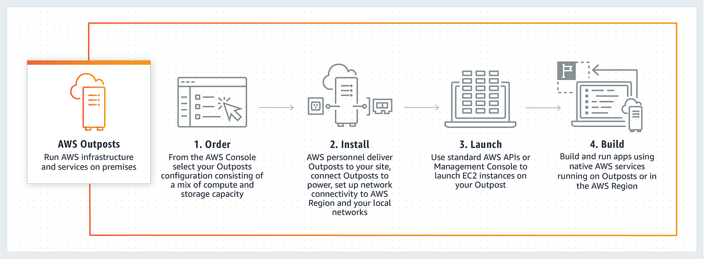
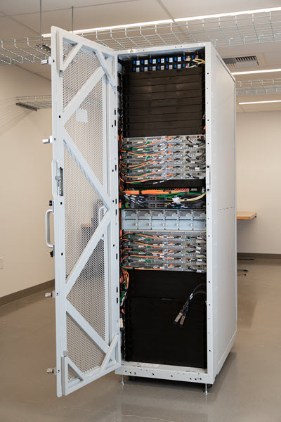

# AWS Outposts

## 1. Introduction

**AWS Outposts** is a fully managed service designed to bring native AWS services, infrastructure, and operating models to virtually any on-premises or edge location. Outposts allows organizations to build and run applications that require low latency, local data processing, or data residency needs while still leveraging the full breadth of AWS services. By extending AWS to your data center, you gain consistency between on-premises and cloud environments, which simplifies hybrid architectures and eases application migration.

Below is an image of an AWS Outposts Rack:

AWS Outposts extends AWS infrastructure, services, APIs, and tools to on-premises environments. It provides local access to AWS-managed compute and storage capacity, enabling you to run applications with low latency and local data processing needs while maintaining a consistent experience with AWS Regions.

## 2. Deployment & Physical Components

- **Outpost Site:** The customer-managed facility that meets specific power, networking, and facility requirements.
- **Outpost Equipment:** The physical hardware (racks, servers, switches, cabling) owned and managed by AWS.
- **Outposts Racks:** Industry-standard 42U racks preconfigured with AWS hardware.
- **Outposts ACE Racks:** Aggregation, Core, Edge (ACE) racks used as network aggregation points when deploying four or more compute racks, reducing networking complexity.
- **Outposts Servers:** Smaller form factors (1U or 2U servers) for sites with limited space or capacity needs.

## 3. Connectivity & Integration

- **Service Link:** A dedicated network route that connects your Outpost to its associated AWS Region, allowing seamless integration with AWS services.
- **Local Gateway & Local Network Interface:** These components ensure communication between the Outpost and your on-premises network, maintaining low-latency and secure data transfer.

## 4. AWS Resource Deployment

You can deploy various AWS resources on Outposts, including compute (Amazon EC2, ECS clusters, and EKS nodes), databases (Amazon RDS, ElastiCache, EMR), networking (VPC subnets, Application Load Balancers, Route 53), and storage (Amazon EBS volumes, S3 buckets). This enables you to run low-latency and hybrid workloads close to your data and applications.

## 5. Management & Ownership

AWS Outposts is fully managed by AWS, including hardware maintenance, software patches, and infrastructure monitoring. The account owner who places the Outposts order serves as the primary point of contact for installation, updates, and support.

## 6. AWS Outpost vs. AWS Snow Family

Choose AWS Outposts if you want a seamless, permanent extension of AWS into your data center or colocation, with the full suite of EC2/EBS and native AWS services available on‑prem, and you have reliable connectivity to an AWS Region.

Choose AWS Snow Family when you need offline data migration (e.g., terabytes to petabytes of data), or lightweight edge compute in disconnected environments, with devices you can ship back and forth.

## 7. Pricing Model

Pricing for AWS Outposts is based on your chosen configuration (racks or servers), contract term, and payment options. It includes charges for hardware delivery, installation, maintenance, and data transfers between the Outpost and the AWS Region.

## 8. Conclusion

AWS Outposts is designed for organizations looking to combine the reliability and scalability of AWS with the benefits of local, on-premises deployments. By providing a consistent AWS experience both on-premises and in the cloud, Outposts simplifies hybrid cloud architectures, meets low-latency requirements, and ensures compliance with data residency mandates. For further technical details and operational guidance, refer to the official documentation and white papers provided by AWS.

For further details, refer to the [official page](https://aws.amazon.com/outposts/).

