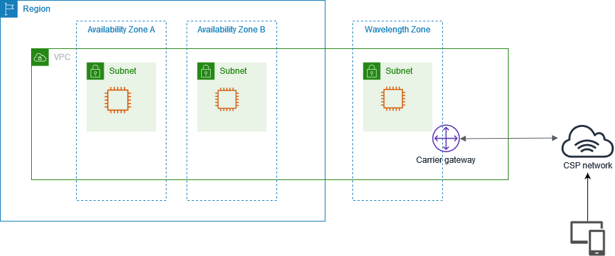

# AWS Wavelength

## 1. Introduction

**AWS Wavelength** is an AWS infrastructure offering that extends AWS cloud services to the edge of telecommunications networks. It is designed to enable developers to build applications that require ultra-low latency and high bandwidth by deploying AWS compute and storage services directly inside 5G networks. This means that mobile and connected devices can access AWS services with single-digit millisecond latencies, opening up new possibilities for applications such as augmented reality (AR), virtual reality (VR), gaming, IoT, and autonomous vehicles.

## 2. Key Components and Architecture

### 2.1. Wavelength Zones

**Wavelength Zones** are infrastructure deployments placed within a telecom operator’s data center or central office. They are strategically located to be as close as possible to end users, reducing the round-trip time for data processing. Each Wavelength Zone is an extension of an AWS Region, providing the same APIs, services, and management experience while delivering low latency to applications running on 5G networks.

### 2.2. Integration with Telecom Providers

AWS Wavelength works in partnership with leading telecom carriers. This integration brings the power of AWS cloud services to the network edge, leveraging the carriers’ connectivity. By integrating directly with the 5G network, Wavelength Zones enable mobile applications to process data near the user rather than sending it to a centralized cloud, thereby reducing latency and bandwidth use.

### 2.3. Consistency with AWS Services

Applications running on AWS Wavelength utilize the same AWS APIs, tools, and services that are available in AWS Regions. This consistency simplifies the process for developers who want to build or extend applications to the edge without needing to learn new management or deployment procedures.

## 3. How AWS Wavelength works

The following diagram demonstrates how you can create a subnet that uses resources in a communications service provider (CSP) network at a specific location. For resources that must be deployed to the Wavelength Zone, first opt in to the Wavelength Zone, and then create resources in the Wavelength Zone.

## 4. Use Cases

AWS Wavelength is particularly well-suited for a number of modern application scenarios:

- **Real-Time Gaming:** Ultra-low latency is critical for competitive online gaming experiences.
- **Augmented and Virtual Reality:** For immersive experiences, minimal latency ensures smooth interactions.
- **IoT and Autonomous Systems:** Fast, local processing of data from sensors and vehicles can improve responsiveness and safety.
- **Live Video Streaming and Analytics:** Enhanced user experiences are possible with reduced buffering and near-real-time analytics.

## 5. Conclusion

AWS Wavelength brings the power of AWS directly to the network edge, enabling developers to build applications that benefit from ultra-low latency and high bandwidth. By extending the AWS infrastructure into telecom networks, Wavelength not only provides a familiar development environment but also opens up new possibilities for innovative applications in gaming, AR/VR, IoT, and more. For further technical details and best practices, refer to the [official documentation](https://docs.aws.amazon.com/wavelength/latest/developerguide/what-is-wavelength.html).

