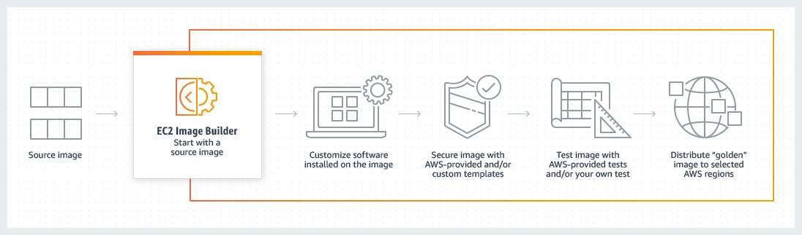

# EC2 Image Builder

## 1. Introduction

**EC2 Image Builder** is a fully managed AWS service that automates the creation, maintenance, validation, and distribution of customized, secure, and up‑to‑date server images – including both Amazon Machine Images (AMIs) and container images. It helps you keep your images current with the latest operating system patches and software updates without the need to build your own automation pipeline.

## 2. Overview of the Workflow

At its core, EC2 Image Builder uses a pipeline that:

- **Defines a Recipe:**  
	This is a declarative document that specifies the base image and a list of components. Components are scripts or configuration steps that customize the image (for example, installing software packages, applying security hardening, or running tests).

- **Configures the Build Environment:**  
	An infrastructure configuration defines the runtime settings for the build process. This includes EC2 instance types, network settings (VPC, subnets, security groups), logging destinations, and other settings required to launch a temporary instance.

- **Builds and Tests the Image:**  
	When the pipeline is run (either manually or on a schedule), Image Builder launches a temporary EC2 instance. The instance uses the defined base image, then sequentially applies the recipe’s components in two main phases:
    - **Build Phase:** Customizations are applied to configure the image as required.
    - **Test Phase:** If test components are specified, the image is validated (for example, by checking that services start correctly or that security settings are enforced).

- **Creates the Final Image:**  
	Once the build and tests complete successfully, Image Builder creates the output image. For AMIs, this involves creating an Amazon EBS snapshot and registering a new AMI; for container images, the process culminates in building a Docker container image.

- **Distributes the Image:**  
	Distribution settings allow the final image to be copied to other AWS Regions and shared with other AWS accounts. For AMIs, you can also set launch permissions (making the image private, public, or shared with select accounts).

- **Cleans Up Temporary Resources:**  
	All temporary build resources (the EC2 instance, any temporary snapshots or container build resources) are automatically deleted after the image is successfully created.

## 2. How the AMI (EC2) Pipeline Works

1. **Create the Pipeline:**    
    - You start in the EC2 Image Builder console and select “Create image pipeline.”
    - In the first step, you provide general details such as a unique pipeline name and set a build schedule (using cron expressions if desired). The schedule can be configured to check for dependency updates, so that a new build is triggered only when the underlying base image or components have changed.

2. **Select an Image Recipe:**
    - You choose to either use an existing recipe or create a new one.
    - The image recipe defines the base AMI and lists the build and test components that are applied. For example, a build component might install application software, while a test component might verify that security settings (like firewall rules) are in place.

3. **Configure Infrastructure:**
    - Although optional, you can specify an infrastructure configuration that sets the parameters for the temporary EC2 instance (e.g., instance type, IAM role, VPC/subnet details, logging settings, etc.).

4. **Define Distribution Settings:**
    - Here you can configure how and where the final AMI is distributed. This might include copying the AMI to multiple Regions and setting launch permissions to control which AWS accounts can use it.

5. **Review and Run the Pipeline:**
    - After reviewing your configuration, you launch the pipeline.
    - Image Builder then creates a temporary build instance, applies the recipe (build components), and then runs any tests. Once successful, it creates the new AMI along with an associated EBS snapshot.

6. **Post-Build Actions:**
    - The newly created AMI is then distributed according to the specified distribution configuration.
    - All temporary resources are cleaned up, leaving you with a production-ready image that’s compliant with your desired configuration and security settings.

## 3. How the Container Pipeline Works

1. **Create the Container Pipeline:**
    - The process begins similarly in the console where you create a new pipeline—this time for container images.
    - You provide a name and scheduling details much like you do for an AMI pipeline.

2. **Select a Container Recipe:**
    - Instead of an AMI recipe, you choose a container recipe. This document specifies a base container image (which might come from public repositories, Amazon ECR, or AWS Marketplace) along with a series of build steps.
    - The recipe can include a Dockerfile or custom commands that customize the container image (for example, installing dependencies or configuring environment variables).

3. **Set Up Infrastructure:**
    - Similar to the AMI pipeline, you define the infrastructure configuration that determines the settings of the temporary EC2 instance used for the build.
    - This instance must have access to Docker, as it will be responsible for executing the container build process.

4. **Build, Test, and Push:**
    - Once the pipeline is executed, Image Builder launches the temporary instance where the container recipe is applied.
    - The base container image is pulled, the build components are executed (e.g., running the Dockerfile instructions), and any tests configured in the recipe are executed to verify the integrity and functionality of the container.
    - After the container image is built successfully, it is pushed to the designated Amazon ECR repository specified in your distribution configuration.

5. **Cleanup:**
    - As with AMI pipelines, all temporary resources (build instance, temporary containers, etc.) are cleaned up after the process completes.

## 4. Common Elements Across Both Pipelines

- **Automation & Scheduling:**  
    Both pipelines can be configured to run on a schedule (using cron expressions or EventBridge rules) and can automatically detect changes in the base image or components to trigger new builds only when necessary.

- **Security & Testing:**  
    Optional test components (including integrations with Amazon Inspector) can be included to perform vulnerability scans and validate that the customizations meet security standards before the image is finalized.

- **Service-Linked Roles & IAM:**  
    EC2 Image Builder leverages a service-linked role (AWSServiceRoleForImageBuilder) to securely perform actions on your behalf. It also requires that your IAM roles and policies (such as EC2InstanceProfileForImageBuilder) are properly configured to allow the build and test operations.

- **Integration with AWS Ecosystem:**  
    In addition to integrating with Systems Manager for remote command execution and enhanced metadata collection, Image Builder works with services like CloudWatch for logging, SNS for notifications, ECR for container storage, and AWS Organizations/Resource Access Manager (RAM) for sharing images across accounts.

## 5. Conclusion

EC2 Image Builder offers a complete, automated solution for building and managing server and container images in AWS. It streamlines processes by combining image recipes, modular components, infrastructure configurations, and automated pipelines. With built‑in support for security testing, multi‑Region distribution, and integration with a broad range of AWS services, it is a powerful tool for modern DevOps and IT operations.

For more information, refer to the official [EC2 Image Builder API Reference](https://docs.aws.amazon.com/imagebuilder/latest/APIReference/Welcome.html) and the [EC2 Image Builder User Guide](https://docs.aws.amazon.com/imagebuilder/latest/userguide/what-is-image-builder.html).
