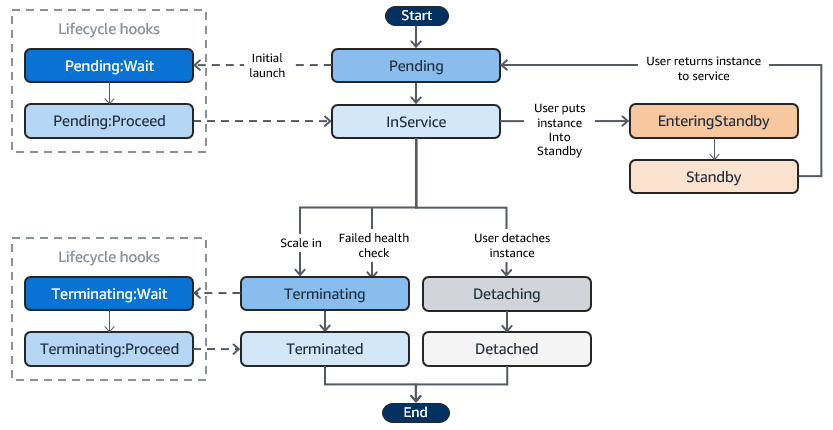
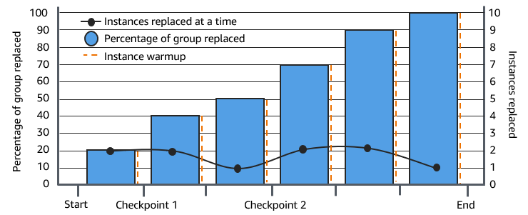
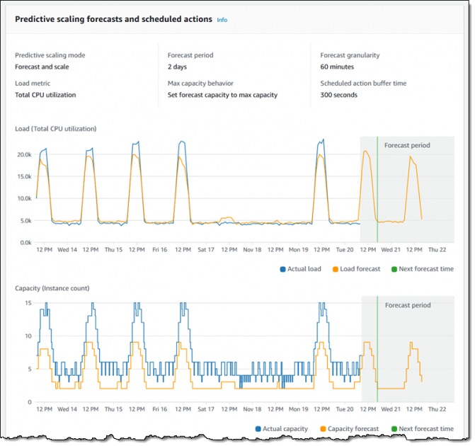

# Amazon EC2 - Auto Scaling

## 1. Introduction

Amazon EC2 Auto Scaling helps you maintain application availability by automatically launching or terminating EC2 instances according to the demand of your application. By defining an Auto Scaling group with a minimum, maximum, and desired capacity, the service ensures that you have the right amount of compute capacity at any given time. It monitors instance health and replaces unhealthy instances so that your application remains resilient and highly available.

## 2. Auto Scaling Benefits for Application Architecture

Adding Amazon EC2 Auto Scaling to your application architecture is one way to maximize the benefits of the AWS Cloud. When you use Amazon EC2 Auto Scaling, your applications gain the following benefits:

- **Better fault tolerance:** Amazon EC2 Auto Scaling can detect when an instance is unhealthy, terminate it, and launch an instance to replace it. You can also configure Amazon EC2 Auto Scaling to use multiple Availability Zones. If one Availability Zone becomes unavailable, Amazon EC2 Auto Scaling can launch instances in another one to compensate.

- **Better availability:** Amazon EC2 Auto Scaling helps ensure that your application always has the right amount of capacity to handle the current traffic demand.

- **Better cost management:** Amazon EC2 Auto Scaling can dynamically increase and decrease capacity as needed. Because you pay for the EC2 instances you use, you save money by launching instances when they are needed and terminating them when they aren't.

## 3. Instance Lifecycle

The EC2 instances in an Auto Scaling group have a path, or lifecycle, that differs from that of other EC2 instances. The lifecycle starts when the Auto Scaling group launches an instance and puts it into service. The lifecycle ends when you terminate the instance, or the Auto Scaling group takes the instance out of service and terminates it.

The following illustration shows the transitions between instance states in the Amazon EC2 Auto Scaling lifecycle.

- **Scale Out**  
    When demand increases, a scale‐out event triggers the launch of new EC2 instances. These new instances start in a _Pending_ state and, once fully configured and having passed health checks (and optionally after any lifecycle hook actions), are attached to the Auto Scaling group and transition to the _InService_ state.  

- **Instances in Service**  
    _InService_ instances are the ones actively running and handling application traffic. They remain in service until a scale‐in event, a manual detachment, or they are placed into standby.  

- **Scale In**  
    When demand decreases, a scale‐in event initiates the termination process. The Auto Scaling group reduces its capacity by terminating one or more instances, using its termination policy to choose which instances to end. If the group is linked with a load balancer, the instances are automatically deregistered before being terminated.  

- **Detach an Instance**  
    You can remove (detach) an instance from an Auto Scaling group without terminating it. This allows you to manage the instance independently or attach it to another group later.  

- **Attach an Instance**  
    Conversely, you can attach an existing, running EC2 instance (that meets certain criteria) to an Auto Scaling group. Once attached, the instance becomes managed as part of the group and contributes to the desired capacity.  

- **Lifecycle Hooks**  
    Lifecycle hooks let you perform custom actions when instances are in transition. For example, during a scale‐out event, a hook can pause an instance in the _Pending:Wait_ state to allow custom initialization steps before it enters _InService_. Similarly, during a scale‐in event, a hook can delay termination by moving the instance into a _Terminating:Wait_ state until necessary actions (like graceful shutdown tasks) are completed.  

- **Enter and Exit Standby**  
    You can temporarily remove an instance from active service by placing it in _Standby_. In this state, the instance is still part of the Auto Scaling group (and continues to be monitored) but does not serve traffic. When ready, you can return it back to the _InService_ state.  

## 4. Launch Templates and Launch Configurations

Launch Configurations are the **legacy** way to specify how new EC2 instances should be launched as part of an Auto Scaling group. They are essentially a “blueprint” that contains the parameters needed to create an instance.

Launch Templates are the newer, more advanced method for defining instance configuration. They offer greater flexibility and are now the recommended way to specify instance settings for Auto Scaling groups, EC2 Spot, and On-Demand launches.

When creating an Auto Scaling group today, AWS recommends using Launch Templates for the following reasons:

- They simplify updates by allowing you to maintain a single template with multiple versions.
- They enable you to take advantage of the latest features (such as instance metadata options and enhanced networking configurations).
- They provide a consistent mechanism across AWS services, reducing the need to maintain separate configurations for different use cases.

Here's a comparison table summarizing the differences between **Launch Configurations** and **Launch Templates**:

| **Feature**                | **Launch Configuration** 🏗️                                 | **Launch Template** 🚀                                    |
|----------------------------|------------------------------------------------------------|-----------------------------------------------------------|
| **Mutability**              | 🔄 **Immutable** (must create new config for changes).      | 🔄 **Versioned** (update existing template with versions). |
| **Versioning**              | 🚫 **No versioning** (no rollback capability).             | #️⃣ **Supports versions** (track/rollback changes easily). |
| **Key Parameters**          | ✅ **Basics**: AMI, instance type, key pair, security groups, user data. | ✅ **All basics** + 🌟 **Advanced**: metadata options, capacity reservations, tagging, mixed purchasing (Spot/On-Demand). |
| **Flexibility**             | 🚫 **Limited** (no advanced networking/storage options).   | 💪 **High** (placement groups, burstable instances, multiple instance types). |
| **Reusability**             | 🔄 **Single-use** (tied to one Auto Scaling group).         | ♻️ **Reusable** (works across Auto Scaling, EC2, Spot Fleet). |
| **Updates**                 | ⏳ **Manual replacement** (new config for every change).    | ⚡ **Seamless** (update templates, retain versions).       |
| **AWS Recommendation**      | 🚫 **Legacy** (avoid for new setups).                      | 🏆 **Recommended** (future-proof, supports latest features). |
| **Use Cases**               | 🏚️ **Existing setups** (if not migrating yet).             | 🏗️ **New projects** + ☁️ **Multi-service workflows** (EC2, Spot, ASG). |

## 5. Auto Scaling Group (ASG)

The ASG is a logical collection of EC2 instances managed as a single unit. You define parameters such as minimum, maximum, and desired capacity. The group also handles the distribution of instances across multiple Availability Zones to improve fault tolerance.

An Auto Scaling group starts by launching enough instances to meet its desired capacity. It maintains this number of instances by performing periodic health checks on the instances in the group. The Auto Scaling group continues to maintain a fixed number of instances even if an instance becomes unhealthy. If an instance becomes unhealthy, the group terminates the unhealthy instance and launches another instance to replace it.

### 5.1. Create an ASG

If you have created a launch template, you can create an Auto Scaling group that uses a launch template as a configuration template for its EC2 instances. The launch template specifies information such as the AMI ID, instance type, key pair, security groups, and block device mapping for your instances.

### 5.2. Update an ASG

You can update most of your Auto Scaling group's details, but you can't update the name of an Auto Scaling group or change its AWS Region.

### 5.3. Instance Maintenance Policies

You can configure an instance maintenance policy for your Auto Scaling group to meet specific capacity requirements during events that cause instances to be replaced, such as an instance refresh or the health check process.

The following policies are available:

- **Launch before terminating** – A new instance must be provisioned first before an existing instance can be terminated. This approach is a good choice for applications that favor availability over cost savings.

- **Terminate and launch** – New instances are provisioned at the same time your existing instances are terminated. This approach is a good choice for applications that favor cost savings over availability. It's also a good choice for applications that should not launch more capacity than is currently available, even when replacing instances.

- **Custom policy** – This option lets you set up your policy with a custom minimum and maximum range for the amount of capacity that you want available when replacing instances. This approach can help you achieve the right balance between cost and availability.

### 5.4. Amazon EC2 Auto Scaling Lifecycle Hooks

Amazon EC2 Auto Scaling offers the ability to add lifecycle hooks to your Auto Scaling groups. These hooks let you create solutions that are aware of events in the Auto Scaling instance lifecycle, and then perform a custom action on instances when the corresponding lifecycle event occurs. A lifecycle hook provides a specified amount of time (one hour by default) to wait for the action to complete before the instance transitions to the next state.

As an example of using lifecycle hooks with Auto Scaling instances:

- When a scale-out event occurs, your newly launched instance completes its startup sequence and transitions to a wait state. While the instance is in a wait state, it runs a script to download and install the needed software packages for your application, making sure that your instance is fully ready before it starts receiving traffic. When the script is finished installing software, it sends the **complete-lifecycle-action** command to continue.

- When a scale-in event occurs, a lifecycle hook pauses the instance before it is terminated and sends you a notification using Amazon EventBridge. While the instance is in the wait state, you can invoke an AWS Lambda function or connect to the instance to download logs or other data before the instance is fully terminated.

A popular use of lifecycle hooks is to control when instances are registered with Elastic Load Balancing. By adding a launch lifecycle hook to your Auto Scaling group, you can ensure that your bootstrap scripts have completed successfully and the applications on the instances are ready to accept traffic before they are registered to the load balancer at the end of the lifecycle hook.

### 5.5. Minimum, Maximum, and Desired Capacity

- **Minimum Capacity:**
    - **Definition:** The lowest number of instances your group must always run.
    - **Purpose:** Guarantees a baseline level of capacity even during low demand.
- **Maximum Capacity:**
    - **Definition:** The highest number of instances your group can scale out to.
    - **Purpose:** Prevents runaway scaling and helps control costs by capping resources.
- **Desired Capacity:**
    - **Definition:** The target number of instances that the ASG strives to maintain.
    - **Behavior:**
        - If the actual number of instances falls below this target (for example, due to failures), the ASG launches new instances.
        - Scaling policies adjust this value (within the boundaries set by minimum and maximum capacity) to match changes in demand.
- **Considerations:**  
    These three values work in tandem to control the scaling boundaries and overall capacity of your application.

## 6. Instance Refresh

You can use an instance refresh to update the instances in your Auto Scaling group. This feature can be useful when a configuration change requires you to replace instances, especially if your Auto Scaling group contains a large number of instances.

Some situations where an instance refresh can help include:

- **Deploying a new Amazon Machine Image (AMI) or user data script across your Auto Scaling group.** You can create a new launch template with the changes and then use an instance refresh to roll out the updates immediately.
- **Migrating your instances to new instance types to take advantage of the latest improvements and optimizations.**
- **Switching your Auto Scaling groups from using a launch configuration to using a launch template.** You can copy your launch configurations to launch templates and then use an instance refresh to update your instances to the new templates.

You can cancel an instance refresh that is still in progress. You can't cancel it after it's finished.

### 6.1. Cancel an Instance Refresh

Canceling an instance refresh does not roll back any instances that were already replaced. To roll back the changes to your instances, perform a rollback instead.

### 6.2. Undo Changes with a Rollback

You can roll back an instance refresh that is still in progress. You can't roll it back after it's finished. You can, however, update your Auto Scaling group again by starting a new instance refresh.

When rolling back, Amazon EC2 Auto Scaling replaces the instances that have been deployed so far. The new instances match the configuration that you last saved on the Auto Scaling group before starting the instance refresh.

### 6.3. Instance Refresh Checkpoints

When using an instance refresh, you can choose to replace instances in phases, so that you can perform verifications on your instances as you go. To do a phased replacement, you add checkpoints, which are points in time where the instance refresh pauses. Using checkpoints gives you greater control over how you choose to update your Auto Scaling group. It helps you to confirm that your application will function in a reliable, predictable manner.

## 7. Scaling Method

Amazon EC2 Auto Scaling offers several methods for adjusting your fleet’s capacity:

- **Fixed Capacity** ensures a steady state without additional scaling actions.
- **Manual Scaling** allows you to directly control capacity changes.
- **Scheduled Scaling** automates capacity adjustments at specific times to meet known demand patterns.
- **Dynamic Scaling** (target tracking, step scaling, and simple scaling) reacts in real time to changes in application load.
- **Predictive Scaling** uses historical trends to forecast and prepare capacity in advance.

### 7.1. Fixed Capacity (No Scaling)

By default, an Auto Scaling group maintains the number of instances at the “desired capacity” you specify. If no scaling policies or scheduled actions are attached, the group simply launches enough instances to meet this target and continues running them—even if some instances become unhealthy (in which case they are replaced).

It is useful when your workload is relatively constant or when you simply want to ensure a baseline level of capacity with automatic replacement of unhealthy instances.

### 7.2. Manual Scaling

Manual scaling involves directly changing the desired capacity of your Auto Scaling group (for example, via the AWS Management Console, CLI, or API). You can manually increase or decrease the number of instances or even attach/detach specific instances.

**Key Points:**
- You decide the exact number of instances to add or remove.
- It’s useful for ad-hoc changes when you have direct insight into current needs.

While manual scaling gives you precise control, it doesn’t automatically react to changes in load, so it’s typically used in combination with other methods or for short-term adjustments.

### 7.3. Scheduled Scaling

Scheduled scaling lets you define scaling actions that occur at specific dates or recurring times. You set up “scheduled actions” that adjust the desired capacity (and optionally the minimum and maximum) of your group.

**Key Points:**
- Ideal for predictable load patterns (e.g., a website that gets high traffic every weekday morning or during known seasonal peaks).
- You specify the time (using UTC or a local time zone) and recurrence (using cron expressions or simple recurrence patterns).

This method ensures that your capacity increases or decreases exactly when you expect it to—proactively managing capacity without waiting for load metrics to trigger a reaction.

### 7.4. Dynamic Scaling

Dynamic scaling adjusts capacity in real time based on changes in your application’s demand. There are several types:
#### a. Target Tracking Scaling

This policy type continuously adjusts capacity to maintain a target metric value (for example, keeping average CPU utilization at 50%). It functions much like a thermostat – you set the target, and the system scales out or in as needed.

**Benefits:**
- Automatically adapts to changing load.
- Simplifies configuration by eliminating the need for custom CloudWatch alarms.

#### b. Step Scaling

Step scaling policies allow you to define multiple adjustment levels (or “steps”) based on the magnitude of a metric breach. For example, if CPU utilization goes above 60%, you might add one instance; if it exceeds 80%, add two more.

**Benefits:**
- Provides granular control over capacity changes.
- Useful when the relationship between the metric and capacity isn’t linear.

#### c. Simple Scaling

Simple scaling uses a single adjustment and incorporates a cooldown period between actions. For instance, if a CloudWatch alarm breaches a threshold, the policy might add one instance and then wait for the cooldown period before allowing another scaling action.

**Benefits:**
- Easier to configure than step scaling when you only need one adjustment level.

### 7.5. Predictive Scaling

Predictive scaling uses machine learning to analyze historical data and forecast future load. Based on these forecasts, capacity is proactively adjusted before the load actually increases. This is particularly useful for workloads with regular, predictable patterns.

**Key Points:**
- It examines historical metrics (typically over a 14-day period) to predict the load for the next two days.
- The system then schedules scaling actions in advance so that capacity is ready when needed.

**When to Use:** 
- When you have cyclical or predictable traffic patterns (e.g., business hours vs. off-hours).
- When your application has long initialization times and needs capacity pre-provisioned.

### 7.6. Comparison 

Here's a comparison table summarizing the different EC2 Auto Scaling methods:

| **Feature / Method**              | Fixed Capacity | Manual Scaling | Scheduled Scaling | Target Tracking | Step Scaling | Simple Scaling | Predictive Scaling |
| --------------------------------- | -------------- | -------------- | ----------------- | --------------- | ------------ | -------------- | ------------------ |
| **Automated Scaling**             | ❌              | ❌              | ✅                 | ✅               | ✅            | ✅              | ✅                  |
| **Real-time Reaction**            | ❌              | ❌              | ❌                 | ✅               | ✅            | ✅              | 🟡 (combined)      |
| **Cooldown Periods**              | ❌              | ❌              | ❌                 | ❌               | ❌            | ✅              | ❌                  |
| **Handles Cyclical Traffic**      | ❌              | ❌              | ✅                 | 🟡              | 🟡           | 🟡             | ✅                  |
| **Handles Unpredictable Traffic** | ❌              | 🟡 (manual)    | ❌                 | ✅               | ✅            | ✅              | ❌                  |
| **Proactive Scaling**             | ❌              | ❌              | ✅                 | ❌               | ❌            | ❌              | ✅                  |
| **Reactive Scaling**              | ❌              | ❌              | ❌                 | ✅               | ✅            | ✅              | 🟡 (combined)      |
| **Machine Learning**              | ❌              | ❌              | ❌                 | ❌               | ❌            | ❌              | ✅                  |
| **Requires CloudWatch Alarms**    | ❌              | ❌              | ❌                 | ❌               | ✅            | ✅              | ❌                  |
| **Granular Control**              | ❌              | ✅              | 🟡 (time-based)   | ❌               | ✅            | ❌              | ❌                  |
| **Maintains Baseline**            | ✅              | ❌              | ❌                 | ❌               | ❌            | ❌              | ❌                  |

## 8. Health Checks

Amazon EC2 Auto Scaling continuously monitors the health status of instances in an Auto Scaling group to maintain the desired capacity.

Amazon EC2 Auto Scaling can determine the health status of an `InService` instance by using **one or more** of the following health checks:

| Health check type                                   | What it checks                                                                                                                                                                                                              |
| --------------------------------------------------- | --------------------------------------------------------------------------------------------------------------------------------------------------------------------------------------------------------------------------- |
| ***Amazon EC2 status checks and scheduled events*** | - Checks that the instance is running.\n- Checks for underlying hardware or software issues that might impair the instance.\n\nThis is the default health check type for an Auto Scaling group.                       |
| ***Elastic Load Balancing health checks***          | - Checks whether the load balancer reports the instance as healthy, confirming whether the instance is available to handle requests.\n\nTo run this health check type, you must turn it on for your Auto Scaling group. |
| ***VPC Lattice health checks***                     | - Checks whether VPC Lattice reports the instance as healthy, confirming whether the instance is available to handle requests.\n\nTo run this health check type, you must turn it on for your Auto Scaling group.       |
| ***Amazon EBS health checks***                      | - Checks whether EBS volumes are reachable and passing I/O status checks.\n\nTo run this health check type, you must turn it on for your Auto Scaling group.                                                            |
| ***Custom health checks***                          | - Checks for any other problems that might indicate instance health issues, according to your custom health checks.                                                                                                         |

## 9. Conclusion

Amazon EC2 Auto Scaling is an essential AWS service designed to keep your applications available, resilient, and cost-effective by dynamically adjusting the number of EC2 instances in response to demand. Whether you use manual adjustments, scheduled actions, dynamic (reactive) policies, or predictive scaling, Auto Scaling automates fleet management so that you can focus on your core application logic.

For further information refer to the [official documentation](https://docs.aws.amazon.com/autoscaling/ec2/userguide/what-is-amazon-ec2-auto-scaling.html).

