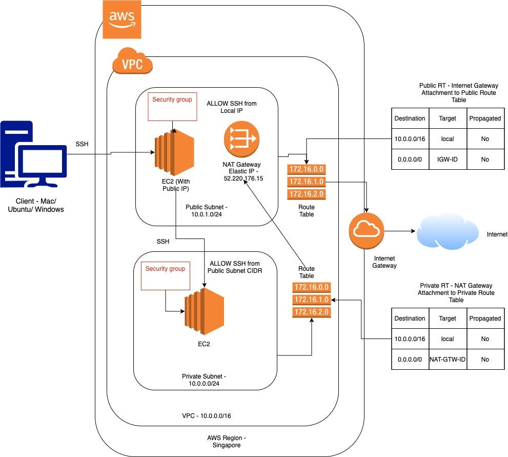
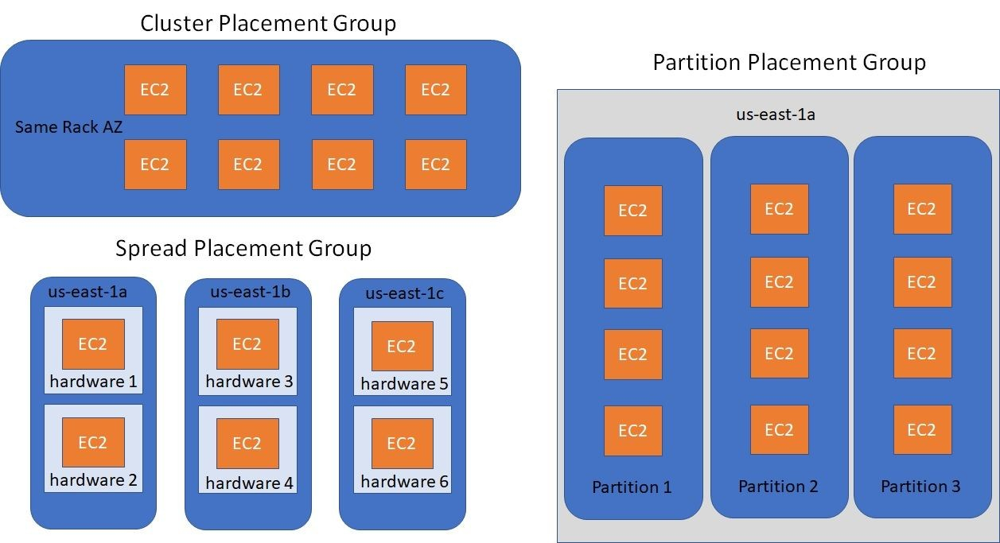

# Amazon EC2 - Networking

## 1. Introduction

Amazon EC2’s networking capabilities are designed to give you complete control over both the connectivity and security of your compute resources. At its core, EC2 networking is built around the concept of a Virtual Private Cloud (VPC), which lets you define a logically isolated section of the AWS Cloud. From there, you can customize network topology, configure route tables, subnets, gateways, and more—all while leveraging advanced features for performance and security.

## 2. EC2 in Virtual Private Cloud (VPC)

Amazon VPC enables you to provision a private, isolated section of the AWS Cloud where you can launch your EC2 instances. You determine the IP address range, create subnets, and configure route tables and network gateways to control connectivity both within the cloud and to your on-premises networks.

AWS offers various connectivity solutions such as VPC peering, AWS Transit Gateway, and VPN connections to extend your network to on-premises data centers or between different VPCs.

## 2. Elastic Network Interfaces (ENIs)

An Elastic Network Interface (ENI) is a virtual network interface that you can attach to an EC2 instance in a Virtual Private Cloud (VPC). Every instance launched in a VPC has a primary network interface, but you can attach additional ENIs for more complex network configurations.

**Key Features and Capabilities:**

- **Multiple IP Addresses:**  
    An ENI can have one primary private IPv4 address along with multiple secondary private IP addresses. This allows you to run applications that require multiple IP addresses on a single instance.
- **Security Group Associations:**  
    Each ENI can have one or more security groups attached. This enables you to apply different firewall rules to different interfaces on the same instance.
- **Persistent Configuration:**  
    Unlike instance-level network configurations that are lost when an instance stops, ENIs persist independently. They can be detached from one instance and attached to another, helping you maintain network configurations and high availability.
- **Enhanced Flexibility:**  
    By using multiple ENIs, you can segregate traffic (for example, separating public and private traffic) and even implement dual-homed instances that connect to different subnets within your VPC.

See the [official ENI documentation](https://docs.aws.amazon.com/AWSEC2/latest/UserGuide/using-eni.html) for more details.

## 3. IP Addressing

Amazon EC2 instances use a combination of private and public IP addressing to enable communication both within a VPC and with the Internet.

**Key Aspects:**

- **Private IPv4 Addresses:**  
    When an instance is launched in a VPC, it is assigned a private IPv4 address from the subnet’s CIDR block. Instances can also be assigned additional secondary private IP addresses, which can be used for hosting multiple SSL websites or running containerized applications that require distinct IPs.
- **Public IPv4 Addresses and Elastic IPs:**  
    Instances can be assigned public IPv4 addresses at launch or through association with an Elastic IP. Elastic IP addresses are static and can be remapped quickly to another instance if needed.
- **IPv6 Support:**  
    For modern applications, EC2 supports IPv6 addressing, providing a vastly expanded address space and supporting dual-stack mode (IPv4 and IPv6 simultaneously).
- **IP Address Management:**  
    AWS automates much of the IP address management; however, you can control the allocation and association of IP addresses to tailor your network architecture.

### 3.1. Bring Your Own IP (BYOIP)

Amazon EC2 instances are typically assigned private and public IP addresses from AWS-managed pools. However, with BYOIP (Bring Your Own IP), you can bring your own public IP address ranges into AWS and use them with your resources. This feature is especially useful if you have existing IP addresses with established reputations or if you need to maintain consistency in external DNS records and other integrations during cloud migrations.
## 4. Enhanced Networking

Enhanced Networking is designed to provide high throughput, low latency, and lower jitter compared to traditional networking methods. It is especially important for applications that require high network performance.

**How It Works:**

- **Elastic Network Adapter (ENA):**  
    Many instance types use the ENA to deliver high performance. ENA supports advanced features such as multi-queue, SR-IOV (Single Root I/O Virtualization), and offloads for network processing.
- **Intel 82599 Virtual Function (VF):**  
    Some instance families offer enhanced networking using the Intel 82599 VF, which also improves packet-per-second performance and reduces latency.

Review the [Enhanced Networking documentation](https://docs.aws.amazon.com/AWSEC2/latest/UserGuide/enhanced-networking.html) for in-depth performance metrics.

## 5. Elastic Fabric Adapter (EFA)

The Elastic Fabric Adapter is a network interface designed to support applications that require high levels of inter-instance communication with very low latency and high throughput. It is especially beneficial for high-performance computing (HPC) and machine learning workloads.

**Key Features:**

- **Low-Latency, High-Bandwidth Communication:**  
    EFA is engineered to reduce the latency gap between instances and improve inter-node bandwidth, making it ideal for tightly coupled parallel computing frameworks.
- **Integration with MPI:**  
    Many HPC applications use the Message Passing Interface (MPI) for communication. EFA provides a network layer that is compatible with MPI, ensuring optimal performance for scientific and engineering applications.
- **Offloading Capabilities:**  
    By offloading parts of the communication stack, EFA reduces CPU overhead, allowing more resources to be devoted to the application’s processing needs.
- **Supported Instance Types:**  
    Not all EC2 instance types support EFA; it is available only on selected instance families optimized for HPC and machine learning.

## 6. Placement Groups

Placement groups are a critical component for optimizing the physical placement of EC2 instances to meet specific application requirements, whether that be low latency, high throughput, or fault isolation. AWS provides three distinct types of placement groups:

Here’s a comparison table for EC2 placement groups:

| **Placement Type**       | **Benefits**                                                                 | **Considerations**                                                                 |
|--------------------------|-----------------------------------------------------------------------------|-----------------------------------------------------------------------------------|
| **Cluster Placement** 🏢 | 🐇 **Low Latency**: Ideal for rapid inter-instance communication.   🚀 **High Throughput**: Optimized for HPC workloads. | 🏠 **Single AZ Only**: All instances must reside in one Availability Zone.   ⚠️ **Capacity Limits**: Risk of constraints for large deployments. |
| **Spread Placement** 🌐  | 🛡️ **Fault Isolation**: Instances on separate hardware.   🌟 **Critical Apps**: High-availability focus. | 🔢 **Instance Limits**: Up to 7 instances per group.   ⚖️ **Scalability Issues**: Not ideal for large-scale workloads. |
| **Partition Placement** 🧩 | 💪 **Resilience**: Failures in one partition don’t affect others.   🌐 **Optimized Network**: High bandwidth within partitions.   📈 **Scalability**: Supports large-scale distributed workloads. | 🏗️ **Multi-Rack Setup**: Instances spread across racks in the same AZ.   🧠 **Complex Planning**: Requires careful partition sizing and balancing. |

### 6.1. Cluster Placement Groups

Cluster placement groups are designed to ensure that instances are physically located in close proximity within a single Availability Zone.

- **Benefits:**
    - **Low Latency:**  
        Because instances are placed close together, network latency between them is minimized, which is ideal for applications that require rapid inter-instance communication.
    - **High Throughput:**  
        The network performance is optimized, offering high packet-per-second performance, making it suitable for HPC workloads.
- **Considerations:**
    - All instances in a cluster placement group must reside within a single Availability Zone.
    - There may be capacity constraints if you require a large number of instances with very high performance.

### 6.2. Spread Placement Groups

Spread placement groups distribute instances across distinct underlying hardware to minimize the risk of simultaneous failures.

- **Benefits:**
    - **Fault Isolation:**  
        By ensuring that no two instances share the same physical hardware, a hardware failure affecting one instance is unlikely to impact others.
    - **Ideal for Critical Applications:**  
        Suitable for applications where high availability is paramount.
- **Considerations:**
    - A spread placement group can support only a limited number of instances (typically up to seven per group), which might limit its use for larger deployments.

### 6.3. Partition Placement Groups

Partition placement groups are tailored for large-scale, distributed, and replicated workloads. They enable you to divide your instances into logical segments called partitions.

- **How It Works:**
    - **Isolation of Failure Domains:**  
        Each partition is mapped to a distinct set of underlying hardware. This means that if one partition encounters a hardware failure, the other partitions remain unaffected.
    - **Workload Distribution:**  
        This is especially useful for distributed applications like Hadoop, HDFS, Cassandra, and Kafka, where data and compute tasks are partitioned across many nodes.
    - **Scalability:**  
        Partition placement groups support a much larger number of instances compared to spread groups, making them ideal for scalable architectures that require both high performance and fault tolerance.
- **Benefits:**
    - **Resilience:**  
        Faults or failures in one partition will not cascade to others, improving overall application availability.
    - **Optimized Network Performance:**  
        Within each partition, network traffic can achieve high bandwidth and low latency similar to cluster placement groups, while still providing fault isolation between partitions.
- **Considerations:**
    - Instances in partition placement groups are typically spread across multiple racks (or failure domains) within the same Availability Zone.
    - Planning and architecture need to be carefully managed to ensure that partitions are appropriately sized and balanced with respect to workload and redundancy requirements.

### 6.4. Shared Placement Groups

Placement group sharing allows you to influence the placement of interdependent instances that are owned by separate AWS accounts. An owner can share a placement group across multiple AWS accounts or within their organization. A participant can launch instances in a placement group that is shared with their account.

A placement group owner can share a placement group with:

- Specific AWS accounts inside or outside of its organization
- An organizational unit inside its organization
- Its entire organization

You can use VPC peering to connect instances owned by separate AWS accounts and get the full latency benefits offered by shared cluster placement groups.

## 7. Hybrid Connectivity and Integration

- **PrivateLink and Transit Gateway:**  
    AWS PrivateLink allows you to access services hosted on AWS in a highly secure manner without using public IPs. AWS Transit Gateway simplifies your network architecture by acting as a hub that interconnects your VPCs and on-premises networks.
- **Load Balancing:**  
    Elastic Load Balancing (ELB) integrates with EC2 networking to distribute incoming application traffic across multiple instances, thereby enhancing fault tolerance and scalability.
- **IPv6 Support:**  
    For modern applications, EC2 supports IPv6 addressing in addition to traditional IPv4 addresses.

## 8. Conclusion

Networking in Amazon EC2 is built on a flexible, secure, and high-performance foundation. By leveraging VPCs, ENIs, security groups, enhanced networking features, and hybrid connectivity options, AWS provides a robust platform that can meet a wide range of application requirements—from simple web applications to complex, high-performance computing workloads.

