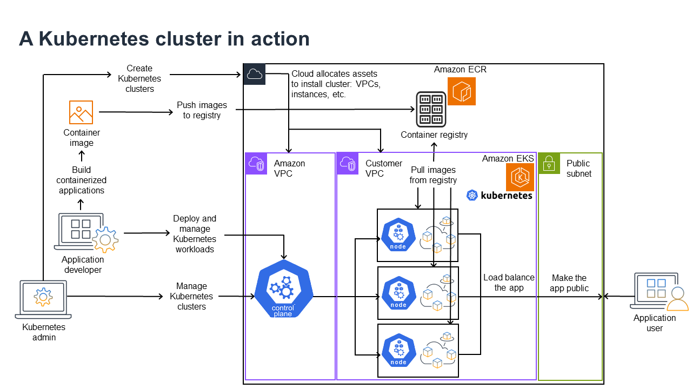
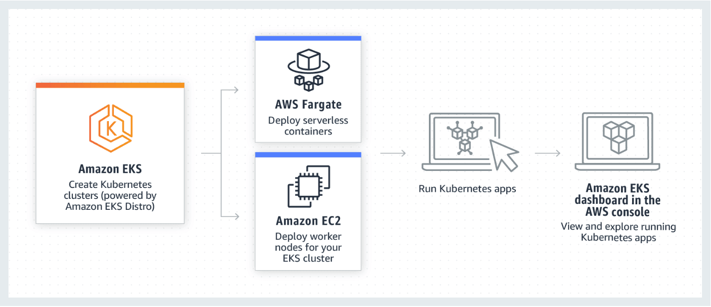
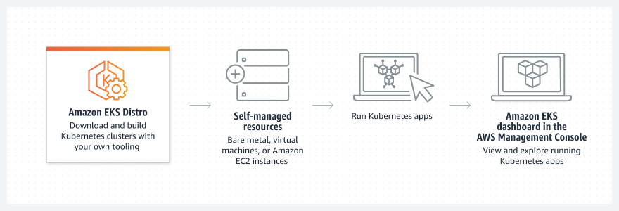

# Amazon EKS

## 1. Introduction

Amazon EKS is a fully managed Kubernetes service designed to simplify the deployment, management, and scaling of containerized applications using Kubernetes on AWS. It is a certified Kubernetes conformant service, which means you can run standard Kubernetes applications without needing to modify your code. EKS handles the complexities of operating Kubernetes control planes, including scalability, availability, and patching, so you can focus on building your applications.

## 2. Common Use Cases for Amazon EKS

Amazon EKS is designed to address a wide range of containerized application scenarios:

### 2.1. Modernizing Applications and Microservices Architectures

- **Containerization & Decoupling:**  
    EKS enables you to break down monolithic applications into smaller, independent microservices that are easier to develop, deploy, and scale. This containerized approach allows teams to update and deploy individual services without affecting the entire system.

- **Resiliency & Scalability:**  
    By leveraging Kubernetes’ orchestration capabilities, you can design systems that automatically recover from failures and scale horizontally based on demand. This is particularly important for applications that require high availability and fault tolerance.

### 2.2. Batch Processing and Machine Learning Workloads

- **Efficient Resource Management:**  
    Kubernetes provides powerful scheduling capabilities for batch processing jobs, making it an ideal platform for data processing and machine learning tasks. You can run jobs in parallel and automatically manage resource allocation to optimize cost and performance.

- **Integration with Data Services:**  
    EKS integrates seamlessly with AWS data storage and analytics services (such as Amazon S3 and Amazon EMR), making it easier to build and scale complex data pipelines and machine learning workflows.

### 2.3. Continuous Integration and Continuous Delivery (CI/CD)

- **Dynamic and Ephemeral Environments:**  
    EKS is well suited for modern CI/CD pipelines. With Kubernetes, you can spin up temporary, isolated environments to run tests and deploy builds. This ensures that each change is tested in an environment that closely mirrors production before being promoted.

- **Automation and Scalability:**  
    By integrating with AWS services (such as CodePipeline and CodeBuild) and popular third-party tools (like Jenkins or GitLab), you can automate your software delivery process and efficiently scale your build and test infrastructure.

### 2.4. Hybrid and Multi-Cloud Deployments

- **Consistency Across Environments:**  
    EKS can serve as a central platform for managing containerized workloads across on-premises, hybrid, and multi-cloud environments. This consistency allows organizations to modernize applications without a complete rewrite, enabling smoother transitions between environments.

- **Seamless Integration:**  
    Kubernetes’ abstraction of underlying infrastructure means you can run similar workloads on EKS and other Kubernetes environments. This flexibility supports scenarios where certain workloads remain on-premises while others are moved to the cloud.

### 5. Serverless Container Deployments with AWS Fargate

- **No Infrastructure Management:**  
    With EKS integration with AWS Fargate, you can run containers without managing EC2 instances. This serverless compute model is especially useful for workloads with variable or unpredictable resource demands, reducing the operational overhead and complexity of managing underlying infrastructure.
    
- **Cost Efficiency and Simplicity:**  
    Using Fargate with EKS allows you to pay only for the compute time you use, making it a cost-effective option for many production and development scenarios.

## 3. Kubernetes in action

The following diagram shows key activities you would do as a Kubernetes Admin or Application Developer to create and use a Kubernetes cluster. In the process, it illustrates how Kubernetes components interact with each other, using the AWS cloud as the example of the underlying cloud provider.

A Kubernetes Admin creates the Kubernetes cluster using a tool specific to the type of provider on which the cluster will be built. This example uses the AWS cloud as the provider, which offers the managed Kubernetes service called Amazon EKS. The managed service automatically allocates the resources needed to create the cluster, including creating two new Virtual Private Clouds (Amazon VPCs) for the cluster, setting up networking, and mapping Kubernetes permissions directly into the new VPCs for cloud asset management. The managed service also sees that the control plane services have places to run and allocates zero or more Amazon EC2 instances as Kubernetes nodes for running workloads. AWS manages one Amazon VPC itself for the control plane, while the other Amazon VPC contains the customer nodes that run workloads.

Many of the Kubernetes Admin’s tasks going forward are done using Kubernetes tools such as `kubectl`. That tool makes requests for services directly to the cluster’s control plane. The ways that queries and changes are made to the cluster are then very similar to the ways you would do them on any Kubernetes cluster.

An application developer wanting to deploy workloads to this cluster can perform several tasks. The developer needs to build the application into one or more container images, then push those images to a container registry that is accessible to the Kubernetes cluster. AWS offers the Amazon Elastic Container Registry (Amazon ECR) for that purpose.

To run the application, the developer can create YAML-formatted configuration files that tell the cluster how to run the application, including which containers to pull from the registry and how to wrap those containers in Pods. The control plane (scheduler) schedules the containers to one or more nodes and the container runtime on each node actually pulls and runs the needed containers. The developer can also set up an application load balancer to balance traffic to available containers running on each node and expose the application so it is available on a public network to the outside world. With that all done, someone wanting to use the application can connect to the application endpoint to access it.

## 4. Worker Nodes

- **EC2 and Fargate Options:** You can run your Kubernetes worker nodes on Amazon EC2 instances (using managed node groups) or opt for serverless compute with AWS Fargate, which abstracts away the underlying infrastructure management.
- **Integration with AWS Services:** Worker nodes integrate seamlessly with other AWS services such as Amazon VPC for networking, AWS IAM for authentication and authorization, and Amazon EBS for storage.

## 5. Amazon EKS Distro

Amazon Elastic Kubernetes Service (EKS) uses Amazon EKS Distro, a Kubernetes distribution built and maintained by AWS. Amazon EKS Distro makes it easier to create reliable and secure clusters.

**Use Cases:**

* **Deploy consistently on premises and in the cloud**
	Run the same secure, validated, and tested Kubernetes components that power Amazon EKS within self-managed infrastructure on AWS, on premises, and on other clouds.  

* **Modernize on-premises applications**
	Remove the need to keep up with upstream Kubernetes and security patches so you can focus on your core business.  

* **Use existing hardware investments**
	Continue using your own hardware and data center investments to run your Kubernetes workloads.

For further details and to explore the distribution, you can refer to the [Amazon EKS Distro documentation](https://aws.amazon.com/eks/eks-distro/).

## 6. Amazon EKS Anywhere

Amazon EKS Anywhere is an extension of Amazon EKS that enables you to create, operate, and maintain Kubernetes clusters on your own on-premises infrastructure. It provides a consistent, upstream Kubernetes experience—the same as what powers the managed Amazon EKS service—but runs outside the AWS cloud. This means you can deploy Kubernetes clusters in your own data centers, on bare metal, or in virtualized environments, all while leveraging familiar AWS tooling and best practices.

For further details, you can refer to the official [Amazon EKS Anywhere documentation](https://aws.amazon.com/eks/eks-anywhere/).

## 7. EKS vs ECS

Here’s a comparison table summarizing the differences between **Amazon ECS** and **Amazon EKS:**

| **Feature**               | **Amazon ECS**                                                                                                                                 | **Amazon EKS**                                                                                                                                 |
|---------------------------|-------------------------------------------------------------------------------------------------------------------------------------------------|-------------------------------------------------------------------------------------------------------------------------------------------------|
| **Service Type**          | AWS-native proprietary container orchestration service.                                                                                        | Managed Kubernetes service (CNCF-certified, conformant with upstream Kubernetes).                                                              |
| **Ecosystem**             | Tightly integrated with AWS services (IAM, CloudWatch, VPC). Limited to AWS tooling.                                                           | Leverages the broader Kubernetes ecosystem (third-party tools, Helm charts, operators, and community extensions).                              |
| **Integration**           | Seamless out-of-the-box AWS integrations (e.g., ALB, ECR). Minimal configuration required.                                                     | Requires setup for AWS integrations but supports Kubernetes-native tooling (e.g., Prometheus, Istio, Knative).                                  |
| **Control & Customization** | Opinionated, simplified configuration. Fewer customization options. Best for straightforward AWS-centric workflows.                            | High customization via Kubernetes APIs, CRDs, and controllers. Supports advanced networking, storage, and scheduling configurations.           |
| **Management Complexity** | Lower operational overhead. Managed control plane and simpler abstractions (e.g., tasks/services instead of pods/deployments).                 | Higher complexity due to Kubernetes architecture (e.g., managing pods, nodes, and custom controllers). AWS manages the control plane only.     |
| **Pricing Model**          | No additional cost for ECS itself. Pay only for EC2/Fargate resources.                                                                          | EKS control plane costs $0.10/hour per cluster + EC2/Fargate resources.                                                                        |
| **Use Cases**             | - Rapid deployment of AWS-integrated apps. - Serverless containers with Fargate. - Teams avoiding Kubernetes complexity.                  | - Multi-cloud/hybrid-cloud workloads. - Kubernetes-native tooling needs. - Advanced orchestration or existing Kubernetes expertise.       |
| **Portability**           | Limited to AWS. Migrating workloads off AWS requires re-architecting.                                                                          | Highly portable (Kubernetes workloads can run on any conformant cluster, including on-premises or other clouds).                               |
| **Learning Curve**         | Easier for AWS users. No Kubernetes knowledge required.                                                                                        | Steeper learning curve (requires Kubernetes expertise).                                                                                        |

## 8. Conclusion

Amazon EKS is a robust, production-ready managed Kubernetes service that abstracts much of the complexity associated with operating Kubernetes. With its deep integration into the AWS ecosystem, high availability, security features, and compliance with Kubernetes standards, EKS is well-suited for running modern, containerized applications at scale. 

For further reading and deep dives into specific topics, refer to the [official resources](https://docs.aws.amazon.com/eks/latest/userguide/what-is-eks.html).