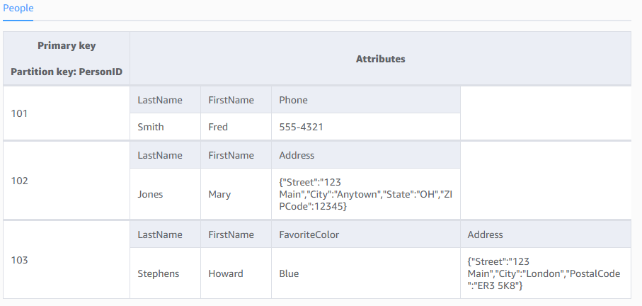
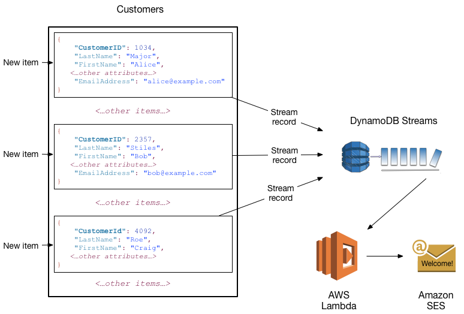

# Amazon DynamoDB

## 1. Introduction

Amazon DynamoDB is a fully managed NoSQL database service offered by AWS. Designed for applications that require low latency at any scale, DynamoDB provides fast and predictable performance while automatically handling administrative tasks such as hardware provisioning, configuration, replication, and scaling. As a serverless service, it removes the burden of managing servers and infrastructure so you can focus on building your applications.

## 2. Characteristics of DynamoDB

Here are the key characteristics of DynamoDB along with explanations:

1. **Fully Managed Service**  
	DynamoDB is completely managed by AWS. This means you don’t have to worry about hardware provisioning, software patching, setup, configuration, replication, or scaling—AWS takes care of all of these operational aspects so you can focus on your application logic.
    
2. **High Performance and Low Latency**  
	Designed to deliver single-digit millisecond response times, DynamoDB ensures fast and predictable performance for both read and write operations. This consistent low latency is crucial for applications that require rapid data access at any scale.
    
3. **Seamless Scalability**  
	DynamoDB automatically scales throughput capacity in response to changes in your application’s workload. Whether you experience a sudden spike in traffic or need to store massive amounts of data, DynamoDB can grow (or shrink) without downtime, ensuring that performance remains consistent.
    
4. **Flexible Data Model**  
	Supporting both key–value and document data structures, DynamoDB allows you to store and query structured or semi-structured data. Data is organized in tables, with items (similar to rows) and attributes (similar to columns), and you can define simple or composite primary keys to suit your access patterns.
    
5. **High Availability and Durability**  
	Data in DynamoDB is automatically replicated across multiple Availability Zones within an AWS Region (typically three replicas). This replication not only enhances durability (protecting against data loss) but also ensures high availability even if one or more zones experience issues.
    
6. **Robust Security**  
	DynamoDB integrates with AWS Identity and Access Management (IAM) for fine-grained access control. Additionally, it provides encryption both at rest (using AWS Key Management Service) and in transit (via HTTPS), ensuring your data remains secure.
    
7. **Built-in Backup and Restore Capabilities**  
	DynamoDB offers features like on-demand backups and point-in-time recovery. These built-in tools allow you to protect your data from accidental loss and restore your tables to any point in time without manual intervention.
    
8. **Optional In-Memory Caching with DAX**  
	For applications that require even faster read performance, DynamoDB Accelerator (DAX) provides a fully managed, in‑memory cache. DAX helps reduce response times from milliseconds to microseconds, making it ideal for read-heavy workloads.

## 3. Tables, Items, and Attributes

The following are the basic DynamoDB components:

- **Tables**: Similar to other database systems, DynamoDB stores data in tables. A _table_ is a collection of data.

- **Items**: Each table contains zero or more items. An _item_ is a group of attributes that is uniquely identifiable among all of the other items. Items in DynamoDB are similar in many ways to rows, records, or tuples in other database systems. In DynamoDB, there is no limit to the number of items you can store in a table. **The maximum size for an item is 400 kilobytes.**

- **Attributes**: Each item is composed of one or more attributes. An _attribute_ is a fundamental data element, something that does not need to be broken down any further. For example, an item in a _People_ table contains attributes called _PersonID_, _LastName_, _FirstName_, and so on. Attributes in DynamoDB are similar in many ways to fields or columns in other database systems.
## 4. Primary key

When you create a table, in addition to the table name, you must specify the primary key of the table. The primary key uniquely identifies each item in the table, so that no two items can have the same key.

DynamoDB supports two different kinds of primary keys:

- **Partition key**: 
	A simple primary key, composed of one attribute known as the _partition key_.
    
	DynamoDB uses the partition key's value as input to an internal hash function. The output from the hash function determines the partition (physical storage internal to DynamoDB) in which the item will be stored.
    
    In a table that has only a partition key, no two items can have the same partition key value.

- **Partition key and sort key**: 
	Referred to as a _composite primary key_, this type of key is composed of two attributes. The first attribute is the _partition key_, and the second attribute is the _sort key_.

    DynamoDB uses the partition key value as input to an internal hash function. The output from the hash function determines the partition (physical storage internal to DynamoDB) in which the item will be stored. All items with the same partition key value are stored together, in sorted order by sort key value.
    
    In a table that has a partition key and a sort key, it's possible for multiple items to have the same partition key value. However, those items must have different sort key values.

## 5. Secondary Indexes

You can create one or more secondary indexes on a table. A _secondary index_ lets you query the data in the table using an alternate key, in addition to queries against the primary key. DynamoDB doesn't require that you use indexes, but they give your applications more flexibility when querying your data. After you create a secondary index on a table, you can read data from the index in much the same way as you do from the table.

DynamoDB supports two kinds of indexes:

- **Global secondary index:** An index with a partition key and sort key that can be different from those on the table. The primary key values in global secondary indexes don't need to be unique. **It can be created after table creation.**
- **Local secondary index:** An index that has the same partition key as the table, but a different sort key. **It must be defined during table creation.**

In DynamoDB, global secondary indexes (GSIs) are indexes that span the entire table, allowing you to query across all partition keys. Local secondary indexes (LSIs) are indexes that have the same partition key as the base table but a different sort key.

Each table in DynamoDB has a quota of 20 global secondary indexes (default quota) and 5 local secondary indexes.

## 6. Read Capacity Units (RCUs)

One RCU represents the capacity to perform one strongly consistent read per second for an item up to 4 KB in size. If you use eventually consistent reads, one RCU can support up to two reads per second for an item of the same size.

For items larger than 4 KB, DynamoDB rounds up the item size to the next 4 KB increment. For example, reading an 8 KB item with strong consistency would consume 2 RCUs.

Eventually consistent reads consume half the RCUs of strongly consistent reads. This option is often used when a slight delay in data freshness is acceptable, thereby lowering your cost while providing high throughput.

## 7. Write Capacity Units (WCUs)

One WCU represents the capacity to perform one write per second for an item up to 1 KB in size. For items larger than 1 KB, DynamoDB rounds up the item size to the next 1 KB increment.

Writing an item that is 2 KB in size would require 2 WCUs. The more data you write in a single operation, the more capacity units are consumed.

WCUs ensure that your table can handle a certain volume of write operations per second, and you provision them based on your expected workload or use on‑demand mode to automatically scale.
## 8. DynamoDB Throughput Capacity

 A table’s throughput mode determines how the capacity of a table is managed. Throughput mode also determines how you're charged for the read and write operations on your tables. In Amazon DynamoDB, you can choose between **on-demand mode** and **provisioned mode** for your tables to accommodate different workload requirements.
 
- **Provisioned Capacity:**  
  You specify the number of RCUs and WCUs your application needs, and DynamoDB allocates the throughput accordingly. You can choose to use provisioned capacity if you have steady workloads with predictable growth, and if you can reliably forecast capacity requirements for your application.
- **On‑Demand Capacity (default):**  
  DynamoDB automatically adjusts capacity based on your actual traffic patterns and you are billed per request, which can simplify scaling for unpredictable workloads. 

Understanding and correctly provisioning RCUs and WCUs is crucial for maintaining predictable performance and managing cost in your DynamoDB applications.

## 9. DynamoDB Read Consistency

DynamoDB gives you two options for reading data that impact consistency and capacity usage:

- **Eventually Consistent Reads (Default):**  
    When you perform an eventually consistent read (the default behavior for operations like GetItem and Query), the read may not reflect the most recent write immediately. In other words, if a write was just acknowledged, a subsequent eventually consistent read might return an older version of the data. However, if no new updates occur, all replicas will converge to the same state within a short time. Eventually consistent reads consume half as many read capacity units compared to strongly consistent reads.
    
- **Strongly Consistent Reads:**  
    By setting the ConsistentRead parameter to true, you can request a strongly consistent read. This type of read always returns the most up-to-date data, ensuring that the read reflects all successful writes prior to the read. Because strongly consistent reads require coordination with the leader node (or a similar mechanism), they consume more capacity and may introduce slightly higher latencies. Note that strongly consistent reads are only available in the same AWS Region as the data; for global tables, reads are always eventually consistent.

These options allow you to balance between performance, cost, and the need for up-to-date data based on your application's requirements.  

## 10. ACID transactions

Amazon DynamoDB supports ACID transactions that let you group multiple operations into a single all-or-nothing action. This capability is built into the service so that you can update or read multiple items—potentially across different tables—in a way that guarantees atomicity, consistency, isolation, and durability (ACID) without having to manage distributed transactions yourself. Below are the key points about ACID transactions in DynamoDB based on the official documentation:

1. **Atomicity**  
    With DynamoDB transactions (using the `TransactWriteItems` API for writes and `TransactGetItems` for reads), either all of the operations in the transaction succeed or none do. If any condition fails or a conflict is detected, the entire transaction is canceled, ensuring that your data remains in a consistent state.

2. **Consistency**  
    Transactions in DynamoDB offer serializable isolation when operating in transactional APIs. This means that the outcome of concurrent transactions is as if they had been executed one after another. For example, when you use a transaction to update multiple items, the system guarantees that each read within the transaction sees the latest committed data, either all before or all after the transaction.

3. **Isolation**  
    DynamoDB transactions ensure that the intermediate state of a transaction is never visible to other operations. Even if a transaction is in progress, any non-transactional read might see either the state before or after the transaction’s completion—but not a partially applied state. For complex workflows where you require a consistent snapshot across multiple items, you can use `TransactGetItems` for an isolated, atomic read.

4. **Durability**  
    Once a transaction is successfully committed, all changes are durably written to disk and replicated across multiple Availability Zones. This replication, combined with DynamoDB’s underlying design (using SSDs and automated backup mechanisms), ensures that the data remains safe even in the event of a hardware failure.

## 11. Global Tables

Global Tables are a fully managed, multi‑Region, multi‑active feature of Amazon DynamoDB that automatically replicates your tables across multiple AWS Regions. This replication enables globally distributed applications to read and write data with low latency and high availability. 

Here are the key points:

- **Multi‑Region Replication:**  
	Global Tables automatically replicate data across the AWS Regions you choose. This means that when data is written in one Region, those changes are asynchronously propagated to replica tables in other Regions.
    
- **Multi‑Active Writes:**  
	You can perform write operations in any of the Regions where the global table is deployed. Although the transaction’s ACID guarantees apply only within the source Region, having multi‑active writes allows for local, low‑latency writes and enhanced availability.
    
- **High Availability and Disaster Recovery:**  
	Since your data is replicated in multiple, geographically dispersed Regions, Global Tables help ensure that your application remains available even if an entire AWS Region becomes temporarily unreachable.
    
- **Seamless Integration:**  
	Global Tables use the same DynamoDB APIs as standard tables, so you can enable multi‑Region replication without making changes to your application code. They also integrate with other AWS services like AWS KMS for encryption, ensuring your data remains secure.
    
- **Eventual Consistency Across Regions:**  
	While Global Tables provide ACID transactions within the originating Region, replication to other Regions occurs asynchronously. This means that shortly after a successful transaction, some Regions might temporarily see an older version of the data until the update propagates.
    

Global Tables are ideal for applications with a global user base or those that require enhanced resilience and low latency by keeping data close to where users are located.  

## 12. DynamoDB Streams

DynamoDB Streams is an optional feature that captures data modification events in DynamoDB tables. The data about these events appear in the stream in near-real time, and in the order that the events occurred.

Each event is represented by a _stream record_. If you enable a stream on a table, DynamoDB Streams writes a stream record whenever one of the following events occurs:

- A new item is added to the table: The stream captures an image of the entire item, including all of its attributes.
- An item is updated: The stream captures the "before" and "after" image of any attributes that were modified in the item.
- An item is deleted from the table: The stream captures an image of the entire item before it was deleted.

Each stream record also contains the name of the table, the event timestamp, and other metadata. Stream records have a lifetime of 24 hours; after that, they are automatically removed from the stream.

You can use DynamoDB Streams together with AWS Lambda to create a _trigger_—code that runs automatically whenever an event of interest appears in a stream. For example, consider a _Customers_ table that contains customer information for a company. Suppose that you want to send a "welcome" email to each new customer. You could enable a stream on that table, and then associate the stream with a Lambda function. The Lambda function would run whenever a new stream record appears, but only process new items added to the _Customers_ table. For any item that has an `EmailAddress` attribute, the Lambda function would invoke Amazon Simple Email Service (Amazon SES) to send an email to that address.

## 13. Time to Live

Time to Live (TTL) in DynamoDB is an automatic mechanism that deletes items after a specified expiration time. Here’s how it works and why it’s useful:

- **Expiration Attribute:**  
    You designate a particular attribute (usually storing a Unix epoch timestamp in seconds) to represent the expiration time for each item. Once the current time exceeds this value, the item becomes eligible for deletion.
    
- **Automatic Deletion:**  
    DynamoDB continuously monitors items with a TTL attribute enabled. Expired items are removed automatically in the background, which helps keep your table lean and reduces storage costs without requiring manual intervention or additional write capacity.
    
- **Cost Efficiency:**  
    The TTL process operates asynchronously, so the deletions do not consume your provisioned throughput. This makes it an efficient way to manage data that is only relevant for a limited period, such as session data, logs, or temporary items.
    
- **Use Cases:**  
    TTL is particularly useful for scenarios where data naturally becomes obsolete after a certain period. For example, user session information, cached results, or temporary tokens can be automatically cleaned up, reducing the need for manual maintenance or complex application logic.
    
- **Setup and Management:**  
    To enable TTL on a table, you simply specify the attribute that holds the expiration timestamp. Once enabled, DynamoDB will automatically remove expired items, but note that the deletion is not instantaneous—it typically occurs within 48 hours of expiration.

## 14. Zero-ETL Integration

Zero-ETL integration in DynamoDB refers to the capability of seamlessly integrating your DynamoDB data with other AWS services—such as Amazon Redshift for analytics or Amazon OpenSearch Service for advanced search—without requiring you to build and manage separate ETL (Extract, Transform, Load) pipelines. This integration works “out-of-the-box,” allowing you to:

- **Directly Analyze Data:**  
    Use integrations that let you query or analyze DynamoDB data in near real time (for example, using Amazon Redshift Spectrum or OpenSearch), which means you don’t need to extract data manually, transform it, and then load it into another system.
    
- **Simplify Data Pipelines:**  
    Because DynamoDB can be connected directly to analytics and search services, you avoid the complexity, latency, and additional cost associated with traditional ETL processes. Your production workload isn’t impacted by the overhead of transferring data to a separate system.
    
- **Maintain Freshness and Efficiency:**  
    With Zero-ETL integration, data modifications in DynamoDB are made immediately available to downstream systems—often via DynamoDB Streams or built-in integration features—ensuring that your analytical and search applications always work with up-to-date data.

## 15. Caching

AWS provides DynamoDB Accelerator (DAX) to serve as an in‑memory cache that works seamlessly with DynamoDB. Here’s what you need to know:

- **DynamoDB Accelerator (DAX):**  
    DAX is a fully managed, in‑memory caching service specifically designed for DynamoDB. It caches the results of read queries so that applications can retrieve data in microseconds instead of milliseconds. Because it’s write‑through, whenever you update data in DynamoDB, DAX automatically updates (or invalidates) its cache to ensure that subsequent reads return current data.
    
- **Performance Improvement:**  
    DAX can reduce response times by up to 10× for read‑intensive workloads, making it ideal for applications with heavy read traffic or those that experience unpredictable spikes. This benefit comes from serving frequently requested items directly from memory rather than repeatedly querying the underlying DynamoDB table.
    
- **Ease of Integration:**  
    DAX is API‑compatible with DynamoDB, which means you don’t need to change your application code significantly to start benefiting from caching. Your existing DynamoDB SDK calls can automatically be routed through a DAX cluster if you choose to use it.
    
- **Consistency Considerations:**  
    DAX supports eventually consistent reads. If your application requires strongly consistent reads, you would bypass DAX and access DynamoDB directly. This trade-off is important to consider depending on your application’s data freshness requirements.
    
- **Reduced Read Capacity Consumption:**  
    By caching popular items in memory, DAX reduces the number of read operations hitting your DynamoDB table, which can lower costs and improve overall throughput.

## 16. Importing and Exporting Data to Amazon S3

### 16.1. Exporting Data from DynamoDB to Amazon S3

DynamoDB can export the data from a table to an Amazon S3 bucket directly. This export is performed without consuming your table’s provisioned read capacity and is integrated with DynamoDB’s Point-in-Time Recovery (PITR) feature. You can export the entire table data, or incremental changes from a specific point in time, into formats such as DynamoDB JSON or Amazon Ion.

**Use Cases:**
- **Analytics:** Export data to Amazon S3 to analyze using AWS services like Amazon Athena, Amazon EMR, or AWS Glue.
- **Data Archiving:** Maintain historical snapshots for compliance or auditing.
- **Data Migration:** Export table data for cross-account or cross-Region migrations.

### 16.2. Importing Data from Amazon S3 to DynamoDB

DynamoDB also supports importing data from Amazon S3 directly into a new DynamoDB table. Similar to export, this process is fully managed and leverages the exported data in formats such as DynamoDB JSON or Amazon Ion. The import process creates a new table based on the data from your S3 bucket, which can be particularly useful for data migrations or restoring backups.

**Use Cases:**
- **Data Migration:** Migrate data between accounts or Regions by exporting from one table to S3 and importing into another table.
- **Testing and Development:** Quickly load test data into a new table without needing to re-ingest data from scratch.

## 17. Backup and Restore

### 17.1. Continuous Backups and Point-in-Time Recovery

DynamoDB’s continuous backup feature automatically captures and retains a full history of changes to your table data. When you enable Point-in-Time Recovery (PITR) on a table, DynamoDB continuously backs up all writes, updates, and deletes for that table for up to 35 days.

- **How It Works:**
    - **Automatic and Continuous:** Once enabled, DynamoDB continuously backs up your table without any manual intervention or the need to provision additional capacity.
    - **Restoration Flexibility:** You can restore your table to any specific second within the retention period. This means that if data is accidentally deleted or corrupted, you can recover the table to its state at a precise moment in time.
    - **No Performance Impact:** The backup process runs in the background and does not consume your table’s provisioned throughput.
- **Benefits:**
    - **Data Protection:** Provides a safeguard against accidental writes, deletions, or data corruption by allowing precise restoration.
    - **Operational Simplicity:** Fully managed by AWS, so you don’t need to set up or manage separate backup systems.

### 17.2. On-demand Backup and Restore

On-demand backup and restore is a feature that lets you create a full, manual backup of your DynamoDB table at any point in time. Unlike continuous backups (PITR), these backups are snapshots taken when you initiate them and are retained until you delete them.

- **How It Works:**
    - **Manual Snapshots:** You trigger a backup (via the AWS Management Console, CLI, or API) to capture the entire table’s data.
    - **Restoration Process:** The backup can be used to restore your table to a new table, either in the same account/Region or cross-account/Region, which is useful for migrations, testing, or data recovery.
    - **No Capacity Consumption:** The backup process does not consume the table’s read/write capacity and operates without impacting the table’s performance.
- **Benefits:**
    - **Compliance and Archiving:** Useful for long-term retention of data for compliance, auditing, or historical analysis.
    - **Flexibility:** You have control over when to create a backup and can retain it as long as needed.
    - **Ease of Migration:** Enables you to move data between environments or accounts without complex ETL pipelines.

## 18. DynamoDB Pricing

Amazon DynamoDB pricing is structured around three main components:

- **Capacity:**  
    Choose between provisioned capacity (RCUs and WCUs set per second) for predictable workloads, or on‑demand capacity (pay per request) for variable traffic.
    
- **Storage:**  
    You pay for data stored in tables and indexes, calculated per GB per month.
    
- **Additional Features:**  
    Costs may also include backup and restore (on‑demand or continuous PITR), DAX for caching, and Global Tables for multi‑Region replication.

## 19. Security

Amazon DynamoDB security is built on a robust, multi-layered framework that helps protect your data both at rest and in transit. Here are the key elements:

### 19.1. Shared Responsibility Model

- **Security of the Cloud:** AWS manages the physical infrastructure, data centers, network, and hardware.
- **Security in the Cloud:** You are responsible for configuring and managing access to your data, including setting up IAM policies, encryption, and VPC endpoints.

### 19.2. Data Protection

- **Encryption at Rest:** All data stored in DynamoDB (tables, indexes, streams, and backups) is encrypted using keys from AWS Key Management Service (KMS). You can choose between AWS-owned, AWS-managed, or customer-managed keys.
- **Encryption in Transit:** All communications with DynamoDB are secured using HTTPS (TLS) to ensure data is encrypted while moving between your application and DynamoDB.

### 19.3. Access Control

- **IAM Policies:** Use AWS Identity and Access Management (IAM) to define fine-grained permissions and control access to DynamoDB resources.
- **Resource-based and Attribute-based Access Control:** Apply policies directly to DynamoDB tables and use conditions to restrict access based on specific attributes.
- **VPC Endpoints:** Secure your traffic by using VPC endpoints to access DynamoDB from within your Amazon VPC, keeping data off the public internet.

### 19.4. Compliance and Monitoring

- **Compliance Certifications:** DynamoDB meets several industry standards and compliance programs (e.g., HIPAA, PCI DSS, GDPR).
- **Monitoring and Logging:** AWS services like CloudTrail, Config, and Security Hub help monitor and audit access to DynamoDB, ensuring ongoing compliance and security.

## 20. Conclusion

Amazon DynamoDB is a cornerstone of AWS’s NoSQL offerings, providing a highly available, scalable, and secure database solution that is fully managed and optimized for modern application requirements. Whether you need consistent performance at scale, support for flexible data models, or integration with other AWS services, DynamoDB is engineered to meet these needs while abstracting away much of the complexity of managing distributed databases.

For further details, refer to the official [AWS resources](https://docs.aws.amazon.com/amazondynamodb/latest/developerguide/Introduction.html).

