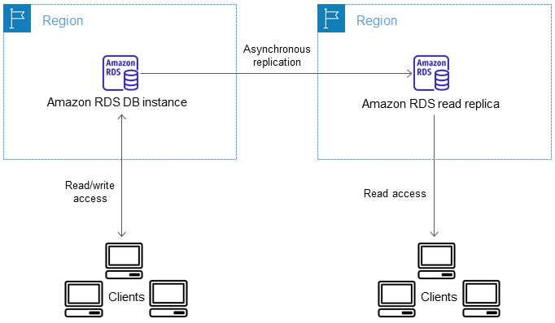
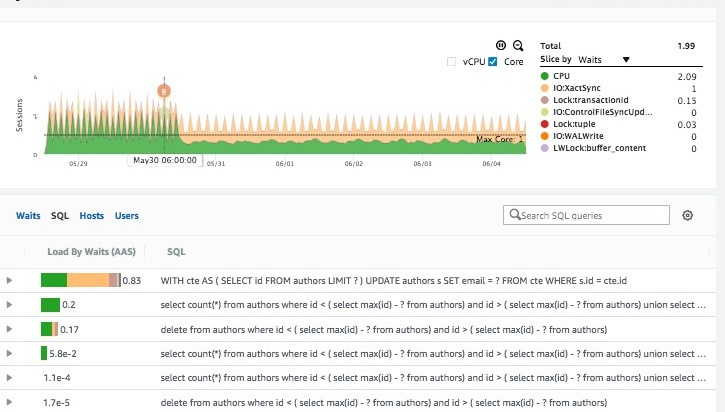
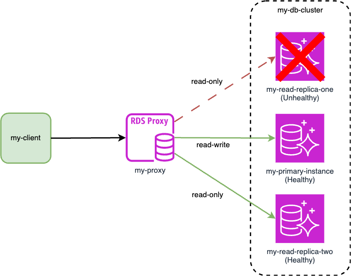
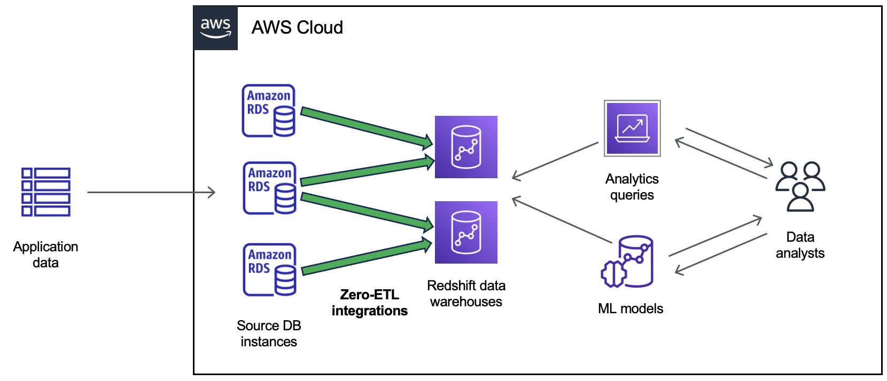

# Amazon RDS

## 1. Introduction

Amazon RDS is a fully managed service designed to simplify the setup, operation, and scaling of a relational database in the cloud. By automating time‐consuming administrative tasks such as hardware provisioning, database software patching, backups, and recovery, Amazon RDS lets you focus on your applications and business logic rather than database maintenance.

## 2. Supported Database Engines

Amazon RDS supports multiple popular database engines, including:

- **Amazon Aurora** – A MySQL- and PostgreSQL-compatible engine built for high performance and availability.
- **MySQL**
- **PostgreSQL**
- **MariaDB**
- **Oracle**
- **Microsoft SQL Server**

Each engine comes with its own set of features and configurations, so you can choose the one that best fits your application needs.

## 3. Amazon RDS Features

Amazon RDS offers a lot of features, but not all features are available in every DB engine. The following table lists each feature and available RDS DB engine. 

| Feature                                                          | RDS for Db2 | RDS for MariaDB | RDS \nfor MySQL | RDS for Oracle | RDS for PostgreSQL | RDS for SQL Server |
| ---------------------------------------------------------------- | ----------- | --------------- | ----------------- | -------------- | ------------------ | ------------------ |
| Blue/Green Deployments                                           | ❌           | ✅               | ✅                 | ❌              | ✅                  | ❌                  |
| Cross-Region automated backups                                   | ✅           | ✅               | ✅                 | ✅              | ✅                  | ✅                  |
| Cross-Region read replicas                                       | ❌           | ✅               | ✅                 | ✅              | ✅                  | ✅                  |
| Database activity streams                                        | ❌           | ❌               | ❌                 | ✅              | ❌                  | ✅                  |
| Dual-stack mode                                                  | ❌           | ✅               | ✅                 | ✅              | ✅                  | ✅                  |
| Export Snapshot to Amazon S3                                     | ❌           | ✅               | ✅                 | ❌              | ✅                  | ❌                  |
| AWS Identity and Access Management (IAM) database authentication | ❌           | ✅               | ✅                 | ❌              | ✅                  | ❌                  |
| Kerberos authentication                                          | ✅           | ❌               | ✅                 | ✅              | ✅                  | ✅                  |
| Multi-AZ DB clusters                                             | ❌           | ❌               | ✅                 | ❌              | ✅                  | ❌                  |
| Performance Insights                                             | ❌           | ✅               | ✅                 | ✅              | ✅                  | ✅                  |
| RDS Custom                                                       | ❌           | ❌               | ❌                 | ✅              | ❌                  | ✅                  |
| RDS Proxy                                                        | ❌           | ✅               | ✅                 | ❌              | ✅                  | ✅                  |
| Secrets Manager integration                                      | ✅           | ✅               | ✅                 | ✅              | ✅                  | ✅                  |

### 3.1. Blue/Green Deployments

Blue/Green deployments enable you to minimize downtime and reduce risk during database version upgrades or application changes. With this approach, you create two nearly identical environments—“blue” (your current production) and “green” (the new version). You can validate and test changes on the green environment without impacting the production blue environment. Once the green environment is verified, a quick switch can direct production traffic to the new version. This reduces the window of potential disruptions and provides an easy rollback option if issues arise. 

For RDS, blue/green deployments often leverage features such as snapshot-based cloning or the use of separate DB clusters, allowing you to perform in-place testing and then redirect your workload when ready. This strategy is particularly valuable for mission-critical databases where uptime and data integrity are paramount.  

### 3.2. Cross-Region Automated Backups

Cross-Region automated backups extend your disaster recovery and data protection strategies by automatically copying your RDS automated backups to another AWS Region. This feature helps ensure that your backups remain available even in the event of a regional disruption. The copied backups can be used to restore your database in an alternate Region, significantly reducing the Recovery Time Objective (RTO) during a regional outage.  

AWS RDS manages these backups seamlessly—once enabled, it periodically transfers your backup data to the designated Region. This offsite backup solution not only safeguards your data against localized failures but also helps meet compliance and regulatory requirements for data residency and protection.

### 3.3. Cross-Region Read Replicas

Cross-Region read replicas allow you to replicate your RDS databases asynchronously into a different AWS Region. They serve several purposes: reducing read latency for globally distributed users, enhancing application performance by offloading read traffic, and providing a disaster recovery solution. In the event of a regional disruption, a read replica can be promoted to become the new primary database, helping to maintain business continuity.

This feature uses the native replication capabilities of your chosen database engine and integrates with AWS tools like AWS Database Migration Service (DMS) if needed. By enabling cross-region replication, you gain both performance benefits for end users and an extra layer of protection against regional outages.
### 3.4. Database Activity Streams

Database activity streams provide a near-real-time data stream of all activity against your RDS instance. This feature is designed to help you monitor, audit, and respond to database activity by streaming a detailed log of SQL operations, changes, and connection events. With activity streams, you can enhance your security posture by detecting anomalies, meeting compliance requirements, and performing forensic analysis after a security incident.  

Activity streams integrate with AWS services such as Amazon CloudWatch and third-party security information and event management (SIEM) tools. The data is cryptographically signed, ensuring the integrity and non-repudiation of the captured activity, which is especially useful for environments with strict regulatory requirements.

### 3.5. Dual-Stack Mode

Dual-stack mode in Amazon RDS refers to the ability of your database instance to support both IPv4 and IPv6 addressing simultaneously. This capability simplifies network management and future-proofs your environment as IPv6 adoption increases. Dual-stack connectivity allows you to serve a wider variety of clients and ensures that your applications can communicate seamlessly regardless of the IP protocol used by your users or services.  

By enabling dual-stack mode, you also benefit from improved security and simplified network integration in environments that require both addressing schemes. This feature is managed via the Amazon VPC configuration for your RDS instance, ensuring that network settings comply with your organizational policies.

### 3.6. Export Snapshots to S3

Exporting snapshots to Amazon S3 enables you to extract your RDS snapshots and convert them into an open format (such as Apache Parquet) for further analysis or integration with other AWS analytics services. Once exported, you can use tools like Amazon Athena or Amazon Redshift Spectrum to query the snapshot data without impacting the performance of your live database instance.  

This feature provides flexibility in data management and allows you to retain historical data in a cost-effective manner. It’s especially useful for compliance, long-term archival, or analytical use cases where you want to combine historical database states with other data sources in your data lake.

### 3.7. IAM Database Authentication

IAM database authentication allows you to authenticate to your RDS database instance using AWS Identity and Access Management (IAM) credentials rather than traditional database passwords. With IAM authentication, you can centrally manage database access through AWS IAM policies, which streamlines user management and enhances security by avoiding the need to store static passwords.  

This feature supports fine-grained access control and is particularly useful in environments where developers or applications need temporary or role-based access to the database. It also integrates with AWS services such as AWS Secrets Manager to further simplify credential management.  

### 3.8. Kerberos Authentication

Kerberos authentication in Amazon RDS provides a secure method for verifying user identities using the industry-standard Kerberos protocol. This feature is particularly beneficial for organizations that require integration with existing enterprise authentication systems, such as Microsoft Active Directory or other Kerberos-based directory services.  

By using Kerberos authentication in Amazon RDS, you can support external authentication of database users using Kerberos and Microsoft Active Directory. Using Kerberos and Active Directory provides the benefits of single sign-on and centralized authentication of database users.

### 3.9. Multi-AZ DB Clusters

Multi-AZ deployments can have one standby or two standby DB instances. When the deployment has one standby DB instance, it's called a _Multi-AZ DB instance deployment_. A Multi-AZ DB instance deployment has one standby DB instance that provides failover support, but doesn't serve read traffic. When the deployment has two standby DB instances, it's called a _Multi-AZ DB cluster deployment_. A Multi-AZ DB cluster deployment has standby DB instances that provide failover support and can also serve read traffic.

### 3.10. Performance Insights

Performance Insights is a monitoring and tuning tool that helps you analyze the performance of your RDS database. It provides a dashboard that visualizes key performance metrics such as database load, wait states, and query performance over time. With Performance Insights, you can identify performance bottlenecks and quickly pinpoint the underlying causes of database issues.

### 3.11. RDS Custom

Amazon RDS Custom brings the benefits of Amazon RDS to a market that can't easily move to a fully managed service because of customizations that are required with third-party applications. Amazon RDS Custom saves administrative time, is durable, and scales with your business.

If you need the entire database and operating system to be fully managed by AWS, we recommend Amazon RDS. If you need administrative rights to the database and underlying operating system to make dependent applications available, Amazon RDS Custom is the better choice. If you want full management responsibility and simply need a managed compute service, the best option is self-managing your commercial databases on Amazon EC2.

To deliver a managed service experience, Amazon RDS doesn't let you access the underlying host. Amazon RDS also restricts access to some procedures and objects that require high-level privileges. However, for some applications, you might need to perform operations as a privileged operating system (OS) user.

For example, you might need to do the following:
- Install custom database and OS patches and packages.
- Configure specific database settings.
- Configure file systems to share files directly with their applications.

Previously, if you needed to customize your application, you had to deploy your database on-premises or on Amazon EC2.  

### 3.12. Amazon RDS Proxy

By using Amazon RDS Proxy, you can allow your applications to pool and share database connections to improve their ability to scale. RDS Proxy makes applications more resilient to database failures by automatically connecting to a standby DB instance while preserving application connections. By using RDS Proxy, you can also enforce AWS Identity and Access Management (IAM) authentication for databases, and securely store credentials in AWS Secrets Manager.

Using RDS Proxy, you can handle unpredictable surges in database traffic. Otherwise, these surges might cause issues due to oversubscribing connections or new connections being created at a fast rate. RDS Proxy establishes a database connection pool and reuses connections in this pool. This approach avoids the memory and CPU overhead of opening a new database connection each time. To protect a database against oversubscription, you can control the number of database connections that are created.

RDS Proxy queues or throttles application connections that can't be served immediately from the connection pool. Although latencies might increase, your application can continue to scale without abruptly failing or overwhelming the database. If connection requests exceed the limits you specify, RDS Proxy rejects application connections (that is, it sheds load). At the same time, it maintains predictable performance for the load that RDS can serve with the available capacity.

You can reduce the overhead to process credentials and establish a secure connection for each new connection. RDS Proxy can handle some of that work on behalf of the database.

RDS Proxy is fully compatible with the engine versions that it supports. You can enable RDS Proxy for most applications with no code changes.

### 3.13. Secrets Manager Integration

With AWS Secrets Manager, you can replace hard-coded credentials in your code, including database passwords, with an API call to Secrets Manager to retrieve the secret programmatically.

When you specify that RDS manages the master user password in Secrets Manager, RDS generates the password and stores it in Secrets Manager. You can interact directly with the secret to retrieve the credentials for the master user. You can also specify a customer managed key to encrypt the secret, or use the KMS key that is provided by Secrets Manager.

RDS manages the settings for the secret and rotates the secret every seven days by default. You can modify some of the settings, such as the rotation schedule. If you delete a DB instance that manages a secret in Secrets Manager, the secret and its associated metadata are also deleted.

### 3.14. Zero-ETL Integrations

An Amazon RDS zero-ETL integration with Amazon Redshift enables near real-time analytics and machine learning (ML) using Amazon Redshift on petabytes of transactional data from RDS. It's a fully managed solution for making transactional data available in Amazon Redshift after it is written to an RDS database. _Extract, transform,_ and _load_ (ETL) is the process of combining data from multiple sources into a large, central data warehouse.

A zero-ETL integration makes the data in your RDS database available in Amazon Redshift in near real-time. Once that data is in Amazon Redshift, you can power your analytics, ML, and AI workloads using the built-in capabilities of Amazon Redshift, such as machine learning, materialized views, data sharing, federated access to multiple data stores and data lakes, and integrations with Amazon SageMaker AI, Amazon QuickSight, and other AWS services.

To create a zero-ETL integration, you specify an RDS database as the _source_, and an Amazon Redshift data warehouse as the _target_. The integration replicates data from the source database into the target data warehouse.

The following diagram illustrates this functionality:

## 4. Storage

Amazon RDS storage is the foundation that supports your relational database workloads in the AWS Cloud. When you create an RDS DB instance, the service provisions block-level storage using Amazon Elastic Block Store (EBS) volumes. You have a choice of storage types to match your performance and cost requirements. The primary options include:

- **Provisioned IOPS SSD Storage (io1 and io2)**: These volumes are optimized for I/O-intensive, transactional workloads that demand consistently low latency and high throughput. They allow you to specify an exact IOPS rate, making them ideal for production environments where performance consistency is critical.

- **General Purpose SSD Storage (gp2 and gp3)**: These volumes offer a balance between price and performance. They are cost-effective and provide baseline IOPS that scale with the volume size—making them well-suited for a broad range of applications, especially in development and testing scenarios. The newer gp3 volumes also allow you to independently provision IOPS and throughput.

- **Magnetic Storage**: Primarily supported for backward compatibility, magnetic storage is an older option that is generally not recommended for new deployments due to its lower performance compared to SSD-based options.

Additionally, RDS offers features like storage autoscaling, which automatically increases your allocated storage when available space drops below a set threshold. However, once storage is allocated or autoscaled, it cannot be decreased. These storage options and features allow you to tailor your database environment for optimal performance, scalability, and cost-effectiveness.

## 5. Monitoring

Below is a list of the primary monitoring tools and features available for Amazon RDS:

1. **Amazon CloudWatch Metrics**  
    Amazon RDS automatically sends metrics to CloudWatch every minute. These metrics include CPU utilization, storage, IOPS, network throughput, and more. CloudWatch allows you to create alarms and dashboards so you can monitor the health and performance of your DB instances in near real‑time.
    
2. **Enhanced Monitoring**  
    This feature provides detailed, real-time operating system-level metrics for your RDS instance. Enhanced Monitoring goes beyond standard CloudWatch metrics by delivering additional insights such as OS process details, file system utilization, and detailed I/O statistics—helping you diagnose performance issues that might not be visible at the database engine level.
    
3. **Performance Insights**  
    Performance Insights is designed to help you analyze database load and identify performance bottlenecks. With a simple dashboard, you can visualize the load over time and drill down into specific SQL queries or wait events, making it easier to pinpoint and resolve performance issues.
    
4. **Event Notifications**  
    Amazon RDS publishes events (such as failovers, maintenance actions, or backup completions) that can be subscribed to via Amazon SNS. These notifications help you keep track of important changes or issues in your DB instance without having to constantly monitor logs or metrics.
    
5. **Database Log Files**  
    You can access, view, and export the database log files (e.g., error logs, slow query logs) through the RDS console. These logs can also be pushed to CloudWatch Logs for long-term storage and further analysis, providing additional context for troubleshooting and auditing.
    
6. **AWS CloudTrail**  
    Although primarily used for auditing API calls, CloudTrail records actions taken on your RDS instances. This can help you monitor changes, track user activity, and ensure compliance with your security policies.

## 6. Data Encryption

Amazon RDS encrypts your database resources to protect data at rest and in transit with minimal impact on performance. When you create an encrypted DB instance, RDS uses the industry‐standard AES-256 algorithm to encrypt the underlying storage that holds your database data, automated backups, snapshots, and read replicas. This encryption is managed through AWS Key Management Service (KMS), which can utilize either AWS-managed keys or customer-managed keys according to your security policies. Once encryption is enabled at creation time, all data written to disk is automatically encrypted and, importantly, cannot be later disabled. This seamless integration means that your applications can continue to interact with the database as usual while RDS transparently handles encryption and decryption operations.

In addition to encrypting data at rest, Amazon RDS also protects data in transit. For example, when replicating data between the primary DB instance and its read replicas—even across AWS Regions—the data is encrypted, ensuring that sensitive information is secure as it moves across the network. This layered security approach, often referred to as envelope encryption, involves encrypting your data with a data key and then protecting that key with a master key managed by AWS KMS. Together, these measures help you meet compliance requirements and safeguard your data without requiring any modifications to your database client applications.  

### 6.1. Transforming Unencrypted to Encrypted Databases

An unencrypted RDS instance can become encrypted via snapshots. You create a snapshot of the unencrypted instance, then copy the snapshot with encryption. Finally, you restore from the encrypted snapshot to complete the process.
## 7. Conclusion

Amazon RDS offers a robust, scalable, and secure managed database solution that minimizes the operational overhead of running relational databases in the cloud. By leveraging its automated features, high availability options, and flexible pricing, organizations can rapidly deploy and scale databases while ensuring high performance and security

For further detailed information, please consult the official [Amazon RDS documentation](https://docs.aws.amazon.com/rds/).
