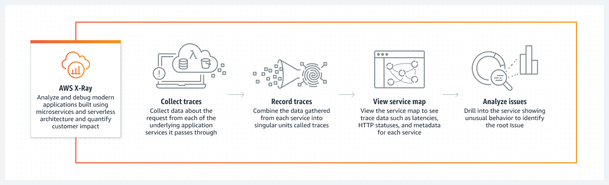
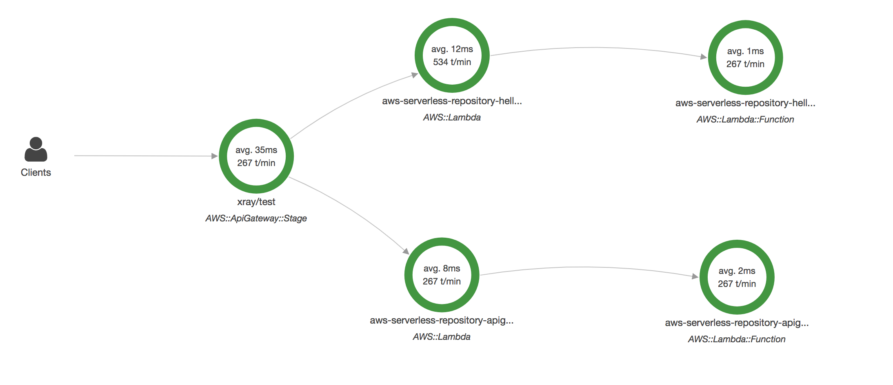

# AWS X-Ray

## 1. Introduction

AWS X‑Ray is a distributed tracing service designed to help developers analyze and debug production and distributed applications. It provides an end‑to‑end view of requests as they travel through an application—from the client to backend services—making it easier to identify performance bottlenecks, errors, and other issues in microservices or serverless architectures. AWS X‑Ray collects data from your application (via SDKs and agents), processes it into traces, and then displays the data in the form of a service map and detailed trace timelines.

## 2. Key Features

- **End‑to‑End Tracing:**  
    AWS X‑Ray records data for every request served by your application. It aggregates this data into a “trace” that shows the complete journey of a request.
- **Service Map & Visualizations:**  
    It automatically generates a service graph (or map) that visually represents your application’s components and how they interact. This helps quickly pinpoint problematic areas in your architecture. Below you can see an example Service Map:
    
- **Segmentation & Subsegments:**  
    The service uses “segments” to capture data from individual components. Within segments, “subsegments” break down work into more granular parts (for example, a call to an AWS service or a database query).
- **Annotations & Metadata:**  
    You can attach key‑value pairs (annotations) and more detailed non‑indexed data (metadata) to traces, enabling custom filtering and analysis.
- **Sampling:**  
    To reduce overhead while still capturing representative data, X‑Ray applies configurable sampling rules that record a fraction of incoming requests.
- **Integration & Automatic Instrumentation:**  
    AWS X‑Ray integrates seamlessly with AWS services such as Lambda, EC2, ECS, Elastic Beanstalk, API Gateway, and more. AWS provides SDKs for multiple languages (Java, .NET, Node.js, Python, Ruby, Go) that support both automatic and manual instrumentation.
- **Insights & Anomaly Detection:**  
    X‑Ray uses built‑in insights powered by machine learning to automatically detect anomalies and performance issues without requiring complex setup.  

## 3. How AWS X‑Ray Works

### 3.1. Traces, Segments, and Subsegments

- **Traces:**  
    A trace represents the complete journey of a single request through your application. It groups together all the segments recorded for that request.
- **Segments:**  
    When a service (such as a web server or Lambda function) processes a request, it sends a segment to X‑Ray containing details such as the start and end times, the host information, and any errors encountered.
- **Subsegments:**  
    Within a segment, subsegments capture more granular details such as calls to external services, database queries, or custom functions. This layered approach helps isolate where latency or failures occur.  
### 3.2. Sampling and Trace Headers

- **Sampling:**  
    AWS X‑Ray does not record every request; it applies sampling rules (by default recording the first request each second and a percentage of subsequent requests) to balance between detailed insight and resource efficiency.
- **Trace Headers:**  
    When a request is initiated, a trace ID is generated and propagated through the system via headers (typically named `X-Amzn-Trace-Id`). This allows AWS X‑Ray to correlate segments from different services into a single trace.  

### 3.3. Real-World Example

Imagine you run an online store. When a customer clicks on a product, here’s what happens with AWS X‑Ray behind the scenes:

1. **Customer Request:**  
    The customer’s browser sends an HTTP request to your web server to view a product.
    
2. **Web Server Segment:**  
    When the web server receives this request, it starts a segment in X‑Ray. This segment records basic details like the start time, the endpoint accessed, and any errors if they occur.
    
3. **Calling the Product Service (Subsegment):**  
    The web server then calls a separate microservice (the product service) to retrieve product details. This call is recorded as a subsegment within the original segment. The subsegment details how long the call took and whether it encountered any issues.
    
4. **Database Query (Another Subsegment):**  
    The product service may need to query a database for more detailed information about the product. This database call creates yet another subsegment that captures its own timing and error information.
    
5. **Trace Aggregation:**  
    AWS X‑Ray automatically combines these segments and subsegments into a single “trace” that shows the entire journey of the customer’s request—from the browser, through the web server and microservices, down to the database.
    
6. **Service Map Visualization:**  
    Using the aggregated trace, X‑Ray generates a visual service map. This map shows the interconnected components (web server, product service, database) and highlights where any delays or errors occurred.
    

For example, if the database query is slow, you’ll see a longer subsegment for that call on the timeline, helping you pinpoint exactly where to improve performance.
## 4. Instrumentation & Integrations

- **SDKs & Agents:**  
    AWS offers SDKs for multiple programming languages, enabling you to automatically or manually instrument your applications. The SDKs capture details from incoming and outgoing requests, record annotations and metadata, and send the data to a local X‑Ray daemon which then batches and uploads the trace data.
- **AWS Service Integrations:**  
    Many AWS services (such as AWS Lambda, API Gateway, and ECS) come with built‑in support for X‑Ray. For instance, when you enable tracing in AWS Lambda, the X‑Ray daemon runs automatically within the Lambda execution environment.
- **Custom Instrumentation:**  
    You can also add custom subsegments to trace specific parts of your code, which is particularly useful for complex logic or third‑party HTTP calls.
- **OpenTelemetry Support:**  
    AWS X‑Ray supports OpenTelemetry, allowing you to use industry‑standard APIs and agents to collect traces that can be sent to X‑Ray as well as other observability tools.  

## 5. Pricing and Limits

AWS X‑Ray’s pricing is based on the number of traces recorded, scanned, and retrieved. Key points include:

- **Free Tier:**  
    There is a monthly free tier that provides a set number of trace retrievals and scans.
- **Billing:**  
    Beyond the free tier, traces are billed in batches (per million traces), and additional charges may apply for using X‑Ray Insights.
- **Retention:**  
    Traces are retained for 30 days, allowing you to analyze historical performance and incidents.
- **Trace Size Limit:**  
    There is a maximum trace size (e.g., 500 KB per trace), which is important to consider when adding annotations and metadata.  

## 6. Use Cases

- **Debugging & Root Cause Analysis:**  
    Quickly locate errors and performance bottlenecks in complex, distributed systems without having to sift through logs manually.
- **Performance Optimization:**  
    Identify latency issues and inefficient calls by analyzing detailed timing information in traces.
- **Operational Monitoring:**  
    Use service maps and automated insights to monitor the health of your application and respond rapidly to incidents.
- **Cost Optimization:**  
    Understand the performance characteristics of your distributed systems to optimize resource usage and reduce operational costs.
## 7. Conclusion

AWS X‑Ray is an essential tool for modern application monitoring and debugging in distributed systems. By capturing granular data about each request and providing powerful visualizations and insights, X‑Ray enables rapid root cause analysis and performance optimization. Its seamless integration with various AWS services, support for multiple programming languages, and flexible instrumentation options make it a valuable component in any AWS‑based architecture.

For more comprehensive details, please refer to the [official documentation](https://docs.aws.amazon.com/xray/latest/devguide/aws-xray.html).

