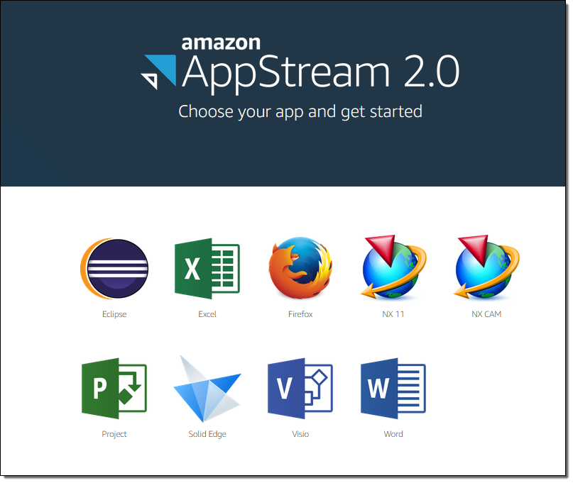

# Amazon AppStream 2.0

## 1. Introduction

**Amazon AppStream 2.0** is a fully managed application streaming service that lets you deliver desktop applications to users on any device without rewriting the software. For example, imagine your company uses a high-end photo editing application that typically requires a powerful Windows PC. Instead of installing and updating this software on every employee’s computer, you create an AppStream 2.0 image with the photo editor pre-installed. Then you set up a fleet of streaming instances running that image.

When an employee needs to edit photos, they simply log in through a web browser or the dedicated AppStream 2.0 client. A streaming instance is launched in the cloud that runs the photo editing application. The employee interacts with the application just as if it were installed on their own computer—even though all the heavy processing happens on AWS. This approach not only saves on hardware costs but also centralizes updates and improves security by keeping data in the cloud.

## 2. Key Concepts & Architecture

AppStream 2.0’s architecture is built around a few core components:

- **Image**: A preconfigured template that includes an operating system (Windows Server or Amazon Linux 2) and your applications. Once created, an image can be copied or shared within a region.
    
- **Image Builder**: A virtual machine you launch to install, test, and configure applications. Once ready, you use it to create a final image.
    
- **Fleet**: A group of streaming instances (EC2 instances) that run your chosen image. Each user’s session runs on a dedicated instance. Fleets can be configured in different modes—Always-On, On-Demand, or Elastic—to balance between performance and cost.
    
- **Stack**: Combines a fleet with user access policies and persistent storage configurations. A stack is what your users actually connect to when streaming an application.
    
- **Streaming Instance**: The individual instance that is provisioned to a user’s session. After the session ends, the instance is terminated, ensuring that user data does not persist on the device.

## 3. Fleet Auto Scaling

AppStream 2.0 supports multiple fleet types:
    
- **Always-On** fleets are always running, providing instant access but incurring continuous charges.
- **On-Demand** fleets start when a user connects and are charged only for active sessions plus a nominal stopped fee when idle.
- **Elastic** fleets support application streaming from app blocks (VHDs) with per-second billing.

Scaling policies—such as scheduled scaling, step scaling, or target tracking—adjust fleet capacity automatically based on real-time usage and CloudWatch metrics (like capacity utilization and insufficient capacity errors).  

## 4. Client Access & Streaming Experience

- **Browser-Based Access**:  
    AppStream 2.0 supports streaming directly through any HTML5-capable web browser, which simplifies access because no additional software installation is needed.
    
- **Native Client**:  
    For enhanced functionality—such as support for multiple monitors (up to 4K), USB device redirection (e.g. 3D mice, webcams), local drive and printer redirection, and improved keyboard shortcut support—AWS provides dedicated AppStream 2.0 clients for Windows (and macOS).  

- **Streaming Protocol**:  
    The underlying streaming is powered by Amazon DCV, which adjusts to network conditions in real time to deliver a smooth and responsive user experience.

## 5. Conclusion

For more comprehensive details, please refer to the [official documentation](https://docs.aws.amazon.com/appstream2/).