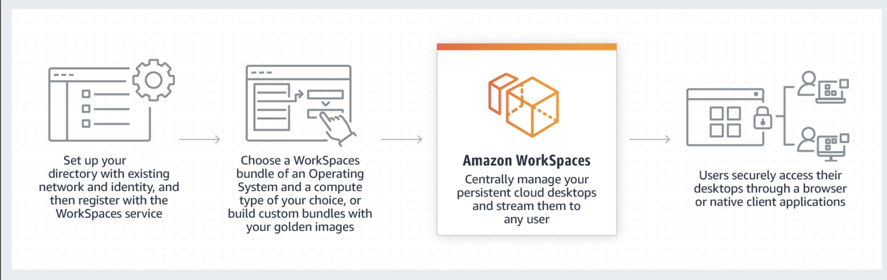

# Amazon WorkSpaces

## 1. Introduction

**Amazon WorkSpaces** is a fully managed, secure virtual desktop service that enables organizations to provision Windows or Linux desktops in the AWS Cloud quickly. It eliminates the need to purchase, provision, and manage hardware while delivering a persistent desktop experience that users can access from anywhere, on a wide range of devices.

Key aspects include:

- **Managed Service:** AWS handles infrastructure provisioning, patching, and maintenance.
- **Flexibility:** Supports persistent desktops (each user gets their own desktop) as well as pooled desktops (for shared use cases).
- **Scalability:** Quickly scale from one to thousands of desktops using the AWS Management Console, CLI, or APIs.

## 2. Key Features

- **Multi-OS Support:**
    - **Windows Desktops:** Including BYOL (Bring Your Own License) options for Windows 10/11 when needed.
    - **Amazon Linux Desktops:** Optimized for Linux users with persistent home directories.

- **Persistent Storage:**
    - Each WorkSpace comes with two volumes: a system (root) volume and a user volume.
    - Snapshots of user data are taken automatically, ensuring data recovery and persistence.

- **Flexible Billing Models:**    
    - **AlwaysOn:** Fixed monthly pricing for constant availability.
    - **AutoStop:** Hourly metering that automatically stops the desktop after inactivity, reducing costs.

- **Secure Access:**    
    - **Encryption:** Supports encryption in transit (using HTTPS and AES-encrypted PCoIP sessions) and encryption at rest via AWS KMS.
    - **Access Controls:** Integrates with AWS Directory Service (via AD Connector, AWS Managed Microsoft AD, or Simple AD) and supports MFA and IP access control groups.
    - **Trusted Devices:** Optionally restrict desktop access based on client device certificates.

- **Client Support:**    
    - Native WorkSpaces clients are available for Windows, macOS, Linux, iPad, Android, Chromebook, and even via web browsers.

## 3. Architecture & Deployment

- **Virtual Private Cloud (VPC):**
    - WorkSpaces run within an Amazon VPC configured with at least two subnets (across different Availability Zones) to ensure high availability and fault tolerance.
    - Customers have full control over network settings, including security groups and routing.

- **Directory Services Integration:**
    - **AD Connector:** Proxies authentication requests to your existing on‑premises Active Directory.
    - **AWS Managed Microsoft AD/Simple AD:** Provides a cloud-managed directory service for managing users and policies.

- **Streaming Protocols:**
    - WorkSpaces use adaptive streaming protocols (PCoIP for Windows and Amazon DCV for Linux) that optimize desktop rendering based on network conditions.
    - Protocols are designed to deliver a high-quality user experience even over less-than-ideal networks.

- **Automation & Management:**
    - Use AWS CLI, APIs, and CloudFormation to automate provisioning and management.
    - Self-service portals can empower end users to perform routine tasks like restarting or rebuilding their WorkSpaces.

## 4. Use Cases & Benefits

- **Remote Work & BYOD:**
    - Enables employees to securely access a consistent desktop environment from any location or device.
- **Enterprise Scalability:**
    - Quickly scale virtual desktop deployments without significant capital expenditure.
- **Cost Efficiency:**
    - Pay-as-you-go pricing models and auto-stop options help reduce costs when desktops are idle.
- **Improved Security:**
    - Centralized management of desktops with robust security controls, encryption, and compliance features.

## 5. Conclusion

Amazon WorkSpaces offers a highly secure, scalable, and flexible virtual desktop solution built on AWS’s global infrastructure. By leveraging official best practices and comprehensive documentation, organizations can deploy cost‑effective and resilient cloud desktops that support diverse user needs—from full‑time remote workers to task‑specific pooled environments.

For further details, please refer to the [official resources](https://docs.aws.amazon.com/workspaces/).