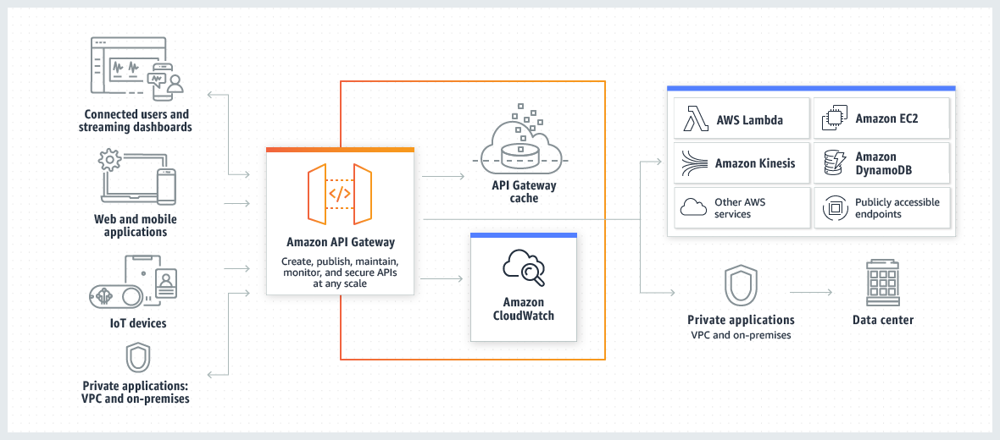

# Amazon API Gateway

## 1. Introduction

Amazon API Gateway is a fully managed service that enables developers to **create, publish, maintain, monitor, and secure APIs at any scale**. It serves as the “front door” for applications to access data, business logic, or functionality from back-end services such as AWS Lambda functions, containerized microservices, or traditional web applications. It is designed to handle hundreds of thousands of concurrent API calls while offloading tasks like traffic management, authorization, monitoring, and version management.

## 2. Architecture of API Gateway

The following diagram shows API Gateway architecture.

This diagram illustrates how the APIs you build in Amazon API Gateway provide you or your developer customers with an integrated and consistent developer experience for building AWS serverless applications. API Gateway handles all the tasks involved in accepting and processing up to hundreds of thousands of concurrent API calls. These tasks include traffic management, authorization and access control, monitoring, and API version management.

API Gateway acts as a "front door" for applications to access data, business logic, or functionality from your backend services, such as workloads running on Amazon Elastic Compute Cloud (Amazon EC2), code running on AWS Lambda, any web application, or real-time communication applications.

## 3. Supported API Types

API Gateway supports several API styles to meet a variety of use cases:
### 3.1. REST APIs

REST APIs offer a robust and versatile approach to building web services by organizing endpoints around resources and standard HTTP methods. Each resource, represented by a unique URL path, can be manipulated with methods such as GET, POST, PUT, PATCH, and DELETE. This resource-based structure makes it straightforward to model real-world data entities and actions—allowing, for example, a POST to `/incomes` to add a new income record or a GET from `/expenses` to retrieve expense data. REST APIs also facilitate detailed integration with backend services like AWS Lambda, DynamoDB, or other HTTP endpoints, while abstracting the underlying complexities from the client.

These APIs are ideal when you need comprehensive API management capabilities, including request/response transformations, detailed error handling, and schema validations. They are especially beneficial in scenarios that require rich documentation, SDK generation, and precise control over the interactions between the frontend and backend. In applications where the business logic is closely tied to specific resource operations, such as managing financial data or user profiles, REST APIs provide the necessary granularity and integration flexibility.

### 3.2. HTTP APIs

HTTP APIs provide a streamlined, high-performance alternative to REST APIs, optimized for lower latency and cost efficiency. They simplify API development by focusing on core functionalities and integrating seamlessly with AWS Lambda functions or any publicly routable HTTP endpoint. With support for modern web security standards like OpenID Connect and OAuth 2.0, as well as built-in features such as automatic deployments and cross-origin resource sharing (CORS), HTTP APIs are well-suited for applications that demand speed without sacrificing essential security and accessibility.

When the primary requirements are rapid response times and minimal processing overhead, HTTP APIs are the preferred choice. They are perfect for scenarios where the API's role is to quickly forward requests to backend services without the need for extensive request/response transformations or complex routing rules. For instance, if you’re building a serverless backend that handles real-time user interactions or data retrieval with minimal latency, leveraging HTTP APIs can result in a more efficient and cost-effective solution.

### 3.3. WebSocket APIs

WebSocket APIs enable real-time, bidirectional communication between clients and servers by maintaining a persistent connection. This allows both parties to send messages at any time, making it an excellent choice for interactive applications that require immediate data exchanges. Unlike the traditional request-response model, WebSocket APIs support continuous data streams, which is crucial for applications such as live chats, real-time dashboards, or collaborative tools where the delay of polling would hinder performance.

These APIs are particularly advantageous when you need to build systems that push live updates to users, ensuring that information is delivered as soon as it is available. For example, a chat application can instantly broadcast messages to all connected clients, and a real-time stock ticker can update users with the latest market information without repeated HTTP requests. By leveraging WebSocket APIs, developers can create scalable, responsive systems that efficiently handle multiple concurrent connections and dynamic, real-time interactions.

#### 3.3.1. Connections

- **Connection IDs:** When a client establishes a WebSocket connection, API Gateway assigns a unique connection ID. This ID is used for subsequent interactions and is essential for managing state externally (for example, by storing connection metadata in a database).
- **Lifecycle Management:** API Gateway manages the lifecycle of each connection, invoking specific routes when a client connects or disconnects.
#### 3.3.2. Routes and Route Selection

- **Built-in Routes:**
    - **$connect:** Triggered when a client initiates a connection. Often used to perform initial authentication or setup.
    - **$disconnect:** Called when a client disconnects, allowing for cleanup actions.
    - **$default:** Catches any message that doesn’t match a specific custom route.
- **Custom Routes:**  
    Developers can define additional routes based on message content. Each route is determined by a _route key_—a string that API Gateway matches against an incoming message using a routing selection expression. This provides fine-grained control over message processing.  

## 4. Endpoint Types

API Gateway lets you choose how your API is accessed by defining its endpoint type. In simple terms, an endpoint type determines the hostname and network routing for your API. Depending on your use case and where your clients are located, you can choose one of the following:

- **Edge-optimized:** Designed to serve REST API requests from clients distributed around the world.
- **Regional:** Ideal for APIs whose clients reside in—or near—a single AWS region.
- **Private:** Restricts API access to resources within your Amazon Virtual Private Cloud (VPC).

It’s important to note that these endpoint types are supported differently between the two API offerings:

- **REST APIs** support all three types (Edge-optimized, Regional, and Private).
- **HTTP APIs** support only the Regional endpoint type.

### 4.1. Edge-optimized API Endpoints

Edge-optimized endpoints route incoming requests through the nearest Amazon CloudFront Point of Presence (POP), reducing latency for geographically dispersed users. This setup optimizes performance by leveraging CloudFront’s global distribution. However, edge-optimized endpoints are available exclusively for REST APIs and are not supported for HTTP APIs. Additionally, when you assign a custom domain name to an edge-optimized REST API, it applies globally across all regions.

### 4.2. Regional API Endpoints

Regional endpoints are intended for scenarios where your API clients are located within the same region as the deployed API. This minimizes connection overhead and is particularly beneficial when running applications on AWS resources such as EC2 instances within the same region. For Regional endpoints:

- **REST APIs** support them, offering the flexibility to configure custom domain names that are specific to each region (even though you can reuse the same domain name across multiple regions if needed).
- **HTTP APIs** also use Regional endpoints exclusively.
- They pass all HTTP header names through without alteration, ensuring that your client’s headers are preserved.

By combining Regional endpoints with your own CloudFront distribution (if desired), you can still optimize delivery to clients across various geographic locations without using the built-in CloudFront distributions associated with edge-optimized endpoints.

### 4.3. Private API Endpoints

Private endpoints are designed for internal APIs that should only be accessible from within your VPC. When you create a private REST API, you do so by setting up an interface VPC endpoint (an Elastic Network Interface within your VPC), which restricts API access to your private network. This endpoint type is not available for HTTP APIs. Like Regional endpoints, private endpoints forward all header names as provided, maintaining the integrity of HTTP requests.

## 5. Security

The following table summarizes key Security features and their support status across REST APIs and HTTP APIs:

| Security features                       | REST API | HTTP API |
| --------------------------------------- | -------- | -------- |
| Mutual TLS authentication               | Yes      | Yes      |
| Certificates for backend authentication | Yes      | No       |
| AWS WAF                                 | Yes      | No       |

### 5.1. Mutual TLS Authentication

Mutual TLS authentication is a robust security mechanism that establishes a two-way verification process. Both the client and the server must present X.509 certificates to confirm their identities, ensuring that only trusted parties can initiate communication. This protocol is especially critical for scenarios such as Internet of Things (IoT) networks and business-to-business (B2B) interactions where strong identity assurance is required.

Within API Gateway, mutual TLS is seamlessly integrated. When clients connect using mutual TLS, API Gateway forwards the presented certificates to Lambda authorizers and backend integrations for further processing. To implement this feature, you need to use a custom domain name, provision at least one certificate via AWS Certificate Manager, and set up a truststore in Amazon S3. Additionally, disabling the default `execute-api` endpoint ensures that clients access your API exclusively through your custom domain, reinforcing security.

**Real-World Use Cases:**
- **IoT Deployments:** Devices authenticate securely using certificates before transmitting data.
- **B2B Integrations:** Partners verify each other’s identities to exchange sensitive business data securely.

### 5.2. Certificates for Backend Authentication

Certificates for backend authentication provide a mechanism by which your backend system can verify that incoming requests genuinely originate from API Gateway. This is achieved by having API Gateway generate an SSL certificate and exposing its public key, which the backend can then use to confirm the source of the request.

For REST APIs, API Gateway can generate self‐signed SSL certificates, making the public key available to your backend systems for verification. This process helps ensure that even if your backend is publicly accessible, it only processes requests from trusted sources. In contrast, HTTP APIs do not natively support this certificate generation.  

**Workaround for HTTP APIs:**  
For HTTP APIs, you can implement custom verification—such as using a Lambda authorizer—to validate a signature or token that emulates the certificate-based check, ensuring similar security without native support.

**Real-World Use Cases:**
- **Sensitive Data Transfers:** Backends can confirm the authenticity of requests, ensuring that data exchanges occur only via API Gateway.
- **Public Service Endpoints:** When backend services are exposed publicly, certificate verification acts as an extra layer of security against unauthorized access.

### 5.3. AWS WAF

AWS WAF (Web Application Firewall) is designed to protect your APIs from common web exploits such as SQL injection, cross-site scripting (XSS), and other malicious attacks. It enables you to define customizable rules that filter or block unwanted traffic based on criteria like IP addresses, request patterns, and rate limits.

In API Gateway, AWS WAF is integrated with REST APIs to serve as the first line of defense. When enabled, WAF evaluates incoming requests against your defined rules before any other access controls (such as resource policies or IAM permissions) take effect. This integration helps in mitigating attacks by blocking malicious traffic at the edge. However, HTTP APIs do not offer native support for AWS WAF.  

**Workaround for HTTP APIs:**  
To protect HTTP APIs, you can front them with an Amazon CloudFront distribution that integrates with AWS WAF, or deploy a custom security solution (such as a Lambda function) to enforce similar rules.

**Real-World Use Cases:**
- **Public-Facing APIs:** Secure your API endpoints against automated attacks and web exploits that might otherwise impact availability or performance.
- **Enterprise Applications:** Use WAF to enforce strict security policies and block traffic from malicious sources, ensuring reliable service for legitimate users.

## 6. Authorization

The following table summarizes key Authorization features and their support status across REST APIs and HTTP APIs:

| Authorization options                            | REST API | HTTP API |
| ------------------------------------------------ | -------- | -------- |
| IAM                                              | Yes      | Yes      |
| Resource policies                                | Yes      | No       |
| Amazon Cognito                                   | Yes      | Yes      |
| Custom authorization with an AWS Lambda function | Yes      | Yes      |
| JSON Web Token (JWT)                             | No       | Yes      |

### 6.1. IAM Authorization

IAM authorization leverages AWS Identity and Access Management (IAM) to control access to your API. By using IAM policies, you can define which users, groups, or roles have permission to manage or invoke your API, ensuring that only authorized identities can interact with your resources.

In API Gateway, IAM is used in two distinct scenarios:
- **Management Access:** For REST APIs, developers must have the correct IAM permissions to create, deploy, or manage API resources.
- **Execution Access:** Both REST and HTTP APIs require clients to sign requests (using SigV4 for HTTP APIs) with valid credentials that include the `execute-api` permission before they can invoke an API.  
    This dual-model allows granular control over who can administer your API versus who can call it.

**Real-World Use Cases:**
- **Internal Applications:** Secure internal dashboards and administrative interfaces by enforcing strict IAM policies.
- **Service-to-Service Communication:** Ensure that backend services only call APIs when they possess the necessary IAM credentials, protecting sensitive operations from unauthorized access.

### 6.2. Resource Policies

Resource policies are JSON policy documents attached directly to your API, defining which principals, IP ranges, or VPCs can access it. They add an additional layer of security by imposing network and identity restrictions at the API resource level.

For REST APIs, resource policies allow you to explicitly permit or deny access to your API based on source IP, AWS account, VPC, or VPC endpoint. This fine-grained control is particularly useful for private APIs. However, HTTP APIs do not support resource policies natively.  

**Workaround for HTTP APIs:**  
For HTTP APIs, you can combine IAM authorization with external network-level controls (such as CloudFront with AWS WAF) or implement custom authorizers to achieve similar restrictions.

**Real-World Use Cases:**

- **Private APIs:** Limit access to specific VPCs or IP ranges, ensuring that only trusted entities can reach your API endpoints.
- **Multi-Tenant Environments:** Use resource policies to segregate access among different clients or business units, enforcing strict boundaries.
### 6.3. Amazon Cognito

Amazon Cognito offers managed user authentication, enabling you to control access to your API via user pools. It provides a secure way for users to sign up, sign in, and manage their sessions using identity and access tokens.

API Gateway integrates with Amazon Cognito for both REST and HTTP APIs. For REST APIs, you create a Cognito user pool authorizer and attach it to your API methods. HTTP APIs typically leverage a JWT authorizer that validates tokens issued by Cognito. In both cases, once a user is authenticated, the tokens (identity or access tokens) are used to authorize API requests.  
No special workaround is needed since both API types support this integration—though HTTP APIs require configuration via a JWT authorizer.

**Real-World Use Cases:**
- **Consumer Applications:** Secure mobile and web applications with a scalable, out-of-the-box user management system.
- **Social Sign-In Integrations:** Allow users to authenticate via popular identity providers integrated with Cognito, streamlining access control.

### 6.4. Custom Authorization with an AWS Lambda Function

Custom authorization using AWS Lambda functions (Lambda authorizers) enables you to implement bespoke authentication and access control strategies tailored to your specific business logic. The Lambda function processes incoming requests, validates tokens or parameters, and returns an IAM policy dictating whether to allow or deny access.

Both REST and HTTP APIs support custom Lambda authorizers. In REST APIs, the authorizer is integrated directly to manage access before the request reaches backend integrations. In HTTP APIs, Lambda authorizers provide flexible processing of request headers, query strings, and other identity sources. The typical workflow involves the authorizer receiving request details, performing validations (including calling external identity providers if necessary), and returning a policy that API Gateway enforces.

**Real-World Use Cases:**
- **Non-Standard Authentication:** When default mechanisms (like Cognito or IAM) don’t meet your needs—such as integrating with legacy systems or handling custom tokens—a Lambda authorizer provides the necessary flexibility.
- **Third-Party Integrations:** Secure APIs that require validation against external identity providers or databases before granting access.

### 6.5. JSON Web Token (JWT) Authorization

JWT authorization uses JSON Web Tokens to convey authentication claims in a compact, URL-safe format. This approach is popular with modern authentication frameworks like OpenID Connect (OIDC) and OAuth 2.0, enabling stateless verification of client identities without maintaining server-side sessions.

HTTP APIs in API Gateway support JWT authorization natively. When a route is configured with a JWT authorizer, API Gateway automatically validates the token’s signature and claims (such as issuer, audience, expiration, and scopes) against the configuration. In contrast, REST APIs do not offer built-in JWT support.  

**Workaround for REST APIs:**  
For REST APIs that require JWT-based security, you can implement a Lambda authorizer to decode and validate JWTs, thereby mimicking the native behavior found in HTTP APIs.

**Real-World Use Cases:**

- **Modern Web and Mobile Apps:** JWTs simplify authentication for applications that rely on token-based user sessions, reducing the need for stateful server management.
- **Microservices Architectures:** Stateless token validation via JWTs enables scalable, distributed API ecosystems where each service independently verifies client identity.

## 7. API Management

The following table summarizes key API management features and their support status across REST APIs and HTTP APIs:

|Features|REST API|HTTP API|
|---|---|---|
|Custom domains|Yes|Yes|
|API keys|Yes|No|
|Per-client rate limiting|Yes|No|
|Per-client usage throttling|Yes|No|

### 7.1. Custom Domains

Custom domain names let you replace the default, auto-generated API Gateway endpoints (e.g., `https://api-id.execute-api.region.amazonaws.com/stage`) with branded, memorable URLs such as `https://api.example.com/myservice`. This improves user experience and strengthens your API’s identity.

After deploying your API, you can map your custom domain and base path to your API endpoint. API Gateway supports both edge-optimized and Regional custom domains. You can even disable the default endpoint so that clients receive a `403 Forbidden` error if they try to access the API without using your custom domain. Additional configuration includes updating DNS records and choosing a security policy for TLS communications. Wildcard custom domain names are also available to support a virtually unlimited number of subdomains.

**Real-World Use Cases:**

- **Branded Services:** Companies use custom domains to present a professional appearance and improve user trust.
- **Multi-Tenant Platforms:** Wildcard domains (e.g., `*.example.com`) allow service providers to route traffic for each tenant or customer with a unique subdomain.

**Additional Considerations:**

- Your custom domain name must be unique within an AWS Region across all accounts.
- Prerequisites include registering your domain (via Route 53 or another registrar) and having an SSL/TLS certificate in AWS Certificate Manager (ACM) or imported into API Gateway.
- Migrating between edge-optimized and Regional endpoints is supported—but note that public and private custom domains cannot be interchanged.

### 7.2. API Keys

API keys are alphanumeric identifiers that allow you to track and control how your API is used. They are distributed to your application developers to limit access and apply usage plans with throttling and quota limits.

For REST APIs, API keys are integrated with usage plans. You can configure individual API methods to require an API key, generate or import keys, and then attach them to usage plans that define throttling rates and quota limits. This enables you to monitor usage, enforce limits, and even offer your APIs as productized services. HTTP APIs, however, do not support API keys natively.

**Workaround for HTTP APIs:**  
If you need similar functionality with HTTP APIs, consider implementing custom authorization (for example, using Lambda authorizers) to validate tokens that your application generates or using a third-party API management solution to enforce usage policies externally.

**Real-World Use Cases:**

- **Productizing APIs:** API keys let you offer APIs to partners or customers, while controlling access and usage.
- **Usage Monitoring:** They allow you to track consumption metrics and enforce business rules like rate limits.

### 7.3. Per-Client Rate Limiting

Per-client rate limiting allows you to set throttling rules that restrict the number of API requests a single client can make within a given period. This protects your API from being overwhelmed by any one client.

In REST APIs, per-client rate limiting is configured as part of usage plans and is applied based on the API key associated with the client. API Gateway uses a token bucket algorithm to manage both steady-state request rates and bursts. HTTP APIs do not provide native per-client rate limiting since they lack API key support.

**Workaround for HTTP APIs:**  
For HTTP APIs, you can implement rate limiting by:

- Deploying a Lambda authorizer that tracks client request rates, or
- Using an external solution (e.g., CloudFront or a third-party API management tool) to enforce per-client limits.

**Real-World Use Cases:**

- **Fair Usage Enforcement:** Prevents any single client from monopolizing API resources, ensuring quality of service for all users.
- **Cost Management:** Helps you control resource usage and avoid unexpected charges by limiting overuse.

### 7.4. Per-Client Usage Throttling

Per-client usage throttling lets you define both a throttling limit (the rate at which tokens are replenished) and a quota (the maximum number of requests allowed) on a per-client basis. This granular control is essential for managing load and ensuring that each client stays within acceptable limits.

In REST APIs, usage plans support per-client throttling where API keys are used to aggregate request counts across API stages. This enables you to tailor rate limits and quotas to different clients or products. For HTTP APIs, since API keys and usage plans are not natively available, per-client usage throttling isn’t supported out of the box.

**Workaround for HTTP APIs:**  
To mimic per-client usage throttling with HTTP APIs, you can:

- Use custom Lambda authorizers to inspect and count client requests, or
- Integrate your API with CloudFront, which supports additional rate-limiting features, or
- Employ external API management services to enforce usage limits.

**Real-World Use Cases:**

- **Customer Tiering:** Different clients or subscription plans can be offered varying quotas and throttling thresholds.
- **API Monetization:** Enables you to enforce paid tiers of service, where higher tiers enjoy higher limits.

## 8. Development

The following table summarizes key Development features and their support status across REST APIs and HTTP APIs:

| Features                         | REST API | HTTP API |
| -------------------------------- | -------- | -------- |
| CORS configuration               | Yes      | Yes      |
| Test invocations                 | Yes      | No       |
| Caching                          | Yes      | No       |
| User-controlled deployments      | Yes      | Yes      |
| Automatic deployments            | No       | Yes      |
| Custom gateway responses         | Yes      | No       |
| Canary release deployments       | Yes      | No       |
| Request validation               | Yes      | No       |
| Request parameter transformation | Yes      | Yes      |
| Request body transformation      | Yes      | No       |

### 8.1. CORS Configuration

Cross-Origin Resource Sharing (CORS) is a browser security standard that controls how resources on a server are shared across different domains. It ensures that web applications hosted on one domain can safely request resources from another domain while maintaining strict security controls.

In API Gateway, you can enable CORS at the API level to allow your endpoints to be invoked from different origins. For REST APIs, you typically configure an `OPTIONS` method with a mock integration or use the AWS Management Console’s built-in CORS enablement, which automatically creates the required response headers. In HTTP APIs, CORS can be configured more directly on the route, simplifying the process. In both cases, you must ensure that your integration—be it a proxy or non-proxy—returns the appropriate headers like `Access-Control-Allow-Origin`, `Access-Control-Allow-Methods`, and `Access-Control-Allow-Headers`.

**Real-World Use Cases:**
- **Web Applications:** Allowing browser-based applications hosted on one domain to securely consume your API.
- **Mobile Backend Services:** Enabling cross-domain requests when mobile apps connect to a cloud-hosted API.

### 8.2. Test Invocations

Test invocations allow developers to simulate API calls from within the API Gateway console. This feature is especially useful for debugging and verifying method configurations without deploying the API externally.

For REST APIs, the API Gateway console includes a test-invoke feature where you can specify query parameters, headers, and a request body. The console then displays the full response, including status codes, headers, and body, along with simulated CloudWatch log output. In contrast, HTTP APIs do not support built-in test invocations. Instead, you’ll need to use external tools like Postman, curl, or automated test scripts to validate your HTTP API endpoints.

**Real-World Use Cases:**
- **Quick Debugging:** Rapidly test changes to methods or integration settings during development.
- **Integration Verification:** Confirm that your backend receives the correct parameters and that the response format matches expectations.

### 8.3. Caching

Caching in API Gateway helps reduce backend load and improve response times by temporarily storing responses from your integration. Cached responses are served directly to clients, reducing latency and lowering costs.

For REST APIs, you can enable stage-level caching by provisioning a dedicated cache instance. You can fine-tune caching behavior on a per-method basis and use parameters (such as headers or query strings) as cache keys. HTTP APIs, however, do not provide native caching support.  

**Workaround:**  
For HTTP APIs, consider fronting your API with Amazon CloudFront to leverage its caching capabilities, or implement caching at your backend service.

**Real-World Use Cases:**
- **Static or Infrequently Changing Data:** Improve performance for endpoints that return data which does not change on every request.
- **Cost Optimization:** Reduce the number of calls to backend services during high-traffic periods.

### 8.4. User-Controlled Deployments

User-controlled deployments give you full authority to manage when and how your API changes go live. You create deployments that map API configurations to stages such as `dev`, `test`, or `prod`, allowing for rigorous version control and controlled rollout.

Both REST and HTTP APIs support user-controlled deployments. With REST APIs, you manually redeploy changes to update an existing stage or create a new one. HTTP APIs follow a similar approach, letting you deploy to named stages and ensuring clients use the correct base URL.  

**Real-World Use Cases:**
- **Versioning:** Manage multiple API versions concurrently and promote changes from a testing stage to production once validated.
- **Change Management:** Control the rollout of critical updates, ensuring that only fully tested changes are released to end users.

### 8.5. Automatic Deployments

Automatic deployments streamline the development process by instantly publishing changes to an API without requiring manual redeployment. This approach reduces downtime and the operational overhead of manual updates.

HTTP APIs support automatic deployments where any configuration change is immediately applied to the default stage. In contrast, REST APIs require manual redeployment after updates, giving you more granular control but also necessitating additional operational steps.  

**Workaround for REST APIs:**  
Consider integrating your deployment process with CI/CD pipelines (using AWS CodePipeline, for example) to automate redeployment upon changes.

**Real-World Use Cases:**
- **Rapid Iteration:** Automatically deploy minor changes to testing environments for faster feedback loops.
- **Continuous Integration:** Integrate API deployments into automated workflows for quicker rollouts and rollback capabilities.

### 8.6. Custom Gateway Responses

Custom gateway responses let you tailor the error messages and HTTP status codes returned by API Gateway when a request fails. You can modify response headers and payloads to provide more context or user-friendly error messages.

REST APIs support custom gateway responses by configuring predefined response types (such as `Missing Authentication Token`) through the API Gateway console or REST API. HTTP APIs do not offer native support for custom gateway responses.  

**Workaround for HTTP APIs:**  
To mimic custom responses in HTTP APIs, you may use Lambda authorizers or backend error handling to intercept and format error messages before they reach the client.

**Real-World Use Cases:**
- **Improved Developer Experience:** Provide clear and actionable error messages for API consumers, reducing debugging time.
- **Brand Consistency:** Customize error formats to match your organization’s style and logging requirements.

### 8.7. Canary Release Deployments

Canary release deployments allow you to roll out new API versions gradually. A small percentage of traffic is directed to the updated version while the majority continues to use the stable production release, minimizing risk.

In REST APIs, canary settings can be applied to a deployment stage to control what percentage of traffic is routed to the new version. HTTP APIs currently do not support built-in canary release functionality.  

**Workaround for HTTP APIs:**  
For HTTP APIs, you may simulate canary releases by leveraging weighted routing through services like AWS Lambda (in conjunction with Route 53 or CloudFront) or by manually controlling traffic split via stage variables and separate deployments.

**Real-World Use Cases:**
- **Risk Mitigation:** Gradually expose new features to a subset of users, allowing you to monitor performance and user feedback before full rollout.
- **A/B Testing:** Compare behavior between two API versions in production without impacting the majority of users.

### 8.8. Request Validation

Request validation in API Gateway allows you to check that incoming API requests meet predefined requirements—such as non-null parameters or adherence to a JSON schema—before the request is processed. This helps catch errors early and reduces unnecessary backend calls.

For REST APIs, you can define request validators that check query strings, headers, and body content against models and required parameters. HTTP APIs do not offer built-in request validation, so you must implement validation in your backend or via Lambda functions if needed.  

**Real-World Use Cases:**
- **Error Prevention:** Catch malformed requests early, reducing load on backend systems.
- **Developer Guidance:** Provide clear feedback to API consumers on what is expected in a request.

### 8.9. Request Parameter Transformation

Request parameter transformation lets you modify incoming API requests before they reach your backend. This can involve changing headers, query strings, or path variables to meet backend expectations or to add additional context.

For REST APIs, you use mapping templates written in Velocity Template Language (VTL) to transform request parameters. HTTP APIs provide a simpler, declarative parameter mapping mechanism where you specify transformation rules directly (for headers, query strings, and paths) without needing VTL.  

**Real-World Use Cases:**
- **Backend Adaptation:** Translate external API formats into the format expected by legacy backends.
- **Security and Normalization:** Remove sensitive headers or standardize parameter names before processing.

### 8.10. Request Body Transformation

Request body transformation enables you to change the format or structure of the payload sent from the client before it reaches your integration backend. This transformation can help reconcile differences between client-side data formats and backend expectations.

In REST APIs, you can define mapping templates (using VTL) to reformat or restructure the request body. This can include converting JSON data structures or extracting specific values based on a model schema. HTTP APIs do not support native request body transformation. 

**Workaround for HTTP APIs:**  
For HTTP APIs, you may implement transformation logic in a Lambda integration or adjust your backend to handle multiple data formats directly.

**Real-World Use Cases:**
- **Legacy Integration:** Adapt incoming requests to the format required by older backend systems without forcing clients to change their data format.
- **Data Enrichment:** Automatically add, remove, or modify data fields in the request payload before processing.

## 9. Monitoring

|Feature|REST API|HTTP API|
|---|---|---|
|Amazon CloudWatch metrics|Yes|Yes|
|Access logs to CloudWatch Logs|Yes|Yes|
|Access logs to Amazon Data Firehose|Yes|No|
|Execution logs|Yes|No|
|AWS X-Ray tracing|Yes|No|

### 9.1. Amazon CloudWatch Metrics

Amazon CloudWatch metrics provide near-real-time data that monitors API execution. With automatic collection in one-minute intervals and 15 months of historical data retention, these metrics give you a detailed view of API performance, responsiveness, and resource utilization.

Both REST and HTTP APIs integrate with CloudWatch metrics. API Gateway records key performance indicators such as **Latency**, **IntegrationLatency**, **CacheHitCount**, and **CacheMissCount**. These metrics help pinpoint backend responsiveness and overall API efficiency, enabling you to make data-driven adjustments in caching, scaling, and troubleshooting strategies.

**Real-World Use Cases:**
- **Performance Tuning:** Monitor latency metrics to identify slow integrations and adjust configurations accordingly.
- **Capacity Planning:** Leverage historical data to predict traffic trends and prepare for scaling.
- **Operational Insights:** Use cache hit/miss statistics to optimize resource usage and improve response times.

### 9.2. Access Logs to CloudWatch Logs

Access logging to CloudWatch Logs captures detailed information about API calls, including client identities, request paths, and response details. These logs are crucial for debugging, security audits, and compliance monitoring.

API Gateway supports two logging types:

- **Execution Logging:** Automatically managed logs that record error messages, request/response details, and traces from Lambda authorizers.
- **Access Logging:** Customizable logs that record who accessed your API and how. You can define formats (e.g., CLF, JSON, XML, CSV) using [$context](https://docs.aws.amazon.com/apigateway/latest/developerguide/api-gateway-mapping-template-reference.html#context-variable-reference) variables.  
    Both REST and HTTP APIs can send these logs to CloudWatch, with sensitive details (such as authorization headers and API keys) redacted automatically.

**Real-World Use Cases:**
- **Debugging:** Analyze logs to identify errors and unusual request patterns quickly.
- **Compliance:** Maintain audit trails to satisfy regulatory and security standards.
- **Usage Analysis:** Monitor client access trends and adjust API performance settings accordingly.

### 9.3. Access Logs to Amazon Data Firehose

Logging to Amazon Data Firehose enables you to stream API logs directly to Firehose, where they can be ingested into data warehouses, analytics platforms, or visualization tools in near real time.

For REST APIs, API Gateway can directly send access logs to a configured Firehose delivery stream. This facilitates advanced log analytics and seamless integration with business intelligence tools. In contrast, HTTP APIs do not natively support logging to Data Firehose.

**Workaround:**  
For HTTP APIs, you can log access details to CloudWatch Logs and then set up a Firehose delivery stream to pull logs from CloudWatch. This indirect approach replicates the direct Firehose integration.

**Real-World Use Cases:**
- **Real-Time Analytics:** Stream log data into analytics systems to immediately identify and respond to operational anomalies.
- **Centralized Logging:** Aggregate logs from multiple sources for unified monitoring and long-term trend analysis.
- **Automated Alerts:** Use streamed data to trigger alerts when abnormal patterns or errors are detected.

### 9.4. AWS X-Ray Tracing

AWS X-Ray tracing provides distributed tracing, which visualizes the entire journey of a request through your API and its backend services. This tracing capability is essential for diagnosing performance issues and pinpointing bottlenecks across microservices and integrations.

For REST APIs, API Gateway natively integrates with X-Ray to trace requests across various services, giving you an end-to-end view of API performance. X-Ray’s service maps help identify latency issues and monitor backend health. HTTP APIs, however, lack native X-Ray integration.

**Workaround:**  
To achieve similar tracing with HTTP APIs, consider implementing custom instrumentation via Lambda integrations or employing client-side tracing libraries that forward trace data to X-Ray.

**Real-World Use Cases:**

- **Latency Analysis:** Identify slow segments in the request flow to optimize performance.
- **Microservices Monitoring:** Gain insights into how different services interact and where delays occur.
- **Root Cause Analysis:** Use detailed trace data to investigate and resolve backend issues quickly.

## 10. REST API Integration Types

API Gateway REST API supports multiple integration types to connect your API methods with various backend endpoints. The choice of integration type depends on the nature of your backend (e.g., Lambda functions, HTTP endpoints, or AWS services) and how you want data to be passed between API Gateway and your integration endpoint.

Below is a summary table that outlines the supported integration types, their endpoint targets, mapping requirements, and key characteristics:

|Integration Type|Target Endpoint|Mapping Required?|Key Characteristics|
|---|---|---|---|
|**AWS**|AWS service actions (including Lambda custom)|Yes|Exposes AWS service actions; requires custom mapping of requests and responses.|
|**AWS_PROXY**|Lambda function (proxy integration)|No|Streamlined, direct integration with a Lambda function; passes the full client request directly. Recommended for most Lambda use cases.|
|**HTTP**|HTTP endpoint (custom integration)|Yes|Requires configuration of integration request/response mappings to transform data formats.|
|**HTTP_PROXY**|HTTP endpoint (proxy integration)|No|Direct pass-through integration with HTTP endpoints; minimal configuration.|
|**MOCK**|Simulated endpoint|N/A|Generates a response without forwarding the request; useful for testing, CORS support, and simulation.|

### 10.1. AWS Integration (Including Lambda Custom Integration)

This integration type is used to expose AWS service actions via API Gateway. It requires you to configure both the integration request and the integration response with mapping templates that translate between the method request and the backend service request, as well as map the backend response back to the client.

**Lambda Custom Integration:**  
A special case of the AWS integration, where the integration endpoint is the Lambda function's invocation action. This approach allows for reuse of configured mapping templates across multiple endpoints that share similar input and output data formats. It is best suited for advanced application scenarios where custom data transformation is needed.

**Programmatic Configuration:**  
Set the `type` property on the Integration resource to `AWS`.

### 10.2. AWS_PROXY (Lambda Proxy Integration)

AWS_PROXY provides a streamlined setup for integrating with Lambda functions. With this integration, API Gateway automatically passes the entire client request (including headers, path variables, query string parameters, and body) directly to the Lambda function. The Lambda function is responsible for processing the input and returning a properly formatted response.

**Key Advantages:**
- Minimal configuration, as you do not need to set up separate mapping templates.
- Allows the integration to evolve with the backend without requiring changes to API Gateway settings.
- Highly recommended for most Lambda function integrations.

**Programmatic Configuration:**  
Set the `type` property to `AWS_PROXY`.

### 10.3. HTTP Integration (HTTP Custom Integration)

This integration type is used for connecting to HTTP endpoints where you need control over how data is transformed between the client request and the backend. With HTTP (custom) integration, you must configure both the integration request and the integration response by defining mapping templates. This allows you to tailor data formats according to specific requirements.

**Programmatic Configuration:**  
Set the `type` property to `HTTP`.

### 10.4. HTTP_PROXY (HTTP Proxy Integration)

HTTP_PROXY provides a direct and simplified integration with HTTP endpoints. In this mode, API Gateway forwards the entire client request directly to the backend HTTP endpoint and relays the response back to the client without requiring any mapping configuration. This streamlined approach is ideal when your backend can handle the incoming request format natively.

**Programmatic Configuration:**  
Set the `type` property to `HTTP_PROXY`.

### 10.5. MOCK Integration

The MOCK integration enables API Gateway to generate a response without sending the request to any backend. This is particularly useful for:

- Testing API configurations without incurring backend costs.
- Simulating API behavior during collaborative development.
- Returning CORS-related headers or default responses (e.g., in the OPTIONS method) for preflight requests.

**Programmatic Configuration:**  
Set the `type` property to `MOCK`.

## 11. Limits and Quotas

### 11.1. Throttle Quota

- **Limit:** Each account per Region can handle up to **10,000 requests per second** with a burst capacity of up to **5,000 requests**. Note that select regions (e.g., Africa (Cape Town), Europe (Milan)) have lower defaults (2,500 RPS and 1,250 burst).
- **Workaround:**
    - **Traffic Distribution:** Consider distributing your traffic across multiple regions to leverage higher limits.
    - **Caching Strategies:** Use caching (e.g., with Amazon CloudFront) to reduce the load on API Gateway.
    - **Rate Limiting & Backoff:** Implement client-side throttling and exponential backoff strategies.

### 11.2. ARN Length Limit for Authorized Methods

- **Limit:** When authorization is enabled, the method’s ARN must not exceed **1,600 bytes**. Exceeding this limit (often due to long path parameters) will result in a `414 Request URI too long` error.
- **Workaround:**
    - **Optimize Naming Conventions:** Shorten resource names and path parameters to reduce the overall length of the ARN.
    - **API Restructuring:** Redesign API paths to group resources more efficiently, thereby reducing the number of segments or their lengths.
    - **Parameter Handling:** Consider moving lengthy data from the URI to headers or the request body when possible.

### 11.3. API Type–Specific Limits

#### 11.3.1 HTTP APIs

- **Routes per API:**
    - **Limit:** Up to **300 routes**.
    - **Workaround:** If your design requires more than 300 routes, consider splitting the API into multiple APIs logically grouped by functionality.

- **Integration Timeout:**
    - **Limit:** Maximum of **30 seconds**.
    - **Workaround:**
        - Use asynchronous processing or background job systems (e.g., AWS Lambda) for operations that exceed this duration.
        - Offload long-running tasks to separate backend services.

- **Payload Size:**
    - **Limit:** Up to **10 MB** per request.
    - **Workaround:**
        - For larger data transfers, upload the payload to Amazon S3 and pass the S3 URL to your API.
        - Utilize multipart uploads for very large files.

- **Stages per API:**
    - **Limit:** **10 stages** (expandable upon request).
    - **Workaround:**
        - Consolidate multiple environments or versions within the allowed stages.
        - Request an increase from AWS if additional stages are necessary.

#### 11.3.2 WebSocket APIs

- **New Connections:**
    - **Limit:** Up to **500 new connections per second** (this limit is adjustable via support requests).

- **Integration Timeout:**
    - **Limit:** Ranges from **50 milliseconds to 29 seconds**.
    - **Workaround:**
        - Use asynchronous messaging or break the workflow into smaller, manageable interactions to stay within the timeout.

- **Idle Connection Timeout:**
    - **Limit:** Fixed at **10 minutes**.
    - **Workaround:**
        - Implement keep-alive messages or periodic heartbeats to maintain the connection if continuous connectivity is required.

- **URL Length:**
    - **Limit:** Limited to **4096 characters**.
    - **Workaround:**
        - Shorten URL paths and encode parameters efficiently.
        - Consider using query parameters or request bodies to pass lengthy data.

#### 11.3.3 REST APIs

- **API Definition File Size:**
    - **Limit:** Maximum of **6 MB** for imported definitions.
    - **Workaround:**
        - Modularize your API definitions by breaking large APIs into smaller, manageable components.
        - Leverage external references where possible to reduce the overall file size.

- **Resources per API:**
    - **Limit:** Up to **300 resources**.
    - **Workaround:**
        - Partition large APIs into multiple APIs if you approach this resource limit.
        - Optimize your API design to combine related resources when feasible.

- **Stages per API:**
    - **Limit:** **10 stages**.
    - **Workaround:**
        - Use efficient versioning strategies to consolidate multiple stages.
        - Request additional stages if your operational model requires it.

- **API Keys:**
    - **Limit:** Up to **10,000 per account**.
    - **Workaround:**
        - Implement key rotation and reuse strategies.
        - Design your access control policies to minimize the number of keys required.

- **Client Certificates:**
    - **Limit:** Up to **60 per account**.
    - **Workaround:**
        - Optimize certificate usage by sharing certificates among APIs where security policies allow.
        - Monitor and decommission unused certificates to free up capacity.

- **Usage Plans:**
    - **Limit:** Up to **300 usage plans per account**.
    - **Workaround:**
        - Consolidate usage plans where possible to avoid hitting the limit.
        - Organize plans based on similar usage tiers or access patterns.

- **Integration Timeout:**
    - **Limit:** Default range of **50 milliseconds to 29 seconds** (with some Regional APIs offering extensions that affect overall throttle quotas).
    - **Workaround:**
        - Similar to HTTP APIs, employ asynchronous processing or decouple long-running tasks into background workflows.

## 12. Cost Optimization Strategies

To optimize costs while leveraging Amazon API Gateway, consider these best practices:

- **Select the Appropriate API Type:**
    - **HTTP APIs** are designed for cost efficiency and low latency, making them ideal if you don’t require the advanced features of REST APIs. Their simplified feature set results in a lower per-request cost.
    - Use **REST APIs** only when you need extensive functionality such as complex transformations, custom authorizers, or deep integration capabilities.

- **Utilize Caching Wisely:**
    - Enable caching on frequently accessed resources to reduce the number of calls that reach your backend services. This not only improves performance by reducing latency but also cuts down on compute costs.
    - Fine-tune cache TTL (time-to-live) settings and choose an appropriate cache size to ensure that you are not over-provisioning cache memory, which could lead to unnecessary charges.

- **Throttling and Usage Plans:**
    - Implement throttling to control traffic and prevent unexpected cost spikes due to sudden bursts of API calls.
    - Create usage plans that limit the number of requests per API key, which helps keep usage—and therefore costs—within predictable bounds.

- **Monitor and Optimize:**
    - Use AWS monitoring tools such as CloudWatch to track API usage, latency, and error rates. This information can help you identify inefficient endpoints or underused features that could be scaled down.
    - Regularly review your API usage patterns and adjust configurations to align with your performance needs and budget constraints.

For more detailed guidance on cost optimization strategies, consult the official [AWS API Gateway Best Practices](https://docs.aws.amazon.com/apigateway/latest/developerguide/api-gateway-best-practices.html) documentation.
## 13. Conclusion

Amazon API Gateway is a central piece in crafting modern, serverless architectures on AWS. It enables streamlined development and maintenance of APIs while providing advanced controls over security, scaling, and request handling.

For more comprehensive details, please refer to the [official documentation](https://docs.aws.amazon.com/apigateway/latest/developerguide/welcome.html).
