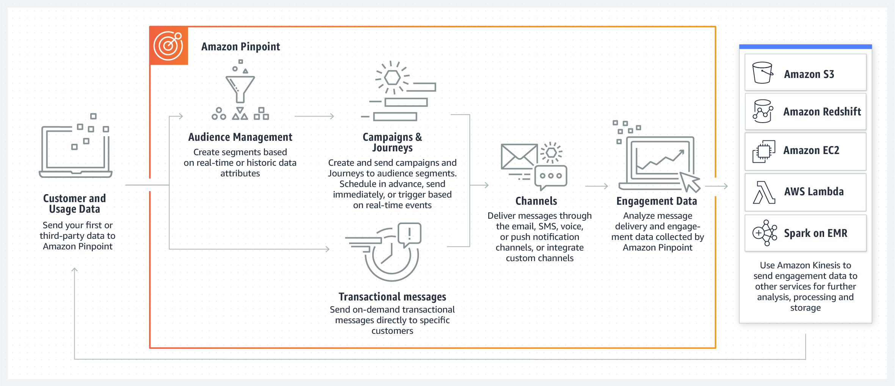
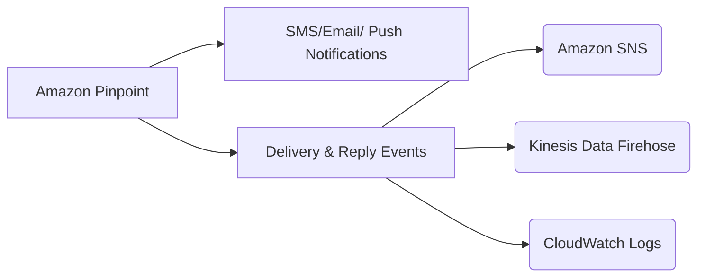

# Amazon Pinpoint: A Unified Marketing Communications Service

## 1. Introduction

Amazon Pinpoint is a fully managed AWS service designed for customer engagement and targeted messaging. It enables organizations to communicate with their customers through multiple channels—including email, SMS, push notifications, in‑app messages, and voice messages—and to gain deep insights into campaign performance and user behavior. With a flexible API, a robust console, and rich SDK support, Amazon Pinpoint makes it easier to plan, execute, and analyze both transactional and marketing campaigns.
## 2. Key Features and Capabilities

### 2.1. Multi‑Channel Messaging

- **Email, SMS, and Voice:** You can send transactional messages (order confirmations, password resets, etc.) and marketing campaigns through channels like email and SMS. For SMS and voice messaging, Pinpoint provides dedicated APIs and extensive channel configuration options.  

- **Push and In‑App Notifications:** Besides traditional channels, Pinpoint supports mobile push notifications and in‑app messaging, which can be used to engage users directly on their devices.  

### 2.2. User Segmentation and Targeting

- **Dynamic Segmentation:** Amazon Pinpoint enables you to define and build dynamic segments based on user attributes, behavior, and engagement history. This allows for highly targeted messaging strategies.  

- **Journey Orchestration:** The service’s Journey feature lets you design automated, multi-step communication workflows that respond to user actions in real time.

### 2.3. Campaign Management and Analytics

- **Campaign Scheduling and Personalization:** You can schedule campaigns to run at specific times, tailor messages with personalized content, and even incorporate custom attributes into your communications.
- **Event Tracking and Reporting:** Amazon Pinpoint automatically collects data on message deliveries, opens, clicks, and other engagement metrics. This data is available through detailed dashboards and can be streamed for custom analysis via services like Amazon Kinesis.  

## 3. Key Use Cases
Pinpoint is well-suited for a variety of scenarios, including:

- **High-volume marketing campaigns:** Bulk-sending promotions or newsletters to large customer segments.  
- **Transactional notifications:** Sending order confirmations, shipping updates, or password reset instructions.  
- **Multichannel engagement:** Coordinating consistent messages across SMS, email, push notifications, and more.  
- **Real-time analytics and feedback loops:** Streaming message events to external services to trigger follow-up actions or maintain dashboards.

## 4. Architecture and Event Flows

When you send messages using Amazon Pinpoint, each event (such as delivery confirmation or customer reply) can be routed to Amazon SNS, Amazon Kinesis Data Firehose, and Amazon CloudWatch Logs, enabling robust data ingestion and analysis pipelines.

Below is a conceptual diagram illustrating how message events flow through Pinpoint and into various AWS services:

This integration allows you to create automated, event-driven workflows. For example, if a recipient successfully receives an SMS message, Pinpoint can send a notification event to an Amazon SNS topic, which can trigger downstream processing or analytics.

## 5. Comparison with Amazon SNS and Amazon SES

While Amazon SNS and Amazon SES also provide messaging capabilities, they differ substantially from Amazon Pinpoint in how campaigns are managed:

- **Amazon SNS and Amazon SES:** Require you to handle the logic for segmenting audiences, personalizing messages, and scheduling deliveries within your own application code.  
- **Amazon Pinpoint:** Offers a higher-level, campaign-oriented approach to message distribution. You can define targeted segments, create reusable message templates, and set delivery schedules while letting Pinpoint manage the entire orchestration process.

If your goal is to manage high-volume campaigns that involve sophisticated segmentation, automation, and analytics, Amazon Pinpoint is generally the more suitable choice. However, for simpler notification workflows that do not require extensive campaign management, Amazon SNS and Amazon SES can be sufficient.

## Conclusion

Amazon Pinpoint is a powerful choice for organizations looking to launch complex, multi-channel marketing efforts and automate high-volume, high-frequency communications. With its robust segmentation, campaign management, and automated event routing capabilities, Pinpoint goes beyond what standard messaging solutions offer. By seamlessly integrating with Amazon SNS, Amazon Kinesis Data Firehose, and Amazon CloudWatch Logs, you can build sophisticated, event-driven architectures that deliver the right message to the right audience at the right time—all while maintaining full visibility into key marketing and transactional metrics.

For more comprehensive details, please refer to the [official documentation](https://aws.amazon.com/pinpoint/?nc=sn&loc=0).