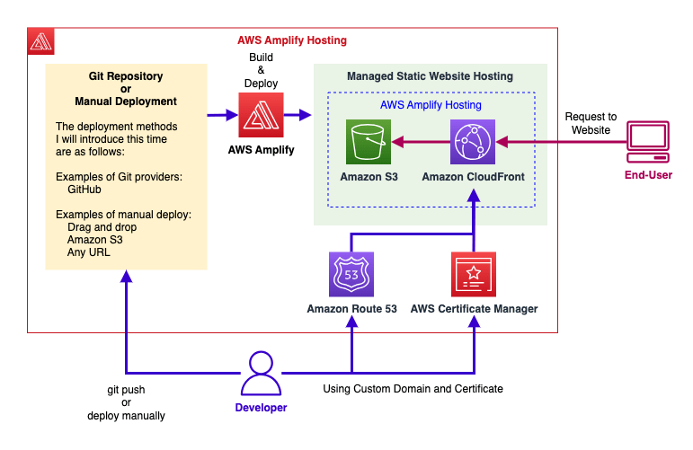

# AWS Amplify
## 1. Introduction

At its core, **AWS Amplify** is a one-stop solution for building, deploying, and hosting modern web and mobile applications on AWS. It offers:

- **Amplify Studio** – A visual interface to build both front-end UIs and backend services.
- **Amplify CLI** – A command-line tool that guides you through configuring AWS services for your app.
- **Amplify Libraries** – Pre-built libraries to integrate AWS services (e.g., Amazon Cognito, S3, AppSync) into your front-end or mobile code.
- **Amplify Hosting** – A fully managed hosting service with built-in continuous integration and continuous delivery (CI/CD).

An easy way to conceptualize Amplify is to think of it as an “Elastic Beanstalk” specifically tailored for mobile and web apps. It abstracts away much of the complexity of provisioning and managing AWS services, so you can focus on building features rather than figuring out low-level configurations.

## 2. Key Components of AWS Amplify

### 2.1. Amplify Studio


**Amplify Studio** offers a visual development environment that helps you design both the front-end UI and the backend for your application. It includes:

- **Drag-and-drop UI building**: Construct React or other front-end frameworks visually.
- **Data modeling**: Graphically model your data and relationships, which are then provisioned in services like Amazon DynamoDB and AWS AppSync.
- **Integration with Amplify Libraries**: Once you set up your data models and authentication, the necessary front-end code can be generated automatically.

Amplify Studio is particularly useful for teams looking for a low-code or no-code approach to common setup tasks, accelerating the process of scaffolding an application.

### 2.2. Amplify CLI


For developers who prefer working with a terminal, the **Amplify CLI** provides a guided approach to creating and managing AWS resources for your app. After installing the CLI, you can initialize a new project with:

```
amplify init
```

From there, adding backend features is straightforward:

- **Authentication**: `amplify add auth` (configures Amazon Cognito)
- **API / DataStore**: `amplify add api` (leverages Amazon AppSync and DynamoDB for GraphQL APIs and automatic data synchronization)
- **Hosting**: `amplify add hosting` (sets up AWS Amplify Hosting to deploy your app)

The Amplify CLI then takes care of provisioning the resources in your AWS account, updating configuration files, and generating the code you need to integrate these services into your front-end application.

### 2.3. Amplify Libraries

**Amplify Libraries** include a collection of open-source client libraries that integrate your front end with AWS services. They provide ready-to-use UI components and abstractions for:

- **User authentication** (Amazon Cognito)
- **Secure file storage** (Amazon S3)
- **Real-time GraphQL APIs** (AWS AppSync)
- **Analytics, push notifications, and more**

These libraries support popular frameworks and languages, including **React.js, Vue.js, JavaScript, iOS, Android, and Flutter**, allowing you to pick whichever stack suits your application needs.

### 2.4. Amplify Hosting


**Amplify Hosting** is AWS’s fully managed CI/CD and hosting platform for modern web apps. Key capabilities include:

- **Automated builds**: Every time you push code to your Git repository (e.g., GitHub, GitLab, Bitbucket, or AWS CodeCommit), Amplify can automatically build your front end.
- **Continuous deployment**: Deploy changes to a globally available content delivery network (often backed by Amazon CloudFront).
- **Pull request previews**: Generate temporary, shareable previews of your application for testing and feedback before merging changes.
- **Custom domains and HTTPS**: Simplify domain management and automatically provision SSL certificates.
- **Monitoring and logging**: Gain insights into application performance, usage, and errors.
- **Redirects, custom headers, and password protection**: Implement additional configuration for advanced hosting requirements.

Amplify Hosting can be seen as an AWS-native alternative to platforms such as Netlify or Vercel, providing a streamlined path from code to production deployment.

## 3. Key Features

Amplify is engineered to cover the most common needs of modern applications:

1. **Authentication**
    - Leverages Amazon Cognito for **sign-up, sign-in, password recovery, and multi-factor authentication (MFA)**.
    - Offers **pre-built UI components** that reduce custom code needed for user flows.
    - Supports **fine-grained authorization** for protected resources in your backend.

2. **Data Storage (DataStore)**    
    - Utilizes **AWS AppSync** (managed GraphQL service) and **Amazon DynamoDB** for your application’s database.
    - Allows you to work with local data that **automatically syncs** to the cloud, enabling **offline** and **real-time** capabilities.
    - Simplifies data modeling and integrates seamlessly with Amplify Studio’s visual tools.

3. **Machine Learning**    
    - Provides the option to add AI/ML features (e.g., predictions, translations, or image recognition) powered by AWS services like Amazon Rekognition or Amazon Comprehend, all while staying in the Amplify ecosystem.

By incorporating AWS best practices under the hood, Amplify ensures your applications are **scalable**, **secure**, and **highly available**.

## 4. End-to-End Testing with AWS Amplify

Testing is a critical aspect of any modern CI/CD pipeline, and Amplify offers robust testing options:

1. **Unit Tests**
    - Executed during the build phase, these tests verify whether small units of code behave as expected.
    - Common libraries and frameworks (e.g., Jest, Mocha) can be incorporated.

2. **End-to-End (E2E) Tests**
    - Executed after the application has been deployed to a temporary or production environment.
    - Helps identify regressions or integration issues before code merges or final production releases.
    - **Cypress** is a popular framework supported by Amplify, enabling you to simulate user actions—like button clicks and form submissions—within a browser-like environment.
    - You can define these test steps in your `amplify.yml` file, instructing Amplify to run them automatically during the **test** phase of your CI/CD pipeline.

By combining build-level tests (unit tests) and E2E tests (via Cypress), you ensure a high level of quality and confidence before shipping new features or updates to end users.

## 5. Conclusion

AWS Amplify dramatically simplifies the process of creating, deploying, and managing full-stack applications on AWS. By providing both a visual development environment (Amplify Studio) and a powerful CLI, it addresses the wide range of developer preferences and needs. With built-in authentication, database integration, hosting, and testing, Amplify paves the way for faster development cycles without sacrificing best practices for security, scalability, or performance.

Whether you are a startup prototyping your first product or a large organization looking to streamline development workflows, AWS Amplify can be the cornerstone of your modern application stack. As you continue to explore Amplify, you will discover it is not just a collection of services, but an end-to-end platform that enables teams to focus on innovation rather than infrastructure.

For more comprehensive details, please refer to the [official documentation](https://aws.amazon.com/amplify/?nc=sn&loc=0).
