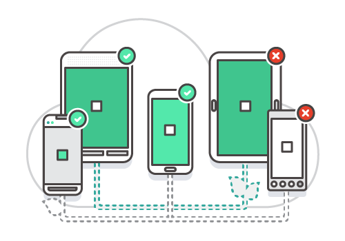

# AWS Device Farm

## 1. Introduction  

AWS Device Farm offers a streamlined way to test mobile and web applications across a variety of real devices. By running tests on hardware that mirrors actual end-user environments, developers and QA teams can identify device-specific issues more reliably. With automated test frameworks, robust logging, and remote debugging, AWS Device Farm helps ensure apps run smoothly on the broadest set of browsers and devices.

## 2. Key Capabilities  

### 2.1. Real Devices for Authentic Testing  

Rather than relying solely on emulators, AWS Device Farm tests apps on physical devices. This approach ensures that subtle hardware and OS-version differences are accounted for, reducing the risk of unexpected behavior once an app is released.

- Covers popular Android and iOS devices, including varying models and OS versions.  
- Includes real web browsers for end-to-end testing of responsive web apps.
### 2.2. Automated Test Execution  

AWS Device Farm integrates with multiple automation frameworks. You can write tests once, upload them, and let the service run these scripts on each device in your designated pool. This automation accelerates regression tests and frees up time for your team to focus on new features.

- Compatible frameworks include XCTest, Espresso, Appium, and more.  
- Parallel run support lets you test across multiple devices simultaneously.
### 2.3. In-Depth Reporting and Debugging

When errors occur, AWS Device Farm automatically captures screenshots, logs, and even videos of the tests in progress. These resources help pinpoint the root cause quickly. For even deeper inspection, you can remotely log in to a device and perform live debugging.

- Automatically generate failure reports.  
- Access detailed device logs for deeper analysis.  
- Use remote access to isolate and fix issues in real time.
## 3. Typical Workflow

1. Upload your test scripts and application package.  
2. Define a device pool (including the specific sets of devices and OS types).  
3. Trigger the automated test run on these devices.  
4. Collect and review logs, videos, and screenshots of the runs.  
5. If issues are found, replay failures or remotely connect to the issue devices for deeper debugging.

## 4. Practical Example

Imagine you publish a new version of a mobile banking app. You want to verify its behavior on various popular models before releasing it:

- Device Farm can point out that certain Android devices, such as Nexus 6 or LG G Flex 2, experience unexpected UI layout problems.  
- Tests succeed on other devices like certain Samsung Galaxy models, confirming that the app is at least functional across those devices.

With the automatically generated logs and video recordings, you can see exactly how the error manifests, allowing for quick fixes and re-tests.

## 5. Conclusion  

AWS Device Farm reduces friction in mobile and web application testing by offering a wide array of real devices, automated test integrations, and thorough reporting. Gaining familiarity with this service can help teams shorten development cycles, improve app reliability, and ensure a more consistent user experience across diverse devices.

For more comprehensive details, please refer to the [official documentation](https://aws.amazon.com/device-farm/).
