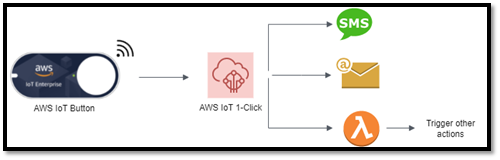
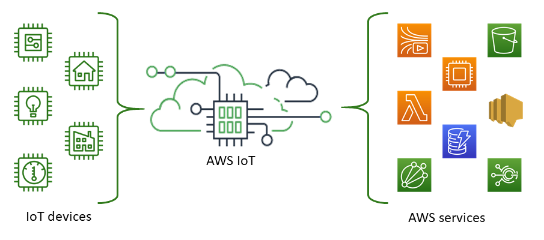
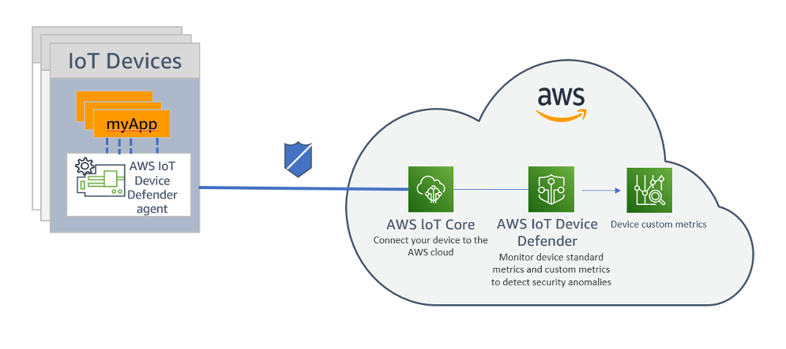
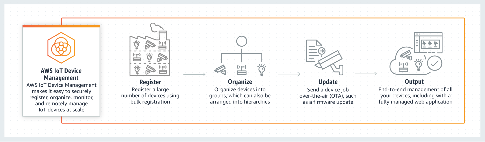
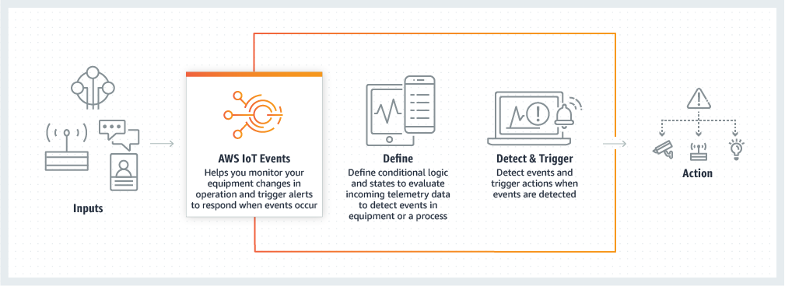
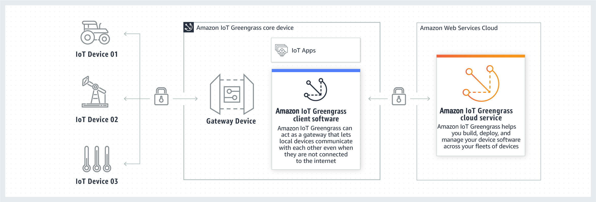
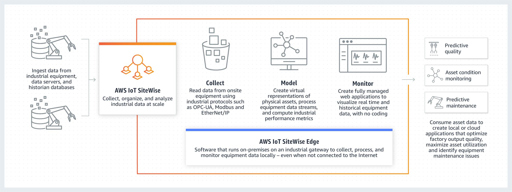

# AWS IoT Services

## 1. Introduction

The Internet of Things (IoT) promises to connect billions of devices, enabling organizations to collect massive amounts of data, gain insights, and deliver real-time actions. As IoT technology evolves, the challenge of securely managing these devices and harnessing their data grows exponentially. Amazon Web Services (AWS) addresses these challenges with a suite of fully managed IoT services designed to connect, secure, analyze, and manage IoT fleets of any scale.

This chapter explores several core AWS IoT services—AWS IoT 1-Click, AWS IoT Core, AWS IoT Device Defender, AWS IoT Device Management, AWS IoT Events, AWS IoT Greengrass, and AWS IoT SiteWise. Each service meets specific needs within an IoT infrastructure, from simple device-triggered actions and robust cloud-to-device connectivity, to ensuring device security and collecting industrial sensor data at scale.

## 2. AWS IoT 1-Click

AWS IoT 1-Click is designed for simplicity. It allows organizations to use a range of “out-of-the-box” devices that can trigger AWS Lambda functions with a single action—no custom firmware development needed.

Common use cases include:

- Notifying technical support teams with the push of a button.
- Tracking assets in remote locations.
- Replenishing goods or services automatically when a device is activated.

Because AWS IoT 1-Click devices require minimal setup, they can be deployed quickly. They automatically connect securely to AWS, removing the time and costs associated with programming or customizing device firmware. Furthermore, AWS IoT 1-Click offers straightforward device management capabilities that make it easy to group and monitor devices. By simply associating a device (or device group) with a Lambda function, you can define and execute the desired action when the button is pressed. This service also provides pre-built reports to track device health and activity.

## 2. AWS IoT Core

AWS IoT Core is often at the heart of an AWS-based IoT solution. It is a managed cloud service that securely routes messages between billions of IoT devices and AWS back-end applications, or between devices themselves.
### Key Benefits

- **Secure Communication:** AWS IoT Core provides authentication and end-to-end encryption, ensuring data is transmitted securely.
- **Scalability:** It can support a massive number of devices and handle trillions of messages reliably.
- **Seamless Integration:** IoT data can be routed to other AWS services such as AWS Lambda, Amazon Kinesis, Amazon S3, Amazon SageMaker, Amazon DynamoDB, and more.
- **Device Communication:** Even when devices are not connected, the service maintains a logical “twin” in the cloud, making it possible for applications to track and update device state continuously.

With AWS IoT Core, you can build powerful IoT applications without having to manage back-end servers or specialized networking infrastructure. This helps keep the focus on business logic and device behavior.

## 3. AWS IoT Device Defender

As organizations connect more devices, ensuring the security of each endpoint becomes paramount. AWS IoT Device Defender is a fully managed service that continuously audits IoT configurations and monitors device activity for security anomalies.

### 3.1. Continuous Auditing

- **Configuration Checks:** It verifies that security best practices are followed—examples include ensuring device certificates aren’t shared among multiple devices, and checking that revoked certificates are not allowed to connect.
- **Alerting:** Whenever AWS IoT Device Defender finds gaps, it sends alerts so that teams can address potential vulnerabilities swiftly.

### 3.2. Behavior Monitoring

- **Real-Time Anomaly Detection:** By examining network traffic and device metrics, AWS IoT Device Defender identifies behaviors that deviate from a known baseline (for instance, unusual spikes in outbound traffic).
- **Integration and Remediation:** It integrates with AWS IoT Greengrass and FreeRTOS to gather metrics automatically. Alerts can be seen in the AWS IoT Console, Amazon CloudWatch, and Amazon SNS. If an incident is detected, you can use AWS IoT Device Management to roll out security fixes or other mitigating actions.

## 4. AWS IoT Device Management

Managing IoT devices at scale involves onboarding new devices, tracking each device’s health, and updating firmware. AWS IoT Device Management simplifies these tasks for fleets that may number in the thousands or even millions.

### 4.1. Key Features

1. **Secure Onboarding:** Register devices individually or in bulk and configure secure identity and access policies for each.
2. **Organization & Monitoring:** Organize devices into logical groups and continuously monitor their status, facilitating troubleshooting and operational oversight.
3. **Remote Management:** Query the state of devices remotely and push over-the-air (OTA) updates for firmware and software, ensuring devices remain current and secure.
4. **Scalability:** Since it’s agnostic to device type and operating system, you can manage a large variety of devices under one umbrella, from tiny microcontrollers to complex automotive systems.

By automating these routine tasks, AWS IoT Device Management significantly reduces operational overhead, freeing teams to focus on innovation instead of tedious device maintenance.

## 5. AWS IoT Events

Many IoT use cases involve the need to detect and respond to changing conditions in real time—whether it’s a temperature fluctuation, a production line breakdown, or an unauthorized entry. AWS IoT Events is a fully managed service for building event-driven applications without the complexity of custom-coded solutions.

### 5.1. How It Works

1. **Event Detection:** AWS IoT Events monitors data from various IoT sensors and applications, looking for defined patterns or anomalies (e.g., a stuck belt or abnormal motor speed).
2. **Logical Expressions:** You set up simple “if-then-else” rules to define the logic for each situation or threshold, making it straightforward to create triggers.
3. **Alerts and Actions:** When a defined event occurs, AWS IoT Events can automatically initiate alerts or custom actions. This might include sending a message to a service technician, logging an event, or even triggering another AWS service.

By providing early detection and automatic responses to issues, AWS IoT Events helps minimize costly downtime and boosts operational efficiency.

## 6. AWS IoT Greengrass

For IoT devices operating in locations with intermittent or limited connectivity, AWS IoT Greengrass brings the power of AWS compute and machine learning to the edge. With Greengrass, devices can act on data locally, remaining operational even without continuous cloud connectivity.

### 6.1. Core Capabilities

- **Local Compute with AWS Lambda:** You can run AWS Lambda functions directly on connected devices to process sensor data in real time.
- **Machine Learning at the Edge:** Greengrass devices can run machine learning models to generate predictions without having to send data to the cloud.
- **Secure Communication:** Data can be encrypted and secured whether devices are connecting to each other on local networks or to the AWS Cloud.
- **Offline Operation:** Greengrass maintains device data and state locally, synchronizing with the cloud when connectivity is re-established.

Additionally, Greengrass supports **Connectors** that simplify integration with common third-party applications, on-premises software, and other AWS services. This feature extends device capabilities and accelerates new deployments.

## 7. AWS IoT SiteWise

Industrial facilities generate vast amounts of data from sensors and machinery. Often, this data is locked in on-premises systems and requires specialized expertise to analyze. AWS IoT SiteWise streamlines this challenge by making it easier to collect, store, and organize industrial data for large-scale monitoring and analytics.

### 7.1. Use Cases

- **Preventive Maintenance:** By analyzing machinery data in near real time, teams can identify issues before they escalate into costly failures.
- **Operational Optimization:** Gathering metrics from multiple industrial sites helps improve efficiency and reduce production gaps.
- **Centralized Data Management:** SiteWise’s software gateway automatically connects to on-premises data servers, collects industrial sensor data, and sends it to the AWS Cloud for analysis.

Once data is in SiteWise, you can model physical assets and processes, define performance metrics (e.g., overall equipment effectiveness), and visualize insights in ready-to-use web applications. This reduces time to value by eliminating the need for custom, in-house software solutions.

## 8. Conclusion

AWS’s comprehensive IoT portfolio addresses the entire lifecycle of connected devices—onboarding, authentication, messaging, storage, analytics, and real-time event handling. From initiating simple actions with AWS IoT 1-Click to building complex, edge-based machine learning models with AWS IoT Greengrass, these services provide the building blocks for secure, scalable, and cost-effective IoT solutions.

AWS IoT Core lies at the center, orchestrating message traffic between devices and applications. Tightly integrated services such as AWS IoT Device Defender and AWS IoT Device Management ensure that fleets remain secure and up-to-date, while AWS IoT Events and AWS IoT SiteWise offer powerful ways to detect, respond to, and analyze data in real time. By using these managed IoT services, organizations can focus on innovation and outcomes rather than getting bogged down in the complexities of infrastructure management.

Together, these services illustrate how AWS provides a flexible and robust framework for creating advanced IoT ecosystems—capable of handling everything from simple sensor networks to complex industrial operations.
