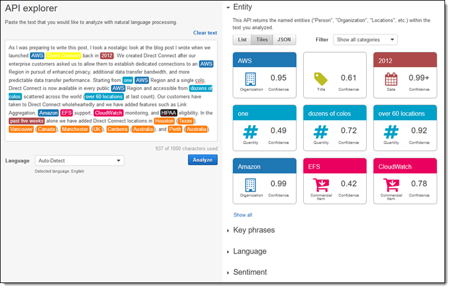

# Amazon Comprehend

## 1. Introduction

Amazon Comprehend is a fully managed natural language processing (NLP) service offered by AWS that uses advanced machine learning—specifically deep learning—to uncover insights and relationships in unstructured text. It enables you to derive meaning from your text data without requiring any machine learning expertise. By automatically detecting language, sentiment, key phrases, entities, and syntax, Amazon Comprehend helps transform raw text into actionable information. This service scales effortlessly with your business needs and integrates seamlessly with other AWS services, making it ideal for a wide range of text analysis applications.  

## 2. Features and Capabilities

Amazon Comprehend offers a rich set of features that empower developers and data scientists to derive meaningful insights from large volumes of text. Key capabilities include:

- **Language Detection:** Automatically identifies the predominant language in a document, supporting dozens of languages.
- **Entity Recognition:** Extracts and categorizes entities such as people, organizations, locations, events, and more from text.
- **Key Phrase Extraction:** Identifies the most relevant phrases and concepts, which can be used for summarization or indexing.
- **Sentiment Analysis:** Evaluates the overall sentiment of text (positive, negative, neutral, or mixed) and, with targeted sentiment analysis, assesses the sentiment towards specific entities.
- **Syntax Analysis:** Analyzes the parts of speech and grammatical structure of text, which is useful for further linguistic processing.
- **Document Classification and Topic Modeling:** Enables automatic organization of documents into custom categories or topics based on the content.
- **Customization (Amazon Comprehend Custom):** Allows you to build custom classification and entity recognition models tailored to your specific domain or business needs without requiring deep ML expertise.
- **Integration with AWS Ecosystem:** Easily integrates with services like Amazon S3, AWS Lambda, and AWS KMS, ensuring secure data handling and seamless workflow automation.

These capabilities are continuously enhanced by AWS through model retraining and integration with advanced deep learning techniques, ensuring high accuracy and robustness over time.  
## 3. Use Cases

Amazon Comprehend is a versatile tool that can be applied to a wide array of business challenges. Common use cases include:

- **Customer Feedback Analysis:** Automatically process customer reviews, support tickets, or survey responses to gauge sentiment and extract key themes.
- **Social Media Monitoring:** Analyze social media posts to identify trending topics, monitor brand sentiment, or extract key entities related to campaigns.
- **Content Organization and Search:** Enhance search engines by indexing documents based on key phrases and entities, improving relevance and user experience.
- **Call Center Analytics:** Automatically classify call transcripts and analyze sentiment to improve customer service operations.
- **Document and Email Classification:** Organize large volumes of documents or emails by automatically categorizing content, enabling more efficient data management and retrieval.
- **Compliance and Risk Management:** Extract sensitive or personally identifiable information (PII) to help automate compliance workflows and protect data privacy.

By leveraging these use cases, organizations can streamline processes, reduce manual efforts, and gain deeper insights from their unstructured text data.  
## 4. Conclusion

Amazon Comprehend provides a robust, scalable, and easy-to-integrate solution for organizations looking to harness the power of natural language processing. With its extensive suite of pre-built and customizable features, it transforms unstructured text into actionable intelligence—whether you need to analyze customer sentiment, automate document processing, or drive advanced analytics across your data. By combining the power of deep learning with AWS’s secure and scalable infrastructure, Amazon Comprehend empowers businesses to derive real value from their textual data while minimizing the complexities of building and maintaining ML models. For further details and guidance, AWS’s official documentation and white papers serve as excellent resources to explore the full potential of the service.  
