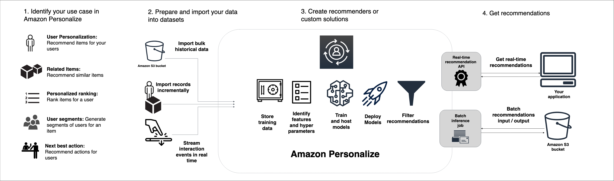

# Amazon Personalize
## 1. Introduction

Amazon Personalize is a fully managed machine learning service that enables developers to build and deploy real-time personalized recommendation engines without requiring extensive machine learning expertise. It takes raw interaction data—such as clicks, views, ratings, and purchases—along with optional user and item metadata, and automatically builds, trains, and tunes custom models to deliver highly relevant recommendations. Whether you’re aiming to enhance content discovery on a streaming platform, drive product recommendations in an ecommerce site, or personalize marketing communications, Amazon Personalize simplifies the entire process from data ingestion to deployment with an easy-to-use API interface.  

## 2. Features and Capabilities

Amazon Personalize offers a wide array of capabilities designed to address various recommendation and personalization needs:

- **User Personalization:**  
    Tailor recommendations for individual users based on historical interactions. Models can be trained on billions of events and millions of unique items, updating in near real time to reflect evolving user behavior.  
    
- **Personalized Ranking:**  
    Re-rank a preselected list of items (e.g., search results or curated lists) to ensure that the most relevant items are presented first for each user. This is ideal for use cases where you have a collection of items and want to adapt the ordering dynamically.  
    
- **Similar Item Recommendations:**  
    Enhance content discovery by suggesting items that are similar to those a user is currently viewing. This feature leverages both interaction data and item metadata to surface contextually similar items.  
    
- **Personalized Search:**  
    When integrated with search platforms such as OpenSearch, Amazon Personalize can boost the relevance of search results by re-ranking them based on the user's past behavior and context.  
    
- **User Segmentation:**  
    Automatically group users based on shared behavior patterns or preferences (e.g., affinity for a product category), which can be used to drive targeted marketing campaigns and tailored messaging.  
    
- **Trending Now & Next Best Action:**  
    Identify and recommend items that are gaining popularity or suggest the next best action (such as signing up for a loyalty program or downloading an app) based on real-time user signals.  
    
- **Real-Time and Batch Recommendations:**  
    The service offers flexibility to generate recommendations in real time—ideal for interactive web or mobile apps—as well as in batch mode for applications like email campaigns or offline analysis.  
    
- **Contextual Recommendations:**  
    Deliver recommendations that adjust based on contextual data such as time of day, device type, or current user session state, ensuring higher relevance in dynamic environments.  
    
- **Integration with Generative AI:**  
    By combining with other AWS services (e.g., Amazon Bedrock), Personalize can feed metadata into generative AI workflows. This enables enriched content generation—such as dynamic messaging or creative summaries—that further personalizes the customer experience.  

## 3. Use Cases

Amazon Personalize is designed to serve a broad spectrum of industries and applications. Some prominent use cases include:

- **Video Streaming and Media:**  
    Provide hyper-personalized video or music recommendations (e.g., “Top picks for you” or “More like this”) to increase engagement and retention on streaming platforms.  
    
- **Ecommerce and Retail:**  
    Drive sales by recommending products that individual customers are most likely to purchase, based on their browsing and purchase history. Additionally, it supports features like “Frequently bought together” to boost cross-selling opportunities.  
    
- **Marketing Personalization:**  
    Generate personalized emails and promotional messages by tailoring content based on user behavior and segmentation. This ensures that marketing campaigns are targeted and effective.  
    
- **Personalized Search Results:**  
    Enhance search experiences by reordering results based on individual user preferences, improving the relevance and engagement of search queries on websites or apps.  
    
- **Next Best Action Recommendations:**  
    Suggest the next logical step for users, such as joining a loyalty program or trying a new service, which can significantly improve user retention and lifetime value.  

## 4. Conclusion

Amazon Personalize stands out as a comprehensive, fully managed solution that democratizes access to advanced recommendation systems. By automating key aspects of model selection, training, and deployment, it allows businesses—from startups to large enterprises—to rapidly incorporate sophisticated personalization into their applications without deep expertise in machine learning. Its diverse features, ranging from real-time personalization and contextual recommendations to integration with generative AI, make it a versatile tool for driving engagement, increasing conversion rates, and enhancing customer satisfaction. Ultimately, Amazon Personalize enables organizations to deliver truly tailored experiences that adapt dynamically to user behavior and business needs. 

