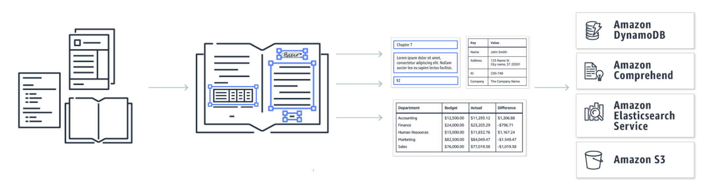

# Amazon Textract

## 1. Introduction

Amazon Textract is a fully managed machine learning service provided by AWS that automatically extracts printed text, handwriting, and structured data from scanned documents. Unlike traditional OCR solutions, Textract goes beyond simple text recognition—it is designed to detect the relationships between elements in a document, such as key–value pairs and tables, enabling the extraction of contextually rich data. This service empowers organizations to digitize and automate their document workflows, reducing manual data entry and increasing operational efficiency.  

## 2. Features and Capabilities

Amazon Textract offers a broad range of features and capabilities that set it apart from conventional OCR technologies:

- **Advanced Text Extraction:**  
    Utilizes deep learning models to recognize printed text and handwriting from a variety of documents, including scanned images and PDFs. This allows for accurate extraction even when documents are not perfectly formatted.  
    
- **Forms and Tables Extraction:**  
    Beyond raw text, Textract can identify and extract key–value pairs and table structures. This capability enables users to automatically capture structured data from forms and complex documents, preserving the relationships among data fields.  
    
- **Asynchronous and Scalable Processing:**  
    For large or multi-page documents, Textract provides asynchronous operations that allow for the processing of documents at scale. This feature is especially useful for high-volume workloads where real-time processing isn’t required.  
    
- **Integration within the AWS Ecosystem:**  
    Amazon Textract is designed to work seamlessly with other AWS services such as Amazon S3 (for document storage), AWS Lambda (for serverless processing), and Amazon Comprehend (for further text analytics). This integration makes it a key component in building automated, end-to-end document processing pipelines.  
    
- **Security and Compliance:**  
    Leveraging AWS’s robust security framework, Textract ensures that your data is handled securely throughout the extraction process. This includes compliance with industry-standard security protocols, helping organizations meet their regulatory requirements.  

## 3. Use Cases

Amazon Textract is versatile and finds application in many industries and scenarios:

- **Document Digitization and Archiving:**  
    Organizations can convert vast repositories of paper documents into searchable, digital formats. This is critical for improving access, reducing storage costs, and preserving historical records.
    
- **Automated Data Entry and Workflow Optimization:**  
    By automatically extracting information from forms, invoices, receipts, and contracts, businesses can drastically reduce manual data entry errors and speed up business processes. This is particularly valuable in finance, human resources, and legal departments.
    
- **Invoice and Expense Processing:**  
    Textract can be used to extract billing information from invoices and receipts, streamlining expense management and accounting workflows.
    
- **Healthcare and Insurance:**  
    In these sectors, Textract helps digitize patient records, claims, and other forms, thereby accelerating processing times while maintaining accuracy and compliance.
    
- **Regulatory Compliance and Auditing:**  
    Extracting structured data from documents enables faster data retrieval for audits, regulatory reporting, and compliance verification.  

## 4. Conclusion

Amazon Textract represents a significant advancement over traditional OCR solutions by leveraging machine learning to extract both text and structured data from a wide range of documents. Its ability to detect forms and tables, combined with seamless integration into the AWS ecosystem, makes it an ideal solution for organizations looking to automate document processing workflows. Whether you need to digitize legacy documents, automate data entry, or build comprehensive content management systems, Textract provides the scalability, accuracy, and security required to handle these tasks efficiently.  
