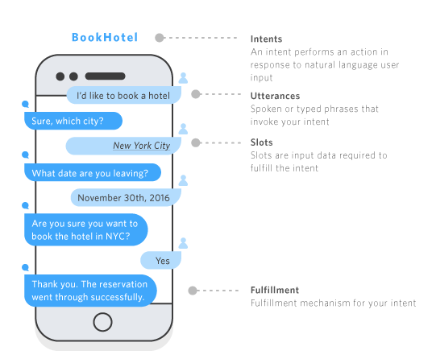
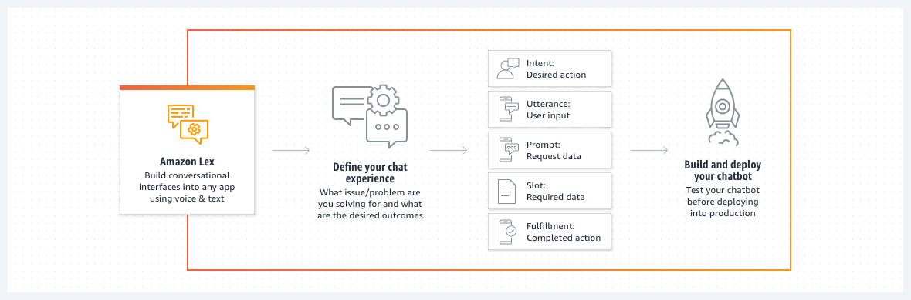

# Amazon Lex

## 1. Introduction

Amazon Lex is a fully managed AWS service that enables you to build conversational interfaces into any application using voice and text. It leverages the same deep learning technologies that power Amazon Alexa to provide advanced natural language understanding (NLU) and automatic speech recognition (ASR) capabilities. In essence, Lex lets you create chatbots and voice assistants that can understand user intent, manage multi-turn conversations, and execute business logic—all without needing extensive machine learning expertise.

## 2. Key Features and Capabilities

- **Conversational Interfaces:**  
    Create chatbots that interact naturally via text or speech. Lex handles the complexities of NLU and ASR, allowing you to focus on designing the conversation flow and integrating backend services.
    
- **Intents and Slots:**  
    Developers define _intents_ (user goals) and configure _slots_ (parameters needed to fulfill those goals) with sample utterances. Lex uses these definitions to determine what a user wants and to extract required information.  
    
- **Multi-Turn Dialogue Management:**  
    Amazon Lex supports complex conversation flows, including slot elicitation, confirmation, and conditional branching. This enables bots to maintain context across multiple exchanges and handle interruptions gracefully.
     
- **Integration with AWS Services:**  
    Seamlessly integrate with AWS Lambda to run custom fulfillment logic, Amazon CloudWatch for monitoring, and Amazon Connect for building omnichannel contact centers. Lex is also designed to work with other AWS tools for security and scalability.  
    
- **Visual Conversation Builder:**  
    For Lex V2, AWS provides a visual builder that simplifies the design and testing of conversation flows without writing code.
    
- **Generative AI and Enhanced Functionality:**  
    Recent updates include capabilities to work with large language models and generative AI tools, further broadening the types of conversational experiences you can create.

## 3. Architecture

## 4. Pricing  

Amazon Lex follows a pay-as-you-go pricing model. You are charged only for the text or speech requests your bot processes. Additionally, AWS offers a free tier for Lex—up to 10,000 text requests and 5,000 speech requests per month for the first 12 months.

## 5. Conclusion

For more in-depth details, consult these official resources:

- **Amazon Lex Official Website:**  
    Learn more about features, use cases, and customer success stories on the [Amazon Lex page](https://aws.amazon.com/lex/)
- **Developer Guides and API References:**  
    Explore detailed documentation, API references, and CLI command guides on the [Amazon Lex V2 API Reference](https://docs.aws.amazon.com/lexv2/latest/APIReference/welcome.html) and related pages.