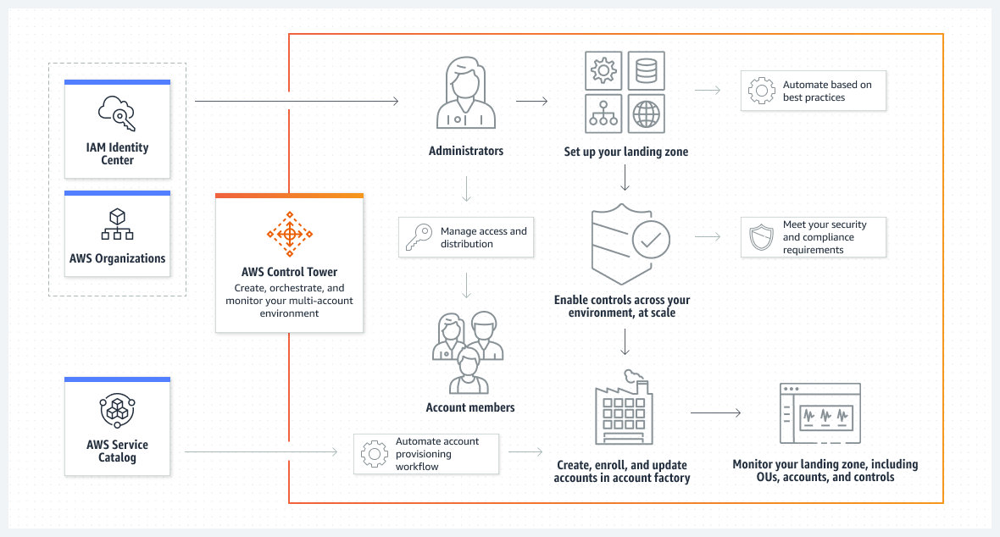

# AWS Control Tower

## 1. Introduction

Effective governance of a multi-account AWS environment is a challenge for modern enterprises. AWS Control Tower offers a straightforward, automated way to set up, secure, and manage such environments following prescriptive best practices. By orchestrating key AWS services—including AWS Organizations, AWS Service Catalog, and AWS IAM Identity Center—Control Tower enables rapid deployment of a well-architected landing zone while continuously enforcing compliance and security policies across your accounts.

AWS Control Tower is an AWS-managed service that simplifies the setup and governance of a multi-account environment. It orchestrates the capabilities of several AWS services to build a secure landing zone in less than an hour. By applying prescriptive best practices and built-in guardrails (controls), it prevents configuration drift and ensures that accounts remain compliant with corporate and regulatory policies. This makes AWS Control Tower an ideal solution for organizations managing more than just a handful of accounts.

## 2. Key Features and Benefits

### 2.1 Landing Zone

- **Definition:**  
    A landing zone is a secure, multi-account environment designed with best practices for security and compliance. It serves as the container for your organizational units (OUs), accounts, users, and resources.
- **Benefits:**  
    Provides a repeatable and scalable foundation for your enterprise, allowing you to quickly provision new accounts with standardized configurations.

### 2.2 Controls (Guardrails)

- **Overview:**  
    Controls—often called guardrails—are high-level rules that continuously govern your AWS environment. They are expressed in plain language and come in three types:
    - **Preventive Controls:**  
        Implemented via Service Control Policies (SCPs), these rules block actions that could lead to non-compliance (for example, preventing root access key creation).
    - **Detective Controls:**  
        Implemented via AWS Config rules, they continuously monitor resource configurations and flag noncompliant behavior.
    - **Proactive Controls:**  
        Implemented with AWS CloudFormation hooks, these ensure resources are compliant even before they are provisioned.
- **Categories:**  
    Controls are categorized as _mandatory_ (always enforced), _strongly recommended_ (best practices), or _elective_ (optional based on organizational needs).

### 2.3 Account Factory

- **Purpose:**  
    An automated, configurable template (or “vending machine”) that standardizes the provisioning of new AWS accounts.
- **Capabilities:**  
    New accounts are created with pre-approved configurations such as default VPC settings, IAM configurations, and network settings.

### 2.4 Centralized Dashboard

- **Functionality:**  
    Provides real-time visibility into your landing zone’s compliance posture, the status of guardrails, and any drift events.
- **Benefits:**  
    Empowers central cloud administrators to monitor, manage, and remediate compliance issues across the organization.

### 2.5 Integration with AWS Services

AWS Control Tower builds on trusted AWS services:

- **AWS Organizations:** For multi-account management and enforcing SCPs.
- **AWS Service Catalog:** For account provisioning via Account Factory.
- **AWS IAM Identity Center:** For streamlined identity and access management.
- **AWS CloudFormation StackSets:** For deploying resources consistently across multiple accounts and Regions.

## 3. Architecture and Setup of the Landing Zone

### 3.1 Landing Zone Structure

When you set up your landing zone with AWS Control Tower, the environment is organized as follows:

- **Root:**  
    The top-level container holding all other OUs.
- **Security OU:**  
    Contains shared accounts for security and logging (Log Archive and Audit accounts). Note that these accounts cannot be renamed post-setup, and new ones cannot be added later.
- **Sandbox OU:**  
    (Optional) Provides an isolated space for development or experimentation.
- **IAM Identity Center Directory:**  
    Houses your IAM Identity Center users and defines their permissions.

### 3.2 What Happens During Landing Zone Setup

During the initial setup, AWS Control Tower automatically:

- Creates two primary OUs (Security and Sandbox) under the organizational root.
- Provisions shared accounts:
    - **Management Account:**  
        The account used for billing, account provisioning, and overall management. It is not intended for running production workloads.
    - **Log Archive Account:**  
        Stores logs from API activities and resource configurations.
    - **Audit Account:**  
        Provides a restricted environment for security and compliance teams to review and audit configurations.
- Sets up a cloud-native directory in IAM Identity Center (or allows you to use a custom identity provider).
- Applies all mandatory preventive and detective controls to ensure compliance across the organization.
- Uses AWS CloudFormation StackSets to deploy resources across accounts and Regions.

### 3.3 Managing AWS Control Tower Resources

It is critical not to modify or delete AWS Control Tower–managed resources (such as specific IAM roles or the foundational OUs) outside of the supported methods. Doing so could cause your landing zone to enter an unknown or drifted state.

## 4. Shared Accounts and Roles

### 4.1 Management Account

The primary account created for your landing zone. It handles billing, account provisioning via Account Factory, and overall governance.

- **Best Practice:**  
    Avoid running production workloads in this account.

### 4.2 Log Archive Account

- **Purpose:**  
    Acts as a centralized repository for logs (API activities, resource configurations) across all accounts.

### 4.3 Audit Account

- **Purpose:**  
    Provides read/write access (typically via Lambda functions) for security and compliance reviews.
- **Limitations:**  
    It does not support manual logins to other accounts; instead, it uses programmatic access.

## 5. Guardrails and Controls in Detail

### 5.1 How Controls Work

Controls in AWS Control Tower are designed to enforce compliance through:

- **Preventive Controls:**  
    These are implemented with SCPs at the OU level. They actively block noncompliant actions (for example, preventing modifications to key log archive policies).
- **Detective Controls:**  
    Using AWS Config rules, they monitor for configuration changes or policy violations and send alerts (often via Amazon SNS).
- **Proactive Controls:**  
    They check resource compliance before provisioning using CloudFormation hooks, thereby preventing non-compliant deployments.

### 5.2 Drift Detection and Resolution

- **Drift Detection:**  
    AWS Control Tower continuously detects drift—changes that diverge from the saved configuration—using read-only API calls (logged via CloudTrail) and SNS notifications.
- **Notification & Deduplication:**  
    When drift is detected (e.g., an account is moved between OUs or an SCP is modified), a notification is sent only for the initial instance of the drift. Subsequent identical drifts do not trigger additional alerts unless the state is resolved and then recurs.
- **Resolution Methods:**
    - **Reset via Console:**  
        Use the Landing Zone settings page to reset drifted resources.
    - **Re-register OU:**  
        For small OUs (fewer than 1,000 accounts), use the “Re-register OU” option.
    - **ResetEnabledControl API:**  
        For specific controls, call this API to restore compliance.
- **Critical Drift Examples:**  
    Do not delete the Security OU, required IAM roles (e.g., AWSControlTowerAdmin, AWSControlTowerCloudTrailRole, AWSControlTowerStackSetRole), or shared accounts. Such actions will force a landing zone reset before any further changes can be made.

## 6. Integration with Other AWS Services

AWS Control Tower is not a standalone solution—it extends and leverages the power of several core AWS services:

- **AWS Organizations:**  
    Manages account hierarchies and applies SCPs at the OU level.
- **AWS Service Catalog:**  
    Supports Account Factory by providing pre-approved account blueprints.
- **AWS IAM Identity Center:**  
    Simplifies user and access management, centralizing identity controls.
- **AWS CloudFormation StackSets:**  
    Enables the deployment of resources (and subsequent updates) across multiple accounts and Regions.
- **Additional Integrations:**  
    AWS Control Tower can be used alongside migration tools (such as CloudEndure) and partner solutions to facilitate workload migrations and further extend capabilities.

## 7. Terminology

Understanding key terms is essential:

- **Organizational Unit (OU):**  
    A container within AWS Organizations that can house accounts and nested OUs (up to five levels deep).
- **Member Account:**  
    An AWS account enrolled in the Control Tower environment; preventive controls apply regardless of enrollment, while detective controls require enrollment.
- **Blueprint:**  
    An artifact (often a CloudFormation template) that defines the infrastructure components deployed by AWS Control Tower.
- **Baseline:**  
    A set of configurations and resources (for example, AWSControlTowerBaseline) applied to OUs or accounts to standardize the landing zone.
- **Drift:**  
    Any change in a resource or configuration that deviates from the established AWS Control Tower template.
- **StackSets and Stack Instances:**  
    CloudFormation constructs that deploy and manage stacks across multiple accounts and Regions.

## 8. Pricing Considerations

- **No Additional Charge for AWS Control Tower:**  
    You are only billed for the underlying AWS services (e.g., AWS Config, CloudTrail, Service Catalog) that are used in your landing zone.
- **Cost Implications:**
    - Ephemeral workloads may drive higher AWS Config costs.
    - Duplicate charges can occur if external CloudTrail trails are enabled alongside AWS Control Tower–managed trails.
- **Best Practices:**  
    Consult your AWS account representative and review the pricing documentation to manage costs effectively.

## 9. Use Cases and Enterprise Benefits

AWS Control Tower is designed to address several enterprise challenges:

- **Automated Environment Setup:**  
    Quickly provision new accounts with standardized, best-practice configurations using the Account Factory.
- **Consistent Policy Enforcement:**  
    Enforce preventive and detective guardrails to ensure every account adheres to security, compliance, and operational policies.
- **Centralized Governance:**  
    A unified dashboard provides visibility into organizational compliance, making it easier to spot and resolve drift.
- **Scalability:**  
    Easily extend governance to new accounts and existing ones (via enrollment or OU registration) as your organization grows.
- **Integrated Remediation:**  
    Automated drift detection and guided remediation help maintain a secure and compliant environment.

**Example Scenario:**  
A multinational enterprise uses AWS Control Tower to create dedicated accounts for different departments. The central IT team provisions accounts via the Account Factory; preventive guardrails deny insecure actions (e.g., root key creation) while detective controls monitor for misconfigurations. When drift is detected (such as an account moving between OUs), notifications are sent to administrators who can then reset or update configurations through the console or APIs.

## 10. Conclusion

AWS Control Tower is a powerful service for automating and governing a secure, compliant, multi-account AWS environment. By combining automated account provisioning, robust guardrails, centralized visibility, and integrated drift management, it provides the operational excellence needed for enterprise-scale cloud adoption. Whether you are setting up your initial landing zone or extending governance to existing accounts, AWS Control Tower delivers a consistent, scalable, and secure foundation for your cloud strategy.