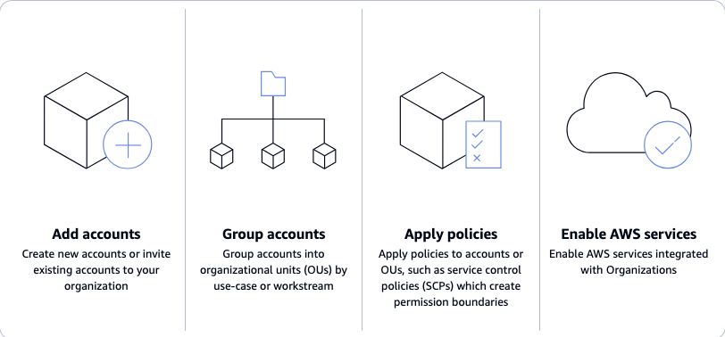
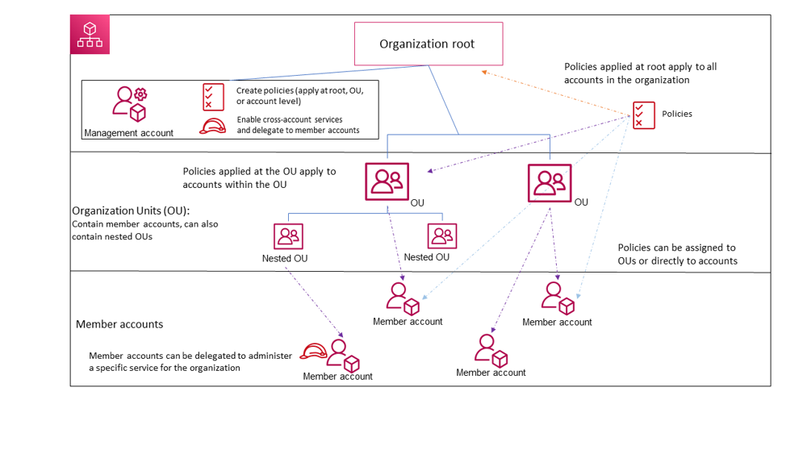

# AWS Organizations

## 1. Introduction

Cloud adoption at scale has reshaped how enterprises structure their IT operations. Instead of relying on a single, monolithic AWS account, modern organizations embrace a multi‐account strategy that leverages isolated accounts for different teams, projects, or environments. AWS Organizations provides the essential framework for this approach by enabling centralized management, policy enforcement, and consolidated billing across all member accounts.



By adopting AWS Organizations, companies can:

- **Improve security:** Isolate workloads into separate accounts so that a breach in one does not affect others.
- **Enhance governance:** Centrally enforce compliance and security standards through Service Control Policies (SCPs) and other centralized policies.
- **Optimize costs:** Pool usage for volume discounts, share reserved capacity across accounts, and monitor spend using consolidated billing.
- **Streamline operations:** Automate account provisioning and baseline configuration, enabling rapid scaling and agile deployments.

## 2. The Multi‐Account Paradigm

The concept of using multiple AWS accounts is rooted in the principle of isolation. By segmenting workloads, teams, and projects into individual accounts, organizations can limit the “blast radius” of security incidents, minimize potential misconfigurations, and assign clear cost ownership. This isolation is fundamental for:

- **Security and Compliance:** If a security vulnerability is exploited in one account, the damage is confined there. Furthermore, sensitive workloads can be segregated to meet regulatory requirements.
- **Operational Autonomy:** Different teams can operate with a degree of independence—modifying policies and configurations that affect only their dedicated environment.
- **Cost Management:** When each account is tied to a single team or project, tracking and attributing costs becomes much more straightforward.

AWS Organizations unifies these separate accounts under one centralized management umbrella, while still preserving their autonomy. The multi‐account approach is widely considered a best practice and is a pillar of the AWS Well‐Architected Framework in categories such as operational excellence, security, reliability, and cost optimization.

## 3. Key Concepts and Structure

At the heart of AWS Organizations is the idea of organizing accounts into a hierarchical tree. This structure is built upon a few fundamental concepts:

### 3.1. The Organization and Its Root

An AWS Organization is a logical container for all your AWS accounts. At the top of the hierarchy is the **Root**. The root represents the entire organization and is the default container that holds every account. Although you might not directly interact with the root for everyday operations, it is crucial as it provides a single point from which all policies and settings eventually propagate.

### 3.2. Management vs. Member Accounts

Within an organization, accounts fall into two distinct types:

- **Management Account:** Formerly known as the “master account,” this is the account that creates and administers the organization. It carries the responsibility for billing and overall policy management. Its privileges allow it to create new accounts, invite existing ones, and enforce organizational controls.
- **Member Accounts:** These are the accounts that contain your actual workloads—whether they run production applications, test environments, or experimental sandboxes. Member accounts are isolated from one another by default; they can only interact if explicit permissions are set up.


A best practice is to reserve the management account solely for administrative functions and avoid deploying workloads there. This separation ensures that the management account remains secure and minimizes the risk of accidental changes or billing mix-ups.

### 3.3. Organizational Units (OUs)

Organizational Units, or OUs, are sub-containers within your organization. They enable you to group accounts by common characteristics such as business unit, environment (e.g., production versus development), or regulatory requirement. OUs can be nested up to five levels deep, allowing for flexible mirroring of your organizational structure. Policies can be applied at any OU level so that all child accounts inherit the settings. This hierarchical design greatly simplifies the task of applying governance controls across related accounts.

### 3.4. Policies in AWS Organizations

One of the most powerful features of AWS Organizations is its ability to enforce policies across multiple accounts. These policies come in several types:

- **Service Control Policies (SCPs):** These JSON policies set the maximum permissions for member accounts. They serve as guardrails that restrict actions regardless of the individual IAM policies in the account. For example, an SCP might prevent the use of certain high-risk services or restrict resource creation to approved AWS regions.
- **Tag Policies:** These help standardize the way resources are tagged across accounts. Enforcing consistent tagging is critical for cost allocation, resource management, and compliance.

:::tip

Tag Policies only provide governance and reporting; they do not actually block non‑compliant resources from being created. To enforce the existence of Tags you have to use SCPs.

:::

- **Backup Policies:** If you are using AWS Backup with Organizations, you can centrally define backup schedules and retention rules that automatically apply to all accounts or selected OUs.
- **AI Services Opt-Out Policies:** For organizations with privacy or regulatory concerns, this type of policy can be used to opt out of having your content used to improve AWS AI services.

By designing and applying these policies carefully, solution architects can enforce strong security postures and governance standards across every account in the organization.

## 4. Feature Sets: Consolidated Billing Versus All Features Mode

When you create an AWS Organization, you must choose a feature set: **Consolidated Billing** or **All Features**. Although both options enable aggregated billing, they differ significantly in terms of management and governance capabilities.

### 4.1. Consolidated Billing Mode

In consolidated billing mode, the organization primarily focuses on billing aggregation. All member accounts are linked for billing purposes, allowing you to pool usage and take advantage of volume discounts and shared reserved instance discounts. However, this mode does not provide the advanced security and management capabilities of AWS Organizations. Without the extra features, you cannot enforce SCPs, use AWS Single Sign-On for centralized access management, or automatically integrate with several AWS security services.

### 4.2. All Features Mode

All Features mode unlocks the full potential of AWS Organizations. In addition to consolidated billing, you can leverage:

- **Organization Policies:** Attach SCPs, tag policies, and backup policies to accounts or OUs.
- **Cross-Account Integrations:** Seamlessly integrate with AWS services such as CloudTrail, Config, IAM Identity Center (formerly AWS SSO), and AWS Resource Access Manager (RAM).
- **Delegated Administration:** Designate delegated administrator accounts for specific services, allowing selected teams to manage resources within their accounts while still following centralized guidelines.

Because All Features mode supports enhanced governance and security, it is strongly recommended for nearly every enterprise scenario. In today’s AWS console or CLI, All Features mode is the default option. If you initially set up an organization in consolidated billing mode, you can later upgrade to All Features by performing a handshake process with every member account.

## 5. Migrating and Merging AWS Accounts

As organizations evolve, it is common to find the need to either migrate AWS accounts from one organization to another or bring standalone accounts into an existing AWS Organization. Such migrations can occur during mergers and acquisitions (M&A), when a company grows organically and creates new accounts for individual projects, or when a company decides to implement centralized governance for legacy accounts.

### 5.1. Pre-Migration Considerations

Before migrating an account, several key prerequisites should be met:

- **Account Age:** New accounts created within an organization must be at least seven days old before they can be migrated. This rule is in place to ensure that the account has stabilized before moving it.
- **Permissions:** Ensure that the necessary IAM permissions are present in both the source and target organizations. In the source account, you must have permissions to remove the account from its current organization (for example, `organizations:LeaveOrganization`). In the target organization, the management account needs permissions such as `organizations:InviteAccountToOrganization`.
- **IAM Roles and SSO:** If an account is part of an organization, it typically has a special role (commonly named `OrganizationAccountAccessRole`) that allows the management account to access it. If migrating the account, review or remove this role to prevent unintended cross-account access from the old organization.
- **Billing Information:** Standalone accounts require valid payment information. When an account leaves an organization, it will be billed directly to its own credit card unless it is joined by another organization.
- **Backup and Logging:** Export any consolidated billing reports or organizational logs before migration. Once an account leaves its current organization, some historical data may no longer be available.

### 5.2. Migration Process

The migration process typically follows these steps:

1. **Account Leaves Source Organization:** The account is removed from its current organization and becomes a standalone AWS account.
2. **Invitation to Target Organization:** The management account of the target organization sends an invitation to the standalone account.
3. **Handshake Acceptance:** The account owner accepts the invitation using the handshake mechanism provided by AWS Organizations.
4. **Configuration Updates:** Once the account joins the new organization, adjust any policies, roles, or settings that were specific to the previous organization.

For example, if you are using the AWS CLI, you can invite an account with a command like:

```bash
aws organizations invite-account-to-organization --target Id=<AccountId>,Type=ACCOUNT
```

Then, from the account being migrated, you would accept the handshake:

```bash
aws organizations accept-handshake --handshake-id <HandshakeId>
```

Throughout this process, AWS ensures that the account’s resources—EC2 instances, S3 buckets, etc.—continue operating normally. The primary impact is on billing, cross-account access, and policy enforcement.

### 5.3. Mergers and Acquisitions

In M&A scenarios, consolidating two separate AWS environments is often more challenging than migrating a single account. A common strategy is to choose one organization as the primary (usually that of the acquiring company) and then migrate accounts from the acquired organization into the primary one. Coordination is essential:

- **Plan and Communicate:** Work closely with the account owners to schedule migrations and to verify that necessary permissions are in place.
- **Review SCPs and Policies:** Ensure that the target organization’s security and governance policies do not inadvertently block essential operations in the migrating accounts.
- **Test Migration:** Begin with non-critical accounts to validate the migration process before moving production accounts.

By approaching the migration methodically, enterprises can merge AWS environments with minimal disruption while unifying billing, security, and management practices across the combined organization.

## 6. Service Control Policies (SCPs): Guardrails for Your Accounts

Service Control Policies (SCPs) are perhaps the most critical tool provided by AWS Organizations. SCPs define the boundaries of what actions can be performed in each account—they do not grant permissions on their own but instead limit the maximum permissions available. In effect, SCPs serve as a “safety net” that ensures even if an IAM policy in a member account is overly permissive, the SCP will block any actions that are not explicitly allowed.

### 6.1. How SCPs Work

When an AWS Organization is created, all accounts automatically receive a default SCP called `FullAWSAccess`. This policy effectively allows every AWS action. When you attach additional SCPs, you are imposing restrictions on top of the default permissions. The key points to remember include:

- **Boundary Enforcement:** SCPs are applied to all users and roles in the account—even the root user. If an SCP denies a particular action, no user or role in that account can perform it, regardless of what their IAM policies allow.
- **Non-Granting Nature:** SCPs do not grant permissions by themselves. Even if an SCP allows a service action, the IAM policies in the account must also allow it for the action to succeed.
- **Inheritance:** Policies attached at a higher level in the hierarchy (such as the root or an OU) automatically apply to all child accounts. This inheritance ensures that a single policy can govern many accounts at once.

### 6.2. Approaches to Using SCPs

There are two primary strategies when designing SCPs:

#### 6.2.1. Deny List (Blacklist) Strategy

In this model, you start with the default allow-all (`FullAWSAccess`) and then attach additional SCPs that explicitly **deny** a set of dangerous or non-compliant actions. For instance, you might create an SCP that denies the ability to disable encryption on storage resources or restricts operations in unapproved regions. The benefit of a deny list is that it generally requires less maintenance because new AWS services will be allowed by default unless explicitly denied.

#### 6.2.2. Allow List (Whitelist) Strategy

Conversely, the allow list approach is much more restrictive. Here, you remove the default allow-all policy and create an SCP that explicitly **allows only** a specific set of actions. Everything not on the allow list is implicitly denied. This zero-trust approach guarantees that only approved actions occur, but it requires constant updates to accommodate any changes or new services, which can slow down innovation.

#### 6.2.3. A Hybrid Approach

Many organizations adopt a hybrid strategy: using a broad deny list for most accounts while applying more restrictive allow lists for particularly sensitive environments. For example, you might allow only networking-related services in a specialized infrastructure OU while keeping a more permissive deny list for general workload accounts.

### 6.3. Designing and Testing SCPs

When designing SCPs:

- **Identify Critical Actions:** Focus on actions that can cause significant security or operational harm if misused (e.g., IAM changes, disabling logging services, or launching unapproved resource types).
- **Use Conditions:** SCPs support conditions that can restrict actions based on resource tags, regions, or service principals. For example, you might deny launching EC2 instances in any region other than `us-east-1` or `eu-west-1` unless certain conditions are met.
- **Test in Lower Environments:** Before rolling out an SCP organization-wide, test it in an OU that contains non-critical accounts. Use CloudTrail logs and IAM policy simulators to ensure the SCP does not inadvertently block essential actions.
- **Document Intent:** Always maintain clear documentation of what each SCP is designed to achieve. This documentation will be invaluable during audits and when making future adjustments.

Here is an example of a simple deny-style SCP that prevents launching an EC2 instance or creating an EBS volume without encryption:

```json
{
  "Version": "2012-10-17",
  "Statement": [
    {
      "Sid": "DenyUnencryptedVolumes",
      "Effect": "Deny",
      "Action": [
        "ec2:RunInstances",
        "ec2:CreateVolume"
      ],
      "Resource": "*",
      "Condition": {
        "Bool": { "aws:RequestPermanentVolumeEncryption": "false" }
      }
    }
  ]
}
```

In this example, if any user tries to launch an instance or create a volume without encryption enabled, the condition will trigger a denial regardless of the permissions granted by IAM policies.

## 7. Integration with Other AWS Services

AWS Organizations does not exist in isolation—it integrates deeply with many other AWS services to enable centralized management and governance across all member accounts. The following sections highlight key integrations that enable a unified management experience.

### 7.1. AWS Resource Access Manager (RAM)

AWS Resource Access Manager (RAM) facilitates cross-account resource sharing without the need for custom cross-account IAM roles. With RAM, you can share resources such as VPC subnets, transit gateways, and Route 53 resolver rules across your organization. When used in conjunction with AWS Organizations, you can specify an entire OU or even the whole organization as the principal for resource sharing. This simplifies the process of creating shared network architectures or centrally managed services across all accounts.

### 7.2. AWS IAM Identity Center (Formerly AWS SSO)

AWS IAM Identity Center is a centralized identity management service that simplifies access across multiple AWS accounts. When integrated with AWS Organizations, it enables you to:

- **Manage Access Centrally:** Create and manage users and groups in a central directory.
- **Assign Permission Sets:** Grant users predefined IAM roles (such as Administrator or ReadOnly) across multiple accounts.
- **Seamless SSO:** Allow users to sign in once and switch between accounts without needing separate credentials.

This integration eliminates the administrative overhead of maintaining separate IAM users in every account and enhances security by centralizing identity and access management.

### 7.3. AWS CloudTrail and AWS Config

**CloudTrail** is essential for auditing and forensic analysis. With an organization-wide CloudTrail trail, all API activities in all member accounts are logged to a central S3 bucket (typically in a dedicated Log Archive account). This centralized logging ensures that even if someone in a member account attempts to disable logging, the organization-wide configuration prevents it.

**AWS Config** continuously records the state of your AWS resources and evaluates them against desired compliance rules. By aggregating AWS Config data using a central aggregator (configured with your organization ID), you gain complete visibility into the configuration history of every resource across all accounts. This is vital for both compliance audits and incident investigations.

### 7.4. AWS Cost Management Tools

Consolidated billing via AWS Organizations enables a single bill for all accounts, which in turn allows the use of tools such as AWS Cost Explorer and AWS Budgets to:

- **Analyze Spend:** Break down costs by account, service, region, or custom cost categories.
- **Track Trends:** Monitor spending trends across the entire organization.
- **Implement Chargeback/Showback:** Allocate costs to the appropriate teams or business units based on resource usage.

For example, if multiple accounts share Reserved Instances or Savings Plans, AWS will apply the discounts automatically across the organization, maximizing cost efficiency.

### 7.5. AWS Security Services: GuardDuty, Security Hub, and More

AWS security services are designed to work across accounts when integrated with Organizations:

- **Amazon GuardDuty:** When enabled organization-wide, GuardDuty continuously monitors all accounts for suspicious activity. Findings are aggregated in a central security account, enabling a security team to view and act on threats across the entire environment.
- **AWS Security Hub:** Security Hub aggregates and normalizes findings from GuardDuty, AWS Config rules, and other security services. With integration into AWS Organizations, Security Hub provides a consolidated dashboard that spans all accounts, simplifying compliance monitoring and incident response.
- **Other Services:** Services such as AWS Macie, Firewall Manager, and IAM Access Analyzer also benefit from integration with Organizations, allowing delegated administration and uniform configuration.

## 8. Cost Optimization Strategies in a Multi-Account Environment

Cost optimization is one of the most compelling benefits of using AWS Organizations. By centralizing billing and pooling usage across accounts, organizations can unlock several cost-saving mechanisms.

### 8.1. Consolidated Billing Benefits

When all member accounts are linked to a single management account for billing, several financial benefits are realized:

- **Volume Discounts:** Many AWS services offer pricing tiers that lower the cost per unit as overall usage increases. Consolidated billing aggregates usage from all accounts, ensuring that the organization benefits from the highest tier pricing.
- **Reserved Instance and Savings Plan Sharing:** If one account purchases Reserved Instances (RIs) or Savings Plans, the discount can be shared across all accounts. This helps maximize utilization and reduces overall costs.
- **Single Payment and Simplified Reconciliation:** A single, unified bill reduces administrative overhead and makes it easier for finance teams to track spending and allocate costs internally.

### 8.2. Implementing Cost Controls

To keep spending under control, organizations can use AWS Budgets and AWS Cost Explorer:

- **AWS Budgets:** Set spending thresholds at the account or OU level. Budgets can send alerts to team leads or even trigger automated actions (such as scaling down resources) if thresholds are exceeded.
- **Cost Explorer:** Use advanced filtering and grouping options to analyze spending by account, service, or tag. This granular visibility allows for better chargeback and cost-allocation practices.

### 8.3. Organizational Governance for Cost Management

Beyond technology, good governance practices play a key role in cost optimization:

- **Tagging Strategies:** Enforce uniform tagging policies across all accounts to facilitate accurate cost allocation and reporting.
- **Policy Enforcement:** Use SCPs to prevent the deployment of expensive or non-essential resources in certain accounts (for example, limiting instance sizes in sandbox accounts).
- **Regular Reviews:** Periodically review cost reports and budget alerts to ensure that spending remains within acceptable bounds.

By combining consolidated billing with vigilant governance, enterprises can significantly reduce cloud costs while maintaining high levels of performance and security.

## 9. Automation and DevOps in Multi-Account Environments

Manually managing dozens—or even hundreds—of AWS accounts is not sustainable. Automation is the key to efficiently provisioning, configuring, and maintaining a multi-account environment. AWS Organizations provides the APIs and integration points necessary to treat your cloud environment as code.

### 9.1. Account Provisioning Automation

Instead of manually creating accounts via the AWS console, you can automate account creation using AWS Organizations APIs. For example, when a new project is approved, a pipeline can trigger an API call that creates a new account, assigns it an email address, and sets a name:

```bash
aws organizations create-account \
    --email new_project_team@example.com \
    --account-name "New Project Account" \
    --role-name OrganizationAccountAccessRole
```

This asynchronous operation returns a request ID that you can poll until the account is ready. Once the account is created, you can move it into the appropriate OU and automatically deploy baseline infrastructure using tools like AWS CloudFormation StackSets.

### 9.2. Infrastructure as Code (IaC) and StackSets

AWS CloudFormation StackSets allow you to deploy CloudFormation templates simultaneously to multiple accounts and regions from a single operation. This capability is invaluable for enforcing baseline configurations—such as setting up VPCs, IAM roles, logging configurations, and even SCPs—across your entire organization. With StackSets, you can ensure that every new account is automatically configured with:

- **Security Baselines:** Logging (CloudTrail, Config), GuardDuty detectors, and pre-configured IAM roles.
- **Network Infrastructure:** Shared VPCs, subnets, and connectivity settings.
- **Operational Tools:** Centralized monitoring, CI/CD agents, and backup configurations.

Using IaC ensures that your entire AWS environment is reproducible, version-controlled, and auditable.

### 9.3. Integration with CI/CD Pipelines

Modern DevOps practices extend to the deployment of applications across multiple AWS accounts. A central CI/CD pipeline can build code once and then deploy it across various environments—such as development, testing, and production—by assuming a deployment role in each target account. AWS IAM Identity Center further streamlines this process by providing a single sign-on experience, reducing the need for manual credential management.

### 9.4. AWS Control Tower: An Opinionated Multi-Account Framework

For many enterprises, AWS Control Tower offers an out-of-the-box solution to establish a multi-account environment. Control Tower leverages AWS Organizations under the hood to create a pre-configured landing zone with default OUs, SCPs, and baseline accounts (such as Log Archive and Audit accounts). Although Control Tower provides an opinionated setup, it can serve as a template or starting point from which you can customize your own automated multi-account framework.

### 9.5. GitOps for AWS Organizations

A cutting-edge practice is to treat your AWS Organization configuration as code. Store your OU structures, SCPs, and baseline infrastructure templates in a version-controlled repository (such as Git). Then, use automated pipelines to deploy and update your organization configuration. This approach not only minimizes manual errors but also provides a history of changes, making audits and compliance reviews much simpler.

## 10. Monitoring and Incident Response

In a multi-account environment, centralized monitoring and a well-defined incident response strategy are essential for maintaining security and operational resilience.

### 10.1. Centralized Logging

One of the first steps is to ensure that every account’s logs are aggregated into a central repository. This is typically achieved through:

- **AWS CloudTrail:** Set up an organization-wide CloudTrail trail that logs every API call across all member accounts. These logs are typically delivered to an S3 bucket in a dedicated Log Archive account where they are protected from tampering.
- **AWS Config:** Use AWS Config aggregators to collect configuration snapshots and compliance data from all accounts.
- **Application and System Logs:** Many organizations forward CloudWatch Logs from each account to a central log analysis system (such as an ELK stack or a SIEM), ensuring that operational issues and security incidents are visible in one place.

### 10.2. Metrics, Alarms, and Dashboards

Using AWS CloudWatch, you can create dashboards that consolidate metrics from all accounts. For example:

- **Cross-Account Dashboards:** Configure dashboards that display key performance indicators (KPIs) such as EC2 instance health, error rates in Lambda functions, and RDS performance metrics.
- **CloudWatch Alarms:** Set up alarms to detect unusual activity, such as spikes in API errors or unexpected resource creation, which might indicate a security breach or misconfiguration.

### 10.3. Security Monitoring and Incident Response

AWS security services, when integrated with Organizations, provide a centralized view of potential threats:

- **Amazon GuardDuty:** Once enabled organization-wide, GuardDuty continuously monitors for anomalies such as unusual API calls or suspicious network activity. Findings from all accounts are aggregated in a central security account.
- **AWS Security Hub:** Aggregates findings from GuardDuty, AWS Config, and other security services, providing a unified view of your organization’s security posture.
- **Automated Incident Response:** Leverage AWS Lambda, Amazon EventBridge, and AWS Systems Manager Automation to create runbooks that can automatically respond to certain incidents—for example, isolating an EC2 instance if GuardDuty detects malicious behavior.

### 10.4. Cross-Account Access for Incident Response

To ensure rapid incident response, it is crucial to set up dedicated IAM roles in each account that security teams can assume. For example, creating a role like “OrgSecurityAudit” in every account allows the central security team to quickly access logs, perform forensic analysis, or remediate issues across accounts. These roles should have minimal permissions needed for troubleshooting and should be protected by multi-factor authentication (MFA).

## 11. Disaster Recovery and Backup Strategies

Disaster recovery (DR) planning in a multi-account environment extends beyond regional replication—it involves a coordinated strategy that spans multiple accounts to ensure that data and critical workloads remain available under adverse conditions.

### 11.1. Centralized Backup with AWS Backup

AWS Backup is a fully managed service that automates the backup of various AWS resources, including EC2 volumes, RDS databases, and DynamoDB tables. When integrated with AWS Organizations, you can:

- **Define Organization-Level Backup Policies:** Apply consistent backup schedules and retention rules across all accounts or OUs.
- **Cross-Account Backup Vaults:** Configure backup vaults in a separate, dedicated account so that backups are isolated from the production environment. This provides additional protection against accidental or malicious deletions.
- **Vault Lock:** Use AWS Backup Vault Lock to enforce a Write-Once-Read-Many (WORM) policy on backups, ensuring that critical backups cannot be altered or deleted during the retention period.

### 11.2. Multi-Region and Cross-Account DR Strategies

Disaster recovery strategies often involve replicating data and workloads across regions or even across different AWS accounts:

- **Same-Account, Cross-Region DR:** Many organizations choose to replicate resources (such as RDS replicas or S3 cross-region replication) within the same account but in a different region.
- **Separate DR Accounts:** Alternatively, you might dedicate separate accounts for DR purposes. For example, production workloads could be mirrored into a “Recovery OU” where standby environments are pre-provisioned using Infrastructure as Code. In a crisis, traffic can be rerouted to these accounts with minimal downtime.
- **Infrastructure Automation:** Use CloudFormation StackSets or Terraform to keep DR environments in sync with production. This ensures that if a disaster strikes, the necessary infrastructure is already in place and can be activated quickly.
- **Route 53 and DNS Failover:** Leverage Amazon Route 53 for DNS-based failover. Health checks can detect when a primary region or account is unavailable and automatically reroute traffic to the DR site.

### 11.3. Testing and Continuous Improvement

A DR plan is only as good as its last successful test. Regularly test your backup restorations and failover processes:

- **Simulated Failovers:** Periodically simulate region outages or account-level incidents to verify that backup data is accessible and that automated recovery processes function correctly.
- **Audit and Adjust Policies:** Use the results of your tests to fine-tune backup policies, restore times, and overall DR strategies. Document lessons learned and update runbooks accordingly.

## 12. Organizational Quotas

AWS Organizations itself has certain limits, including:

- **Maximum Number of Accounts:** By default, an organization starts with a small limit (often 10 accounts), but this can be increased to support thousands of accounts. For large enterprises, planning for account growth is critical.
- **Organizational Units (OUs):** An organization can have up to 1,000 OUs by default, with up to five levels of nesting. This is usually more than sufficient even for complex enterprises.
- **Policy Attachments:** There are limits on the number of SCPs, tag policies, and backup policies that can be attached to a single entity (account or OU).

## 13. Real-World Scenarios and Case Studies

To bring these concepts together, let’s explore two detailed real-world scenarios: one involving enterprise scaling and another focusing on mergers and acquisitions.

### 13.1. Enterprise Scaling Case Study

**Company Background:**  
Acme Corp began its cloud journey with just a handful of AWS accounts dedicated to development, testing, and production. As the company grew, individual product teams requested isolated environments to better manage security, cost, and autonomy. Soon, Acme’s cloud footprint expanded to over 50 accounts, covering everything from microservices applications to shared infrastructure for networking and logging.

**Organizational Structure:**  
Acme Corp designed its AWS Organization to mirror its internal structure:

- **Root Account:** The management account was reserved strictly for governance and billing.
- **Security OU:** Included dedicated accounts for centralized security operations—a Security Tooling account (running GuardDuty, Security Hub, and other monitoring tools) and a Log Archive account (centralizing CloudTrail logs, AWS Config snapshots, and other logs).
- **Infrastructure OU:** Hosted shared services accounts, such as a Network Account for VPC and Transit Gateway management and a Shared Services Account for CI/CD tools and Active Directory.
- **Workloads OU:** Divided into production and non-production OUs, where each product or business unit had its own set of accounts (e.g., “Payments-Prod,” “ShoppingCart-Prod” in production; corresponding development and testing accounts in non-production).
- **Sandbox OU:** Provided isolated environments for individual engineers to experiment safely without affecting production or incurring unexpected costs.

**Governance and Policies:**  
Acme enforced strict SCPs across different OUs:

- **At the Root:** A baseline SCP ensured that no member account could remove itself from the organization, safeguarding against unauthorized departures.
- **Non-Production Accounts:** An SCP limited access to expensive services and ensured that instance sizes stayed within cost-effective bounds.
- **Production Accounts:** More stringent policies prevented any modifications to critical security configurations. For instance, changes to IAM roles or disabling of GuardDuty were strictly controlled.
- **Sandbox Accounts:** The most restrictive SCPs prevented access to high-cost services and ensured that only approved actions could be performed, thereby keeping costs predictable.

**Automation and Efficiency:**  
Acme leveraged automation extensively:

- **Account Vending:** New accounts were provisioned via automated scripts that used the AWS Organizations API, ensuring that each new account was automatically moved to the correct OU and configured with baseline CloudFormation templates.
- **StackSets:** Baseline infrastructure—such as logging configurations, security settings, and networking parameters—was deployed to all accounts using CloudFormation StackSets.
- **Centralized Identity:** AWS IAM Identity Center simplified user access management across accounts, enabling employees to sign in once and switch between accounts seamlessly.

**Cost Management:**  
Using consolidated billing, Acme’s finance team could:

- Monitor spend across all accounts using AWS Cost Explorer.
- Allocate costs back to individual product teams through detailed tagging.
- Optimize reserved instance usage by sharing discounts across accounts, leading to significant savings.

**Incident Response and Monitoring:**  
The Security Tooling account aggregated findings from GuardDuty and Security Hub, while the Log Archive account ensured that logs were tamper-proof. When a security incident occurred in a development account, the central security team quickly:

- Isolated the affected EC2 instance using cross-account IAM roles.
- Analyzed CloudTrail logs from the Log Archive account.
- Applied an emergency SCP to freeze sensitive operations until the incident was resolved.

Acme Corp’s case illustrates how a well-designed AWS Organization can support rapid scaling while maintaining control, compliance, and cost efficiency.

### 13.2. Merger & Acquisition (M&A) Case Study

**Scenario:**  
BetaCo, a mid-sized company with around 20 AWS accounts, was acquired by MegaCorp, a larger enterprise with over 100 AWS accounts. The goal was to merge BetaCo’s cloud environment into MegaCorp’s AWS Organization to achieve unified billing, centralized security, and consistent governance.

**Pre-Migration Planning:**  
Both companies conducted thorough audits of their AWS environments. Key preparatory steps included:

- **Email and Account Validation:** Ensuring that BetaCo’s accounts did not have conflicting email addresses with MegaCorp.
- **Age Verification:** Confirming that all BetaCo accounts met the minimum age requirement (seven days) to be eligible for migration.
- **Policy Reconciliation:** Comparing BetaCo’s SCPs with MegaCorp’s and planning for adjustments to ensure a smooth transition.
- **Backup of Billing and Log Data:** Exporting billing reports and CloudTrail logs from BetaCo’s organization to avoid data loss during the migration.

**Migration Process:**  
The migration was performed incrementally, starting with less critical accounts:

1. **Removal from BetaCo’s Organization:** Each BetaCo account was first removed from its original AWS Organization, becoming a standalone account.
2. **Invitation to MegaCorp:** MegaCorp’s management account sent an invitation to the standalone account.
3. **Acceptance and OU Assignment:** Once the account accepted the invitation, it was moved into a designated “BetaCo” OU within MegaCorp’s organization.
4. **Reconfiguration:** The account’s logging, security, and access configurations were updated to conform to MegaCorp’s policies. For example, existing GuardDuty detectors were either integrated into MegaCorp’s centralized GuardDuty instance or decommissioned to avoid duplication.
5. **User and Access Transition:** BetaCo’s IAM users were transitioned to MegaCorp’s AWS IAM Identity Center, ensuring a seamless sign-on experience.

**Post-Migration Integration:**  
Once all BetaCo accounts were integrated:

- **Unified Billing:** BetaCo’s spend was now part of MegaCorp’s consolidated bill, enabling cost optimizations such as shared Reserved Instance usage.
- **Centralized Security:** Security Hub and GuardDuty began aggregating findings from BetaCo’s accounts, giving the central security team full visibility.
- **Operational Consistency:** The OU structure was adjusted over time as MegaCorp integrated BetaCo’s teams into existing OUs based on function or environment.

**Outcome:**  
The merger was largely successful, with minimal disruption to running applications. Some minor issues arose—for example, an IAM role name collision required a quick resolution—but overall, the migration demonstrated that AWS Organizations can facilitate the seamless integration of disparate AWS environments into one cohesive, centrally managed ecosystem.

## 14. Conclusion

AWS Organizations is the keystone of modern enterprise cloud architecture. It provides a structured framework that allows companies to balance the need for isolated, autonomous accounts with the benefits of centralized control, unified security, and consolidated billing. By understanding and applying the concepts outlined in this chapter, you can design a multi-account environment that is secure, scalable, and cost-effective.
