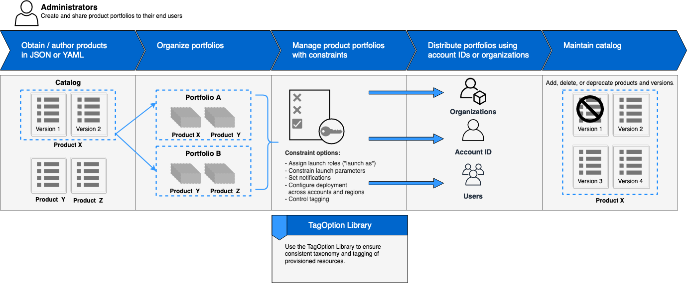
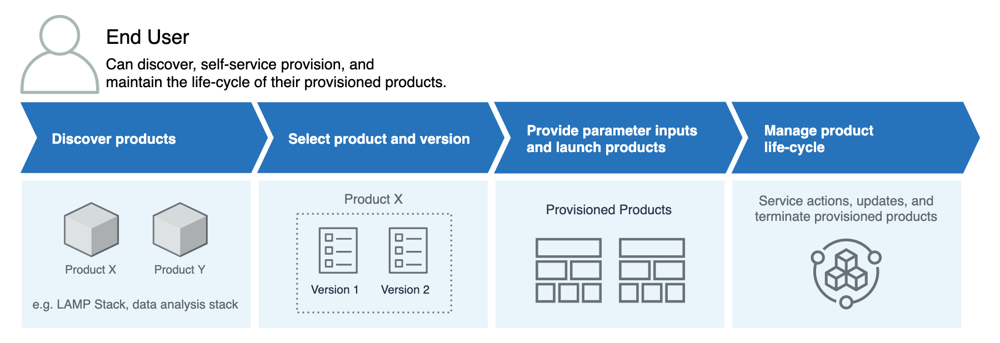

# AWS Service Catalog
## 1. Introduction

AWS Service Catalog is a managed service that enables organizations to create, manage, and distribute catalogs of IT services approved for AWS. These services can range from virtual machine images, servers, software, and databases to complete multi-tier application architectures. By centralizing and standardizing the provisioning process, Service Catalog ensures that resources are deployed in a secure, compliant, and consistent manner.

Service Catalog empowers organizations to:

- **Standardize Deployments:**  
    Administrators can restrict where products are launched, which instance types are used, and enforce configuration best practices. This produces a uniform landscape for all product provisioning.
- **Enable Self-Service Discovery and Launch:**  
    End users browse a catalog of approved products and can launch the IT services they need with minimal friction.
- **Enforce Fine-Grained Access Control:**  
    By using AWS Identity and Access Management (IAM), administrators grant access to portfolios—ensuring that only authorized users can launch and manage specific products.
- **Achieve Extensibility and Version Control:**  
    Products can be added to multiple portfolios without duplication. When updated, new versions are automatically propagated across all portfolios referencing them.

In addition, the Service Catalog API provides programmatic control over all end-user actions as an alternative to the AWS Management Console.

## 2. Core Components

Understanding the following components is key to mastering AWS Service Catalog:
### 2.1 Users

Service Catalog supports two primary user types:

- **Catalog Administrators:**  
    They manage the catalog of products—creating, updating, and organizing them into portfolios. Administrators prepare the underlying AWS CloudFormation templates, configure constraints, and set up the IAM roles necessary for secure provisioning.
    
- **End Users:**  
    These are the individuals who receive AWS credentials (typically via their IT department or manager) and use the AWS Management Console to launch products. Depending on their permissions, end users may have full control over the resources launched or only limited access to specific features.

### 2.2 Products

A **product** is any IT service that you want to make available for deployment on AWS. It can be as simple as a single EC2 instance running Amazon Linux or as complex as a complete multi-tier web application. Key points include:

- **Definition via AWS CloudFormation:**  
    Products are created by importing CloudFormation templates, which define the necessary AWS resources, their interdependencies, and the customizable parameters (e.g., security groups, key pairs).
    
- **Wide Range of Services:**  
    Products can encapsulate anything from virtual machine images and databases to packaged AWS Marketplace solutions.
    

### 2.3 Provisioned Products

When an end user launches a product, Service Catalog provisions an AWS CloudFormation stack (a **provisioned product**) that includes all of the resources required to run the product. This approach simplifies the lifecycle management of resources—enabling tagging, updates, and termination as a single unit.

### 2.4 Portfolios

A **portfolio** is a collection of products with additional configuration details, such as:

- **Access Control:**  
    Portfolios determine which users or IAM entities (users, groups, or roles) can view or launch the products within them.
    
- **Sharing and Constraints:**  
    You can share portfolios with other AWS accounts. This allows administrators of those accounts to further distribute the products with added constraints—for example, limiting which EC2 instance types are allowed.

### 2.5 Versioning

Service Catalog supports multiple versions of a product, which means:

- New versions of CloudFormation templates and associated resources can be added as updates occur.
- When a new version is created, it becomes available to all users with access to that product.
- Users can also update running instances to the new version quickly and efficiently.

### 2.6 Permissions

Access to portfolios is governed by IAM permissions:

- **Granular Control:**  
    IAM policies, groups, and roles control who can view, launch, or modify products.
- **Role-Based Provisioning:**  
    When a product is launched, the associated IAM role is used to create the cloud resources—ensuring users do not get broader permissions than necessary.

### 2.7 Constraints

Constraints help enforce governance and cost control:

- **Launch Constraints:**  
    Specify a role that AWS Service Catalog assumes when launching the product. This role restricts user permissions during provisioning.
- **Notification Constraints:**  
    Enable notifications of stack events through Amazon SNS topics.
- **Template Constraints:**  
    Limit the configuration parameters (for example, allowed EC2 instance types or IP address ranges) that an end user can modify when launching a product.

## 3. Terraform Support

In addition to CloudFormation, AWS Service Catalog also supports quick, self-service provisioning for HashiCorp Terraform Open Source and Terraform Cloud configurations. This means you can:

- Organize and govern standardized, pre-approved Terraform templates.
- Leverage key features such as access control, least-privilege provisioning, versioning, tagging, and sharing across thousands of AWS accounts.
- Provide end users with a simple interface to view available products and deploy them in a single action.

## 4. Workflows

Service Catalog defines clear workflows for both administrators and end users.

### 4.1 Initial Administrator Workflow

This workflow outlines how administrators:

- Create products by importing CloudFormation (or Terraform) templates.
- Organize products into portfolios.
- Configure constraints and permissions.
- Share portfolios with the appropriate AWS accounts or organizational units.

### 4.2 Initial End User Workflow

End users follow this workflow to deploy products:

- Discover available products via the self-service portal.
- Select the appropriate product version.
- Provide necessary inputs and configuration parameters.
- Launch and manage the lifecycle of the provisioned product (i.e., CloudFormation stack).

## 5. Simplifying Governance with AWS Service Catalog

AWS Service Catalog is not only a tool for resource provisioning—it also serves as a powerful governance mechanism:

- **Centralized Management:**  
    By grouping products into portfolios and controlling access via IAM, organizations can enforce corporate standards and compliance requirements.
- **Reduced Operational Overhead:**  
    Self-service capabilities eliminate the need for IT teams to manually provision resources. This reduces delays and minimizes configuration errors.
- **Integration with ITSM Tools:**  
    Service Catalog can integrate with tools like ServiceNow or Jira Service Desk, enabling automated request-to-deploy workflows.
- **Consistency Across Environments:**  
    Leveraging CloudFormation and Terraform ensures that all deployments are uniform, maintain required tagging, and follow preset security configurations.
- **Programmatic Control:**  
    The Service Catalog API allows organizations to automate and integrate product provisioning into their broader DevOps and IT management workflows.

## 6. Conclusion

AWS Service Catalog is a versatile tool for organizations aiming to standardize, govern, and simplify the deployment of approved IT services. By centralizing control through products, portfolios, and constraints—and extending support to both CloudFormation and Terraform—Service Catalog:

- Ensures consistent, compliant deployments.
- Empowers end users with self-service provisioning.
- Reduces the operational burden on IT teams.
- Enhances governance through granular access control and integrated workflows.

Whether deploying single-instance services or complex multi-tier architectures, AWS Service Catalog provides a robust framework to meet your organization’s governance and operational requirements.
