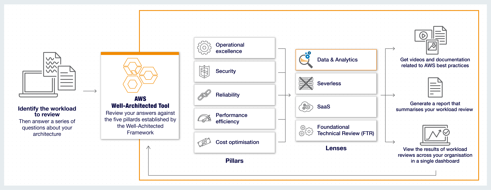

# AWS Well-Architected Tool

## 1. Introduction

Cloud computing has become a foundational skill in today’s technology landscape, and Amazon Web Services (AWS) is at the forefront of this revolution. Understanding how to build, maintain, and improve cloud infrastructure is essential. One powerful resource that simplifies this process is the **AWS Well-Architected Tool** (AWS WA Tool). In this chapter, we will explore the tool’s purpose, how it works, its key features, and practical use cases. By the end, you will understand how the tool helps you design scalable, secure, cost-efficient, and sustainable cloud systems.

## 2. The AWS Well-Architected Framework

At the core of the AWS WA Tool lies the **AWS Well-Architected Framework**—a set of best practices developed by AWS Solutions Architects from years of experience. This framework provides a structured approach to evaluating and optimizing your cloud workloads and is built around **six pillars**:

- **Operational Excellence:**  
    Focuses on running, monitoring, and improving operations. It covers automation, change management, and process improvement.
    
- **Security:**  
    Emphasizes protecting information and systems. It guides you on data confidentiality, identity and access management, threat detection, and securing workloads.
    
- **Reliability:**  
    Ensures that systems perform their intended functions, recover from failures, and adapt to changing requirements.
    
- **Performance Efficiency:**  
    Focuses on selecting and managing computing resources optimally to meet workload demands and performance goals.
    
- **Cost Optimization:**  
    Helps in managing and reducing unnecessary expenses by right-sizing resources and using cost-effective pricing models.
    
- **Sustainability:**  
    (A recent addition) Focuses on minimizing environmental impacts by maximizing resource utilization and reducing waste.
    

These pillars are the foundation upon which the AWS WA Tool evaluates your architecture.

## 3. What is the AWS Well-Architected Tool?

The **AWS Well-Architected Tool** is a free service provided through the AWS Management Console. It helps you assess your cloud architecture against AWS’s best practices defined in the Well-Architected Framework. By guiding you through a series of detailed questions and assessments, the tool identifies potential risks and provides actionable recommendations for improvement.

Key points include:

- **Free and Accessible:**  
    Available at no additional cost to any AWS account holder.
    
- **Framework-Based Assessment:**  
    Evaluates your architecture based on the six pillars (including sustainability) or specialized lenses (e.g., serverless, SaaS).
    
- **Actionable Insights:**  
    Delivers a prioritized list of improvement items to enhance the reliability, security, efficiency, cost-effectiveness, and sustainability of your workloads.

## 4. How It Works

The process of using the AWS Well-Architected Tool can be broken down into several key steps:

1. **Define Your Workload:**  
    A workload is the collection of AWS resources and code that make up your application. Start by describing your workload and documenting the key architectural decisions.
    
2. **Initiate a Review:**  
    Through the AWS Management Console, begin a Well-Architected review. The tool presents you with a series of questions organized by the six pillars (or via a custom lens if needed).
    
3. **Answer Guided Questions:**  
    Each question is designed to probe your design choices and ensure alignment with AWS best practices. Some questions have best-practice answers, while others allow you to skip if they’re not applicable.
    
4. **Identify Risks and Recommendations:**  
    Once you complete the review, the tool evaluates your responses to highlight high-risk issues and offers detailed recommendations on how to remediate them.
    
5. **Track Improvements:**  
    Save snapshots of your review as milestones. This feature lets you monitor changes over time and measure how implemented improvements enhance your architecture.
    
6. **Integrate with Your Workflow:**  
    For teams or organizations, the tool’s robust APIs enable integration into CI/CD pipelines and governance processes. Additionally, integrations with AWS Trusted Advisor and AWS Service Catalog AppRegistry help streamline the review process.

## 5. Key Features of the AWS Well-Architected Tool

The AWS WA Tool offers several standout features that make it an invaluable resource for both beginners and seasoned practitioners:

### 5.1. Architectural Guidance

- **Tailored Recommendations:**  
    Receive detailed suggestions that ensure your architecture adheres to AWS best practices. Think of it as having a mentor guide you through your cloud decisions step by step.
    
- **Best Practices Documentation:**  
    The tool’s recommendations are based on the extensive experience of AWS architects and are continually updated as AWS evolves.

### 5.2. In-Workflow Best Practices

- **API Integration:**  
    Leverage APIs to incorporate the tool into your development and operational workflows. This helps in automating architecture reviews and integrating them into your overall governance process.
    
- **Extended Ecosystem:**  
    Use integrations with services like AWS Trusted Advisor to supplement your assessments.

### 5.3. Milestone Tracking

- **Versioning Reviews:**  
    Save point-in-time snapshots of your architecture reviews. This allows you to track progress, compare improvements, and ensure that changes over time bring your system closer to best practices.

### 5.4. Collaboration & Customization

- **Multi-User Collaboration:**  
    Share your workload reviews with team members or across your organization. Up to 300 IAM users or even your entire AWS Organization can access the review.
    
- **Custom Lenses:**  
    Beyond the standard framework, you can create custom lenses tailored to specific technologies or industry requirements (for example, adding a sustainability lens to assess environmental impact). Custom lenses allow you to add your own questions, best practices, and improvement plans.

## 6. Conclusion

The AWS Well-Architected Tool is an indispensable resource for anyone entering the world of cloud computing. Whether you’re a college student beginning your journey, working on a startup or side project, involved in university research, or preparing for AWS certifications, this tool provides comprehensive, guided insights into designing and operating robust cloud systems.

By integrating the AWS WA Tool into your workflow, you not only learn and apply AWS best practices but also gain the confidence to tackle real-world cloud challenges. With its free access, collaborative features, and continuous improvement cycle, the tool is a powerful mentor in your journey toward mastering cloud architecture.
