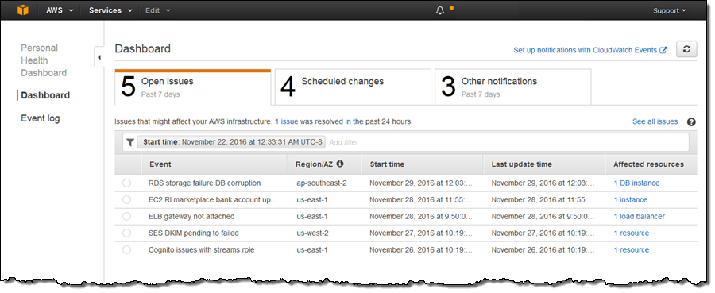

# AWS Personal Health Dashboard

## 1. Introduction

Ensuring that your AWS infrastructure remains resilient and quickly recovers from outages or maintenance events is paramount for any organization. The AWS Personal Health Dashboard (PHD) delivers critical, account‐specific insights into operational and maintenance events affecting your AWS services and resources. Combined with event‐driven mechanisms—such as Amazon EventBridge and the AWS Health API—you can proactively respond to issues and coordinate maintenance in real time. This chapter explains how the Personal Health Dashboard offers valuable visibility, how to aggregate health information across accounts using AWS Organizations, and how to set up practical notifications and automated remediation for potentially disruptive events.

## 2. Understanding the AWS Personal Health Dashboard

The Personal Health Dashboard is a global service that monitors and displays only the events relevant to your specific AWS environment. Its key functions include:

- **Monitoring Maintenance and Outage Events:**
    - **Scheduled Maintenance:** Detects upcoming maintenance windows (e.g., pending patches affecting EC2 instances or EBS volumes).
    - **Outage or Availability Events:** Alerts you when operational issues directly impact your resources.

- **Detailed Event Information:**  
    Each alert provides specifics about the affected entities—such as resource identifiers (instance IDs, volume IDs, etc.)—and includes recommended remediation steps to help you quickly address the issue.
    
- **Personalized vs. Global Views:**  
    Unlike the AWS Service Health Dashboard—which shows the overall status for all AWS customers—the Personal Health Dashboard filters out global events and displays only the information that impacts your account. This focused view ensures you get real‑time updates on how outages and scheduled events directly relate to your resources.
    
- **Remediation Guidance:**  
    For every detected event, PHD includes detailed troubleshooting information and remediation guidance (for example, recommendations to restore an EBS volume from a snapshot), helping you to minimize downtime.

## 3. Aggregating Health Information Across Multiple Accounts

For organizations using multiple AWS accounts, AWS Organizations offers an organizational view in the Personal Health Dashboard:

- **Centralized Monitoring:**  
    When enabled, administrators in the management account can view and query health events across all member accounts. This consolidated perspective simplifies large‑scale operations by providing a single, unified dashboard for monitoring potential disruptions across the entire organization.
    
- **Coordinated Maintenance:**  
    The organizational view enables central teams to plan and schedule maintenance events consistently, ensuring that all affected accounts are managed proactively and in unison.

## 4. Event-Driven Notifications with Amazon EventBridge

While the Personal Health Dashboard offers a rich visual console for tracking health events, many organizations expand its capabilities by automating responses using Amazon EventBridge:

- **Automated Event Routing:**  
    EventBridge consumes AWS Health events and routes them to a variety of targets such as:
    - **Amazon SNS:** To send notifications directly to operations teams (via email, SMS, or mobile push).
    - **AWS Lambda:** To invoke functions that perform immediate remediation—such as launching replacement instances or migrating workloads to a different Availability Zone.
    - **Amazon SQS or Kinesis Data Streams:** To log, audit, and further process health events.

- **Use Cases for Automation:**
    - **Incident Notification:** Instantly alert your operations team about critical events.
    - **Automated Remediation:** Trigger workflows that automatically mitigate issues (for example, replacing failed resources).
    - **Auditing and Analytics:** Stream events for compliance reporting and historical analysis.

- **Public vs. Private Notifications:**  
    Note that while the Personal Health Dashboard focuses on resource-specific events, public events (unrelated to your resources) are still available via public channels such as the AWS Service Health Dashboard RSS feed.

## 5. Integrating with AWS Health API and IT Management Tools

Beyond visual monitoring and automated notifications, the AWS Health API enables deeper integration with your existing IT management systems:

- **Programmatic Access:**  
    The AWS Health API allows you to programmatically fetch event details, affected entities, and remediation guidance, enabling custom dashboards or integrations with internal tools.
    
- **Third-Party Integrations:**  
    Many organizations integrate AWS health events with systems such as ServiceNow or JIRA through the Service Management Connector (SMC), automating ticket creation and updates based on health events. This tight integration streamlines incident management workflows and reduces manual overhead.
    
- **Fine-Grained Access Control:**  
    Using AWS Identity and Access Management (IAM) policy conditions, you can restrict access to sensitive health events based on event metadata (such as event type or service affected), ensuring that only authorized users receive critical alerts.

## 6. Example Scenario

Imagine you are managing a fleet of EC2 instances distributed across multiple regions. Suddenly, one Availability Zone experiences connectivity issues, leaving your instances in a pending state for an unusually long time. The AWS Personal Health Dashboard detects the issue and displays it under open issues, indicating that a specific Availability Zone is affected. With an EventBridge rule configured:

- **Notification:**  
    An SNS message is sent to your operations team alerting them of the issue.
    
- **Automated Remediation:**  
    A Lambda function is triggered to automatically launch new EC2 instances in an unaffected Availability Zone, minimizing downtime and ensuring continued service availability.
    

This scenario demonstrates how proactive monitoring combined with event-driven automation can help maintain service continuity even during unexpected outages.

## 7. AWS Health Dashboard vs. Personal Health Dashboard

The key difference is that the AWS Health Dashboard provides a general view of the overall health of AWS services, while the Personal Health Dashboard delivers a personalized, account‑specific view. In other words:

- **AWS Health Dashboard (Service Health View):**  
    This part shows the overall status and performance of all AWS services globally. It gives a broad picture of any widespread outages or issues without tailoring the information to your specific AWS resources.
    
- **Personal Health Dashboard:**  
    When you’re signed in, this view focuses on how those global issues (or scheduled maintenance events) affect your own resources. It provides personalized alerts, detailed remediation guidance, and notifications about upcoming changes that could impact your AWS account.
    

This means that while the public Service Health view lets you see if AWS is having a problem overall, the Personal Health Dashboard tells you if and how those problems might affect your own environment.

## 8. Conclusion

The AWS Personal Health Dashboard is an essential tool for gaining real‑time visibility into how AWS events impact your specific resources. By focusing solely on your environment, it offers actionable insights—such as scheduled maintenance alerts and outage notifications—that help you plan and react swiftly. Furthermore, leveraging Amazon EventBridge enables automated, event‑driven workflows that not only notify your team but can also trigger immediate remediation actions. With added integrations via the AWS Health API and fine‑grained access control using IAM, organizations can build robust, scalable, and resilient cloud environments.
